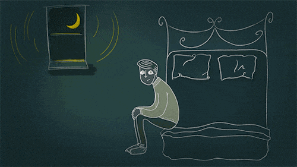
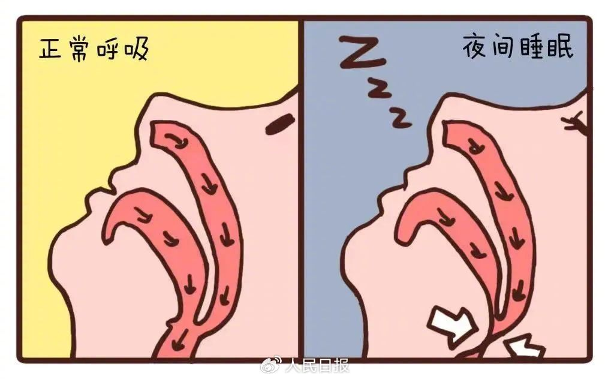

# 10 种 “睡不安稳”，各有解决办法

在有些人眼里，睡觉就是躺在床上、闭上双眼这么简单。然而这件简单的事，正困扰着越来越多的人。  
据调查，我国有超 3 亿人存在睡眠障碍。睡不着、睡不醒、睡不好是现代人最常遇到的睡眠问题。

近日，国外有网站总结了影响睡眠质量的 10 个因素。在本文中，专家教你 “对症” 改善睡眠。  
 

**1**

**睡眠呼吸暂停综合征**  
睡眠呼吸暂停综合征患者喉咙肌肉松弛，睡觉时容易出现打鼾、呼吸停止等问题，不仅影响睡眠质量，醒来后还容易感到疲倦，或口干、头痛、烦躁等。

**缓解方法：**症状较轻者可改变生活方式，比如定期锻炼、侧卧睡觉等；症状较重者则要配合药物甚至手术治疗。  
 

**2**

**超重**  
诸多研究表明，超重会增加失眠几率，并降低睡眠舒适度。  
**缓解方法：**专家表示，患者不必节食减肥，应规律锻炼、控制饮食、正常作息等，帮助提高代谢水平。  
 

**3**

**抑郁、焦虑**  
抑郁、焦虑与睡眠障碍存在强烈关联，尤其是上班族，很容易处于过度焦虑或情绪不稳定的状态，从而影响睡眠质量。  
**缓解方法：**建议睡前进行冥想、瑜伽来放松身心，白天多到户外活动，以改善整体情绪、提高睡眠质量。如果工作压力特别大，一周空出 2 天让自己彻底放松，至少睡觉前不要打开手机查看工作信息。  
睡前可通过听音乐、看书等转移注意力，帮助入睡。  
 

**4**

**甲状腺问题**  
甲状腺负责调节新陈代谢和激素水平。然而，当它过度活跃或不活跃时，就会导致失眠和白天疲惫不堪。  
**缓解方法：**如果觉得自己特别容易累，建议检查甲状腺。发现有问题，可在医生指导下进行激素替代治疗、改变饮食习惯和规律运动等。

**5**

**不安腿综合征**  
患者夜间下肢不适感明显，会导致入睡困难、觉醒次数增多，使睡眠质量严重下降。  
**缓解方法：**若问题轻微或偶尔出现，可通过热水泡脚帮助放松肌肉、缓解关节疼痛、改善足部疲劳与肿胀；较严重时应及时就诊。  
 

**6**

**胃酸反流**  
患者夜间仰卧睡眠时，胃食管反流会导致发作性的胸部不适或胸骨下烧灼痛，造成反复清醒，干扰正常睡眠。  
**缓解方法：**建议患者睡前 3 小时尽量避免摄入辛辣、番茄、含咖啡因和酒精的食物，睡觉时用楔形枕头将头部垫高。  
 

**7**

**不健康饮食**  
包括饮酒过量、太晚摄入咖啡因等。研究表明，酒精会阻碍快速眼动睡眠期，从而扰乱人体获得高质量休息的能力。此外，睡前 6 小时内摄入咖啡因也会导致睡眠紊乱。  
**缓解方法：**建议限制酒精摄入量，睡前 3 小时不喝酒；每天下午 2 点前停止摄入含咖啡因的食物。  
 

**8**

**服用 B 族维生素太晚**  
B 族维生素不仅使人精力充沛，还能镇静神经系统。但服用时间太晚，这些营养素会影响大脑放松入睡的能力或导致频繁惊醒，尤其是有提神作用的 B12。  
**缓解方法：**如果需要补充 B 族维生素，无论单一还是复合剂型，都要确保每天下午 2 点前摄入。  
 

**9**

**缺乏镁元素**  
镁是一种营养物质，能帮助肌肉放松并释放紧张。镁含量低会导致睡眠紊乱或失眠，还会加重白天嗜睡症状。  
**缓解方法：**建议咨询医生，如果需要补充营养素，请在睡前服用。  
 

**10**

**睡眠环境不佳**  
房间太热、太亮、有噪音等都会让大脑很难进入完全恢复性的睡眠状态，导致频繁醒来，造成睡眠紊乱。  
**缓解方法：**室内温度保持在 20℃左右，选择遮光窗帘或眼罩，移除夜灯或带荧光的物品。

**判断自己的睡眠是否健康，可以通过三个方面自测↓↓**  
**入睡时间：**上床后能在 30 分钟内入睡；  
**睡眠时长：**65 岁以上睡 7~8 小时；18~64 岁睡 7~9 小时；14~17 岁的青少年睡 8~10 小时；  
**醒后感受：**醒后感到精力充沛，说明睡眠质量较好。

想要提高睡眠质量，试着每日坚持同样的上、下床时间，形成自己的 “睡眠生物钟”。  
睡觉前，不做与睡眠无关的事，如刷手机、看电视等，养成上床就困的习惯。  
  
需要提醒的是，有睡眠问题的人，尽早到呼吸睡眠专科就诊，不能随意服用安定类药物，否则会使肌肉松弛，加重气道狭窄，让病情更加严重。

- - -

本文来源：生命时报微信公号

受访专家：首都医科大学附属北京朝阳医院睡眠医学中心主任医师  郭兮恒

上海中医失眠症医疗协作中心副主任  施明​​​
