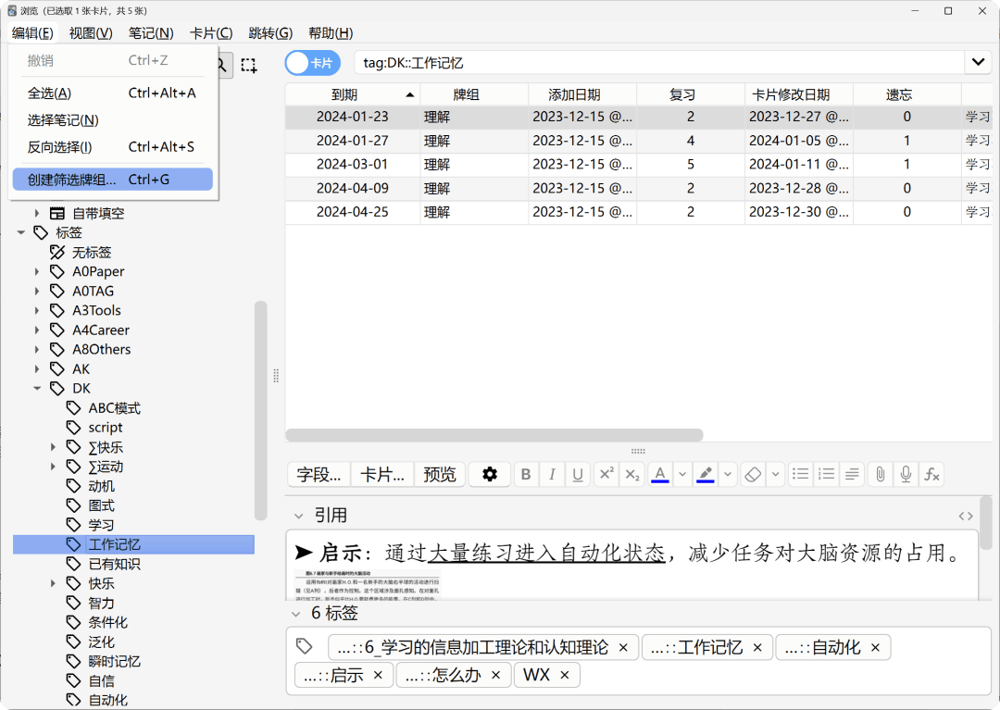
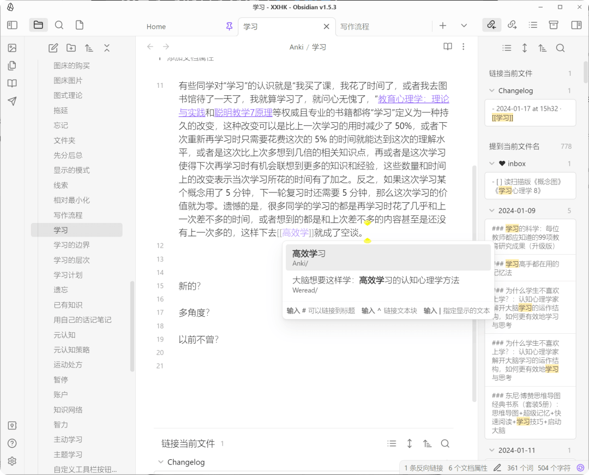

# 2024 年最新工作流：阅读（微信读书）、复习（Anki）、写作（Obsidian）｜学习骇客

  

在微信读书 \[1\] 里管理常读的专题书单，随着知识和经验的更新，常读常新。

  
想到读什么书就先在微信读书里搜索，如果书库里有了，就直接读。如果没有，再找电子版导入，导入的格式以标准电子书为先，实在没有才找扫描版 PDF 文件。如果连 PDF 格式的都没有，可以自己买书然后寄书扫描（自用），再将扫描得到的 PDF 文件导入微信读书。

尽管有了电子版，但这些需要常读的书我都买了纸质版。

## 阅读 @微信读书

除了书城的书、自己导入的 EPUB 等标准格式，现在扫描版 PDF 文件也支持划线了（小范围灰度内测中）。

  
如果是已经较为熟悉的内容，就直接划线。如果是不重要的内容但角度较新，就通过想法形式添加一句话批注。如果是重要的新知，就自己组织 \[2\] 语言，将通用的知识 \[3\] 转换为与己相关的知识，然后用问答笔记表示出来。

第一阶段，认认真真、从头到尾读完一本书，对基本的知识点有所了解。

第二阶段，主题阅读 \[4\] & 检视阅读 \[5\]，重读原来读过的书，结合第一遍时的收获（工作记忆 \[6\]），从知识和应用两方面相互联系，做更深层的主动阅读。

第三阶段，主题阅读 \[7\] & 渐进阅读 \[8\]，想到某一块主题时就回到原来的书里重新思考，并在书库里主动搜索其他科学、权威的著作有无相关论述。结合新的认识，继续指导实践，并在实践中优化方法，最终形成文章、固化成专题认知和实际习惯。

这些阶段划分并没有明确的界线，也没有终点，我会一直读到像艾德勒在如何阅读一本书 \[9\] 里说的一直要读到这本书成为我自己为止 \[10\]。其实在过去的这些年里，通过阅读和复习的交替、新知和已知的相互转化 \[11\]，我经常能体会到这种“人书合一”“知行合一”的巅峰体验 \[12\]，并且随着学习和实践的交替而日益明显。

## 复习 @Anki

通过 weread2anki\[13\] 将[微信读书 ⇱](https://mp.weixin.qq.com/s?__biz=MzU2NDI1Mzg2NQ==&mid=2247496245&idx=1&sn=ab3bedd24fab17f310da2d7f5bd98182&scene=21#wechat_redirect)的笔记导入 Anki 进行复习。

前期按牌组复习新知识点。

  
后期按主题复习 \[14\] 知识点。由于单个知识点都能准确、流畅地提取了，因此很容易建立起关于某方面的扎实的知识网络 \[15\]。例如，关于“工作记忆”的定义、局限、提升方法、相关关系等都可以信手拈来，需要准确引用时也可以快速搜索出来。借助标签 \[16\]，同一张卡片可以出现在不同的主题中。

复习的过程中会增加对知识点的理解，能将当时的最佳理解（新知）变成以后时时刻刻都能理解的已知，即使是原来的笔记也会经历从具体到抽象、从抽象到具体、从简单到复杂、从复杂到简单等对立的相互转化过程，这不是重复，而是从不同角度、不同层面 \[17\] 加深里理解、提升了迁移能力。

在复习过程中，由于不同学科、不同专题的卡片交替出现，新的想法也会不断涌现，这些有的是与已有知识有关，有的则是与解决现实问题有关。

前期的笔记以问答形式居多，因为自己组织语言能反映思考、固化思考、推进思考，问答笔记中的问题又能明确知识点的用途 \[18\]，例如，如何提升记忆 \[19\] 能力？如何提升思考 \[20\] 能力？

## 写作 @Obsidian

通过微信读书转 Obsidian\[21\] 的插件，一键同步最新笔记到 Obsidian 里。我不追求 Anki 与 Obsidian 的打通，复习工具就用来复习，写作工具就用来写作，绝不用写作工具来存档有用的、没用的所有内容，那样反而会增加引用时的信息冗余。

在实践一段时间后，证明流程跑得通，也有效果，就通过写作将某个专题固化下来。

写出来以后并不是固定不变了，那样将来随着现实的变化、问题的愈发复杂，依然还会陷入刻板印象、易得性偏差等认知偏差。

根据图式理论 \[22\]，Obsidian Publish 建立起来的这套将会（已经）让我在将来学习新知识时理解、记忆和运用 \[23\] 变得更容易，查理芒格 \[24\] 也认为应该将未来的知识和经验挂靠到这个模型上，以便于融会贯通并学以致用。

## 发布 @Obsidian Publish

开通了 Obsidian Publish\[25\] 服务后，将本地的 Obsidian 笔记公开发布到网上。

  
根据史蒂芬平克 \[26\] 的观点：

> 写作是将网状的思考，变成树状的结构，用线性的语言表达出来。

因为担负信息处理任务的工作记忆 \[27\] 的容量 \[28\] 有限，人脑不能像复印机一样把一个人头脑中的“网”直接搬到另一个人的脑中，查理芒格也在书中强调了亲自摸索 \[29\] 的必要性，将新的知识和经验挂靠 \[30\] 到原有的网上以不断更新迭代。

学习的过程，就是将课上、书上的线性语言，用自己的话表述出来，使用 Anki 的多级标签 \[31\] 或层级化 \[32\] 的幕布构建起树状结构，最后利用去中心化的标签 \[33\] 或 Obsidian 类笔记工具构建网状的原型。因为每一步都有复习，即每种形式的知识都能随时从长时记忆 \[34\] 中提取到工作记忆里，所以这些也容易在思考时用得上。

公开发布能避免我在给学生答疑时做重复功，学生的问题反过来又促进我优化博客的内容。公开发布在传播 Anki 方法论的同时，也能作为《卡片笔记写作法 \[35\]》思想的具体的实践参考。我不是很担心别人剽窃我的成果，只要我保持现在的进步速度，别人抄完时就已经落后了。

相信你已经看到了，学习骇客最近改变了文章的编辑方式，这种方式像双链笔记一样，把相关的知识点都以引用的形式添加到文末，方便你系统性地了解某方面的知识。如果某些角度还能激发你去阅读的兴趣、使用双链笔记工具的兴趣，那就更好了。  

### 参考资料

\[1\]

微信读书：*https://xxhk.org/weread*

\[2\]

自己组织：*https://xxhk.org/ISBN-9787100106184#^23723810-40-9728-9951*

\[3\]

通用的知识：*https://xxhk.org/ISBN-9787100106184#^23723810-44-481-637*

\[4\]

主题阅读：*https://xxhk.org/ISBN-9787100106184#^23723810-37-338-355*

\[5\]

检视阅读：*https://xxhk.org/ISBN-9787100106184#^23723810-35-359-387*

\[6\]

工作记忆：*https://xxhk.org/jiyi#^030723*

\[7\]

主题阅读：*https://xxhk.org/ISBN-9787100106184#^23723810-51-424-453*

\[8\]

渐进阅读：*https://xxhk.org/jjsxx*

\[9\]

如何阅读一本书：*https://xxhk.org/ISBN-9787100106184*

\[10\]

一直要读到这本书成为我自己为止：*https://xxhk.org/ISBN-9787100106184#^23723810-33-3225-3363*

\[11\]

相互转化：*https://xxhk.org/jiyi#^115347*

\[12\]

巅峰体验：*https://xxhk.org/ISBN-9787508675534#^921826-77-1246-1370*

\[13\]

weread2anki: *https://xxhk.org/weread2anki*

\[14\]

主题复习：*https://xxhk.org/cjsxpzmr*

\[15\]

知识网络：*https://xxhk.org/%E5%9B%BE%E5%BC%8F%E7%90%86%E8%AE%BA*

\[16\]

标签：*https://xxhk.org/biaoqian*

\[17\]

不同角度、不同层面：*https://xxhk.org/ISBN-9787115598417#^3300028854-13-6548-7570*

\[18\]

知识点的用途：*https://xxhk.org/Anki/%E6%9D%A1%E4%BB%B6%E5%8C%96*

\[19\]

记忆：*https://xxhk.org/ISBN-9787515367088#^3300053854-11-821-854*

\[20\]

思考：*https://xxhk.org/ISBN-#^CB-AHo9UG9Vk6316eB6cN71NEq0-1-13401-13502*

\[21\]

微信读书转 Obsidian: *https://xxhk.org/%E6%8F%92%E4%BB%B6+weread+obsidian+%E7%9A%84%E7%94%A8%E6%B3%95*

\[22\]

图式理论：*https://xxhk.org/%E5%9B%BE%E5%BC%8F%E7%90%86%E8%AE%BA*

\[23\]

理解、记忆和运用：*https://xxhk.org/ISBN-#^CB-4N19Ux9VkAfJ6TB6U5-14-44049-44205*

\[24\]

查理芒格：*https://xxhk.org/ISBN-9787521730401#^837932-140-1118-1233*

\[25\]

Obsidian Publish: *https://obsidian.md/publish*

\[26\]

史蒂芬平克：*https://xxhk.org/ISBN-9787111596158#^05129d*

\[27\]

工作记忆：*https://xxhk.org/ISBN-9787111596158#^933891-24-575-709*

\[28\]

容量：*https://xxhk.org/jiyi#^115347*

\[29\]

亲自摸索：*https://xxhk.org/ISBN-9787521730401#^837932-140-58246-58293*

\[30\]

挂靠：*https://xxhk.org/ISBN-9787521730401#^837932-140-1118-1233*

\[31\]

Anki 的多级标签：*https://xxhk.org/biaoqian#^d12cdf*

\[32\]

层级化：*https://xxhk.org/ISBN-#^CB-4N19Ux9VkAfJ6TB6U5-14-44446-44526*

\[33\]

标签：*https://xxhk.org/biaoqian*

\[34\]

长时记忆：*https://xxhk.org/jiyi#^634c3e*

\[35\]

卡片笔记写作法：*https://book.douban.com/review/13679603/*

\[36\]

本文更新地址：*https://xxhk.org/xzlc*
