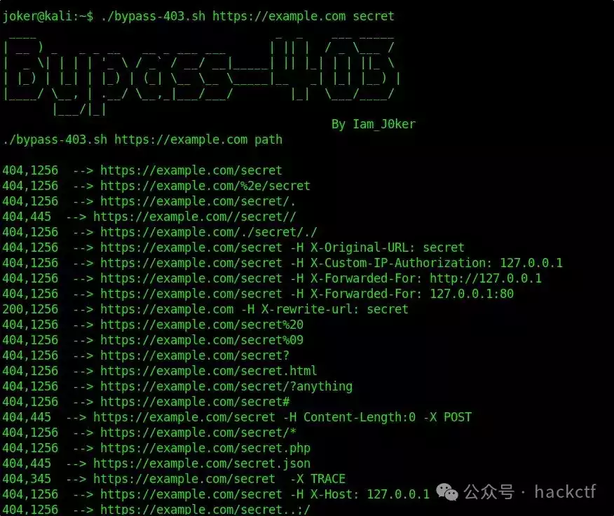

# 24个已知403绕过方法的利用脚本

**介绍**

-   一个简单的脚本，仅供自用，用于绕过 403  
    
-   在curl的帮助下使用24个已知的403绕过方法
    
-   它还可用于比较各种条件下的响应，如下图所示
    



# **用法**

```plain
./bypass-403.sh https://example.com admin
./bypass-403.sh website-here path-here
```

# **安装**

-   `git clone https://github.com/iamj0ker/bypass-403`
    
-   `cd bypass-403`
    
-   `chmod +x bypass-403.sh`
    
-   `sudo apt install figlet` - 如果您看不到屏幕截图中的徽标
    
-   `sudo apt install jq` - 如果你的机器上没有安装 jq
    

**下载地址**