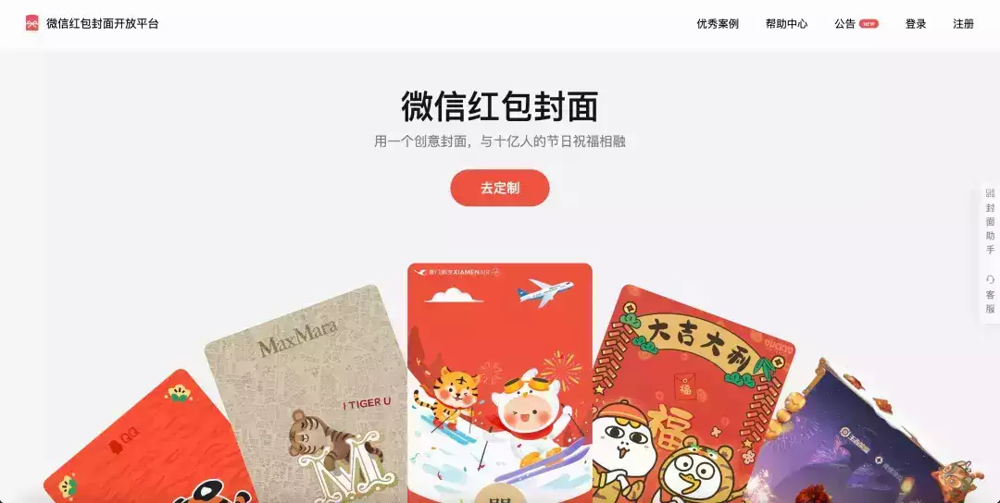
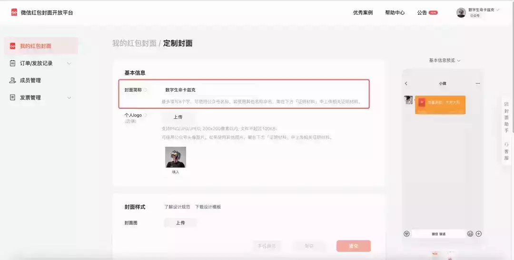
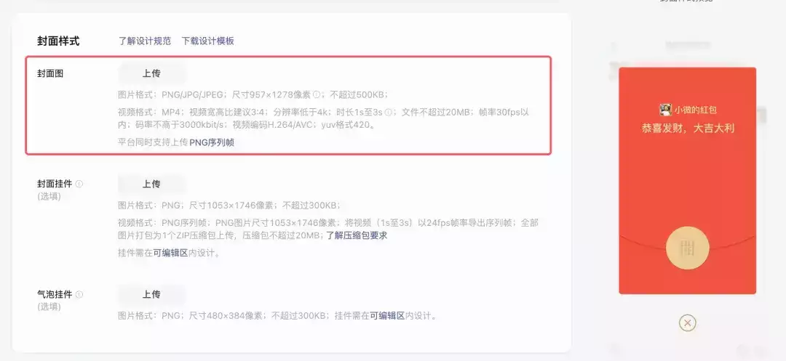

# 2 分钟用 AI 造一个微信红包封面 - 顺便来领个我的限量款

  

最近感觉快过年了，朋友们都在疯狂的卷微信红包封面。  

毕竟，今年在 AI 加持下，做红包封面的成本，比以前低太多了太多了。  

定制微信红包封面挺简单的，直接去微信红包封面开放平台，登录后开始定制就行。  

这里要提一句：个人是无法定制的，在微信的规则下，你必须有个 100 粉的公众号或者视频号，才可以定制。  

如果你没有，但是又想做，有个小道方法就是，去淘宝找个店，给你刷到 100 粉，我记得这个价格，也就 10 块钱左右。。  

你有了资格后，认证并登录，就能看到红包页面了，我是以我公众号身份登录的。  

可以看到我传了 3 个，一个已经上线了，但是还没发，另外两个是通过状态。  

你们直接点击定制封面就 OK。

一进来你们就能看到定制页面。  

第一个说的就是这个封面简称，绝对不要改，一定要用你自己的公众号姓名或者你的视频号姓名，不要去写成你自己的微信号名字。  

要不然，你就会陷入传 N 多资料，比如后台截图、手持身份证照片等乱七八糟的东西，疯狂的给你打回，让你证明你是你。。。

下面的 logo 也是一样的道理，你要是用的话，必须用你公众号或者视频号头像，要不然一样会被打回。这块其实是选填，我不建议加，因为在红包上有个小 logo，会有点丑。

第二步就是最核心的封面图。是别人点开你红包的时候，最显著的区域。  

这块可以传图片，也可以传视频。尺寸建议就是用官方尺寸 1053×1746 像素，其实就是 3:4 的比例。

先说图片。

作图的话，其实反而就很简单了，你用 SD、用 MJ 啥的都行。  

我就直接拿 MJ 跑了很多，毕竟龙年，你的 prompt 就跑不出那几个词：  

比如 Chinese dragon、Chinese New Year、red 啥的。

我给一个 Prompt，如果实在不会写的，可以抄一下：  

very cute chinese dragon painted by Maud Lewis, Chinese New Year atmosphere, Head close-up, abstract simple lines, illustration, Multi-color, advanced color matching --ar 9:16 --s 1000 --v 6.0

效果大概是这样的：

有了这个图以后，你就可以直接把这个封面传到微信红包封面平台了。  

当然大概率会超他们限定的 500K，所以可以去一个贼牛逼的压缩网站，把图片做一下无损压缩，这个基本是设计狗的必备了：

https://tinypng.com/

然后直接传上去就行，尺寸不一样其实也无所谓，反正可以裁。

传上去以后，后面每个位置，也都是可以编辑的。

主要把这块定了就行，下面的封面挂件和气泡挂件，都是选填，我建议就直接崩管了，那个又麻烦设计的又很容丑，不如不传。当然，大神随意。

再说下视频类的动态封面。  

微信红包封面也是可以做成动态的，比如我的好朋友 Jessy 做的这个 blinblin 的动态封面。

 老规矩，正常还是 MJ 生图，生完图以后，把图传到 PIKA 或者 Runway 中，做一个简单的动画就行，不过 PIKA 和 Runway 现在都收费，如果想用免费的，也可以去用 Pixverse，目前不要钱。

https://app.pixverse.ai/

操作也都是一样的，传图，生成，完事。没啥可特别说的。主打一个有手就行。

最后下载下来传上去的时候，微信红包平台有个比较坑的一点是，对码率有一定的要求，绝对不能大于 3000kbit/s。  

所以你可以用剪映，在导出的时候，码率选择自定义，手动改成 2800 就行。  

封面故事这块可以传不同的长图或者视频，都行，有些品牌方甚至传了个 60s 以内的宣传视频。  

主要还是可以链接到公众号或者视频号，算是一个入口了，虽然这个入口量很小，没啥蛋用。。。  

但是有还是比没有好，笑死。  

最后一步，也是卡了很多人的东西，离谱的版权证明，离谱的审核机制。

这块用 AI 作图的话，其实也挺简单的。

截一下你 MJ 的页面，然后标个字，这图是用 MJ 生成的。这是 AI，不是别人的图，因为审核很多时候都是真人审的，但是并不是所有人都知道这界面是 MJ，所以给人标清楚，很容易过的，我自己传了几个，都是一把过。从来没卡过。

全部提交完以后，你就可以等着你的红包审核通过啦。

目前按照我的经验，大概 3 个小时左右，就能审核通过～  

最后，当然是，给大家发一下我的封面，限量 200 个。  

2024，龙腾股跃！  

希望一切都能变得好起来吧～  

谢谢大家一年的陪伴～