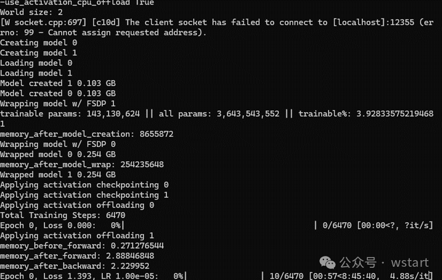

# 2 张卡训练 70B 的大模型（上） - 百亿大模型部署系列

# 0x00 前言

自从《在家训练 70B 的大模型》发布后，很多人都在私信问我是不是写错了，不是 70B 而是 7B，最近因为一直都很忙，所以并没有完整的时间测试。通过这几天断断续续的跑起来的结果来看，应该是可以训练 70B 的，但是我还没跑起来，因为内存卡还没到。

在 23 年初，还只是勉强跑起来 6B 的我，是怎么也想不到，在 24 年的时候，72B 也能勉勉强强跑起来了。更没想到，过了 1 个月，居然还能开始微调 70B 的大模型了。

直接说结论：

**FSDP（内存减少） + QLoRA（所需要的训练参数） +HQQ (训练处理的速度提升)** 这 3 个核心的技术使得 70B 的大模型的训练仅仅需要 35G 的显存。

**代价是什么呢？**

1.  1\. 内存消耗增大，要训练 70B 的大模型，需要 128G 的内存。笔者目前买的内存还没到，但是本文通过侧面的测试已经验证可行。
    
2.  2\. 加载时间变长，训练似乎还好。因为需要在显存和内存之间不断的合并和挪腾，导致时间变长。
    

**接下来的内容**

-   ・ 会讲一下背景和原理，基本来自 **ai.answer 的原文翻译或者摘录**。
    
-   ・微调的代码。
    
-   ・ 在 7B 上的测试的结果。
    

下一篇才会讲 70B 的训练准备的过程，训练的过程以及结果。当然，也有可能我还没出，别人也已经写完。最近真的太忙了。/(ㄒ o ㄒ)/~~ 。

备注：《0x01 背景》 & 《0x02 原理》中的我们指的是 answer.ai 的研究员们。

# 0x01 背景

用于训练深度学习模型的硬件有两种截然不同的级别。还有数据中心级的硬件，比如 H100s、A100s，价格就几十万美元。然后是包含游戏 GPU 的台式计算机，例如双 4090，成本低于 10,000 美元（并且可以用二手零件组装而成，价格不到预构建系统价格的一半）。

但关键是：游戏 GPU 的性能与数据中心 GPU 相似，但价格高出 10 倍以上！如果我们可以使用这些便宜 10 倍（但速度几乎一样快）的卡来训练大型语言模型，那就太好了，但我们不能，因为它们的内存要少得多。目前最好的数据中心卡具有 80GB RAM，而游戏卡最大可达 24GB RAM。由于只有最大的模型才能产生最好的结果，因此大多数人基本上无法创建最好的模型。

我们意识到这实际上没有内在原因。超快的硬件就在那里，等待使用 —— 我们只需要一种方法来为其提供模型和数据，以满足其内存限制。显而易见的问题是：为什么当时没有这样做？所有大型工业实验室都已经拥有昂贵 10 倍的硬件，因此他们并没有动力去解决这个问题。

# 0x02 原理

## QLoRA：在单个 GPU 上训练更大的模型

QLoRA 是现代神经网络中两个至关重要的进步的简单而出色的组合：量化和 LoRA。量化是一种不使用 16 位甚至 32 位来存储神经网络权重的技术，而是使用 4 位（甚至更少）。4 位数字只有 16 个可能的值，但 Dettmers 和 Zettlemoyer 表明，这对于当今流行的大型语言模型来说已经足够了。

当量化为 4 位（即 0.5 字节）时，70b 模型需要 70/2 = 35 GB，这比我们想要使用的 24GB 游戏 GPU 更大。

## FSDP：将训练扩展到多个 GPU

解决单个消费类 GPU 的 RAM 限制问题的一个明显的解决方案是使用多个 GPU！开源社区中一种非常常见的方法是简单地将模型的几层放置在每张卡上。因此，要进行训练，您需要在第一个 GPU 上运行前几层，然后在第二个 GPU 上运行接下来的几层，依此类推。例如，70b (140GB) 模型可以分布在 8 个 24GB GPU 上，每个 GPU 使用 17.5GB。拥抱脸部变形金刚中甚至还有一个方便的设置，device\_map=’auto’您可能已经使用过；这就是这实际上在幕后所做的事情。这可以完成工作，但有一个巨大的缺点：一次只有一个 GPU 处于活动状态，因为所有其他 GPU 都在等待“轮到”。这意味着 ⅞ 的计算被浪费了。

分布式数据并行 (DDP) 以前是跨多个 GPU 高效训练模型的黄金标准方法。这需要在每个 GPU 上保留完整的模型 - 如果您有一个小模型（例如 2b 模型，需要 4GB RAM），您可以简单地将整个模型分别加载到每个 GPU 上，然后让每个 GPU 并行地处理训练示例。例如，如果您有 4 个 GPU，则训练速度会提高 4 倍。但是，如果模型不适合 GPU，并且没有足够的空间来容纳训练过程所需的数据，那么 DDP 就不起作用。

因此，我们需要能够跨 GPU 拆分模型（例如 device\_map=’auto’）并并行使用它们（例如 DPP）的东西。这就是 Meta 的完全分片数据并行 (FSDP) 库的用武之地。它通过将参数拆分到多个 GPU 上来“分片”大型模型，从而允许同时使用所有 GPU。当训练期间在特定 GPU 上计算神经网络的一层时，所有所需的分片都会复制到那里。然后进行计算，最后从该 GPU 中删除复制的部分。虽然这听起来效率非常低，但实际上，通过在当前层忙于计算的同时聪明地复制下一层的数据，与 DDP 相比，这种方法可能不会导致速度减慢。

## 其他技术

为了实现这项工作，我们不仅受益于 FSDP 和 QLoRA，还受益于过去几年学术界和开源社区开发的大量巧妙技术。我们用了：

-   • **Gradient checkpointing**（也称为激活检查点）以避免存储完整梯度，而是在整个模型的多个“检查点”处保存激活，然后根据需要重新运行前向计算步骤来重新计算梯度。
    
-   • **CPU offloading**，在不使用权重时将权重存储在 CPU RAM 中，而不是存储在 GPU 上，从而大大减少了所需的 GPU 内存。这项技术对于使用 H100 GPU 的“GPU 丰富”来说并不是很有用，因为 H100 GPU 具有高度优化的方式来相互传递权重。但对于我们的用例来说，这是绝对必要的，因为游戏 GPU 和主板没有这些系统
    
-   • **Flash Attention 2** 使用内存优化的 Cuda 内核有效计算注意力。
    

# 0x03 启动代码

### 硬件环境

-   ・2 张 3090 / 4090（24G\*2 = 48G 显存）
    
-   ・ 内存 128G
    
-   ・ CPU 32 核 \* 2
    

### 软件环境

-   • ubuntu22.04
    
-   • cuda 12.1
    
-   • pytorch：2.2.0
    

### 安装过程

-   • Clone https://github.com/AnswerDotAI/fsdp\_qlora
    
-   • pip install llama-recipes fastcore --extra-index-url https://download.pytorch.org/whl/test/cu118 as an easy way to get most dependencies (replace 118 with your desired Cuda version)
    
-   • Install bitsandbytes pip install bitsandbytes>=0.43.0
    
-   ・ 下载模型
    

### Llama-2 70B 在 2 个 24GB 的显卡上的微调代码

```bash
python train.py \
--model_name meta-llama/Llama-2-70b-hf \
--batch_size 2 \
--context_length 512 \
--precision bf16 \
--train_type qlora \
--use_gradient_checkpointing true \
--use_cpu_offload true \
--dataset alpaca \
--reentrant_checkpointing true
```

  

看到下面的启动信息说明启动成功：



# 0x04 实验

### 训练的基准

```bash
llama-7B ,
--batch_size 4 
--gradient_accumulation_steps 1 
```

### 没开启 FSDP 之前

内存占用：0 

单张显存：22GB/24GB

### 开启 FSDP 之后

内存占用：18G 

单张显存：7GB/24GB

直接下降了 1/4。更离谱的是，训练的参数甚至可以开到

```bash
--batch_size 8  
--gradient_accumulation_steps =2 
```

直接从 4 变到 8\*2，翻了 4 倍的效率，简直离谱。

# 0x05 总结

虽然很慢，虽然安装的过程还是比较困难和麻烦。但是这个技术切切实实的让普通人也可以开始微调 70B 的大模型了。（等内存到 = = 我现在还没有跑起来。）对于小公司或者想尝鲜的人来说，是一个非常好的尝试。
