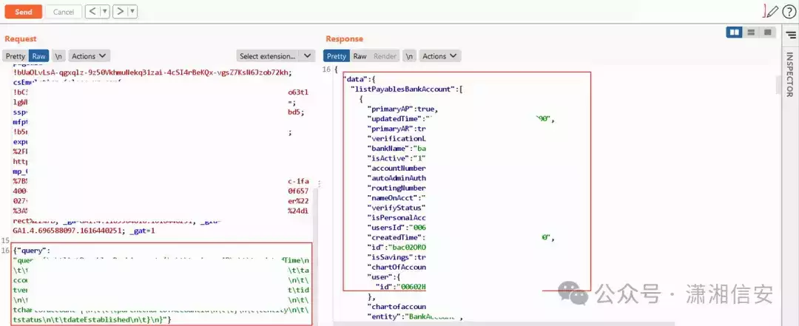
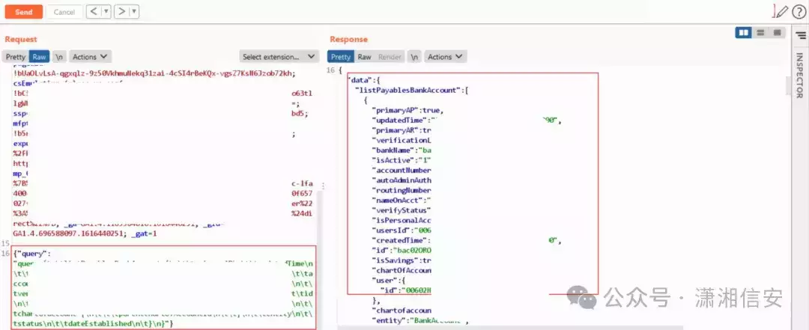
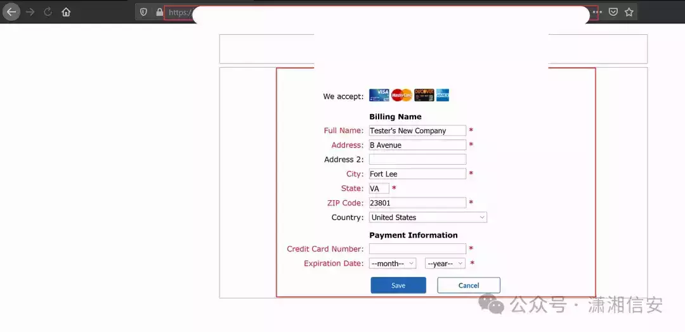

# 600美元的简单MFA绕过 - Graphql

  

  

我将分享我尝试绕过MFA的经验，以及我如何在不经过MFA流程的情况下偶然访问经过身份验证的数据。如果您热衷于了解MFA安全性和潜在漏洞，请继续关注我将分享的见解。  

```plain
测试方法-2FA绕过：https://securitycipher.com/docs/2fa-bypass/
测试方法-验证码绕过：https://securitycipher.com/docs/captcha-bypass/
测试方法-Graphql：https://securitycipher.com/docs/graphql-inprogress/
```

  

设置多重身份验证(MFA)后，我们通常期望额外的安全层来访问我们的应用程序。但是，在这个例子中，我发现了一些有趣的事情。尽管进行了MFA设置，我还是找到了一种无需输入MFA详细信息即可访问某些应用程序功能的方法。

  

**我做了什么？**

好吧，我在没有完成MFA流程的情况下设法调整了我的电子邮件和用户名。我什至添加了银行卡详细信息、银行信息，并使用手机号码更新了用户详细信息，所有这些都无需MFA的麻烦。

因此，我决定对MFA进行测试。我进行了一系列安全测试，重点是MFA的实现。但每次我试图访问受限制的API时，我都会遇到一个“未经授权”的错误。令人沮丧，对吧？

  

**然后我恍然大悟**

该应用程序不仅仅使用传统的API端点；它还使用GraphQL来实现某些功能。灵光一现！因此，我登录了该应用程序（MFA 已设置）并等待MFA提示。  

与此同时，我迅速拿出InQL扫描器插件来研究GraphQL查询。你瞧，使用其中一个查询，我能够在不完成MFA流程的情况下查看和编辑数据。

```plain
https://portswigger.net/bappstore/296e9a0730384be4b2fffef7b4e19b1f
```








  

**这是怎么回事？**

事实证明，该应用程序专门为 GraphQL API 设置了会话令牌，绕过了通常的 MFA 检查。这一发现使我能够访问敏感用户信息 (PII) 并调整一些参数，说明了这种疏忽的潜在影响。  

  

最后，他们承认了这个错误，我因为我的发现而收到了赏金和奖金。


- - -

- - -

- - -