# ADCS 攻击面挖掘与利用

Author: Imanfeng

## 0x00 前言

在 BlackHat21 中 Specterops 发布了 Active Directory Certificate Services 利用白皮书，尽管 ADCS 并不是默认安装但在大型企业域中通常被广泛部署。本文结合实战讲述如何在域环境中利用 ADCS 手法拿下域控，哪些对象 ACL 可用于更好的权限维持并涉及 ADCS 的基础架构、攻击面、后利用等。

## 0x01 技术背景

### 1\. 证书服务

#### *PKI 公钥基础结构*

在 PKI (公钥基础结构) 中，数字证书用于将公密钥对的公钥与其所有者的身份相关联。为了验证数字证书中公开的身份，所有者需要使用私钥来响应质询，只有他才能访问。

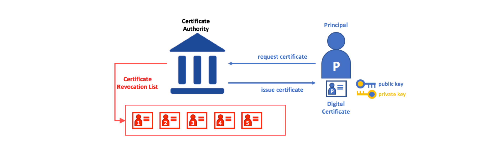

Microsoft 提供了一个完全集成到 Windows 生态系统中的公钥基础结构 (PKI) 解决方案，用于公钥加密、身份管理、证书分发、证书撤销和证书管理。启用后，会识别注册证书的用户，以便以后进行身份验证或撤销证书，即 Active Directory Certificate Services (ADCS)。

#### *ADCS 关键术语*

-   根证书颁发机构 (Root Certification Authority)  
    证书基于信任链，安装的第一个证书颁发机构将是根 CA，它是我们信任链中的起始。
-   从属 CA (Subordinate CA)  
    从属 CA 是信任链中的子节点，通常比根 CA 低一级。
-   颁发 CA (Issuing CA)  
    颁发 CA 属于从属 CA，它向端点（例如用户、服务器和客户端）颁发证书，并非所有从属 CA 都需要颁发 CA。
-   独立 CA (Standalone CA)  
    通常定义是在未加入域的服务器上运行的 CA。
-   企业 CA (Enterprise CA)  
    通常定义是加入域并与 Active Directory 域服务集成的 CA。
-   电子证书 (Digital Certificate)  
    用户身份的电子证明，由 Certificate Authority 发放（通常遵循 X.509 标准）。
-   AIA (Authority Information Access)  
    权威信息访问 (AIA) 应用于 CA 颁发的证书，用于指向此证书颁发者所在的位置引导检查该证书的吊销情况。
-   CDP (CRL Distribution Point)  
    包含有关 CRL 位置的信息，例如 URL (Web Server) 或 LDAP 路径 (Active Directory)。
-   CRL (Certificate Revocation List)  
    CRL 是已被撤销的证书列表，客户端使用 CRL 来验证提供的证书是否有效。

#### *ADCS 服务架构*

微软官方 ADCS 服务架构中的两层 PKI 环境部署结构[示例](https://docs.microsoft.com/en-us/previous-versions/windows/it-pro/windows-server-2012-r2-and-2012/hh831348(v=ws.11)#in-this-guide)如下：


ORCA1：首先使用本地管理员部署单机离线的根 CA，配置 AIA 及 CRL，导出根 CA 证书和 CRL 文件

1.  由于根 CA 需要嵌入到所有验证证书的设备中，所以出于安全考虑，根 CA 通常与客户端之间做网络隔离或关机且不在域内，因为一旦根 CA 遭到管理员误操作或黑客攻击，需要替换所有嵌入设备中的根 CA 证书，成本极高。
2.  为了验证由根 CA 颁发的证书，需要使 CRL 验证可用于所有端点，为此将在从属 CA (APP1) 上安装一个 Web 服务器来托管验证内容。根 CA 机器使用频率很低，仅当需要进行添加另一个从属 / 颁发 CA、更新 CA 或更改 CRL。

APP1：用于端点注册的从属 CA，通常完成以下关键配置

1.  将根 CA 证书放入 Active Directory 的配置容器中，这样允许域客户端计算机自动信任根 CA 证书，不需要在组策略中分发该证书。
2.  在离线 ORCA1 上申请 APP1 的 CA 证书后，利用传输设备将根 CA 证书和 CRL 文件放入 APP1 的本地存储中，使 APP1 对根 CA 证书和根 CA CRL 的迅速直接信任。
3.  部署 Web Server 以分发证书和 CRL，设置 CDP 及 AIA。

#### *LDAP 属性*

ADCS 在 LDAP 容器中进行了相关属性定义 `CN=Public Key Services,CN=Services,CN=Configuration,DC=,DC=`，部分前面提到过


**Certificate templates**

ADCS 的大部分利用面集中在证书模板中，存储为 `CN=Certificate Templates,CN=Public Key Services,CN=Services,CN=Configuration,DC=,DC=` ，其 objectClass 为 `pKICertificateTemplate`，以下为证书的字段

-   常规设置：证书的有效期
-   请求处理：证书的目的和导出私钥要求
-   加密：要使用的加密服务提供程序 (CSP) 和最小密钥大小
-   Extensions：要包含在证书中的 X509v3 扩展列表
-   主题名称：来自请求中用户提供的值，或来自请求证书的域主体身份
-   发布要求：是否需要 “CA 证书管理员” 批准才能通过证书申请
-   安全描述符：证书模板的 ACL，包括拥有注册模板所需的扩展权限

证书模板颁发首先需要在 CA 的 `certtmpl.msc` 进行模板配置，随后在 `certsrv.msc` 进行证书模板的发布。在 Extensions 中证书模板对象的 EKU (pKIExtendedKeyUsage) 属性包含一个数组，其内容为模板中已启用的 OID (Object Identifiers)


这些自定义应用程序策略 (EKU oid) 会影响证书的用途，以下 oid 的添加才可以让证书用于 Kerberos 身份认证

| 描述  | OID |
| --- | --- |
| Client Authentication | 1.3.6.1.5.5.7.3.2 |
| PKINIT Client Authentication | 1.3.6.1.5.2.3.4 |
| Smart Card Logon | 1.3.6.1.4.1.311.20.2.2 |
| Any Purpose | 2.5.29.37.0 |
| SubCA | (no EKUs) |

**Enterprise NTAuth store**

NtAuthCertificates 包含所有 CA 的证书列表，不在内的 CA 无法处理用户身份验证证书的申请

```plain
向 NTAuth 发布/添加证书：
certutil –dspublish –f IssuingCaFileName.cer NTAuthCA

要查看 NTAuth 中的所有证书：
certutil –viewstore –enterprise NTAuth

要删除 NTAuth 中的证书：
certutil –viewdelstore –enterprise NTAuth
```


域内机器在注册表中有一份缓存：

`HKLM\SOFTWARE\Microsoft\EnterpriseCertificates\NTAuth\Certificates`

当组策略开启 “自动注册证书”，等组策略更新时才会更新本地缓存。

**Certification Authorities & AIA**

Certification Authorities 容器对应根 CA 的证书存储。当有新的颁发 CA 安装时，它的证书则会自动放到 AIA 容器中。

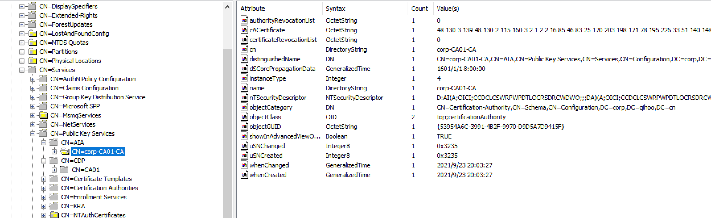

来自他们容器的所有证书同样会作为组策略处理的一部分传播到每个网络连通的客户端，当同步出现问题的话 KDC 认证会抛 `KDC_ERR_PADATA_TYPE_NOSUPP` 报错。

**Certificate Revocation List**

前面在 PKI 服务架构中提到了，证书吊销列表 (CRL) 是由颁发相应证书的 CA 发布的已吊销证书列表，将证书与 CRL 进行比较是确定证书是否有效的一种方法。

`CN=<CA name>,CN=<ADCS server>,CN=CDP,CN=Public Key Services,CN=Services,CN=Configuration,DC=,DC=`

通常证书由序列号标识，CRL 除了吊销证书的序列号之外还包含每个证书的吊销原因和证书被吊销的时间。


### 2\. 证书注册

#### *证书注册流程*

ADCS 认证体系中的证书注册流程大致如下：


1.  客户端创建公钥 / 私钥对；
2.  将公钥与其他信息 (如证书的主题和证书模板名称) 一起放在证书签名请求 (CSR) 消息中，并使用私钥签署；
3.  CA 首先判断用户是否允许进行证书申请，证书模板是否存在以及判断请求内容是否符合证书模板；
4.  通过审核后，CA 生成含有客户端公钥的证书并使用自己的私钥来签署；
5.  签署完的证书可以进行查看并使用。

#### *证书注册方式*

1\. 证书颁发机构 Web 注册

在部署 CA 时勾选证书颁发机构 Web 注册，即可在 `http://CA-Computer/certsrv` 身份认证后进行证书申请。


2\. 客户端 GUI 注册

域内机器可以使用 `certmgr.msc` (用户证书)，`certlm.msc` (计算机证书)  GUI 请求证书


3\. 命令行注册

域内机器可以通过 `certreq.exe` 或 Powershell `Get-Certificate` 申请证书，后面有使用示例

4\. DCOM 调用

基于 DCOM 的证书注册遵循 MS-WCCE 协议进行证书请求，目前大多数 C#、python、Powershell 的 ADCS 利用工具都按照 WCCE 进行证书请求。

#### *证书注册权限*

在 Active Directory 中权限控制是基于访问控制模型的，其包含两个基本部分：

-   访问令牌，其中包含有关登录用户的信息
-   安全描述符，其中包含保护安全对象的安全信息


在 ADCS 中使用两种安全性定义注册权限 (主体可以请求证书) ，**一个在证书模板 AD 对象上，另一个在企业 CA 本身上**。

在颁发 CA 机器上使用 `certtmpl.msc` 可查看所有证书模板，通过安全扩展可以对证书模板的用户访问权限查看。


可以在颁发 CA 机器上使用 `certsrv.msc` 查看 CA 对于用户的访问权限设置。


## 0x02 证书使用

### 1\. 证书认证

#### *Kerberos 认证*

Kerberos 是域环境中主要的认证协议，其认证流程大致如下：


1.  AS\_REQ：client 用 client\_hash 、时间戳向 KDC 进行身份验证；
2.  AS\_REP：KDC 检查 client\_hash 与时间戳，如果正确则返回 client 由 krbtgt 哈希加密的 TGT 票据和 PAC 等相关信息；
3.  TGS\_REQ：client 向 KDC 请求 TGS 票据，出示其 TGT 票据和请求的 SPN；
4.  TGS\_REP：KDC 如果识别出 SPN ，则将该服务账户的 NTLM 哈希加密生成的 ST 票据返回给 client；
5.  AP\_REQ：client 使用 ST 请求对应服务，将 PAC 传递给服务进行检查。服务通过 PAC 查看用户的 SID 和用户组等并与自身的 ACL 进行对比，如果不满足则作为适当的 RPC 状态代码返回；
6.  AP\_REP：服务器验证 AP-REQ，如果验证成功则发送 AP-REP，客户端和服务端通过中途生成的 Session key 等信息通过加解密转换验证对方身份。

#### *PKINIT 认证*

在 RFC 4556 中定义了 PKINIT 为 Kerberos 的扩展协议，可通过 X.509 证书用来获取 Kerberos 票据 (TGT)。


PKINIT 与 Kerberos 差别主要在 AS 阶段：

1.  PKINIT AS\_REQ：发 d 送内容包含证书，私钥进行签名。KDC 使用公钥对数字签名进行校验，确认后返回使用证书公钥加密的 TGT 并且消息是使用 KDC 私钥签名；
2.  PKINIT AS\_REP：客户端使用 KDC 公钥进行签名校验，随后使用证书私钥解密成功拿到 TGT。

详细的协议流程规范：[http://pike.lysator.liu.se/docs/ietf/rfc/45/rfc4556.xml](http://pike.lysator.liu.se/docs/ietf/rfc/45/rfc4556.xml)

#### *NTLM 凭据*

在 2016 年，通过证书获取 NTLM 的功能就被集成在 kekeo 和 mimikatz 中，核心在于当使用证书进行 PKCA 扩展协议认证的时候，返回的 PAC 中包含了 NTLM 票据。


即使用户密码改了，通过证书随时可以拿到 NTLM。获取能用来进行 Kerberos 身份认证的证书需要满足一下几个条件：

1\. 证书模板 OID

前面我们提到了，目前已知应用程序策略 (oid) 只有包含了 Client Authentication、PKINIT Client Authentication、Smart Card Logon、Any Purpose、SubCA 时，对应的证书才能充当 PKINIT 身份认证凭据。

2\. 证书请求权限

-   用户拥有向 CA 申请证书的权限；
-   用户拥有证书模板申请证书的权限。

### 2\. 证书获取

#### *导出机器证书*

通过 `certlm.msc` 图形化或 `certutil.exe` 进行证书导出。


当私钥设置为不允许导出的时候，利用 Mimikatz 的 `crypto::capi` 命令可以 patch 当前进程中的 capi ，从而利用 Crypto APIs 导出含有私钥的证书。


#### *导出用户证书*

通过 `certmgr.msc` 图形化或 `certutil.exe` 进行用户证书导出。


遇到私钥限制同样可尝试 `crypto::capi` 导出证书。


#### *本地检索证书*

在实战中会遇到证书、私钥文件就在文件夹内并不需要导出，其后缀文件主要有以下几种

| 后缀  | 描述  |
| --- | --- |
| .pfx\\ .p12\\ .pkcs12 | 含公私钥，通常有密码保护 |
| .pem | 含有 base64 证书及私钥，可利用 openssl 格式转化 |
| .key | 只包含私钥 |
| .crt\\ .cer | 只包含证书 |
| .csr | 证书签名请求文件，不含有公私钥 |
| .jks\\ .keystore\\ .keys | 可能含有 java 应用程序使用的证书和私钥 |

可结合自身需求通过开源工具或自研武器来满足检索文件后缀的需求。

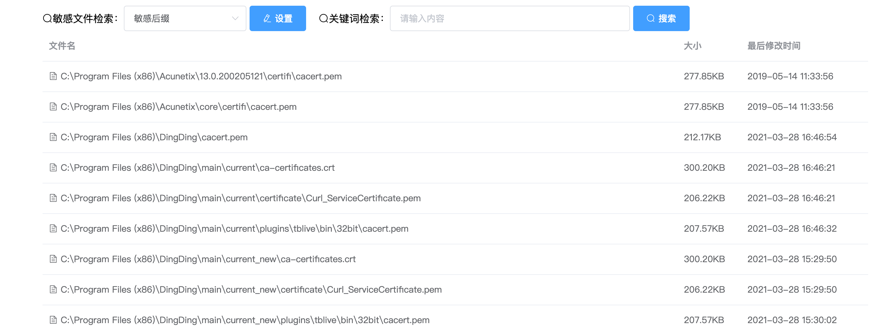

## 0x03 证书滥用

本节围绕 ADCS 从证书模板的滥用到权限维持滥用进行讲解

### 1\. 证书模板

#### *CT\_FLAG\_ENROLLEE\_SUPPLIES\_SUBJECT 滥用*

该错误配置在企业 ADCS 中是最为常见的，需满足的条件为：

-   颁发 CA 授予低权限用户请求权限 (默认)
-   模板中 CA 管理员审批未启用 (默认)
-   模板中不需要授权的签名 (默认)
-   模板允许低权限用户注册
-   模板定义了启用认证的 EKU
-   **证书模板允许请求者在 CSR 中指定一个 subjectAltName**


如果满足上列条件，当攻击者在请求证书时可通过 `CT_FLAG_ENROLLEE_SUPPLIES_SUBJECT` 字段来声明自己的身份，从而可获取到伪造身份的证书，Certify 为白皮书配套的 ADCS 利用工具。

```plain
Certify.exe find /vulnerable
```


使用 `certutil.exe -TCAInfo` 判断 CA 状态及当前用户请求的权限情况


利用 Certify 的 set altname 来伪造 administrator 身份尝试得到证书

```plain
Certify.exe request /ca:"CA01.corp.qihoo.cn\corp-CA01-CA" /template:”ESC1“ /altname:administrator
```


成功通过申请后可得到含有公私钥的 pem 证书文件，使用 openssl 进行格式转化

```plain
/usr/bin/openssl pkcs12 -in ~/cert.pem -keyex -CSP "Microsoft Enhanced Cryptographic Provider v1.0" -export -out ~/cert.pfx
```

20.11 后的 Rubeus 进行了 PKINIT 证书支持，使用 cert.pfx 作为 administrator 身份申请 TGT，成功获得 administrator 的票据

```plain
Rubeus4.exe asktgt /user:Administrator /certificate:cert.pfx /password:123456 /outfile:cert.kribi /ptt
```


#### *Any EKU OR no EKU*

与第一种利用需满足的条件前四点相同的用户证书非机器证书，主要差别在 EKU 的描述：

-   颁发 CA 授予低权限用户请求权限 (默认)
-   模板中 CA 管理员审批未启用 (默认)
-   模板中不需要授权的签名 (默认)
-   模板允许低权限用户注册
-   **证书模板中定义了 no EKU 或 any EKU**


可使用 `certutil.exe` 检查模板的 `pKIExtendedKeyUsage` 字段是否为空

```plain
certutil -v -dstemplate
```

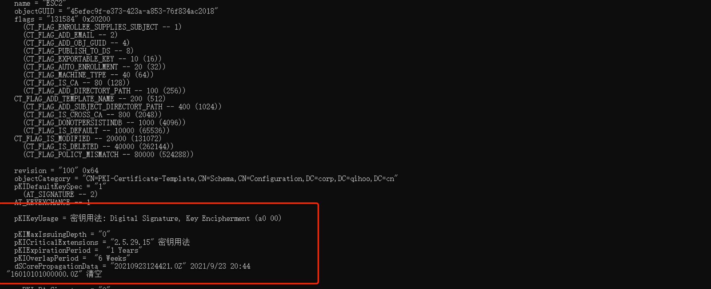

通过 Certify 成功定位到恶意模板


该利用方式并不是能直接通过 Kerberos 认证来伪造用户。Any Purpose (OID 2.5.29.37.0) 可以用于任何目的，包括客户端身份验证，如果没有指定 eku，即 **pkiextendedkeyusag** 为空那么该证书就相当于从属 CA 的证书，可以用于任何情况给其他用户来颁发证书。

前面说过 CA 证书不在 **NtAuthCertificates** 内的话，是无法为身份认证作用来颁发证书的，所以该利用手段无法直接伪造用户，但可以用来签发用于其他应用，例如 ADFS ，它是 Microsoft 作为 Windows Server 的标准角色提供的一项服务，它使用现有的 Active Directory 凭据提供 Web 登录，感兴趣的可以自己搭环境试一试。

#### *注册代理证书滥用*

CA 提供一些基本的证书模板，但是标准的 CA 模板不能直接使用，必须首先复制和配置。部分企业出于便利性通过在服务器上设置可由管理员或注册代理来直接代表其他用户注册对应模板得到使用的证书。


实现该功能需要两个配置模板：

1.  颁发 “注册代理” 的证书模板
2.  满足代表其他用户进行注册的证书模板

**模板一为颁发 “注册代理” 证书**

-   颁发 CA 授予低权限用户请求权限 (默认)
-   模板中 CA 管理员审批未启用 (默认)
-   模板中不需要授权的签名 (默认)
-   模板允许低权限用户注册
-   **证书模板中定义了证书请求代理 EKU (1.3.6.1.4.1.311.20.2.1)**


**模板二为允许使用 “注册代理” 证书去代表其他用户申请身份认证证书**

-   颁发 CA 授予低权限用户请求权限 (默认)
-   模板中 CA 管理员审批未启用 (默认)
-   模板中不需要授权的签名 (默认)
-   模板允许低权限用户注册
-   模板定义了启用认证的 EKU
-   **模板模式版本 1 或大于 2 并指定应用策略，签发要求证书请求代理 EKU**
-   **没有在 CA 上对登记代理进行限制 (默认)**


申请注册代理证书并连同私钥导出为 esc3\_1.pfx

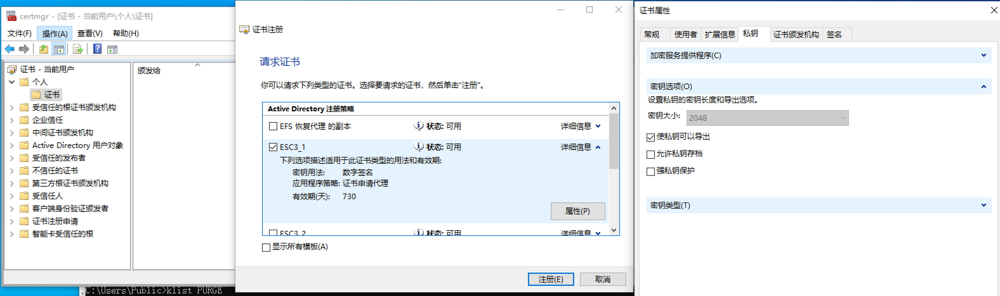

利用 Certify 通过 esc3\_1.pfx 代表 administrator 申请 esc3\_2.pfx 的身份认证证书，得到的证书同样可以进行 ptt 利用

```plain
Certify.exe request /ca:"CA01.corp.qihoo.cn\corp-CA01-CA" /template:ESC3_2 /onbehalfof:administrator /enrollcert:esc3_1.pfx /enrollcertpw:123456
```


可看到证书颁发给了 administrator

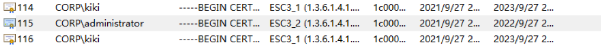

#### *EDITF\_ATTRIBUTESUBJECTALTNAME2 滥用*

一些企业因业务需求会把颁发 CA + `EDITF_ATTRIBUTESUBJECTALTNAME2`  来启用 SAN (主题备用名)，从而允许用户在申请证书时说明自己身份。例如 [CBA for Azure AD](https://samilamppu.com/2017/01/21/cba-for-azure-ad/) 场景中证书通过 NDES 分发到移动设备，用户需要使用 RFC 名称或主体名称作为 SAN 扩展名来声明自己的身份。


至此利用手段与第一种一样均可伪造身份，区别在于一个是证书属性，一个是证书扩展。

-   企业 CA 授予低权限用户请求权限（默认）
-   模板中 CA 管理员审批未启用（默认）
-   模板中不需要授权的签名（默认）
-   **CA +EDITF\_ATTRIBUTESUBJECTALTNAME2**

通过远程注册表判断 CA 是否开启 SAN 标识

```plain
certutil -config "CA01.corp.qihoo.cn\corp-CA01-CA" -getreg "policy\EditFlags"
```


手动创建利用证书请求

`certreq –new usercert.inf certrequest.req`

```ini
#usercert.inf
[NewRequest]

KeyLength=2048
KeySpec=1
RequestType = PKCS10
Exportable = TRUE 
ExportableEncrypted = TRUE

[RequestAttributes]
CertificateTemplate=USER
```

利用 req 请求上步得到 .cer 含公钥证书，其他字段可翻阅[官方文档](https://docs.microsoft.com/en-us/previous-versions/windows/it-pro/windows-server-2012-r2-and-2012/dn296456(v=ws.11))

```plain
certreq -submit -config "CA01.corp.qihoo.cn\corp-CA01-CA" -attrib "SAN:upn=administrator@corp.qihoo.cn" certrequest.req certrequest.cer
```


将 .cer 导入机器后连同私钥导出为 .pfx ，同样顺利通过 ptt 认证。


### 2\. 访问权限

前面提到，证书模板和证书颁发机构是 AD 中的安全对象，这意味着安全描述符同样可用来指定哪些主体对他们具有特定的权限，详细内容可阅读 ACL 相关文档。

在对应设置中安全选项可用于对用户的权限进行相关设置，我们关注 5 种权限

| 权限  | 描述  |
| --- | --- |
| Owner | 对象所有人，可以编辑任何属性 |
| Full Control | 完全控制对象，可以编辑任何属性 |
| WriteOwner | 允许委托人修改对象的安全描述符的所有者部分 |
| WriteDacl | 可以修改访问控制 |
| WriteProperty | 可以编辑任何属性 |

#### *模板访问权限配置错误*

例如我们已经拿下整个域想借助证书模板进行权限维持，那我们可对一个无害正常模板进行相关 ACL 添加

-   NT AUTHORITY\\Authenticated Users -> WriteDacl
-   NT AUTHORITY\\Authenticated Users -> WriteProperty


当我们重新回到域内通过密码喷洒等手段再次拿到任意一个用户凭据后，即可将该无害模板变成我们可以利用的提权模板

-   msPKI-Certificates-Name-Flag -edit-> ENROLLEE\_SUPPLIES\_SUBJECT (WriteProperty)
-   msPKI-Certificate-Application-Policy -add-> 服务器身份验证 (WriteProperty)
-   mspki-enrollment-flag -edit-> AUTO\_ENROLLMENT (WriteProperty)
-   Enrollment Rights -add-> Control User (WriteDacl)


随后利用恶意模板进行 **CT\_FLAG\_ENROLLEE\_SUPPLIES\_SUBJECT** 提权利用，可拿到 administrator 的证书凭据即可 ptt ，相比 Certify ，certi 是可以在域外使用的。

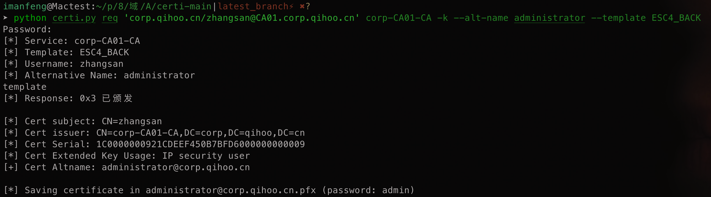

#### *PKI 访问权限配置错误*

如果低特权的攻击者可以对 `CN=Public Key Services,CN=Services,CN=Configuration,DC=,DC=` 控制，那么攻击者就会直接控制 PKI 系统 (证书模板容器、证书颁发机构容器、NTAuthCertificates 对象、注册服务容器等)。

将 `CN=Public Key Services,CN=Services,CN=Configuration` 添加 CORP\\zhangsan 用户对其 GenericAll 的权限


此时我们可以滥用权限创建一个新的恶意证书模板来使用进行前面相关的域权限提升方法。


#### *CA 访问权限配置错误*

CA 本身具有一组安全权限用于权限管理


我们主要关注 **ManageCA** ，**ManageCertificates** 两种权限

| 权限  | 描述  |
| --- | --- |
| Read | 读取 CA |
| ManageCA | CA 管理员 |
| Issue and manage certificates | 证书管理 |
| Request certificates | 请求证书，默认拥有 |


**利用面一：隐藏 CA 申请记录**

在拿到域管权限或拥有 PKI 操作权限后创建一个恶意证书模板


使用 **CT\_FLAG\_ENROLLEE\_SUPPLIES\_SUBJECT** 姿势获取到 administrator 的 pfx 证书用于权限维持 (用户状态异常无法利用该证书)

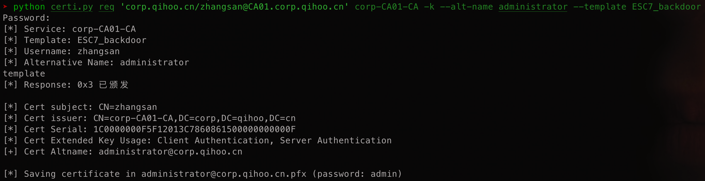

我们出于隐蔽考虑可删除模板并利用拥有 ManageCA 权限的 zhangsan 调用 COM 接口 `ICertAdminD2::DeleteRow` 从 CA 数据库中删除申请的证书痕迹

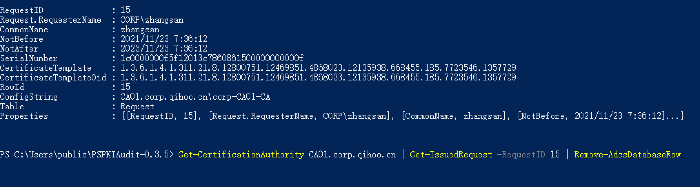

运维人员是无法从证书控制台观察到我们的证书申请记录并无法吊销证书。只要 administrator 用户不过期，证书不过期即可一直使用，即使用户密码更改。

**利用面二：修改 CA 属性用于证书提权**

当我们拥有 ManageCA 权限下调用 `ICertAdminD2::SetConfigEntry` 来修改 CA 的配置数据，例如 `Config_CA_Accept_Request_Attributes_SAN` 的 bool 型数据从而开启 CA 的 `EDITF_ATTRIBUTESUBJECTALTNAME2`

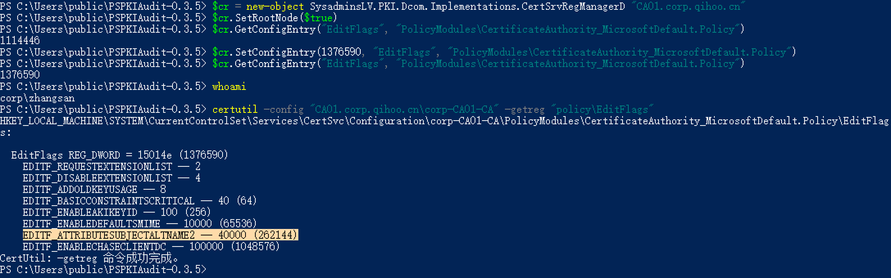

此时可参考前面 **EDITF\_ATTRIBUTESUBJECTALTNAME2** 证书提权滥用拿到域控制权


**利用面三：自己审批证书注册**

在证书模板设置时，部分运维会出于安全考虑将模板发布要求设置为 CA 证书管理员审批，管理员就会在 `certsrv.msc` 上进行确认


当拥有 ManageCertificates 权限时，可调用 `ICertAdminD::ResubmitRequest` 去给需要审核的滥用证书进行批准放行。


### 3\. 其他利用

#### *Golden Certificates*

使用偷来的证书颁发机构 (CA) 证书以及私钥来为任意用户伪造证书，这些用户可以对活动目录进行身份验证，**因为签署颁发证书的唯一密钥就是 CA 的私钥**。

当我们获取到 CA 服务器时，通过 mimikatz 或 [SharpDPAPI](https://github.com/GhostPack/SharpDPAPI) 项目提取任何不受硬件保护的 CA 证书私钥。

```plain
SharpDPAPI4.exe certificates /machine 
```

使用 openssl 转化格式后，利用 [ForgeCert](https://github.com/GhostPack/ForgeCert) 或 [pyForgeCert](https://github.com/Ridter/pyForgeCert) 进行证书构造，故含私钥的 CA 为 “黄金证书”。


#### *NTLM Relay to ADCS HTTP Endpoints*

该利用方式是因为 http 的证书注册接口易受 NTLM Relay 攻击所导致的。NTLM 相关利用文章有很多，例如 CVE-2018-8581、CVE-2019-1040、Printerbug 等这里不再介绍。


PetitPotam 可以指定域内的一台服务器，使其对指定目标进行身份验证。当目标为低版本 (16 以下) 时，可以做到匿名触发。

通过调用 `MS-EFSRPC` 相关函数到域控，使域控发送请求我们的监听，我们将获取到的 NTLM Relay 到 ADCS 的 Web 注册页面。

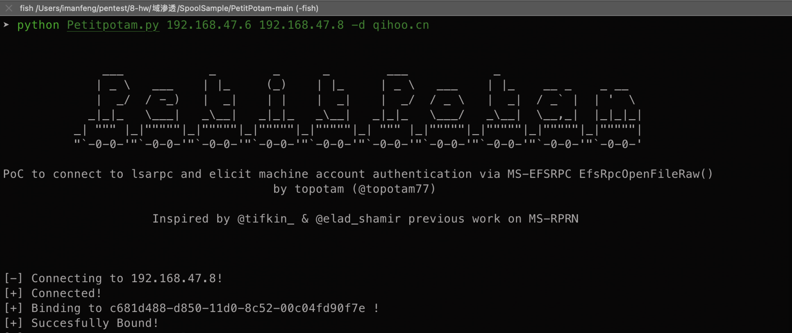

通过域控机器用户 NTLM 凭据向 web 服务注册证书，成功得到域控机器账户的 Encode Base64 证书。


利用 kekeo 进行 ask tgt 成功拿到 DC$ 权限进行 Dcsync。


## 0x04 写在后面

ADCS 相关利用手段在实战场景中权限提升，权限维持非常便捷。针对 ADCS 的防御方案在白皮书也有详细提到，这里就不详细写了。

部分解决方案有提到微软的三层架构：


核心思想就是你是什么用户就访问怎样的资产，无法向下级访问且向上访问会告警。那么 CA 、ADCS 服务器的本地管理员组、PKI 和证书模板所拥有者都应该处于 0 层。

最后灵腾实验室长期招聘高级攻防专家，高级安全研究员，感兴趣可发送简历至 g-linton-lab \[AT\] 360.cn

## 0x05 参考链接

[https://www.specterops.io/assets/resources/Certified\_Pre-Owned.pdf](https://www.specterops.io/assets/resources/Certified_Pre-Owned.pdf)

[https://docs.microsoft.com/en-us/windows/win32/ad/how-access-control-works-in-active-directory-domain-services](https://docs.microsoft.com/en-us/windows/win32/ad/how-access-control-works-in-active-directory-domain-services)

[https://www.riskinsight-wavestone.com/en/2021/06/microsoft-adcs-abusing-pki-in-active-directory-environment/](https://www.riskinsight-wavestone.com/en/2021/06/microsoft-adcs-abusing-pki-in-active-directory-environment/)

[https://www.anquanke.com/post/id/245791](https://www.anquanke.com/post/id/245791)
