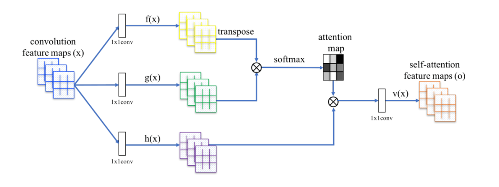
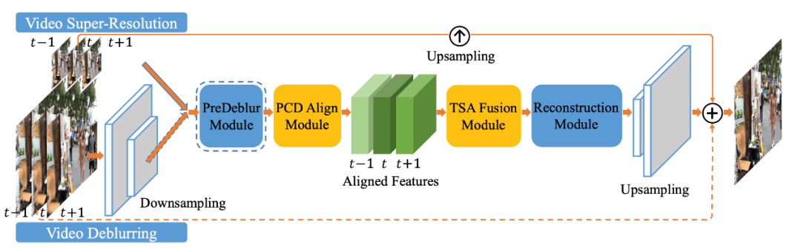
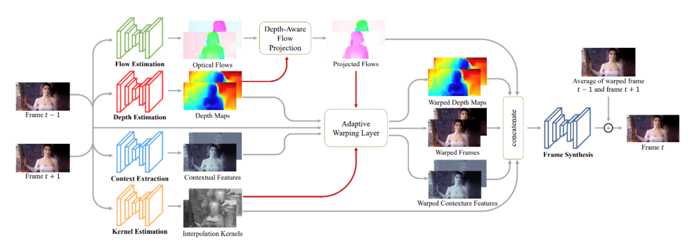
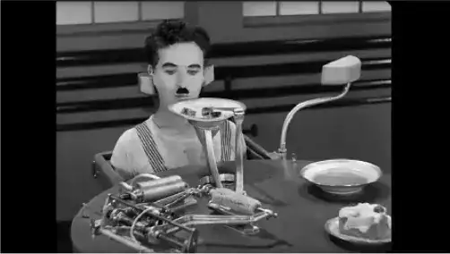
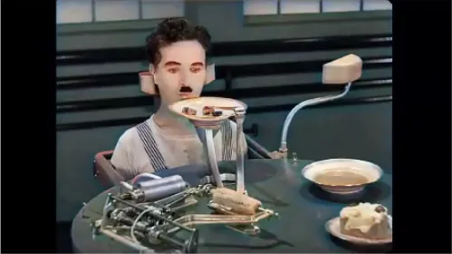

# AI 修复老视频，重温儿时的记忆

  

  

  

  

**前言**

  

每个人心中总有那么几部挥之不去的老电影，然而，电视中播放出那些熟悉的经典镜头时，很多时候画面模糊，难以体验到高清质感带来的视觉享受。随着科技的发展，现在家庭大多使用4K高清电视，不要说480P、720P，就连1080P都满足不了高品质家庭的观影需求，所以非4K转4K、8K HDR高清视频将成为市场主流趋势。

  

值得庆幸的是AI视频修复横空出世了，它并不是简单地把低分辨率的视频放大输出成高分辨率，而是通过生成对抗网络（Generative Adversarial Networks，GAN），实现老视频修复。

  

  

****项目介绍****

  

飞桨生成对抗网络开发套件PaddleGAN，集成风格迁移、超分辨率、动漫画生成、图片上色、人脸属性编辑、妆容迁移等SOTA算法，以及预训练模型。并且模块化设计，以便开发者进行二次研发，或是直接使用预训练模型做应用。  

  

本项目就是基于PaddleGAN中的着色算法、修复算法、插帧算法模型，从而轻松实现了低清黑白电影转变成高清彩色电影，修复老电影磨损划痕画面，提高帧率让画面人物动作更流畅，还可以增强色彩使画质更饱满，AI修复后效果能达到高清标准，满足了人们日益增长的美好生活需要，让你在重温经典的同时，更能享受影院级画质，让记忆更清晰，让经典永留存。

  

  

**老视频修复原理**

  

  

  

  



图1 DeOldify 模型示意图

  

DeOldify 是用于着色和恢复旧图像及视频的深度学习项目，它采用自注意力机制的生成对抗网络。它采用了 NoGAN （一种新型的、高效的图像到图像）的生成对抗网络训练方法，可以更好地处理细节效果，渲染也更逼真，在图像的着色方面有着较好的效果。NoGAN 训练结合了 GAN 训练的优点（好看的色彩），同时消除了令人讨厌的副作用（如视频中的闪烁物体）。NoGAN 生成器是一个U-NET结构的网络，进行了预训练，使其利用常规损失函数，变得更强大、更快、更可靠。DeOldify 修复的老视频由孤立的图像生成，而不添加任何时间建模。该过程执行 30-60 分钟 “NoGAN” 训练的 GAN 部分，每次使用 1% 至 3% 的图像网络（ImageNet）数据。然后，与静止图像着色一样，在重建视频之前对各个帧进行“去旧化 ”。

  

以下是PaddleGAN中着色模型DeOldify模型的代码：

```plain
ppgan.apps.DeOldifyPredictor(output='output', weight_path=None, render_factor=32)
```

  

**参数解释：**

-   output\_path (str，可选的)：输出的文件夹路径，默认值：output。
    
-   weight\_path (None，可选的)：载入的权重路径，如果没有设置，则从云端下载默认的权重到本地。默认值：None。
    
-   render\_factor (int): 会将该参数乘以16后作为输入帧的resize的值，如果该值设置为32，则输入帧会resize到(32 \* 16, 32 \* 16)的尺寸再输入到网络中。
    

  

  

  

  

  



图2 EDVR 模型示意图

  

EDVR模型提出了一个新颖的还原框架——视频具有增强可变形卷积。这个模型有以下两个特点：第一，为了处理大动作而设计的一个金字塔，级联和可变形（PCD）对齐模块，使用可变形卷积以从粗到精的方式在特征级别完成对齐；第二，提出时空注意力机制（TSA）融合模块，在时间和空间上都融合了注意机制，用以增强复原的功能。

  

以下是PaddleGAN中修复模型EDVR模型的代码：

```plain
ppgan.apps.EDVRPredictor(output='output', weight_path=None)
```

  

  

**参数：**

-   output\_path (str，可选的)：输出的文件夹路径，默认值：output。
    
-   weight\_path (None，可选的)：载入的权重路径，如果没有设置，则从云端下载默认的权重到本地。默认值：None。
    

  

  

  

  

  



图3 DAIN 模型示意图

  

DAIN（深度感知视频帧插值）模型通过探索深度的信息来显式检测遮挡。并且开发了一个深度感知的流投影层来合成中间流。在视频补帧方面有较好的效果，它可以“脑补”缺失的帧并插入现有视频剪辑的关键帧之间。换句话说，DAIN首先分析并映射视频片段，然后插入在现有图像之间生成填充图像。

  

以下是PaddleGAN中插帧模型 DAIN的代码：

```plain
ppgan.apps.DAINPredictor(
                        output_path='output',
                        weight_path=None,
                        time_step=None,
                        use_gpu=True,
                        remove_duplicates=False)
```

  

**参数：**

-   output\_path (str，可选的): 输出的文件夹路径，默认值：output.
    
-   weight\_path (None，可选的)：载入的权重路径，如果没有设置，则从云端下载默认的权重到本地。默认值：None。
    
-   time\_step (int): 补帧的时间系数，如果设置为0.5，则原先为每秒30帧的视频，补帧后变为每秒60帧。
    
-   remove\_duplicates (bool，可选的): 是否删除重复帧，默认值：False。
    

  

  

**代码展示**

  

1.  安装PaddleGAN
    

```plain
!git clone https://gitee.com/paddlepaddle/PaddleGAN.git
%cd PaddleGAN/
!pip install -v -e .
```

  

1.  环境配置
    

```plain
import cv2
import imageio
import numpy as np
import matplotlib.pyplot as plt
import matplotlib.animation as animation
from IPython.display import HTML
import warnings
warnings.filterwarnings("ignore")
```

  

1.  导入视频
    

```plain
def display(driving, fps, size=(8, 6)):
    fig = plt.figure(figsize=size)

    ims = []
    for i in range(len(driving)):
        cols = []
        cols.append(driving[i])

        im = plt.imshow(np.concatenate(cols, axis=1), animated=True)
        plt.axis('off')
        ims.append([im])

    video = animation.ArtistAnimation(fig, ims, interval=1000.0/fps, repeat_delay=1000)

    plt.close()
    return video


video_path = '/home/aistudio/moderntimes.mp4'
video_frames = imageio.mimread(video_path, memtest=False)

cap = cv2.VideoCapture(video_path)
fps = cap.get(cv2.CAP_PROP_FPS)
HTML(display(video_frames, fps).to_html5_video())
```

  

1.  修复视频
    

```plain
%cd /home/aistudio/PaddleGAN/applications/
!python tools/video-enhance.py --input /home/aistudio/moderntimes.mp4 \
                               --process_order DAIN DeOldify EDVR \
                               --output output_dir
```

  

1.  导出视频
    

```plain
output_video_path= '/PaddleGAN/applications/output_dir/EDVR/moderntimes_deoldify_out_edvr_out.mp4' 
video_frames = imageio.mimread(output_video_path, memtest=False)

cap = cv2.VideoCapture(output_video_path)
fps = cap.get(cv2.CAP_PROP_FPS)
HTML(display(video_frames, fps).to_html5_video())
```

  

  

****效果展示****

  

  

  

  

**AI Studio项目地址：**

https://aistudio.baidu.com/aistudio/projectdetail/1839885

  



图4 《摩登时代》修复前

  



图5 《摩登时代》修复后

  

  

  

  

**AI Studio项目地址：**

https://aistudio.baidu.com/aistudio/projectdetail/1839881

  

**B站：**

https://www.bilibili.com/video/BV1cb4y1f7ss

  

  

**小结**

  

AI 修复老视频，相比专业视频修复，效果上仍然有所欠缺，比如有些场景颜色修复的不够自然、色彩饱和度不够理想、光线阴影偏暗等，但发展空间很大。以2019年国庆档《开国大典》为例，电影修复技术主要负责人周苏岳介绍，他们是由40人组成的修复团队奋战60天，才将12分12秒长的经典影片修复完成。专业视频修复师1天只能修复1秒，而AI 修复老视频，通过着色算法、修复算法、插帧算法，修复时长1分钟的视频（以《摩登时代》https://aistudio.baidu.com/aistudio/projectdetail/1839885为例）总用时在4小时以内。由此可见，使用 AI 修复视频可以大幅提高视频修复师的工作效率，视频修复师只需要在AI修复的视频基础上再调整光线和增加色彩饱和度，让场景色彩更加自然美观。