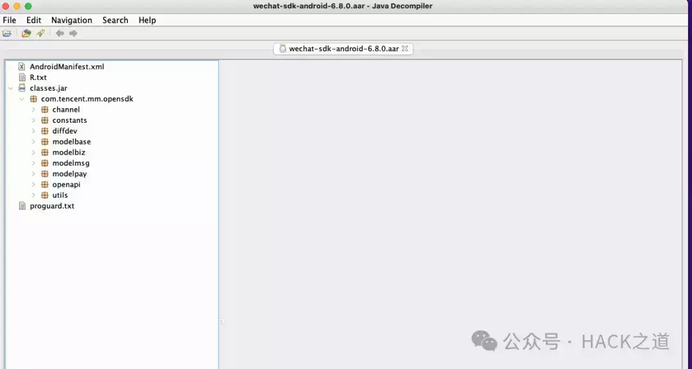

# APK扫描/反编译工具

# 

# **skyeye**

### **安装**

#### **python3环境安装**

```plain
brew install python3
```

#### **skyeye安装**

```plain
pip3 install skyeye
```

#### **扫描APK中代码引用**

1\. 本地创建config.yaml文件,格式如下

```plain
- className: "com.xx.xx.yourClassName1"
  methodName: "methodName"
- className: "com.xx.xx.yourClassName2"
  filedName: "filedName"
```

-   如果methodName,filedName不填写,会扫描className所有方法和变量的外部引用情况
    
-   方法和字段名都是模糊匹配，例如methodName(x,x)只需要填写methodName即可
    
-   扫描父类的字段和方法，其子类的也会被扫描
    

2\. 扫描

```plain
skyeye scan
      -i , --input       输入扫描的APK路径
      -c , --config      扫描配置yaml文件路径
      -o , --output      输出结果的文件夹路径 【可选，默认运行文件夹路径】
```

```plain
{
    "cn.Test:<init>()V": [
        {
            "caller_class": "cn.xx.MainActivity",
            "caller_method": "protected onCreate(Landroid.os.Bundle;)V",
            "invoke_num": " 58"
        }
    ],
    "cn.Test.staticString": [
        {
            "caller_class": "cn.xx.MainActivity",
            "caller_method": "protected onCreate(Landroid.os.Bundle;)V",
            "invoke_num": " 60"
        }
    ]
}
```

#### **反编译**

```plain
skyeye dec
      -i , --input       输入扫描的APK路径
      -o , --output      输出结果的文件夹路径 【可选，默认运行文件夹路径】
```


#### **GUI打开源码**

```plain
skyeye jd
      -i , --input   目标class文件路径 或者 class文件夹路径
```



#### **查看当前版本**

```plain
skyeye -v
输出版本同时，检查更新
```

**点击下方名片，回复关键字【****sky****】获取**