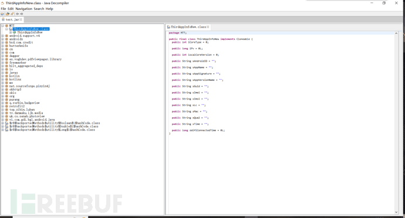
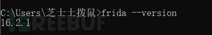
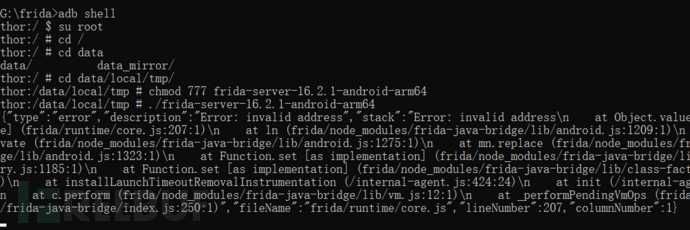
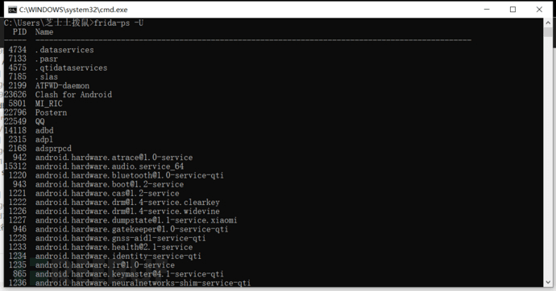
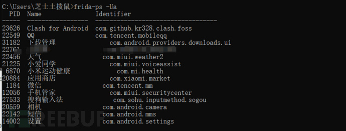
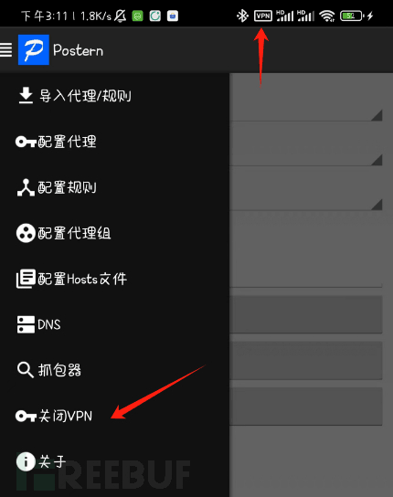
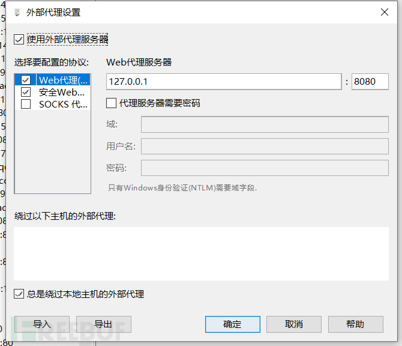
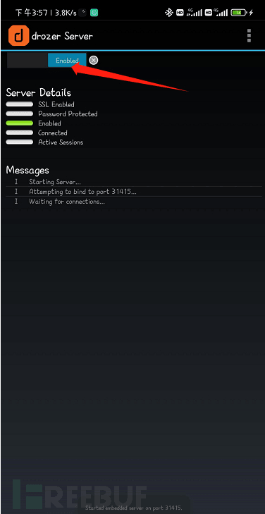
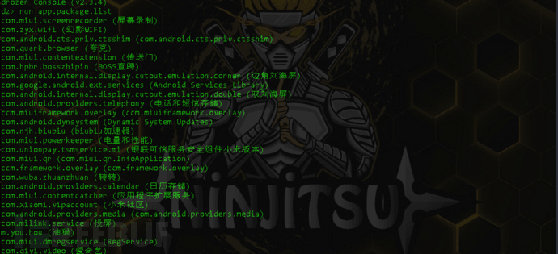
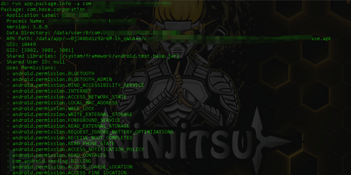

# APP 攻防 & Android 逆向 & HOOK 抓包 & 组件安全 - FreeBuf 网络安全行业门户

## Android 逆向基础

### apk 反编译

APP 渗透测试中重要的一环就是 Android 逆向，此时就需要 apk 反编译技术，小时候的你肯定也想过如何破解一款手机游戏，整个逆向破解最重要的一环就是反编译。

#### dex2jar

dex2jar 是一个安卓反编译的工具，可以吧.dex 文件转换成.jar 文件，可以帮助我们分析具体的代码。  
项目地址：  
[https://github.com/pxb1988/dex2jar/releases](https://github.com/pxb1988/dex2jar/releases)  
使用：  
把测试 apk 后缀改为 zip 解压，可以得到.dex 文件。  
  
把.dex 文件单独解压出来。  
使用命令：  
`d2j-dex2jar <.dex路径> -o <输出路径+名称.jar>`  
  
输出路径下就会有.jar 文件  


#### jd-gui

得到.jar 文件该怎么打开呢，就是 jd-gui 这个工具。  
项目地址：  
[https://github.com/java-decompiler/jd-gui/releases](https://github.com/java-decompiler/jd-gui/releases)  
jd-gui 可以以图形化的界面让开发者测试.jar 文件代码。  
  
此时可以测试代码是否做过混淆。混淆过的代码类文件和方法都是以 a,b,c.... 之类命名的。

#### Android killer

一代神器 Android killer，不多说直接上图  
  
Android killer 是一款集成了 adb，dex2jar 等安卓测试工具为一体的图形化工具，对新人十分友好。  
项目地址：  
[https://github.com/liaojack8/AndroidKiller](https://github.com/liaojack8/AndroidKiller)

#### Apktool

apktool 也可以进行反编译，并且还能进行回编译。 
项目地址：  
[https://ibotpeaches.github.io/Apktool/](https://ibotpeaches.github.io/Apktool/)  
使用命令：  
`java -jar apktool.jar d xxx.apk`  
  
反编译后的内容会在当前目录下生成。  
  
当然，除了这些还有其他方式，比如 ApkBurster 等，我日常使用的还是这些工具，祝师傅们早日成为 Android 逆向高手。

## ADB

adb 的官方中文名叫做 Android 调试桥，作为一种和 Android 设备「沟通」的有效手段，它可以帮我们实现不少实用的玩机需求，让一些不便进行 root 操作的 Android 设备也能享受到绿色守护、冰箱这类应用带来的便利。

### ADB 进入 app 包

先使用 `adb devices` 查看链接状态  
  
手机连接成功的  
`adb shell`  
获取到手机的一个 shell  
  
此时想进入 app 包时没有权限的，APP 包一般在 data/data/ 下。没有执行权限，如图  
  
Permission denied 权限被拒绝  
此时需要手机 root，root 后输入・  
`su root`  
然后命令就能执行了  
  
找到要测试的 APP 包，cd 进去  
  
查看文件下的权限，如果有 x 权限那么久是危险的。  


### 常见的 adb 命令

连接设备或模拟器：

`adb connect <设备IP地址>:<端口号>`  
`adb devices`  
安装应用程序：

`adb install <应用程序.apk>`  
卸载应用程序：

`adb uninstall <应用程序包名>`  
启动应用程序：

`adb shell am start -n <应用程序包名>/<Activity名称>`

停止应用程序：

`adb shell am force-stop <应用程序包名>`  
查看设备日志：

`adb logcat`  
拉取文件从设备到计算机：

`adb pull <设备路径> <本地路径>`  
推送文件从计算机到设备：

`adb push <本地文件路径> <设备路径>`  
获取应用程序包名和 Activity 名称：

`adb shell dumpsys package <应用程序.apk>`  
查看设备信息：

`adb shell getprop`  
列出设备上的所有应用程序包名：

`adb shell pm list packages`  
查看设备上的所有应用程序的权限信息：

`adb shell pm list permissions -d -g`

## frida hook APP 抓包

frida 是一款基于 python + java 的 hook 框架，可运行在 android、ios、linux、win、osx 等各平台，主要使用动态二进制插桩技术。frida 官方地址 [https://frida.re/](https://frida.re/)。有的 APP 会做一些奇怪的反代理检测，导致直接代理是抓不到 APP 的包的

#### frida 环境配置

1、安装 frida  
`pip install frida`  
2、安装 frida-tools  
`pip install frida-tools`  
3、查看 frida 版本  
`frida --version`  
  
4\. 连接 adb  
`adb devices`  
查看 adb 连接状态  
  
`adb shell`  
获取手机的一个 shell  
`getprop ro.product.cpu.abi`  
查看 CPU 版本，好去下载对应版本的 frida-server  
  
可以看到是 arm64 架构，去 [https://github.com/frida/frida/releases](https://github.com/frida/frida/releases)  
下载 frida-server，注意看清楚 frida 的版本  
  
找到 Android ARM64 架构的 server  
  
解压后使用 adb push 到手机 /data/local/tmp 目录下  
`adb push frida-server-16.2.1-android-arm64 /data/local/tmp`  
  
再次进入 adb shell，找到 frida-server 目录并 chmod 权限，然后运行  
  
此时计算机运行 `frida-ps -U` 看一下是否正常运行  
  
到此，frida 已经成功启动。  
此时，运行需要 HOOK 抓包的 app, 运行 `frida-ps -Ua`  
即可看到运行 app 的包名  


#### objection

Objection 是一款移动设备运行时漏洞利用工具，该工具由 Frida 驱动，可以帮助研究人员访问移动端应用程序，并在无需越狱或 root 操作的情况下对移动端应用程序的安全进行评估检查。  
安装 objection  
`pip3 install objection`  
进行 hook  
`objection -g 包名 explore -s "android sslpinning disable"`  
  
成功后，objection 就会自动对目标 app 所有单向认证的地方进行 hook

### Clarles+Postern

简介

#### clarles 配置

配置 SOCKS 代理  
  
端口号设置为 16666，不能和系统端口号重复  


#### Postern 配置

如下图顺序配置，端口联动 clarles  
  
  
配置规则  
  
  
打开某 pn  
  
此时 clarles 即可对移动端进行抓包  


#### 联动 burpsuite

  
  
代理到 burpsuite，bp 即可收到 Charles 的数据包

## 安装包签名

在 Android 操作系统中，每个应用程序（APP）安装包（APK）都必须经过数字签名，以确保应用的完整性和来源验证。

### apksigner

apksigner 是 Android-SDK 里面的一个工具，SDK 的安装方式大家可自行搜索。apksigner 可以检测安装包的签名。  
命令：  
`.\apksigner.bat verify -v --print-certs .\test.apk`  
  
可以看到这个 APP 只进行了 v1 签名，这是不安全的。如果只使用 v1 签名方案，那么它就容易受到安卓 5.0-8.0 上的 Janus 漏洞（CVE-2017-13156）的攻击。在安卓 5.0-7.0 上运行的使用了 v1 签名方案的应用程序，以及同时使用了 v2/v3 签名方案的应用程序也同样存在漏洞。

### apk-info

这个工具是图形化的，不仅仅能看到签名，还有组件等详细信息  
  
工具地址：  
[https://pan.baidu.com/s/1soEX-D\_k54k9b07hu1UWlw?pwd=cy7t](https://pan.baidu.com/s/1soEX-D_k54k9b07hu1UWlw?pwd=cy7t)  
提取码：cy7t

## 组件

### 四大组件

Android 应用程序的四大组件是构成 Android 应用的核心元素，它们允许应用程序执行不同的任务和功能。这四大组件包括：

**Activity（活动）**：Activity 是 Android 应用的用户界面组件，通常代表应用的一个屏幕或一个用户与应用程序进行交互的界面。每个 Activity 都是一个独立的 UI 界面，可以包括用户界面元素，如按钮、文本框和图像。应用程序通常由多个 Activity 组成，它们通过 Activity 之间的切换来实现不同的用户交互。

**Service（服务）**：Service 是一种在后台运行的组件，它执行长时间运行的操作，而不需要与用户界面进行交互。服务通常用于执行一些后台任务，如音乐播放、文件下载、数据同步等，以便不会阻塞用户界面。服务可以在后台运行，即使用户切换到其他应用或锁定屏幕。

**Broadcast Receiver（广播接收器）**：广播接收器是一种用于监听和响应系统广播消息或应用内自定义广播的组件。它可以在应用内或跨应用之间传递消息，以触发相应的操作。例如，应用可以注册广播接收器来监听手机电池电量变化、网络连接状态、来电通知等事件。

**Content Provider（内容提供者）**：内容提供者是用于管理应用内数据共享的组件。它允许不同应用程序之间共享数据，并提供了标准的接口来访问和操作数据。内容提供者通常用于访问应用的数据库或共享数据，以确保数据的安全和一致性。

这四大组件共同构成了 Android 应用的基础架构，使应用能够实现各种不同的功能和交互。开发者可以根据应用的需求组合和使用这些组件，以创建丰富的 Android 应用程序。  
大家可以看一下前辈们的文章  
[安卓四大组件知识点总结](https://www.cnblogs.com/hwb04160011/p/13960517.html)

### ADB

#### **ADB 是什么**

ADB 项目下载地址：[https://adbshell.com/downloads](https://adbshell.com/downloads)  
ADB（Android Debug Bridge）是 Android 开发工具中的一个命令行工具，用于与 Android 设备通信和管理。顾名思义，安卓调试桥，它提供了一种方式，开发者可以在开发、调试和测试 Android 应用程序时与设备或模拟器进行交互。

ADB 的主要功能包括：

安装和卸载应用程序：ADB 允许开发者将应用程序安装到设备或模拟器上，也可以卸载已安装的应用程序。

文件传输：通过 ADB，可以在设备和计算机之间传输文件，包括复制文件到设备或从设备中获取文件。

调试和日志记录：开发者可以使用 ADB 来启用和管理应用程序的调试模式，以便进行调试。还可以使用 ADB 来捕获设备上的日志信息，有助于排查问题。

Shell 访问：通过 ADB，开发者可以访问设备的 Unix shell，执行命令和查看设备的状态。

端口转发：ADB 允许将本地计算机上的端口与设备上的端口进行转发，从而实现本地和设备之间的通信。

屏幕截图和录屏：ADB 可以用来获取设备屏幕的截图，也可以用于录制设备屏幕的视频。

设备信息和状态查询：通过 ADB，可以获取设备的信息，如设备型号、操作系统版本和唯一标识符等。

ADB 是 Android 开发的重要工具之一，它使开发者能够更轻松地进行应用程序开发、测试和调试，以确保应用在不同设备上正常运行。ADB 通常与 Android SDK 一起提供，安装 Android Studio 时会自动包括 ADB。

#### 常用命令

```bash
adb connect 127.0.0.1:62001 链接夜神模拟器
adb devices 查看连接
adb logcat  打印
logcatadb install  安装，覆盖安装是-r
adb uninstall 卸载
adb push   推送本地文件至 Android 设备
adb pull    推送 Android 文件至本地
adb shell mount -o remount rw / 修改系统读写权限
adb root  获得 root 权限
adb kill-server  重启
```

也可以将手机通过数据线连接电脑，直接 adb 连接手机。  


### drozer

#### drozer 是什么

Drozer 是一种用于 Android 应用渗透测试和安全评估的开源工具。它提供了一组功能，使安全研究人员和渗透测试人员能够分析、评估和测试 Android 应用程序的安全性。Drozer 旨在帮助识别和利用应用程序中的漏洞，并提供有关潜在威胁的信息。

Drozer 的一些主要功能和用途包括：

应用安全分析：Drozer 允许安全专家对应用程序进行深入的安全分析，包括查找应用程序中的漏洞、弱点和潜在的安全问题。

应用权限检查：它可以检查应用程序的权限请求，并提供关于应用程序可能过度请求权限或滥用权限的信息。

漏洞利用：Drozer 包括一些模块，用于利用已知的 Android 漏洞，以测试应用程序的弱点。

数据泄漏测试：它可以帮助识别应用程序中的数据泄漏问题，包括敏感数据泄露。

反编译和逆向工程：Drozer 允许用户分析应用程序的代码，进行逆向工程，并查看应用程序的内部结构。

交互式漏洞利用：它提供了一个交互式 Shell，允许用户执行命令和进行漏洞测试。

Drozer 是一个功能强大的工具，但需要谨慎使用，因为在未经授权的环境中使用它可能会违反法律。通常，Drozer 被用于合法的安全评估和渗透测试，以帮助开发者和组织识别和解决 Android 应用程序中的安全问题。安全专家通常会在受控环境中使用它，以测试应用程序的安全性。

#### 使用准备

drozer 分为两部分，手机上要安装 drozer Agent 为服务端，电脑端安装 console 是控制台。  
  
  
drozer 使用必须是 python2.7 环境。  
adb 连接手机：  
  
然后进行端口转发：  
`adb forward tcp:31415 tcp:31415`  
`drozer console connect`  
  
出现这个页面就代表连接成功。  
在手机上打开 drozer Agent，打开这个开关  


### drozer 基本命令

列出所有 APP 安装包  
`run app.package.list`  
  
查看包详情  
`run app.package.info -a com.xxxxxx.sieve`  
  
列出组件攻击面  
`run app.package.attacksurface com.xxxxxx.sieve`  
  
查看 activity 组件信息  
`run app.activity.info -a com.xxxxxx.sieve`  
查看 broadcast 组件信息  
`run app.broadcast.info -a com.xxxxxx.sieve`  
查看 service 组件信息  
`run app.service.info -a com.xxxxxx.sieve`  
查看 Content Provider 组件信息  
`run app.provider.info -a com.xxxxxx.sieve`  
  
对应每种组件下有各种漏洞检测方式，大家如果感兴趣可以参考这位大佬的文章。  
[drozer 漏洞检测](https://blog.csdn.net/qq_42067124/article/details/129803628)

## APP 权限

### AllowBackup

android:allowBackup 是一个在 Android 应用的 AndroidManifest.xml 文件中的权限设置，用于控制应用数据是否可以被备份。这个权限通常设置在 元素内，其值可以是 true 或 false。

如果 android:allowBackup="true"：这意味着应用的数据可以被系统备份工具（如 Android 的云备份服务）备份。这通常适用于用户应用，以便他们可以在设备之间或在重新安装应用时还原数据。

如果 android:allowBackup="false"：这表示应用的数据不应该被备份。这通常适用于包含敏感信息的应用，如金融应用或安全敏感的应用，以确保用户数据不会被泄露。

在渗透测试中，android:allowBackup 的设置可能具有安全风险。如果一个应用允许备份，攻击者可以尝试访问和还原备份数据，这可能导致敏感数据泄露。因此，渗透测试人员可能会检查应用程序的 android:allowBackup 设置，以确保它们符合安全最佳实践。

如果发现应用的 android:allowBackup 设置不正确，可能需要提出安全建议或漏洞报告，以帮助应用开发者改进安全性。此外，测试人员还可以检查应用的其他数据存储和加密方法，以确保数据在备份和存储期间的安全性。  
  
如果被设置成了 true，可以用 adb backup 将应用数据导出  
然后用 abe 工具将导出的数据解密为 tar 压缩包文件，这样可以得到一些敏感数据。

### Debuggable

android:debuggable 是一个用于 Android 应用的 AndroidManifest.xml 文件中的权限设置，用于指示应用是否可以进行调试。这个权限通常设置在 元素内，其值可以是 true 或 false。

如果 android:debuggable="true"：这表示应用是可调试的，允许开发者使用调试工具来分析应用的运行时行为。这对于开发和调试应用程序非常有用。

如果 android:debuggable="false"：这表示应用不应该被调试。在正式发布的应用中，通常应将 android:debuggable 设置为 false 以防止未经授权的调试操作。

在渗透测试中，android:debuggable 的设置可能具有重要的安全风险。如果应用被设置为可调试，那么攻击者可能会利用这个权限来获取敏感信息，如应用内部的数据、逻辑和密钥。因此，渗透测试人员通常会检查应用程序的 android:debuggable 设置，以确保在正式发布的应用中它被设置为 false。

如果发现应用的 android:debuggable 设置为 true，这可能是一个潜在的安全漏洞，需要向应用开发者报告，以确保在发布时设置为 false，以增强安全性。确保应用不容易被未经授权的调试是一项重要的安全措施，以防止敏感数据泄露和应用的滥用。
