# Anki入门安装使用教程+记忆库资源，利用Anki快速背单词最全攻略

文 / 谷雨（微信公众号：王不留）

  

  

  

  

  

  

关于如何记单词，谷雨去年写过一篇长文，现重新整理如下，希望对大家有所帮助。

  

***1.***

  

大家好，我是谷雨。很多朋友反映手上虽存有历年《经济学人》杂志，可是看不懂。

  

看不懂的原因当然是多方面的。

  

1.  生词较多，让我们感到文字晦涩难懂。
    
      
    
2.  语言精练，让我们难以正确拆分长难句。
    
      
    
3.  文化知识储备不足，让我们看到新闻报道时摸不着头脑。
    

  

在这常见的三个原因里，词汇量不足应是最大的拦路虎。单词是英文阅读的基石，这是看懂《经济学人》的前提，而后才是语法知识掌握的熟练程度。

  

据了解，英语母语人士仅仅需要7000个单词就可以表达90%的场景。

  

也就是说，随便扔给你一份《经济学人》，或原版书，或美剧，如果你有7000个单词的词汇量，你可以理解其中绝大部分的字面意思。

  

所以，真正决定你英语好不好的关键在于这7000个高频词汇，它们才是英语里真正的核心词汇。你需要：

  

1.  理解每个词的意思；
    
      
    
2.  能够主动正确地运用它们。
    

  

能做到这两点，即便你的词汇量只有7000，你的英语也已经处于较高的水平。

  

因此，将精力和时间投入到将词汇量提升到7000是一件回报率极高的事情。以应试的角度，四级词汇量为四千，六级六千，考研英语六千左右，而这些词汇基本包含在了七千核心词汇里。

  

从提升英语能力的角度看，7000词汇是一个分水岭。词汇量不到七千的话，词汇是你英语学习的真正屏障，没有足够的词汇量，有质量的英语学习材料——报刊，书籍，美剧很难顺手地学习。

  

词汇量过了七千后，你就进入了一个新的世界，英语学习马上轻松起来，任何你感兴趣的材料，美剧，原版书，公开课等，任你挑选。

  

当你越过这个分水岭后，伴随着大量的阅读和听力，这些核心词汇又会反复不断地在各种语境下面重现。这时候理解英文已经不成问题，七千以外的词汇也可以在阅读中不断地吸收和记忆。

  

所以，**英语单词就像一个金字塔形状一样，底部的高频词汇构成了英语世界的基础。你的学习重点应该放在这些核心词汇上。**

  

这七千高频词是专业语言论文统计出的概数。我们从实用性来说，直接学习对应的词库则更为高效。

  

考虑到大家不同的语言层次，我们根据词汇提升效果的高低准备了五套词库。

  

1.  **经济学人高频词。**共计2298个。来自词频分析工具统计的历年《经济学人》文章中出现次数最多的两千多个单词。熟练掌握这些单词后，可以较为轻松地阅读《经济学人》，从而起到事半功倍的效果。
    
      
    
2.  **麦克米伦高频词典。**6018个。麦克米伦词典共标记了六千个核心词汇。基于其庞大的语料库，麦克米伦的词频统计是非常权威的。麦克米伦出版公司是世界知名的三大英语语言教学(ELT)出版机构之一。
    
      
    
3.  **GRE红宝书。**7512个。备考雅思的朋友基本上人手一册。这套词库以GRE红宝书为基础，结合多种助记解释组合而成，包含标准发音。
    
      
    
4.  **经济学人13000。**13238个。通过词频分析工具统计的历年《经济学人》 出现次数最多的一万多个单词。
    
      
    
5.  **经济学人20000。**20000个。通过词频分析工具统计的历年《经济学人》 出现次数最多的两万个单词。
    

  

上文已经提到了，词汇量低是学英语的直接束缚。很多人把阅读理解看不懂，期刊杂志看不懂的原因归结为语法差，其实没有那么复杂，绝大多数人看不懂或者听不懂都是因为词汇量太低，和理解能力没有任何关系。

  

另外，如果边学习边查字典，你的学习过程会不断地被查字典打断，让学习效率大打折扣，同时也非常影响学习的流畅度。

  

所以，最有效率的办法是，一次性用死记硬背的方式先把核心单词解决掉，然后就可以吃着火锅唱着歌，随意选择任何你喜欢的学习材料，极其畅快地提升英语！

  

**当词汇量较低时，学习策略就这么简单：只追求数量，不追求精通。通过背中文释义的方式，用最快的速度将词汇量提升到七千的门槛。**

  

***2.***

  

那么我们有了词库，要如何记忆呢？

  

你可以买单词书，死记硬背；你也可以用各类APP强记巧记……

  

  

而我们推荐**Anki这款王者级别的记忆复习辅助软件**，它可以让记忆过程变得更加轻松容易。

  

相比传统方法，它更加高效且更加智能，利用它，你可以大大降低自己的学习时间，或者你可以在同样长的时间内学习更多的内容。

  

Anki软件，类似于我们小时候用过的卡片背单词，在卡片的正面写英文，背面写中文释义。不过Anki在此基础上还能通过遗忘曲线，让我们科学记忆。

  

Anki卡片有正反面，正面通常是问题，背面是答案。

  

学习的过程类似于常见的背单词软件，可以自动安排复习和学习记忆。

  

如果你没有入坑，我再强调一下Anki的好处：

  

> 作为电子笔记本，它可以插入文字、图片（拍照/截图都可以）、音频等，所以基本上可以用来记录一切东西。
> 
>   
> 
>   
> 
> 利用Anki记忆东西，随时随地可以进行，因为电脑版和手机版可以同步。
> 
>   
> 
> 一次记忆一个卡片上的一个小知识点，记得牢，而且能够充分利用碎片时间；
> 
>   
> 
> 频率安排合理，事半功倍，记忆过程中的各种难题：容易忘记、重复复习过于熟悉的，这些小问题都可以解决。
> 
>   

如果必须用一句话来概括Anki，那么我们可以说它是：**一个能让你更有效率地记忆和复习的工具。**

  

***3.***

  

是不是想跃跃欲试了？

  

接下来我们就零开始打造一个适合自己背单词的软件。

  

**3.1 下载Anki软件**

  

打开官方网站 https://apps.ankiweb.net/ 

  

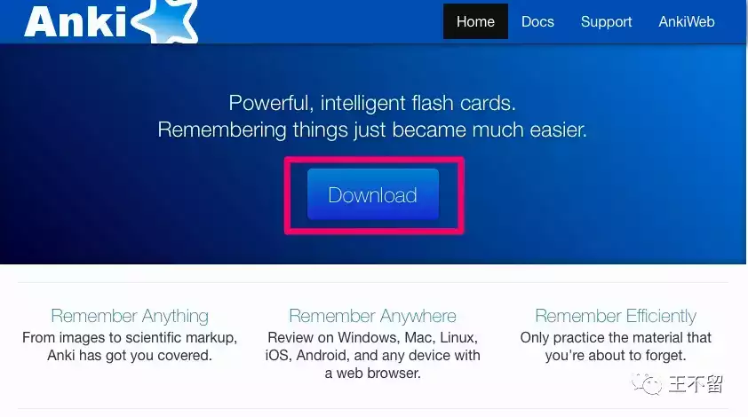

  

点击“Download”按钮，页面会自动跳转到下载的地址。

  

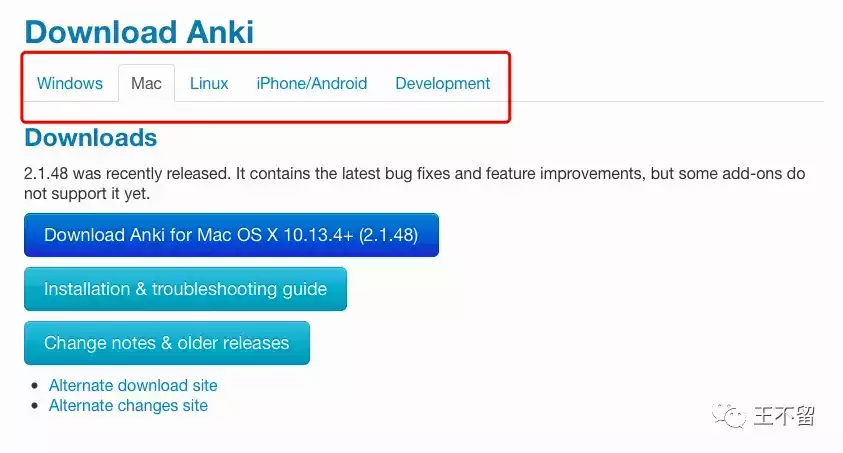

  

然后，我们可以根据自己的使用平台选择对应版本下载。

  

比如，我打算下载安卓版。那就可以点击“iPhone/Android”Tab栏，然后点击“Get AnkiDroid”按钮，即可下载APK安装包。

  

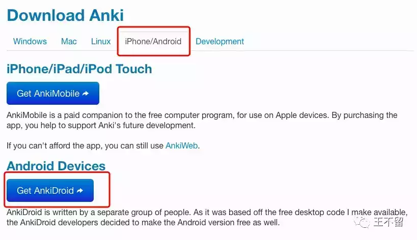

  

**PC、Mac、Android的版本都是免费使用的。**

  

**但是iOS版本比较特别，要收费，168元人民币。你可以在某宝上买个账号，一两块钱左右，客服会提供相应的安装包下载和其它服务指导。**

  

由于官网放置安装包的服务器在国外，所以下载极慢。

  

考虑到大家先睹为快的心情，我们已很人性化地把安装包上传到了百度网盘里。

  

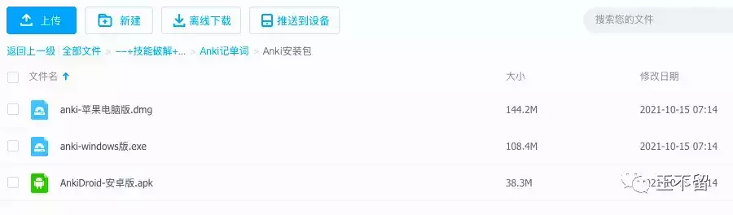

  

请点击下方卡片，关注**“王不留”公众号**，回复**“anki”**四个小写字母，即可获取对应的安装包。

你可以从百度网盘里下载对应的版本。下载速度会比官网快得多。  

  

以下重点讲解安卓手机安装Anki的步骤。电脑版也非常类似，在本文中不再单独赘述。

  

打开手机上安装的“百度网盘”APP，如果没有安装，请在手机自带的应用商店里搜索“百度网盘”进行安装，并完成账号的注册和登录。

  

  

打开百度网盘APP后，点击底部的“我的”。在展示的页面中，左上角展示了你的头像和登录名，说明你已经正常登录。

  

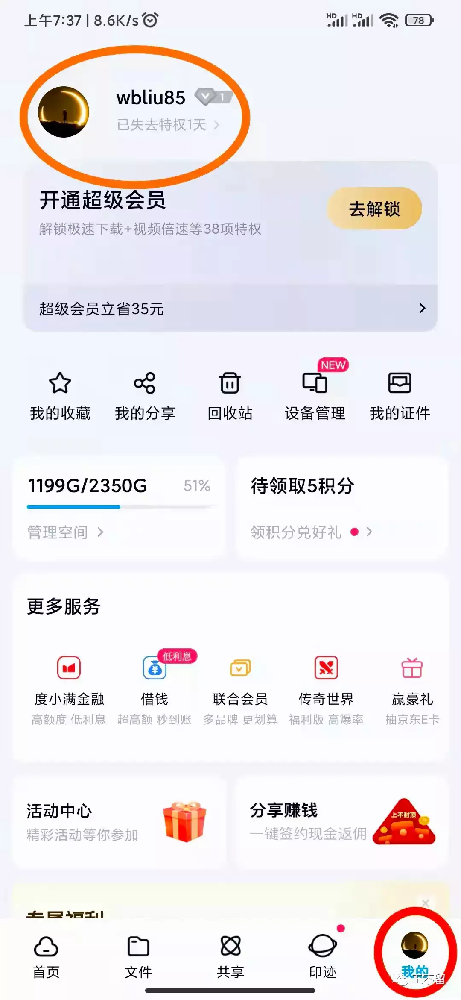

  

好。接下来我们继续操作。

  

在**“王不留”公众号**对话框里通过回复关键字**“anki”**四个小写字母，获得了安装包的下载地址。

  

  

一个手指长按公众号反馈消息的空白处。在弹出的功能框里，点击“复制”按钮，复制百度网盘的下载链接信息。

  

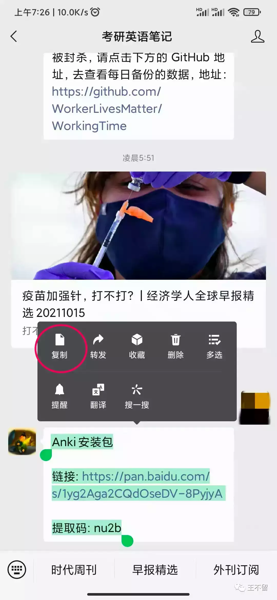

  

手机上再次打开百度网盘APP，这时APP上会弹出一个消息框。

  

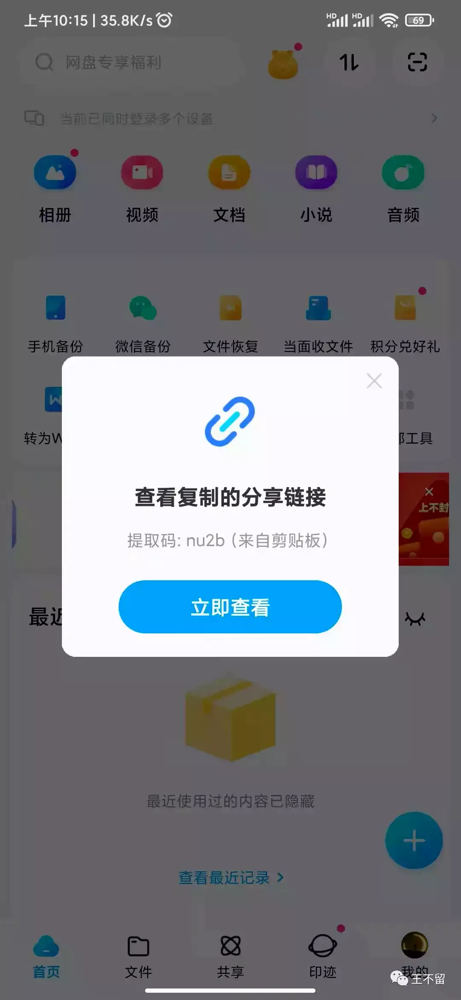

  

点击“立即查看”，可以看到分享的文件夹。

  

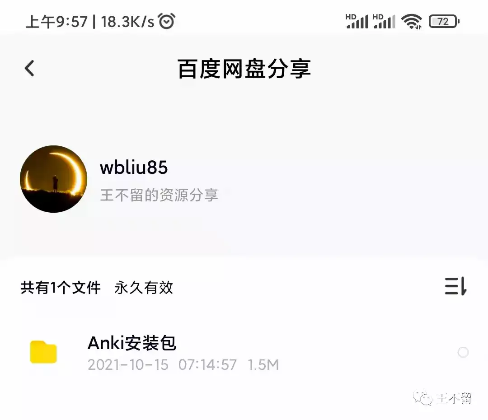

  

点击“Anki安装包”，进入文件夹内。再点击“AnkiDroid-安卓版.apk”右侧的小圆点，选中此文件。

  

  

然后，点击APP底部的“下载”按钮。

  

这时，在百度网盘的“传输列表”可以看到下载进展。

  

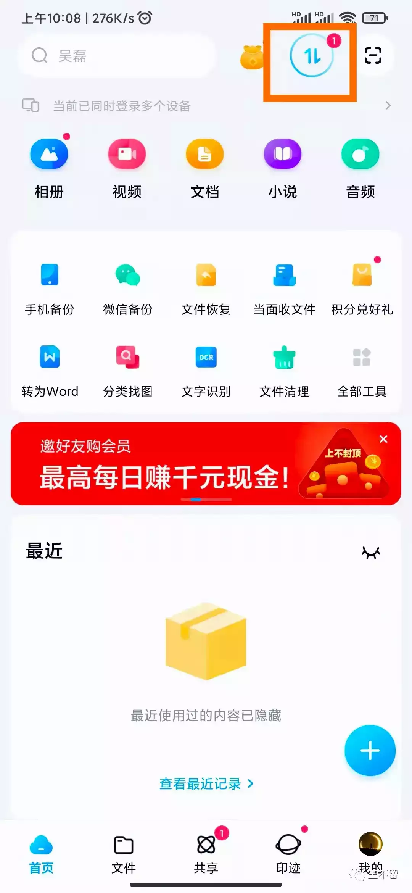

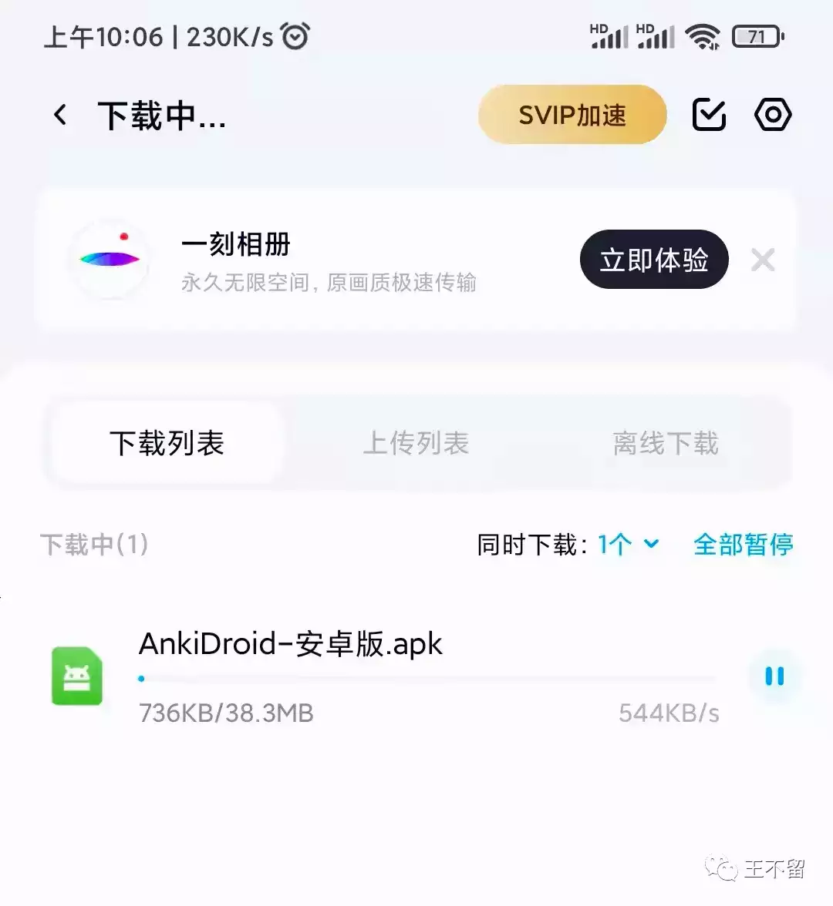

  

**3.2 安装Anki软件**

  

等安装包成功下载后。仍在百度网盘APP里“传输列表”的页面，点击这个“AnkiDroid-安卓版.apk”文件。

  

我是小米手机，点击此文件后，会弹出这个“选择打开方式”的提醒。其它品牌的手机可能略有差异。

  

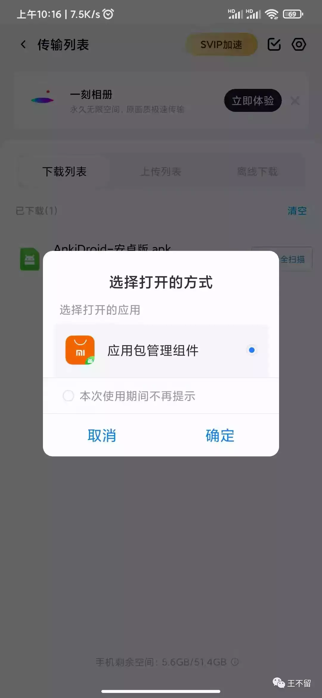

  

而后，根据手机上的提示，安装这个APK。  

  

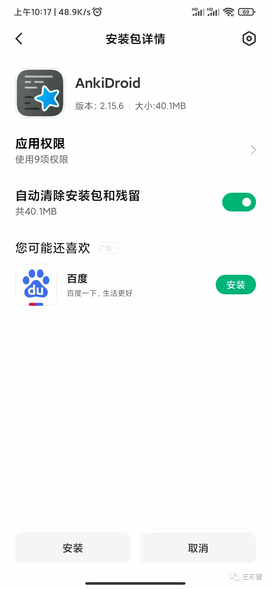

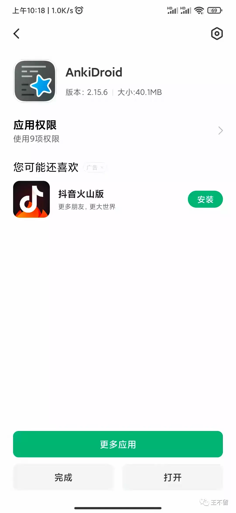

  

安装完成后，手机桌面上会新增一个“AnkiDroid”图标。

  

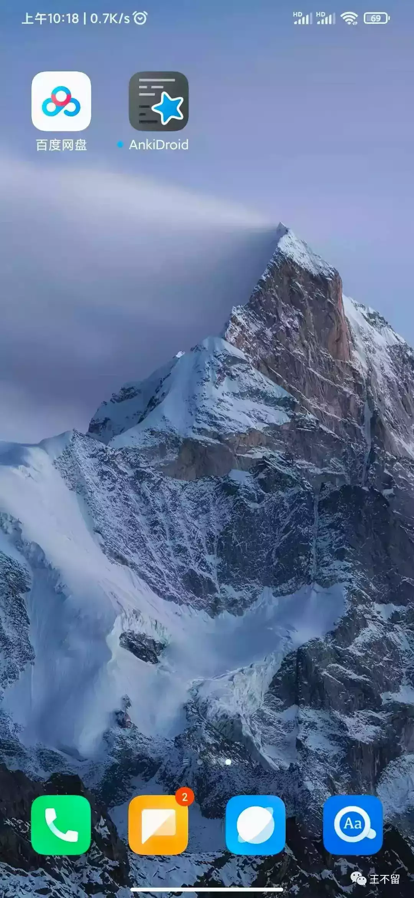

  

恭喜你。这说明软件已经安装成功啦。

  

**3.3 导入Anki牌组**

  

接下来，打开它，认识认识这个软件。

  

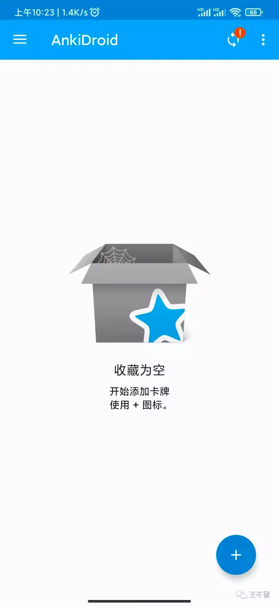

  

是不是感到大失所望，界面实太简陋了，超像“欧路词典”。

  

我想说的是，咱们是用它学习的，不是用来欣赏的，所以界面美观度属于最次要的因素。你说是吧。

  

好了。我们开始导入用于背单词的词库。在Anki中有个牌组的概念，其实就是一系列记忆内容卡片的集合。

  

为了方便大家根据不同需要记忆单词，我们提供了五个词库的牌组。

  

1.  **经济学人高频词。**共计2298个，来自词频分析工具统计的历年《经济学人》文章中出现次数最多的两千多个单词。熟练掌握这些单词后，可以较为轻松地阅读《经济学人》，从而起到事半功倍的效果。
    
      
    
2.  **麦克米伦高频词典。**6018个。麦克米伦词典共标记了六千个核心词汇。基于其庞大的语料库，麦克米伦的词频统计是非常权威的。麦克米伦出版公司是世界知名的三大英语语言教学(ELT)出版机构之一。
    
      
    
3.  **GRE红宝书。**7512个。备考雅思的朋友基本上人手一册。这套词库以GRE红宝书为基础，结合多种助记解释组合而成，包含标准发音。
    
      
    
4.  **经济学人13000。**13238个。通过词频分析工具统计的历年《经济学人》 出现次数最多的一万多个单词。
    
      
    
5.  **经济学人20000。**20000个。通过词频分析工具统计的历年《经济学人》 出现次数最多的两万个单词。
    

  

这些五个牌组，我们都已上传到了百度网盘。

  

  

我们以“经济学人高频词.apkg”为例，讲解如何导入牌组。

  

先用手机上的“百度网盘”APP，参考下载Anki安装包的步骤，将“经济学人高频词.apkg”下载到手机。

  

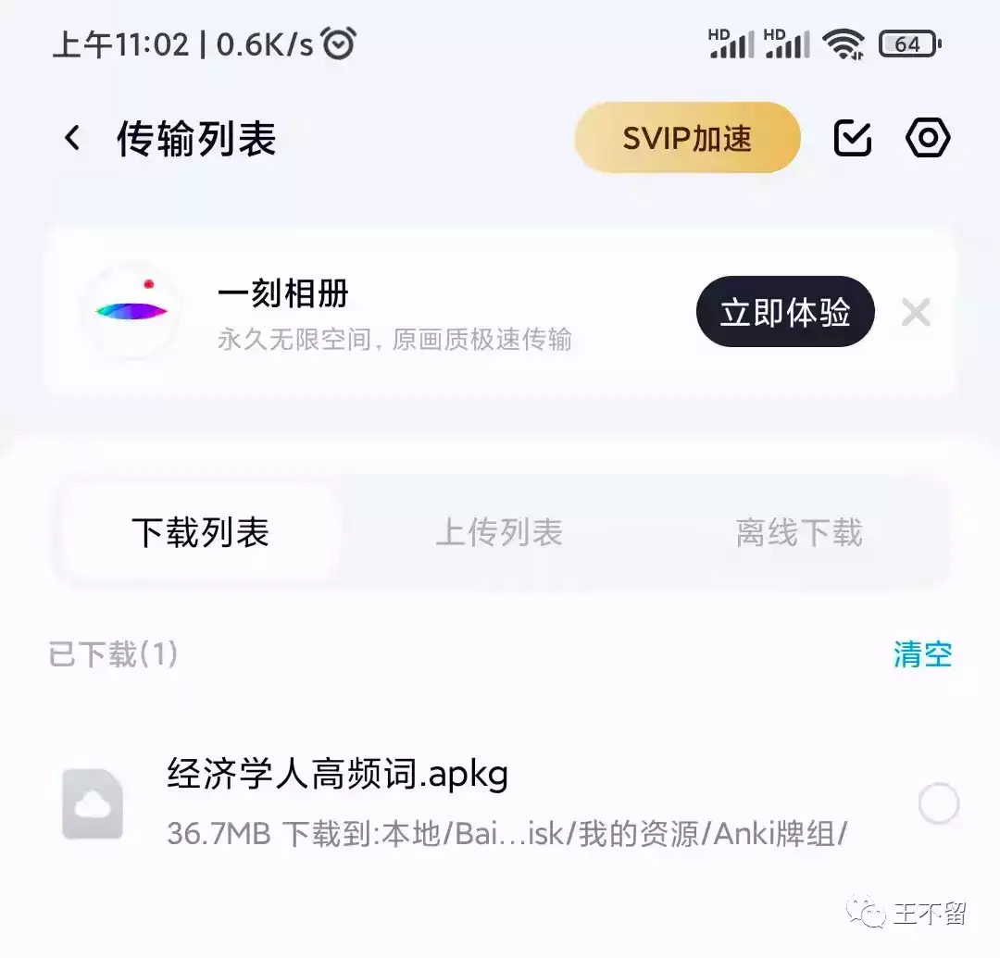

  

然后，打开AnkiDroid这个APP。点击右上角三个点，在弹出的功能列表，选择“导入牌组”。

  

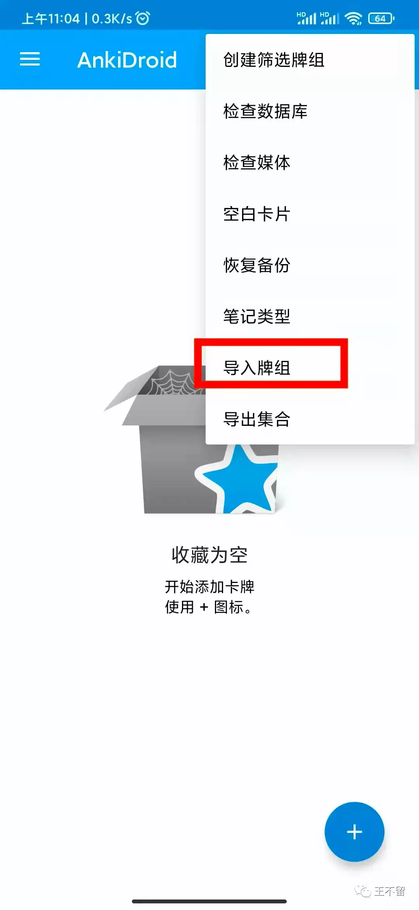

  

在打开的页面里，点击左上角的有三个横线的图标。

  

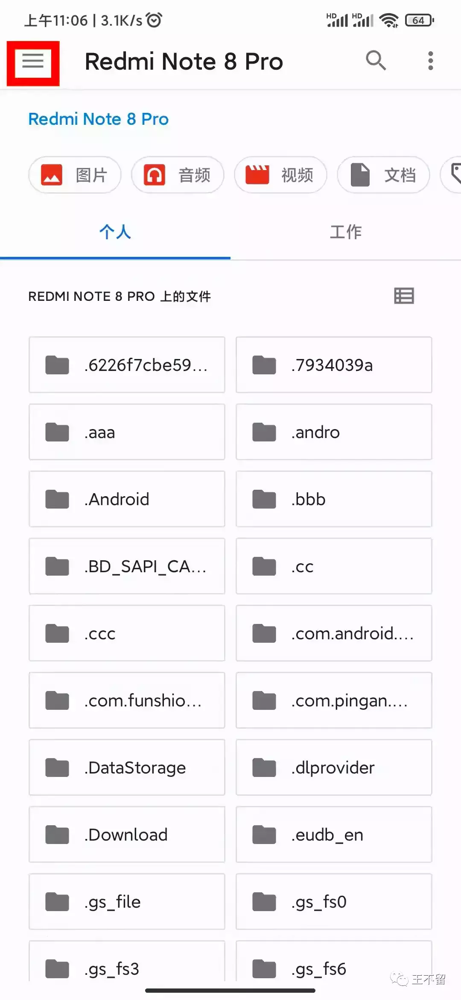

  

选择“Redmi Note 8 Pro”，因为这是用我的手机所的示例。不同品牌手机名字会不一样。

  

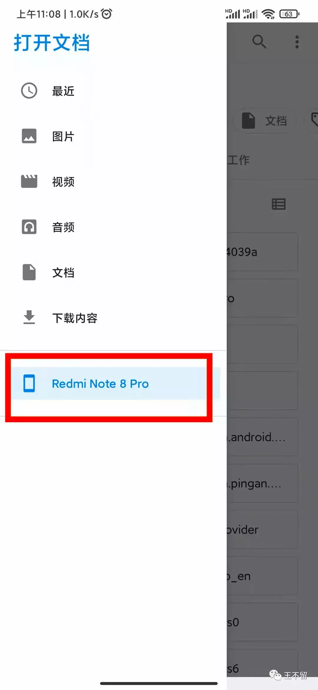

  

然后找到“BaiduNetdisk”文件夹，点进去。

  

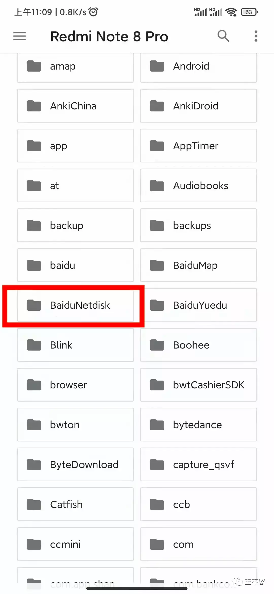

  

找到我们刚下载的文件。

  

  

点击这个文件。AnkiDroid会提示导入这个文件。

  

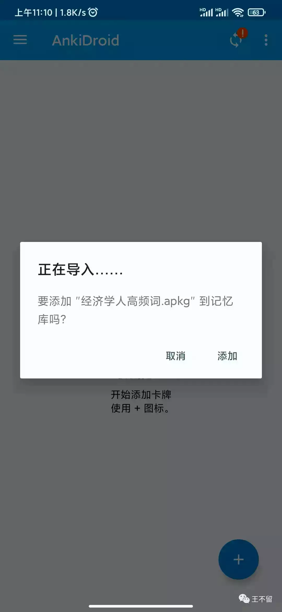

  

点击“添加”按钮后，AnkiDroid开始导入。

  

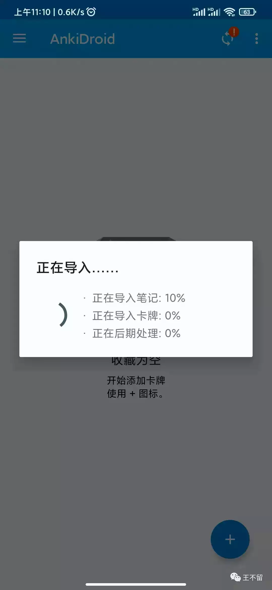

  

导入成功后，变成了这个样子。

  

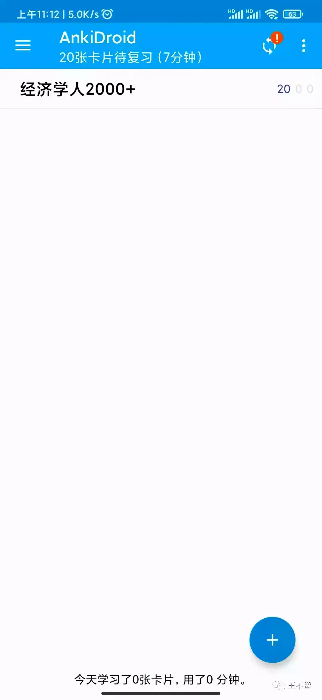

  

**3.4 使用Anki牌组**

  

点击“经济学人2000+”，开始进入单词记忆模式。

  

  

这个单词的中文单词是什么呢？点击APP底部的“显示答案”按钮就可以看到正确答案。

  

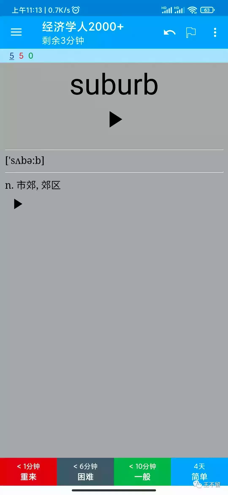

  

注意这时底部出来了四个按钮：重来、困难、一般、简单。

  

我们针对这个单词的难度，选择相应的按钮，Anki会根据我们的选择自动安排复习计划。

  

-   如果你选择了“重来”，1分钟之内Anki会再考你一遍；
    
      
    
-   选择了“困难”，Anki会在6分钟内再考你一遍；
    
      
    
-   选择了“一般”，Anki会在10分钟内再考你一遍；
    
      
    
-   如果选择“简单”，则会在4天后再考你一次。
    

  

Anki会根据复习算法不断测试你对于旧卡片的记忆程度，直到你完全掌握为止。

  

以上就是Anki记单词的基本用法。

  

你可能觉得这和普通的单词软件没什么不同。其实上面只是入门，Anki的功能远远不止于此，它的定制化程度是任何一个单词记忆软件都无法比拟的。另外，它不仅可以用来记单词，任何需要记忆的内容都可以做成Anki卡片。

  

大家先入门应以记单词为主，等大家熟练这款软件后，就可以个性化定制了。

  

**我们建议大家在短时间内大量的重复记忆。趁着还有背单词的激情，快速完成高频词的记忆。**