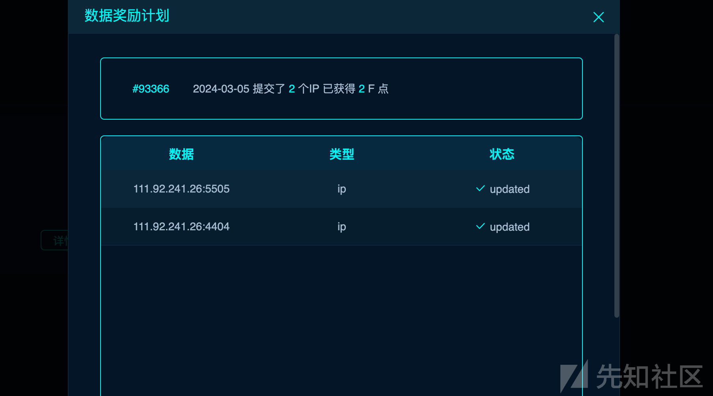
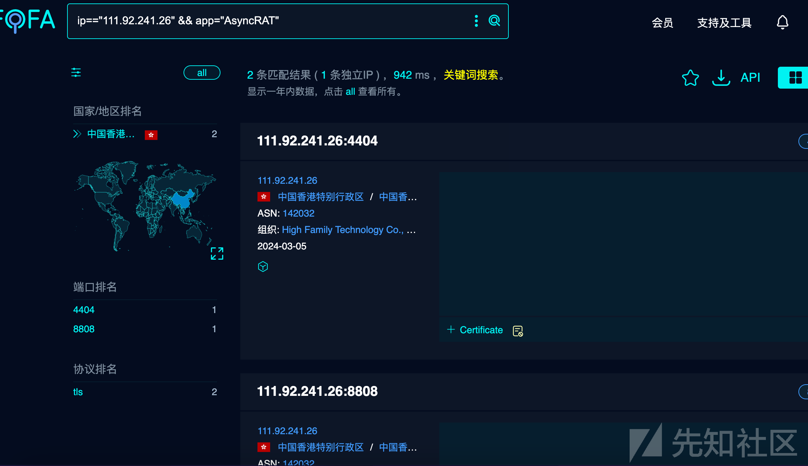
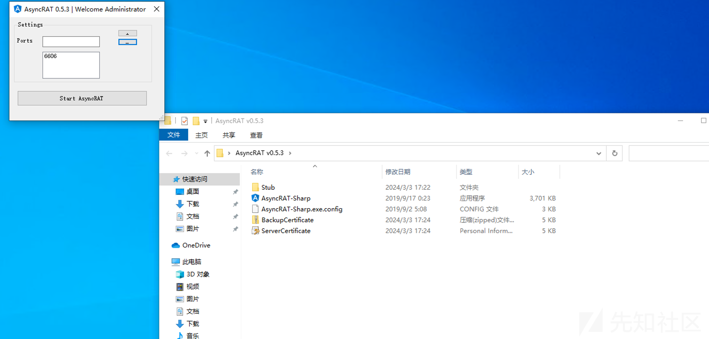
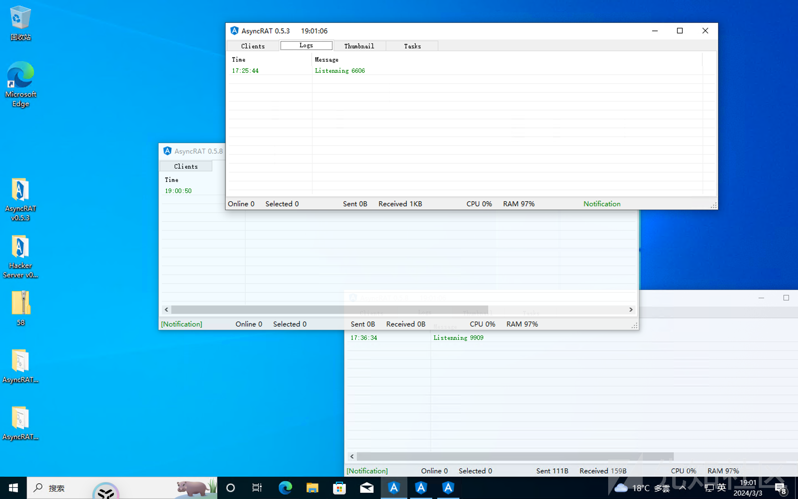
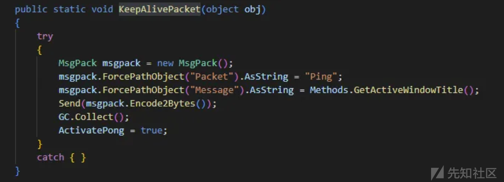
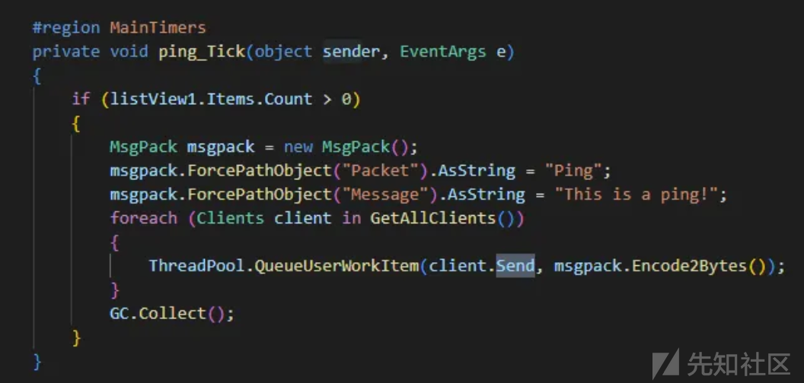
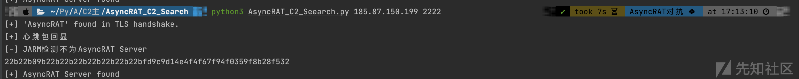

# AsyncRAT C2 服务端主动发现工具 - 先知社区

第一次接触 RAT 对抗，请师傅们多多指点。  
看到微步已经完成相关的拓线研究，于是便萌生开源主机发现脚本的想法。  
由于学业繁重，脚本也处于能用就行的状态，望各位师傅见谅。

> Github 项目地址： [https://github.com/g1an123/AsyncRAT\_C2\_Search](https://github.com/g1an123/AsyncRAT_C2_Search)

## 检测方法

### TLS 证书

```plain
优：命中率100%，也是各大搜索引擎最常用的。
缺：收录范围窄，有经验的apt组织在使用前都会修改证书名。
```

**关于 TLS 证书的选择：**  
建立连接使用的证书和密钥均从 win7 主机生成的 p12 证书提取。win7 主机下通信加密套件默认选择生成的 `TLS_RSA_WITH_AES_128_CBC_SHA` 而非具有前向安全的 `TLS_ECDHE_RSA_WITH_AES_256_CBC_SHA`（加密套件的优先级可以调整）, 且其生成的 p12 证书没有密码保护，直接提取私钥，规避证书格式引起的问题。

以 fofa 为例，进行了以下验证。（实验日期 3 月 2 日）

#### 1\. 收录语法测试

1.  fofa 规则 `app="AsyncRAT"` 数据量与 `cert.issuer="AsyncRAT"` 一致，共 1,682 条，811 条 ip。
2.  反向搜索一致 `app="AsyncRAT" && cert.issuer!="AsyncRAT"` 数据量 0 条

#### 2\. 服务器收录方案验证

```plain
用自己的服务器配置了以下AsyncRAT服务进行验证。
验证结果：fofa仅通过是否AsyncRAT字样进行确定，没有脚本表现好。
```

IP：111.92.241.26

-   4404 部署 0.5.3 版本正常证书名
-   5505 部署 0.5.3 Hacker Server
-   8808 部署 0.5.8 版本正常证书名
-   9909 部署 0.5.8HackerC2 Server

**验证语句**：

```plain
app="AsyncRAT" && ip="111.92.241.26"
```

**fofa 验证结果**：8808 收录，而 9909 通过修改证书名，躲过了 fofa 的特征搜索。  
4404 收录，而 5505 通过修改证书名，躲过了 fofa 的特征搜索。

[](https://xzfile.aliyuncs.com/media/upload/picture/20240327192527-b60547ee-ec2c-1.png)  
[](https://xzfile.aliyuncs.com/media/upload/picture/20240327192544-c0376d5a-ec2c-1.png)  
[](https://xzfile.aliyuncs.com/media/upload/picture/20240327192558-c8ee4644-ec2c-1.png)  
[](https://xzfile.aliyuncs.com/media/upload/picture/20240327192619-d5086108-ec2c-1.png)

**服务器部署截图**：  
[](https://xzfile.aliyuncs.com/media/upload/picture/20240327192653-e94a21c4-ec2c-1.png)  
[](https://xzfile.aliyuncs.com/media/upload/picture/20240327192711-f4085432-ec2c-1.png)

### Ping 包

```plain
优：稳定且准确率高
```

通过流量分析提取出 AsyncRAT 的 ping 包 重放进行特征识别，由于高版本对流量进行了 gzip 加密，所以高低版本需要分别发包验证。

client 发送信息代码部分  
[](https://xzfile.aliyuncs.com/media/upload/picture/20240327192811-17d6c9ca-ec2d-1.png)

Server 服务端收到结果返回信息代码部分  
[](https://xzfile.aliyuncs.com/media/upload/picture/20240327192900-35258ffc-ec2d-1.png)

### JARM 指纹

```plain
优：用来做辅助验证挺不错的
```

用 JA3S 也可以，需要注意的是高低版本指纹也不一致。

### 对比

**结果对比**：fofa:1682 条，脚本：220 条。

```plain
猜测1482条数据的AsyncRAT 服务已经下线。
```

判断依据：

1.  fofa 更新时间距今较久，最近更新的数据皆可通过验证。
2.  使用 sslscan，nmap，openssl 均为 time out ，猜测服务已经下线
3.  本地生成木马链接服务端，无法链接成功。

（截图懒得放了，有点多）

## 功能

探测识别 AsyncRAT C2 工具服务端，方便安全研究人员进行 apt 组织追踪，情报拓线。覆盖目前官方仓库所有版本。（我也不知道咋吹了）

## 使用方法

1.  检测单个端口：
    
    ```plain
    python3 AsyncRAT_C2_Seearch.py host port
    ```
    
    [](https://xzfile.aliyuncs.com/media/upload/picture/20240327192948-51d39630-ec2d-1.png)
    
2.  公网检测、ip、ip 段检测，查看 `C2公网探测.py`
    
    ```plain
    # scan_ip_range("186.137.33.1", "C") # 扫描ip段，可指定C B段  
    # ip_scan("218.204.179.10")          # 扫描单个ip  
    # ip_scan("161.97.151.222",7788)     # 扫描单个端口  
    # process_target_csv("target1.csv")    # 扫描文件  
    # scan_ip_range_from_file("ip_range.txt") # 从文件中获取ip段扫描
    ```
    
    运行环境：Macos 12.5  
    其他环境暂未测试
    

> Github 项目地址： [https://github.com/g1an123/AsyncRAT\_C2\_Search](https://github.com/g1an123/AsyncRAT_C2_Search)
