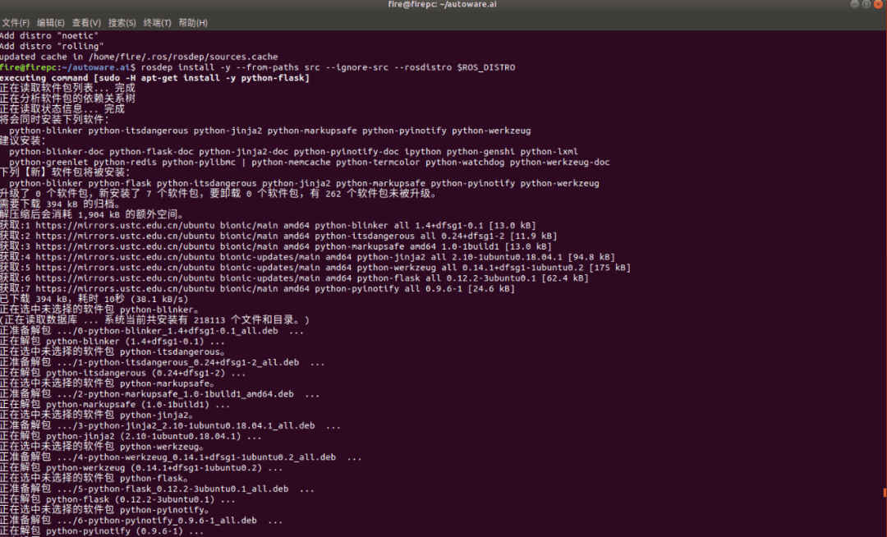

# Autoware.ai 脱坑笔记

于我而言，学习过Apollo，起初我是不太喜欢直接上Autoware的，尤其还是.ai版本。但是因为老板在某站上看到了一个什么xxx自动驾驶实践。想完全复刻，雷达，超声波相机等，另外加之负责项目的另外一个小兄弟在NV2框架下自主导航避障实现有些慢，为了赶项目工期，老板又重新提出来用Autoware来实现。于是，周末就被迫加班来继续赶工（无所谓，反正下周想去参加暑期培训，应该换个工作环境）。

0x1 软硬件环境

0x2 前期适配

前期需要适配好显卡驱动安装与cuda，这个可以参考下Apollo官方，也可以参考下我后续的文章（本来今天写两篇，算了写一篇吧，明天发）。

0x3 安装部署  

这里安装部署的时候，我就不采用docker来进行安装部署了，因为docker的环境下，C16的激光雷达没有办法来进行使用。C16雷达需要对于网关进行配置。（当然也有可能不是不能使用，是我不会）  

我这里使用的是源码安装。首先需要安装依赖。  

```plain
$ sudo apt update$ sudo apt install -y python-catkin-pkg python-rosdep ros-$ROS_DISTRO-catkin$ sudo apt install -y python3-pip python3-colcon-common-extensions python3-setuptools python3-vcstool$ pip3 install -U setuptools
```

然后我们创建一个autoware.ai的功能包，进入功能包根目录后，开始下载autoware.ai的官方文件。

```plain
$ wget -O autoware.ai.repos "https://raw.githubusercontent.com/Autoware-AI/autoware.ai/1.12.0/autoware.ai.repos"
$ vcs import src &lt; autoware.ai.repos
```

当然，也可以在浏览器中下载好，然后直接拖到功能包下，这里我推荐直接拖在功能包下。

下载好之后，还不能进行编译，需要为它安装所需的依赖。

```plain
$ sudo pip3 install rosdepc
$ sudo rosdepc init
$ rosdepc update
$ rosdepc install -y --from-paths src --ignore-src --rosdistro $ROS_DISTRO
```

这里的命令其实很简单，安装rosdepc，rosdepc是鱼香ROS制作的一键dep包，比官方快，而且好用。如下图所示：


但是当我们在执行这条命令的时候，就出现了问题。  

```plain
$ rosdepc install -y --from-paths src --ignore-src --rosdistro $ROS_DISTRO
```


出现上诉错误是因为执行rosdep update时skip 当前的ROS版本（这个问题折腾了一下午）。

运行这条命令，就可以修复。（这是连ChatGPT都无法解决的问题）  

```plain
rosdep update --include-eol-distros
```

之后在继续执行，即可安装部署依赖。



编译命令如下：  

```plain
有 CUDA 支持
  AUTOWARE_COMPILE_WITH_CUDA=1 colcon build --cmake-args -DCMAKE_BUILD_TYPE=Release --continue-on-error

没有 CUDA 支持
  AUTOWARE_COMPILE_WITH_CUDA=0 colcon build --cmake-args -DCMAKE_BUILD_TYPE=Release --continue-on-error
```

部署编译过程中，可能还会存在一些问题。这个问题主要是因为CUDA版本的问题，导致编译失败。打开报错位置的文件，修改CUDA版本后即可解决。


最后，部署过程中超声波雷达驱动存在问题。


老板:你看着他咋弄的，随便写一个超声波雷达的SDK部署上来。

我：......