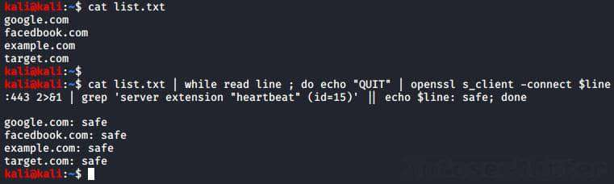
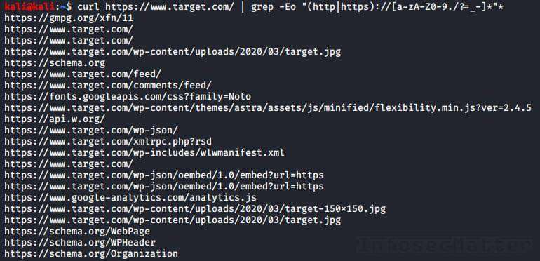
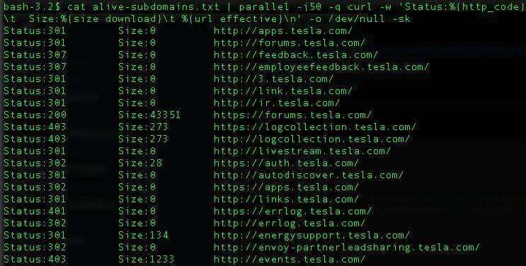
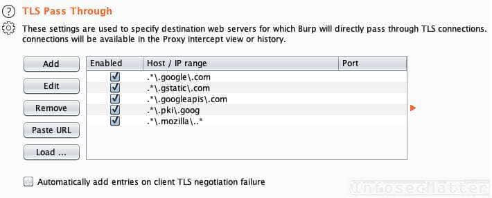

# Bug Bounty Tips #1

With this post we are starting a new blog series focused on [bug bounty tips](https://www.infosecmatter.com/bug-bounty-tips/) found on Twitter – the number one social platform for people interested in information security, penetration testing, vulnerability research, bug hunting and ultimately **bug bounties**.

## Introduction

There are many security researchers and bug hunters around the world who publish their valuable tips on Twitter, trying to help all of us to find more vulnerabilities and collect bug bounties.

This blog series is meant to capture these bug bounty tips, collect them in one place for the future so that they will never vanish in the seemingly never-ending flow of the Twitterverse.

This is the 1st part and in each part we will be publishing 10 or more tips. Here we go..

## 1\. Heartbleed vulnerability

By: [@imranparray101](https://twitter.com/imranparray101)  
Source: [link](https://twitter.com/imranparray101/status/1275348849079406594)

Here’s a useful one-liner to check a list of hostnames for OpenSSL Heartbleed vulnerability:

```bash
cat list.txt | while read line ; do echo "QUIT" | openssl s_client -connect $line:443 2>&1 | grep 'server extension "heartbeat" (id=15)' || echo $line: safe; done
```



Note that the [Heartbleed](https://heartbleed.com/) (CVE-2014-0160) leads to a leak of server memory content and disclosure of sensitive information.

## 2\. Use grep to extract URLs

By: [@imranparray101](https://twitter.com/imranparray101)  
Source: [link](https://twitter.com/imranparray101/status/1274344698547539970)

Here’s a handy command to extract URLs from junk / assorted data:

```bash
cat file | grep -Eo "(http|https)://[a-zA-Z0-9./?=_-]*"*

curl http://host.xx/file.js | grep -Eo "(http|https)://[a-zA-Z0-9./?=_-]*"*
```

The grep ‘-o’ parameter will print only the matched parts. This will result in having each URL printed out nicely on a single line one by one:



Super useful for visual analysis and for further processing!

## 3\. Extract information from APK

By: [@MrR0Y4L3](https://twitter.com/MrR0Y4L3)  
Source: [link](https://twitter.com/MrR0Y4L3/status/1272982285277491200)

Here’s a tip to extract interesting (potentially sensitive) information from unpacked APK files (Android App):

```bash
grep -EHirn "accesskey|admin|aes|api_key|apikey|checkClientTrusted|crypt|http:|https:|password|pinning|secret|SHA256|SharedPreferences|superuser|token|X509TrustManager|insert into" APKfolder/
```

With this one-liner we can identify URLs, API keys, authentication tokens, credentials, certificate pinning code and much more.

Make sure to first unpack the APK file using apktool like this:

```bash
apktool d app_name.apk
```

## 4\. Extract zip file remotely

By [@el\_vampinio](https://twitter.com/el_vampinio)  
Source: [link](https://twitter.com/el_vampinio/status/1273517999954280448)

Did you find a very big zip file accessible on a remote web server and want to inspect its contents, but you don’t want to wait for downloading it? No problem..

```bash
pip install remotezip

# list contents of a remote zip file
remotezip -l "http://site/bigfile.zip"

# extract file.txt from a remote zip file
remotezip "http://site/bigfile.zip" "file.txt"
```

Note that for this to work, the remote web server hosting the zip file has to support the [range](https://developer.mozilla.org/en-US/docs/Web/HTTP/Range_requests) HTTP header.

## 5\. Top 25 open redirect dorks

By [@lutfumertceylan](https://twitter.com/lutfumertceylan)  
Source: [link](https://twitter.com/lutfumertceylan/status/1272895185031217152)

Here are the top 25 dorks to find Open Redirect vulnerabilities (aka. “Unvalidated Redirects and Forwards”):

```bash
/{payload}
?next={payload}
?url={payload}
?target={payload}
?rurl={payload}
?dest={payload}
?destination={payload}
?redir={payload}
?redirect_uri={payload}
?redirect_url={payload}
?redirect={payload}
/redirect/{payload}
/cgi-bin/redirect.cgi?{payload}
/out/{payload}
/out?{payload}
?view={payload}
/login?to={payload}
?image_url={payload}
?go={payload}
?return={payload}
?returnTo={payload}
?return_to={payload}
?checkout_url={payload}
?continue={payload}
?return_path={payload}
```

Let’s remind ourselves that a website is vulnerable to Open Redirect when the URL parameter (payload) is not properly validated on the server-side and causes the user to be redirected to an arbitrary website.

Although this doesn’t posses any major imminent threat to the user, this vulnerability makes phishing so much easier.

## 6\. JWT token bypass

By [@HackerHumble](https://twitter.com/HackerHumble)  
Source: [link1](https://twitter.com/HackerHumble/status/1274313774111920128), [link2](https://twitter.com/HackerHumble/status/1274314917907030017), [link3](https://twitter.com/HackerHumble/status/1274315932119097344)

Here are 3 tips to bypass JWT token authentication.

Tip #1:

1.  Capture the JWT.
2.  Change the algorithm to None.
3.  Change the content of the claims in the body with whatever you want e.g.: email: attacker@gmail.com
4.  Send the request with the modified token and check the result.

Tip #2:

1.  Capture the JWT token.
2.  If the algorithm is RS256 change to HS256 and sign the token with the public key (which you can get by visiting jwks Uri / mostly it will be the public key from the site’s https certificate)
3.  Send the request with the modified token and check the response.
4.  You can party with the bounty if the backend doesn’t have the algorithm check.

Tip #3: Check for proper server-side session termination ([OTG-SESS-006](https://wiki.owasp.org/index.php/Testing_for_logout_functionality_(OTG-SESS-006))):

1.  Check if the application is using JWT tokens for authentication.
2.  If so, login to the application and capture the token. (Mostly web apps stores the token in the local storage of the browser)
3.  Now logout of the application.
4.  Now make a request to the privileged endpoint with the token captured earlier.
5.  Sometimes, the request will be successful as the web apps just delete the token from browser and won’t blacklist the tokens in the backend.

## 7\. Finding subdomains

By [@TobiunddasMoe](https://twitter.com/TobiunddasMoe)  
Source: [link](https://twitter.com/TobiunddasMoe/status/1275130179870961664)

Here’s a quick and basic recon routine for finding subdomains while doing bug bounty:

```bash
#!/bin/bash
# $1 => example.domain

amass enum --passive -d $1 -o domains_$1
assetfinder --subs-only $1 | tee -a domains_$1

subfinder -d $1 -o domains_subfinder_$1
cat domains_subfinder_$1 | tee -a domains_$1

sort -u domains_$1 -o domains_$1
cat domains_$1 | filter-resolved | tee -a domains_$1.txt
```

In order for this to work, we have to install couple of additional tools, very useful not just for bug bounty hunting:

-   [https://github.com/OWASP/Amass](https://github.com/OWASP/Amass)
-   [https://github.com/tomnomnom/assetfinder](https://github.com/tomnomnom/assetfinder)
-   [https://github.com/projectdiscovery/subfinder](https://github.com/projectdiscovery/subfinder)
-   [https://github.com/tomnomnom/hacks/tree/master/filter-resolved](https://github.com/tomnomnom/hacks/tree/master/filter-resolved)

## 8\. Curl + parallel one-liner

By [@akita\_zen](https://twitter.com/akita_zen)  
Source: [link](https://twitter.com/akita_zen/status/1269473525930360832)

Here’s a super useful recon one-liner to quickly validate list of hostnames and subdomains:

```bash
cat alive-subdomains.txt | parallel -j50 -q curl -w 'Status:%{http_code}\t  Size:%{size_download}\t %{url_effective}\n' -o /dev/null -sk
```

This one-liner will spawn 50 instances of curl in parallel and display the HTTP status code and response size in bytes for each host in a beautiful way:



Make sure to install ‘parallel’ to your Kali box before running the one-liner:

```bash
apt-get -y install parallel
```

## 9\. Simple XSS check

By [@TobiunddasMoe](https://twitter.com/TobiunddasMoe)  
Source: [link](https://twitter.com/TobiunddasMoe/status/1273941442117996544)

Check out this shell script to identify XSS (Cross-Site Scripting) vulnerabilities using a number of open-source tools chained together:

```bash
#!/bin/bash
# $1 => example.domain

subfinder -d $1 -o domains_subfinder_$1
amass enum --passive -d $1 -o domains_$1

cat domains_subfinder_$1 | tee -a domain_$1
cat domains_$1 | filter-resolved | tee -a domains_$1.txt

cat domains_$1.txt | ~/go/bin/httprobe -p http:81 -p http:8080 -p https:8443 | waybackurls | kxss | tee xss.txt
```

This is another combo which requires having several additional tools installed:

-   [https://github.com/projectdiscovery/subfinder](https://github.com/projectdiscovery/subfinder)
-   [https://github.com/OWASP/Amass](https://github.com/OWASP/Amass)
-   [https://github.com/tomnomnom/hacks/tree/master/filter-resolved](https://github.com/tomnomnom/hacks/tree/master/filter-resolved)
-   [https://github.com/tomnomnom/httprobe](https://github.com/tomnomnom/httprobe)
-   [https://github.com/tomnomnom/waybackurls](https://github.com/tomnomnom/waybackurls)
-   [https://github.com/tomnomnom/hacks/tree/master/kxss](https://github.com/tomnomnom/hacks/tree/master/kxss)

## 10\. Filter out noise in Burp Suite

By [@sw33tLie](https://twitter.com/sw33tLie)  
Source: [link](https://twitter.com/sw33tLie/status/1275537548539027457)

While you are testing with Burp Suite, you may want to add these patterns into the Burp Suite > Proxy > Options > TLS Pass Through settings:



```bash
.*\.google\.com
.*\.gstatic\.com
.*\.googleapis\.com
.*\.pki\.goog
.*\.mozilla\..*
```

Now all underlying connections to these hosts will go to them directly, without passing through the proxy.

No more noise in our proxy logs!

## Conclusion

That’s it for this part of the [bug bounty tips](https://www.infosecmatter.com/bug-bounty-tips/).

Big thanks to all the authors:

-   [@imranparray101](https://twitter.com/imranparray101)
-   [@MrR0Y4L3](https://twitter.com/MrR0Y4L3)
-   [@el\_vampinio](https://twitter.com/el_vampinio)
-   [@lutfumertceylan](https://twitter.com/lutfumertceylan)
-   [@HackerHumble](https://twitter.com/HackerHumble)
-   [@TobiunddasMoe](https://twitter.com/TobiunddasMoe)
-   [@akita\_zen](https://twitter.com/akita_zen)
-   [@sw33tLie](https://twitter.com/sw33tLie)

Make sure to follow them on Twitter to stay ahead of the bug bounty game.
