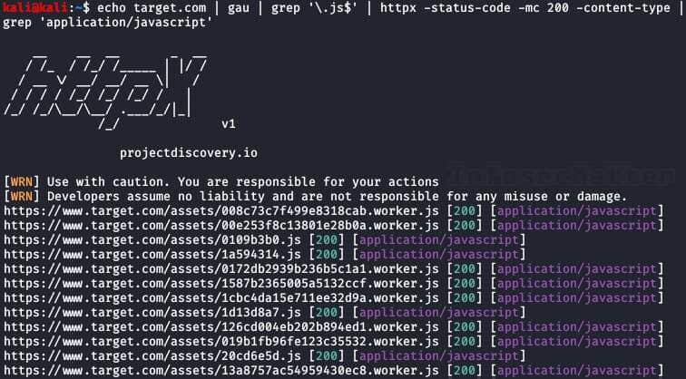
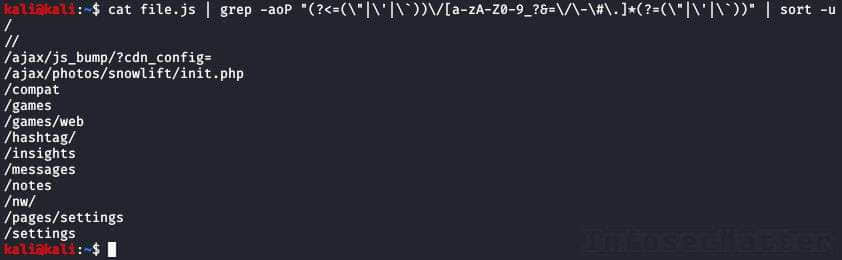
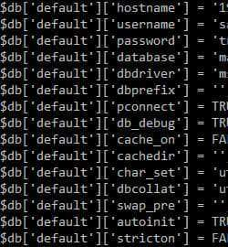
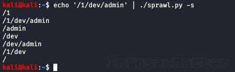
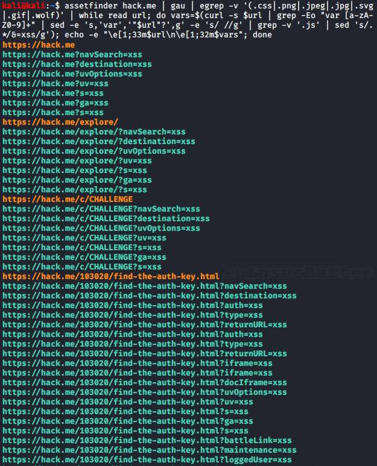

# Bug Bounty Tips #4

This is another dose of [bug bounty tips](https://www.infosecmatter.com/bug-bounty-tips/) from the bug hunting community on Twitter, sharing knowledge for all of us to help us find more vulnerabilities and collect bug bounties.

This is the 4th part and in each part we are publishing 10 or more tips. Here we go..

## 1\. Price manipulation methods

By [@lutfumertceylan](https://twitter.com/lutfumertceylan), [@y\_sodha](https://twitter.com/y_sodha), [@SalahHasoneh1](https://twitter.com/SalahHasoneh1)  
Source: [link1](https://twitter.com/lutfumertceylan/status/1275524919422582785), [link2](https://twitter.com/SalahHasoneh1/status/1284869760921014274), [link3](https://twitter.com/SalahHasoneh1/status/1288211273805635585)

Here’s not 1, but 3 tips on how to manipulate with prices in web applications.

Method #1:

-   If the product price parameter cannot be changed, change the quantity of products:
    -   items\[1\]\[quantity\]= 1 –> 234 EUR
    -   items\[1\]\[quantity\]= 0.1 –> 23.4 EUR
-   Congratulations, you bought the order for 10% of the price!

Method #2:

1.  Add 2 products to the basket – let’s consider a single product is $40
2.  If the request is processed in this way:  
    {“items”:{“laptop”:1,”mobile”:1}}
3.  Change the JSON body to:  
    {“items”:{“laptop”:4,”mobile”:-2}}
4.  The cost will become $20 for 2 items:  
    4 \* $40 – 2 \* $70 = $160 – $140 = $20

Method #3:

1.  Select any item to purchase
2.  Select PayPal as a payment method, intercept all the requests
3.  Until you got a parameter called ‘amount’ from PayPal
4.  Manipulate with the price and change it to 0.01$
5.  Pay, and wait for the confirmation

## 2\. Find javascript files using gau and httpx

By [@pdnuclei](https://twitter.com/pdnuclei)  
Source: [link](https://twitter.com/pdnuclei/status/1289683890328571905)

Here’s a recon tip to find javascript files hosted on our target using [gau](https://github.com/lc/gau) and [httpx](https://github.com/projectdiscovery/httpx) utilities:

```bash
echo target.com | gau | grep '\.js$' | httpx -status-code -mc 200 -content-type | grep 'application/javascript'
```

What this combo will do is that it will collect all known URLs for our target from the AlienVault’s [Open Threat Exchange](https://otx.alienvault.com/) (OTX), the [Wayback Machine](https://archive.org/web/) and [Common Crawl](https://commoncrawl.org/), fetch them using httpx and then display only javascript files.



In order for this combo to work, we have to install the following tools:

-   [https://github.com/projectdiscovery/httpx](https://github.com/projectdiscovery/httpx)
-   [https://github.com/lc/gau](https://github.com/lc/gau)

## 3\. Extract API endpoints from javascript files

By [@renniepak](https://twitter.com/renniepak)  
Source: [link](https://twitter.com/renniepak/status/1287804976669040642)

Here’s a quick one-liner for extracting API endpoints from javascript files:

```bash
cat file.js | grep -aoP "(?<=(\"|\'|\`))\/[a-zA-Z0-9_?&=\/\-\#\.]*(?=(\"|\'|\`))" | sort -u
```



Very useful!

## 4\. Handy extension list for file upload bugs

By [@pwntheweb](https://twitter.com/pwntheweb)  
Source: [link](https://twitter.com/pwntheweb/status/1288112909520781316)

The following file extension lists can be useful when we are trying to find vulnerabilities in file upload functionalities:

ASP:

-   .aspx
-   .config
-   .ashx
-   .asmx
-   .aspq
-   .axd
-   .cshtm
-   .cshtml
-   .rem
-   .soap
-   .vbhtm
-   .vbhtml
-   .asa
-   .asp
-   .cer
-   .shtml

PHP:

-   .php
-   .php5
-   .php3
-   .php2
-   .shtml
-   .html
-   .php.png  
    (double extension attack)

What we would typically want to achieve is to circumvent the controls restricting the type of content that can be uploaded onto the website and try to upload something interesting like:

-   ASP / PHP file with a webshell – RCE
-   HTML file with Javascript code – XSS
-   EICAR file – test possibility of hosting malware

Protip: Don’t forget to always try the NULL byte injection trick as well, e.g.:

-   file.jpg%00shell.php
-   shell.php%00file.jpg
-   shell.php%00.jpg

## 5\. Access Admin panel by tampering with URI

By [@SalahHasoneh1](https://twitter.com/SalahHasoneh1)  
Source: [link](https://twitter.com/SalahHasoneh1/status/1287825026134269958)

Here’s a super easy tip to access an admin panel by tampering with the URI in the following way:

-   https://target.com/admin/ –> HTTP 302 (redirect to login page)
-   https://target.com/admin..;/ –> HTTP 200 OK

Try also the following tips, as others have commented on the tweet:

-   https://target.com/../admin
-   https://target.com/whatever/..;/admin

## 6\. Bypass 403 Forbidden by tampering with URI

By [@remonsec](https://twitter.com/remonsec)  
Source: [link](https://twitter.com/remonsec/status/1262615574082772995)

This tip is very similar to the previous one. By tampering with the URI we might be able to bypass access controls of the application:

-   site.com/secret –> HTTP 403 Forbidden
-   site.com/secret/ –> HTTP 200 OK
-   site.com/secret/. –> HTTP 200 OK
-   site.com//secret// –> HTTP 200 OK
-   site.com/./secret/.. –> HTTP 200 OK

It’s rare to see, but there’s no loss to give it a shot.

**Update**: The author posted an [update](https://twitter.com/remonsec/status/1343710307948974080) to advise on using more comprehensive and workflow oriented approach such as the [403 Bypass](https://github.com/KathanP19/HowToHunt/blob/master/Status_Code_Bypass/403Bypass.md) guide (Github).

Note that today there are also automated tools for bypassing 403 Forbidden errors, see e.g. newer bug bounty tip [BBT10-7](https://www.infosecmatter.com/bug-bounty-tips-10-dec-24/#7-automated-403-forbidden-bypasser-tools) – Automated 403 Forbidden bypasser tools.

## 7\. Find database secrets in SVN repository

By [@faizalabroni](https://twitter.com/faizalabroni)  
Source: [link](https://twitter.com/faizalabroni/status/1287623948843155456)

Here’s how [@faizalabroni](https://twitter.com/SalahHasoneh1) was able to discover database secrets in SVN repository and collect bug bounty:

1.  Run `./dirsearch.py -u target -e php,html,js,xml -x 500,403`
2.  Found http://url.com/.svn/
3.  Clone & use [SVN-Extractor](https://github.com/anantshri/svn-extractor)
4.  Run `./svn-extractor.py --url http://url.com --match database.php`
5.  Result in output dir and just open it



Instant bounty!

Here’s the list of tools we need for this tip:

-   [https://github.com/maurosoria/dirsearch](https://github.com/maurosoria/dirsearch)
-   [https://github.com/anantshri/svn-extractor](https://github.com/anantshri/svn-extractor)

## 8\. Generate content discovery wordlist from URI

By [@healthyoutlet](https://twitter.com/healthyoutlet)  
Source: [link](https://twitter.com/healthyoutlet/status/1288519710380883969)

There’s a useful tool called [sprawl](https://github.com/tehryanx/sprawl) to expand a list of URI paths, e.g. from [waybackurls](https://github.com/tomnomnom/waybackurls) or [gau](https://github.com/lc/gau), and generate a content discovery wordlist. Here’s how to use it:

```bash
echo '/1/dev/admin' | python3 sprawl/sprawl.py -s
```



Now we could use this wordlist to discover additional endpoints hosted on our target.

The tool lives here:

-   [https://github.com/tehryanx/sprawl](https://github.com/tehryanx/sprawl)

## 9\. Extract endpoints from APK files

By [@SalahHasoneh1](https://twitter.com/SalahHasoneh1)  
Source: [link](https://twitter.com/SalahHasoneh1/status/1288134119482851329)

Another useful tool for analyzing Android APK files is [apkurlgrep](https://gihtub.com/ndelphit/apkurlgrep) made by [@delphit33](https://twitter.com/delphit33). This tool can extract URL from an APK file without even needing to unpack it first.

```bash
apkurlgrep -a path/to/file.apk
```

Get the tool from here:

-   [https://github.com/ndelphit/apkurlgrep](https://github.com/ndelphit/apkurlgrep)

## 10\. A recon tip to find more subdomains (Shodan)

By [@krizzsk](https://twitter.com/krizzsk)  
Source: [link](https://twitter.com/krizzsk/status/1287405881441755139)

Big companies often use their own CDN (Content Delivery Network) and some of them are used to serve internal static files such as javascript files.

Using the following steps we can find additional internal subdomains and juicy javascript files via [Shodan](https://www.shodan.io/) search engine:

1.  Do a passive or active enumeration of the CDN domain, e.g. **bigcompanycdn.com**
2.  For whatever subdomains found, search that on Shodan using the “**http.html**” filter
3.  Example: You found **dev-int.bigcompanycdn.com**, Shodan query will look like this:
    -   http.html:”dev-int.bigcompanycdn.com”
    -   http.html:”https://dev-int-bigcompanycdn.com”

## 11\. Find hidden GET parameters in javascript files

By [@chiraggupta8769](https://twitter.com/chiraggupta8769) ([@intigriti](https://twitter.com/intigriti), [@sratarun](https://twitter.com/sratarun))  
Source: [link](https://twitter.com/chiraggupta8769/status/1287249224459984896)

Here’s an interesting tip for finding hidden parameters by analyzing javascript files:

1.  Scour javascript files for variable names, e.g.:  
    `var test = "xxx"`
2.  Try each of them as a GET parameter to uncover hidden parameters, e.g.:  
    https://example.com/?test=”xsstest

This often results in XSS!

Turns out [@sratarun](https://twitter.com/sratarun) made this intricate one-liner generator which finds all variable names and appends them as parameters:

```bash
assetfinder example.com | gau | egrep -v '(.css|.png|.jpeg|.jpg|.svg|.gif|.wolf)' | while read url; do vars=$(curl -s $url | grep -Eo "var [a-zA-Z0-9]+" | sed -e 's,'var','"$url"?',g' -e 's/ //g' | grep -v '.js' | sed 's/.*/&=xss/g'); echo -e "\e[1;33m$url\n\e[1;32m$vars"; done
```



Now we can test all these URLs and check whether we can trigger XSS with them or similar things.

Get all the tools for this tip from here:

-   [https://github.com/tomnomnom/assetfinder](https://github.com/tomnomnom/assetfinder)
-   [https://github.com/lc/gau](https://github.com/lc/gau)

## 12\. GitHub dorks for finding sensitive information

By [@D0cK3rG33k](https://twitter.com/D0cK3rG33k)  
Source: [link](https://twitter.com/D0cK3rG33k/status/1287447419748311045)

This is a list of 10 useful GitHub dorks to identify sensitive information using file extensions:

1.  extension:pem private
2.  extension:ppk private
3.  extension:sql mysql dump password
4.  extension:json api.forecast.io
5.  extension:json mongolab.com
6.  extension:yaml mongolab.com
7.  extension:ica \[WFClient\] Password=
8.  extension:avastlic “support.avast.com”
9.  extension:js jsforce conn.login
10.  extension:json googleusercontent client\_secret

With these GitHub dorks we can identify things like certificate private keys, puttygen private keys, MySQL dumps with passwords, API keys and secrets, MongoDB credentials in json or yaml configs, OAuth credentials for accessing Google APIs and similar sensitive data.

Protip: check also the following repository of GitHub dorks maintained by [@techgaun](https://twitter.com/techgaun):

-   [https://github.com/techgaun/github-dorks](https://github.com/techgaun/github-dorks)

## 13\. Bypass Rate limits by adding X- HTTP headers

By [@Cyb3rs3curi\_ty](https://twitter.com/Cyb3rs3curi_ty)  
Source: [link](https://twitter.com/Cyb3rs3curi_ty/status/1270438007619772416)

Here’s a tip to bypass rate limiting load balancers, proxies and WAFs that are in between somewhere on the way to our target.

Add the following HTTP header(s) with your requests:

-   X-Originating-IP: IP
-   X-Forwarded-For: IP
-   X-Remote-IP: IP
-   X-Remote-Addr: IP
-   X-Client-IP: IP
-   X-Host: IP
-   X-Forwared-Host: IP

These headers are typically used by intermediate components such as load balancers or proxies and by adding an arbitrary internal IP address in these HTTP headers, we may actually bypass the enforced rate limits.

Try it with IP addresses from the following ranges:

-   192.168.0.0/16
-   172.16.0.0/12
-   127.0.0.0/8
-   10.0.0.0/8

Once we experience a blockage again, simply increment the provided IP address.

This tip may not always work, but is definitely worth to try when things get difficult.

## Conclusion

That’s it for this part of the [bug bounty tips](https://www.infosecmatter.com/bug-bounty-tips/).

Big thanks to all the authors for sharing their tips:

-   [@lutfumertceylan](https://twitter.com/lutfumertceylan)
-   [@y\_sodha](https://twitter.com/y_sodha)
-   [@SalahHasoneh1](https://twitter.com/SalahHasoneh1)
-   [@pdnuclei](https://twitter.com/pdnuclei)
-   [@renniepak](https://twitter.com/renniepak)
-   [@pwntheweb](https://twitter.com/pwntheweb)
-   [@remonsec](https://twitter.com/remonsec)
-   [@faizalabroni](https://twitter.com/faizalabroni)
-   [@healthyoutlet](https://twitter.com/healthyoutlet)
-   [@krizzsk](https://twitter.com/krizzsk)
-   [@chiraggupta8769](https://twitter.com/chiraggupta8769)
-   [@intigriti](https://twitter.com/intigriti)
-   [@sratarun](https://twitter.com/sratarun)
-   [@D0cK3rG33k](https://twitter.com/D0cK3rG33k)
-   [@Cyb3rs3curi\_ty](https://twitter.com/Cyb3rs3curi_ty)

Make sure to follow them on Twitter to stay ahead of the bug bounty game.
