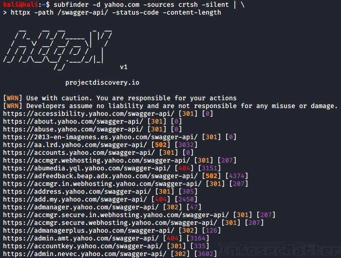
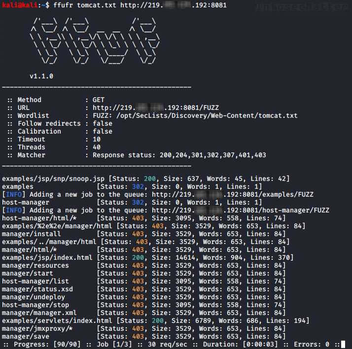
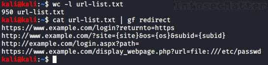

# Bug Bounty Tips #5

Here’s another dose of [bug bounty tips](https://www.infosecmatter.com/bug-bounty-tips/) from the bug hunting community on Twitter, sharing knowledge for all of us to help us find more vulnerabilities and collect bug bounties.

This is the 5th part and in each part we are publishing 10 or more tips. Here we go..

## 1\. Top 25 server-side request forgery (SSRF) parameters

By [@trbughunters](https://twitter.com/trbughunters)  
Source: [link](https://twitter.com/trbughunters/status/1278124869440372741)

Here are the top 25 parameters that could be vulnerable to server-side request forgery (SSRF) vulnerability:

```bash
?dest={target}
?redirect={target}
?uri={target}
?path={target}
?continue={target}
?url={target}
?window={target}
?next={target}
?data={target}
?reference={target}
?site={target}
?html={target}
?val={target}
?validate={target}
?domain={target}
?callback={target}
?return={target}
?page={target}
?feed={target}
?host={target}
?port={target}
?to={target}
?out={target}
?view={target}
?dir={target}
```

Next time you encounter such parameters in an URL, get notice because SSRF is a critical vulnerability that may allow you to:

-   Access services on the loopback interface of the remote server
-   Scan internal network an potentially interact with internal services
-   Read local files on the server using file:// protocol handler
-   Move laterally / pivoting into the internal environment

## 2\. Sensitive data leakage using .json

By [@SalahHasoneh1](https://twitter.com/SalahHasoneh1)  
Source: [link](https://twitter.com/SalahHasoneh1/status/1293918353971531776)

Here’s a tip to achieve sensitive data leak using .json extension.

-   Request:  
    `GET /ResetPassword HTTP/1.1   {"email":"victim@example.com"}`  
      
    Response:  
    `HTTP/1.1 200 OK`

Now let’s try this instead:

-   Request:  
    `GET /ResetPassword.json HTTP/1.1   {"email":"victim@example.com"}`  
      
    Response:  
    `HTTP/1.1 200 OK   {"success":"true","token":"596a96-cc7bf-9108c-d896f-33c44a-edc8a"}`

Notice the added .json extension in our request which resulted in obtaining the secret token!

## 3\. HTTP recon automation with httpx

By [@pdnuclei](https://twitter.com/pdnuclei)  
Source: [link](https://twitter.com/pdnuclei/status/1291454327744106496)

Did you know that you can use [httpx](https://github.com/projectdiscovery/httpx) tool to request any URL path and see the status code and length and other details on the go, filter, or even perform exact matching on them?

Here’s an example:

```bash
cat domains.txt | httpx -path /swagger-api/ -status-code -content-length
```



Very useful, not only for visual analysis. Get the latest release from here:

-   [https://github.com/projectdiscovery/httpx/releases](https://github.com/projectdiscovery/httpx/releases)

## 4\. Easy wins with Shodan dorks

By [@manas\_hunter](https://twitter.com/manas_hunter)  
Source: [link](https://twitter.com/manas_hunter/status/1292082735113109506)

Here is a list of 7 awesome [SHODAN](https://www.shodan.io/) dorks for easy wins:

1.  “default password” org:orgName
2.  “230 login successful” port:21 org:orgName
3.  vsftpd 2.3.4 port:21 org:orgName
4.  230 ‘anonymous@’ login ok org:orgName
5.  guest login ok org:orgName
6.  country:EU port 21 -530 +230 org:orgName
7.  country:IN port:80 title:protected org:orgName

With these dorks we are looking for access credentials and credentials related to FTP, perhaps in a log file exposed online or elsewhere, and also for protected areas such as administrative consoles related to our target organization.

## 5\. How to find authentication bypass vulnerabilities

By [@jae\_hak99](https://twitter.com/kenanistaken)  
Source: [link](https://twitter.com/jae_hak99/status/1292043668375744514)

This is an interesting tip that can help you find authentication bypass vulnerabilities:

-   Request:  
    `GET /delete?user=test HTTP/1.1`  
      
    Response:  
    `HTTP/1.1 401 Unauthorized`

Now let’s try this instead:

-   Request:  
    `GET /delete?user=test HTTP/1.1   X-Custom-IP-Authorization: 127.0.0.1`  
      
    Response:  
    `HTTP/1.1 302 Found`

This might work in cases when the added custom HTTP header (X-Custom-IP-Authorization) is used by the front end – e.g. when it is used to identify the original IP address of the client connecting to the web server through a load balancer.

By identifying ourselves as 127.0.0.1, we might circumvent the access controls of the web application and perform privileged operations.

## 6\. Simple ffuf bash one-liner helper

By [@naglinagli](https://twitter.com/naglinagli)  
Source: [link](https://twitter.com/naglinagli/status/1291686345027485697)

Here’s a useful bash function one-liner made by [@naglinagli](https://twitter.com/naglinagli) to sort out all your directory searching needs. Simply add this into your ~/.bashrc:

```bash
ffufr() {
  ffuf -c -w "/path/to/SecLists/Discovery/Web-Content/$1" -u "$2/FUZZ" -recursion
}
```

Also make sure you have the latest [https://github.com/danielmiessler/SecLists](https://github.com/danielmiessler/SecLists) and the correct path in the function above.

Now you can perform recursive directory searching (dirbusting) of your target domain easily like this:

```bash
ffufr WORDLISTNAME.txt DOMAIN.com
```

Use this with any of the wordlist that is in the ‘SecLists/Discovery/Web-Content/’ directory. Here’s an example using the ‘tomcat.txt’ wordlist:



Really handy! Get everything from here:

-   [https://github.com/ffuf/ffuf](https://github.com/ffuf/ffuf)
-   [https://github.com/danielmiessler/SecLists](https://github.com/danielmiessler/SecLists)

## 7\. Find access tokens with ffuf and gau

By [@Haoneses](https://twitter.com/Haoneses)  
Source: [link](https://twitter.com/Haoneses/status/1291387580299321358)

Here’s another useful bug bounty tip involving [ffuf](https://github.com/ffuf/ffuf) and also [gau](https://github.com/lc/gau). This can help you find access tokens to various service APIs:

1.  Gather all links of your target:  
    `cat hosts | sed 's/https\?:\/\///' | gau > urls.txt`
2.  Filter out javascript urls:  
    `cat urls.txt | grep -P "\w+\.js(\?|$)" | sort -u > jsurls.txt`
3.  Use ffuf to get only valid links and send them right into Burp:  
    `ffuf -mc 200 w jsurls.txt:HFUZZ -u HFUZZ -replay-proxy http://127.0.0.1:8080`
4.  Use Scan Check Builder Burp extension, add passive profile to extract “accessToken” or “access\_token”.
5.  In Burp run passive scan on those javascript links.
6.  Extract found tokens and validate them before reporting.

**Bonus**: How to validate found access tokens? Use [KeyHacks](https://github.com/streaak/keyhacks) to identify particular API keys, how can they be used and how to check if they are valid.

**Protip**: Make sure to also try to extract other file types such as .php, .json etc. (Step 2).

Here’s all the things you need for this tip:

-   [https://github.com/lc/gau](https://github.com/lc/gau)
-   [https://github.com/ffuf/ffuf](https://github.com/ffuf/ffuf)
-   [https://github.com/streaak/keyhacks](https://github.com/streaak/keyhacks)

## 8\. GitHub dorks for finding secrets

By [@impratikdabhi](https://twitter.com/impratikdabhi)  
Source: [link](https://twitter.com/impratikdabhi/status/1292710861996355585)

Here’s a list of 10 Github dorks to find secret and access tokens:

1.  “target.com” send\_keys
2.  “target.com” password
3.  “target.com” api\_key
4.  “target.com” apikey
5.  “target.com” jira\_password
6.  “target.com” root\_password
7.  “target.com” access\_token
8.  “target.com” config
9.  “target.com” client\_secret
10.  “target.com” user auth

With these dorks we can identify all kinds of secrets. As in the previous tip, use [KeyHacks](https://github.com/streaak/keyhacks) to identify and validate found secrets.

## 9\. Use Google cache to find sensitive data

By [@pry0cc](https://twitter.com/pry0cc)  
Source: [link](https://twitter.com/pry0cc/status/1290682586629582849)

Here’s how [@pry0cc](https://twitter.com/pry0cc) was able to find credentials through Google cache for one of his targets:

-   Google dorked target site.
-   Found open HTTP directory.
-   Navigated there – it was patched.
-   Viewed Google cache, Error log path was exposed.
-   Copied the same path to the / of the site, downloaded 300 MB of web error logs.
-   Parsed the error logs, found credentials in plaintext.

Instant win!

This is why it’s crucial to always perform a thorough OSINT analysis. In this case [@pry0cc](https://twitter.com/pry0cc) would have never been able to enumerate it nor find it through bruteforcing. It was there, for a split second, and got indexed in google.

## 10\. Trick to find more IDOR vulnerabilities

By [@m4ll0k2](https://twitter.com/m4ll0k2)  
Source: [link](https://twitter.com/m4ll0k2/status/1290725338285256706)

Here’s a neat trick that could allow you to find more IDOR vulnerabilities.

Let’s say you identified the following endpoint:

```bash
/api/getUser
```

Now do some fuzzing on it (/api/getUser$FUZZ$). Chances are that you will find other endpoints such as these:

```bash
/api/getUserV1
/api/getUserV2
/api/getUserBeta
```

Chances are that these new (old) endpoints are different and potentially vulnerable to IDOR.

In case you are wondering what IDOR vulnerability is – it stands for “Insecure Direct Object Reference” and it allows you to access, edit or delete information belonging to other users.

This is typically achieved by arbitrarily changing (guessing or incrementally increasing) values such as:

-   id
-   uid
-   pid
-   name

If the web application doesn’t properly validate the access rights, you may be able to access other users’ data. IDORs are critical vulnerabilities, so it’s definitely worth paying special attention to.

**Protip**: Use the following wordlist for identifying different endpoint versions (use with [ffuf](https://github.com/ffuf/ffuf) or Burp Intruder):

-   [https://github.com/InfosecMatter/Wordlists/blob/master/version-fuzz.txt](https://github.com/InfosecMatter/Wordlists/blob/master/version-fuzz.txt)

## 11\. Valid email addresses with evil payloads

By [@Haoneses](https://twitter.com/Haoneses)  
Source: [link](https://twitter.com/Haoneses/status/1292456202857742338)

One not-so-well-known attack vector when testing web applications with email address fields is to use the comment section of an email address. This is a feature of email addresses defined in [RFC822](https://tools.ietf.org/html/rfc822) specification.

This means that we can provide an arbitrary comment as part of an email address and it is still going to be a perfectly valid email address. Here is how it may look:

-   “payload”@domain.com
-   name@”payload”domain.com
-   name(payload)@domain.com
-   name@(payload)domain.com
-   name@domain.com(payload)

These are all valid email addresses (you check them in an email address validator, e.g. [here](https://sphinx.mythic-beasts.com/~pdw/cgi-bin/emailvalidate)). As a payload, we can provide something interesting like SQLi, XSS or even a RCE payload.

**Protip**: Check [this](https://www.infosecmatter.com/bug-bounty-tips-2-jun-30/#8_e-mail_address_payloads) bug bounty tip for some good payload examples.

## 12\. Search for interesting parameters with gf

By [@HackersOnDemand](https://twitter.com/HackersOnDemand)  
Source: [link](https://twitter.com/HackersOnDemand/status/1291358539466838016)

Do you have a large list of URLs outputted from another tool?

Use the [gf](https://github.com/tomnomnom/gf) tool (made by [@tomnomnom](https://twitter.com/tomnomnom)) to search for interesting parameters, potentially vulnerable to open redirects, SSRF etc.

```bash
cat url-list.txt | gf redirects
```



Now we could focus on these URLs and test them in detail for open redirection vulnerabilities.

Note that for this tip you will need additional patterns for gf (made by [@1ndianl33t](https://twitter.com/1ndianl33t)) which you can get from here:

-   [https://github.com/1ndianl33t/Gf-Patterns](https://github.com/1ndianl33t/Gf-Patterns)

Make sure to copy all those .json files into your ~/.gf/ directory so that gf can find them.

**Protip**: While you are at it, grab also gf-secrets patterns (made by [@dwisiswant0](https://twitter.com/dwisiswant0)) which can identify various API keys, secrets and access tokens:

-   [https://github.com/dwisiswant0/gf-secrets](https://github.com/dwisiswant0/gf-secrets)

## 13\. XSS payload as an image filename

By [@h4x0r\_dz](https://twitter.com/h4x0r_dz)  
Source: [link](https://twitter.com/h4x0r_dz/status/1292452802338476037)

If you find a file upload function for an image, try introducing an image with XSS (Cross-Site Scripting) payload in the filename, like so:

```bash
.png
">.png
"><svg onmouseover=alert(1)>.svg
<<script>alert('xss')<!--a-->a.png
```

Note that this may only work on UNIX-based systems, because of the special characters not accepted as a filename on Windows. However, as a reflected XSS it should work universally.

## 14\. How to become a bug hunter

By [@kenanistaken](https://twitter.com/kenanistaken)  
Source: [link](https://twitter.com/kenanistaken/status/1293924805490749443)

Here’s a tip how to become a bug hunter and things to keep in mind while doing bug bounties:

-   Sleep well
-   Learn vulnerability types (owasp)
-   Focus on 1 each time
-   Read & practice
-   Learn how to find and exploit
-   Understand how to analyse website
-   See how others do (reports)
-   Learn 1 programming language
-   Make your own scripts
-   Don’t rush

Certainly a very prudent advice!

## Conclusion

That’s it for this part of the [bug bounty tips](https://www.infosecmatter.com/bug-bounty-tips/).

Big thanks to all the authors for sharing their tips:

-   [@trbughunters](https://twitter.com/trbughunters)
-   [@SalahHasoneh1](https://twitter.com/SalahHasoneh1)
-   [@pdnuclei](https://twitter.com/pdnuclei)
-   [@manas\_hunter](https://twitter.com/manas_hunter)
-   [@jae\_hak99](https://twitter.com/kenanistaken)
-   [@naglinagli](https://twitter.com/naglinagli)
-   [@Haoneses](https://twitter.com/Haoneses)
-   [@impratikdabhi](https://twitter.com/impratikdabhi)
-   [@pry0cc](https://twitter.com/pry0cc)
-   [@m4ll0k2](https://twitter.com/m4ll0k2)
-   [@HackersOnDemand](https://twitter.com/HackersOnDemand)
-   [@h4x0r\_dz](https://twitter.com/h4x0r_dz)
-   [@kenanistaken](https://twitter.com/kenanistaken)

Make sure to follow them on Twitter to stay ahead of the bug bounty game.
