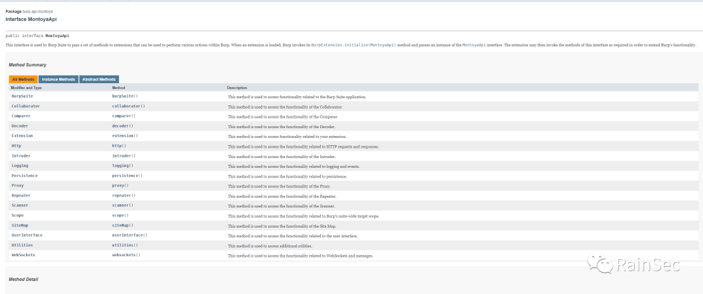
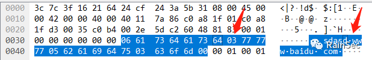
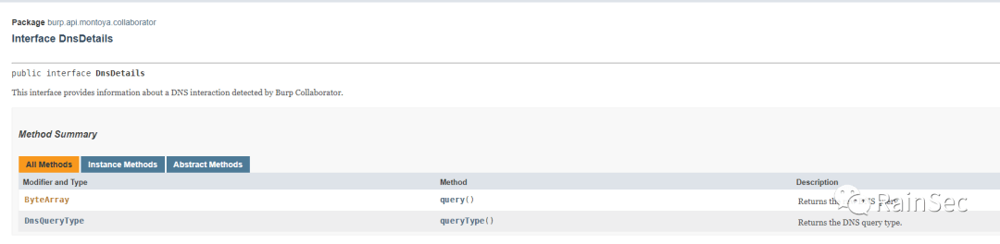
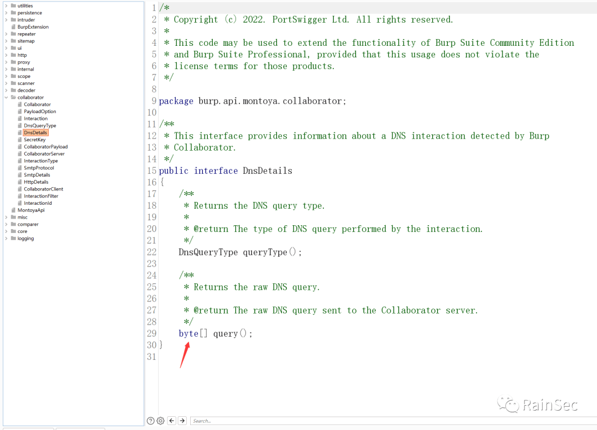

# Burp-Montoya

  Burp的新版本更新了新的API接口，刚好最近有写插件的想法，所以简单的了解了下。

# 简介

  单从MontoyaApi文档\[1\]界面来看，结构清晰了不少



# 使用

  与老版本类似，创建一个插件项目需要继承类`BurpExtension`，它只包含了一个初始化函数

```plain
public interface BurpExtension {
    void initialize(MontoyaApi var1);
}
```

  同样的，想要调用扫描等功能，也需要进行注册，比如我们注册一个扫描

```plain
public void initialize(MontoyaApi montoyaApi) {
    this.montoyaApi = montoyaApi;
    montoyaApi.scanner().registerScanCheck(new FastjsonCheck());
}

public class FastjsonCheck implements ScanCheck {
    @Override
    public List<AuditIssue> activeAudit(HttpRequestResponse httpRequestResponse, AuditInsertionPoint auditInsertionPoint) {
        return null;
    }
    @Override
    public List<AuditIssue> passiveAudit(HttpRequestResponse httpRequestResponse) {
        return null;
    }
    @Override
    public ConsolidationAction consolidateIssues(AuditIssue auditIssue, AuditIssue auditIssue1) {
        return null;
    }
}
```

  与之前类似，`activeAudit`主动，`passiveAudit`被动，`consolidateIssues`定义重复问题的展示规则。具体扫描逻辑与旧版本就大同小异了，不过新版本调用某些方法变得更加方便了，比如调用`collaborator`:

```plain
CollaboratorClient collaboratorClient = montoyaApi.collaborator().createClient();
//生成域名链接
String payload = collaboratorClient.generatePayload().toString();
//访问域名操作
......
//检查记录
List<Interaction> interactions = collaboratorClient.getAllInteractions();
```

  报告的展示与旧版本基本相同，感觉只是变了名称

```plain
import burp.api.montoya.http.HttpService;
import burp.api.montoya.http.message.MarkedHttpRequestResponse;
import burp.api.montoya.scanner.audit.issues.AuditIssue;
import burp.api.montoya.scanner.audit.issues.AuditIssueConfidence;
import burp.api.montoya.scanner.audit.issues.AuditIssueDefinition;
import burp.api.montoya.scanner.audit.issues.AuditIssueSeverity;

import java.util.Arrays;
import java.util.List;

/**
 * @program: BurpMontoya
 * @description:
 * @author: Noel
 * @create: 2022-09-21 01:35
 **/
public class ExampleAudit implements AuditIssue {
    private String name;
    private String detail;
    private HttpService httpService;
    private MarkedHttpRequestResponse[] requestResponses;
    private AuditIssueConfidence confidence;
    private AuditIssueSeverity severity;
    private String baseurl;

    public ExampleAudit(String name, String detail, HttpService httpService, MarkedHttpRequestResponse[] requestResponses, AuditIssueSeverity severity, AuditIssueConfidence confidence, String baseurl){
        this.name = name;
        this.detail = detail;
        this.httpService = httpService;
        this.requestResponses = requestResponses;
        this.severity = severity;
        this.confidence = confidence;
        this.baseurl = baseurl;
    }


    @Override
    public String name() {
        return name;
    }

    @Override
    public String detail() {
        return detail;
    }

    @Override
    public String remediation() {
        return null;
    }

    @Override
    public HttpService httpService() {
        return httpService;
    }

    @Override
    public String baseUrl() {
        return baseurl;
    }

    @Override
    public AuditIssueSeverity severity() {
        return severity;
    }

    @Override
    public AuditIssueConfidence confidence() {
        return confidence;
    }

    @Override
    public List<MarkedHttpRequestResponse> requestResponses() {
        return Arrays.asList(requestResponses);
    }

    @Override
    public AuditIssueDefinition definition() {
        return null;
    }

}
```

  这些结合起来便可以完成一个`Burp`插件的开发了

## 实例

  前段时间出了`Fastjson 1.2.80`的利用与检测方式，刚好我们拿来做一个`Fastjson`检测的插件,`payload`如下:

```plain
[
    {
        "@type":"java.lang.Exception","@type":"com.alibaba.fastjson.JSONException",
        "x":{
            "@type":"java.net.InetSocketAddress"{"address":,"val":"80.DNS"} //  fastjson < 1.2.83
        }
    },
    {
        "@type":"java.lang.Exception","@type":"com.alibaba.fastjson.JSONException",
        "message":{
            "@type":"java.net.InetSocketAddress"{"address":,"val":"83_.DNS"} // fastjson = 1.2.83
        }
    }
]
```

  如果 `fastjson`版本低于`1.2.83`，`DNS`只会收到一个`80`开头的请求，方便我们进行版本判断。我们的检测思路就是遇到`json`格式的`body`或者`param`就全部替换为`payload`，具体操作如下：

1.  1. 获取请求详情
    

```plain
HttpRequest request = httpRequestResponse.httpRequest();

获取参数
List<ParsedHttpParameter> parameters = request.parameters();
```

1.  2. 判断参数值是否为`json`格式
    

```plain
//utilities.urlUtils包含了对URL处理的函数，这里使用了decode，对URL进行解码
utilities.urlUtils().decode(p.value()).startsWith("{") ||utilities.urlUtils().decode(p.value()).startsWith("[") 
```

1.  3. 生成`collaboratorClient`并发送请求
    

```plain
//生成collaborator链接
String payload = collaboratorClient.generatePayload().toString();

// poc
private String Fastjson_Payload = "[\n" +
        "    {\n" +
        "        \"@type\":\"java.lang.Exception\",\"@type\":\"com.alibaba.fastjson.JSONException\",\n" +
        "\t\t\"x\":{\n" +
        "\t\t\t\"@type\":\"java.net.InetSocketAddress\"{\"address\":,\"val\":\"fastjson80.%s\"} \n" +
        "\t\t}\n" +
        "    },\n" +
        "    {\n" +
        "        \"@type\":\"java.lang.Exception\",\"@type\":\"com.alibaba.fastjson.JSONException\",\n" +
        "\t\t\"message\":{\n" +
        "\t\t\t\"@type\":\"java.net.InetSocketAddress\"{\"address\":,\"val\":\"fastjson83.%s\"} \n" +
        "\t\t}\n" +
        "    }\n" +
        "]";
//更新参数为我们的poc
HttpRequest rq = request.withUpdatedParameters(HttpParameter.parameter(p.name(),utilities.urlUtils().encode(String.format(Fastjson_Payload, payload, payload)), p.type()));

//发送请求
HttpRequestResponse httpRequestResponse1 = http.issueRequest(rq);
```

1.  4. 判断`dns`中是否包含有`fastjson83`
    

```plain
// 获取Collaborator服务器中所有与payload有关的请求信息
List<Interaction> interactions = collaboratorClient.getInteractions(InteractionFilter.interactionPayloadFilter(payload));
for (Interaction i :interactions) {
// i.dnsDetails()获取一个DnsDetails的Optional对象，DnsDetails有两个方法，一个是获取dns查询的byte数组 d.query()
// 利用byteUtils().indexOf查询是否包含fastjson83
    flag = i.dnsDetails().filter(d ->
            utilities.byteUtils().indexOf(d.query(), utilities.byteUtils().convertFromString("fastjson83")) > 0
    ).isPresent();

}
```

1.  5. 问题展示
    

```plain
ExampleAudit auditIssue = new ExampleAudit("Example", "Example detail", request.httpService(),new MarkedHttpRequestResponse[]{httpRequestResponse.withNoMarkers(), httpRequestResponse1.withNoMarkers()}, AuditIssueSeverity.HIGH, AuditIssueConfidence.CERTAIN, request.url());
auditIssues.add(auditIssue);
```

至此一个`burp`插件算是完成了。

## 问题

### DNS

  在检测`dns`记录的时候遇到了一个问题，DNS数据包中`.`并不是`ord('.')`的格式



  为了准确识别，采用了`fastjson83`而非`fastjson83.payload`

### api问题

  目前新接口还在不断更新中，不是特别稳定。比如说文档中的`DnsDetails`会返回`ByteArray`类型



  但是目前最新的`burp`接口中还是`byte[]`



## 引用

> \[1\] https://portswigger.github.io/burp-extensions-montoya-api/javadoc/burp/api/montoya/MontoyaApi.html
> 
> \[2\] https://github.com/PortSwigger/burp-extender-montoya-api