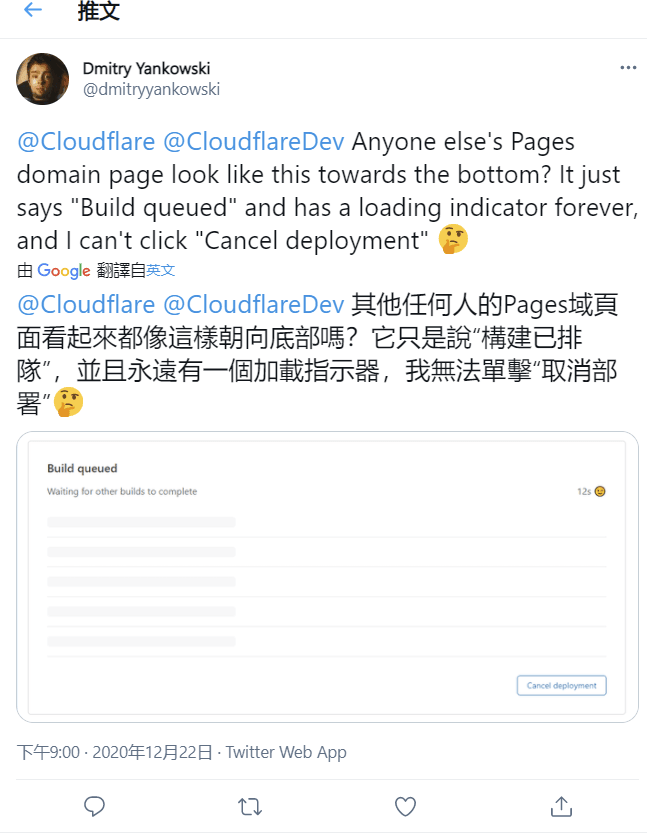
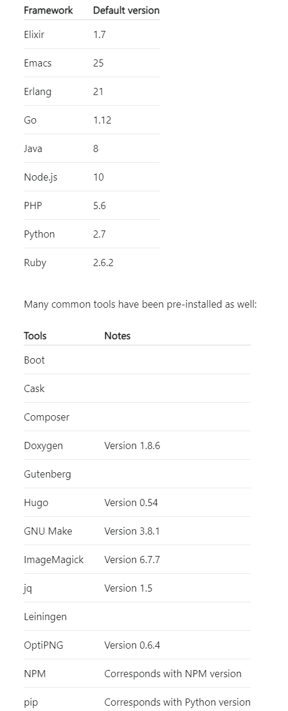
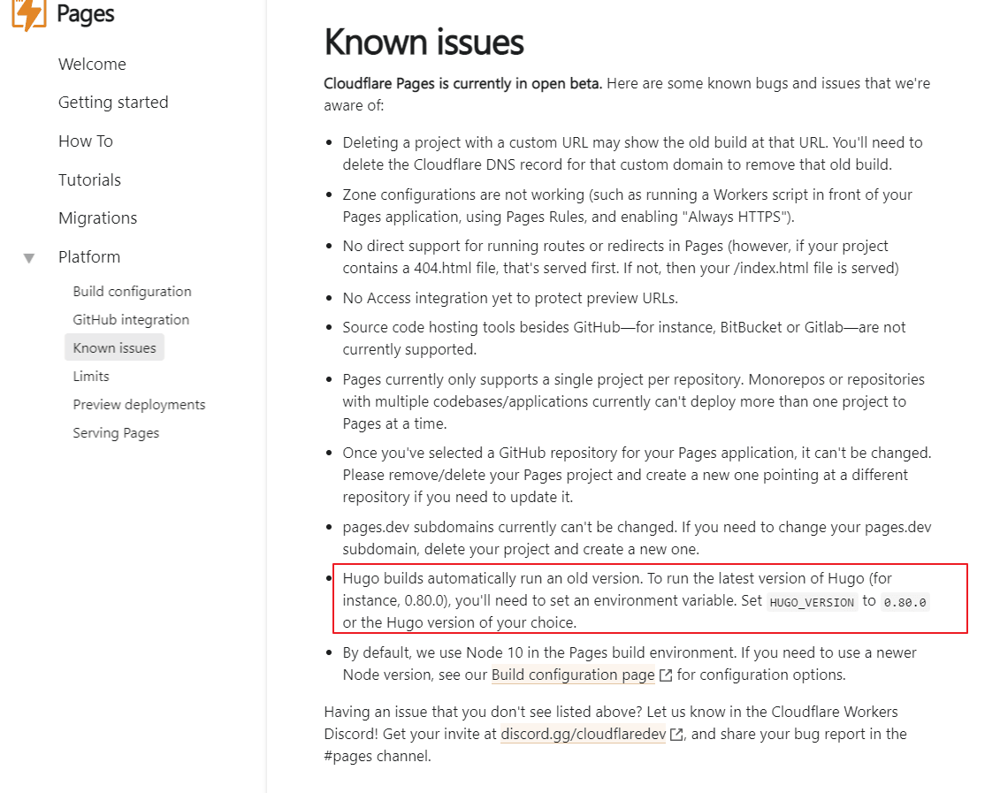
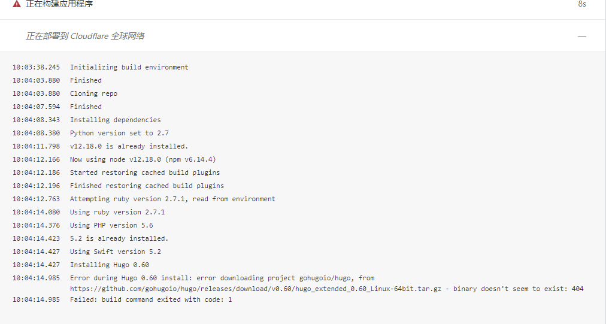
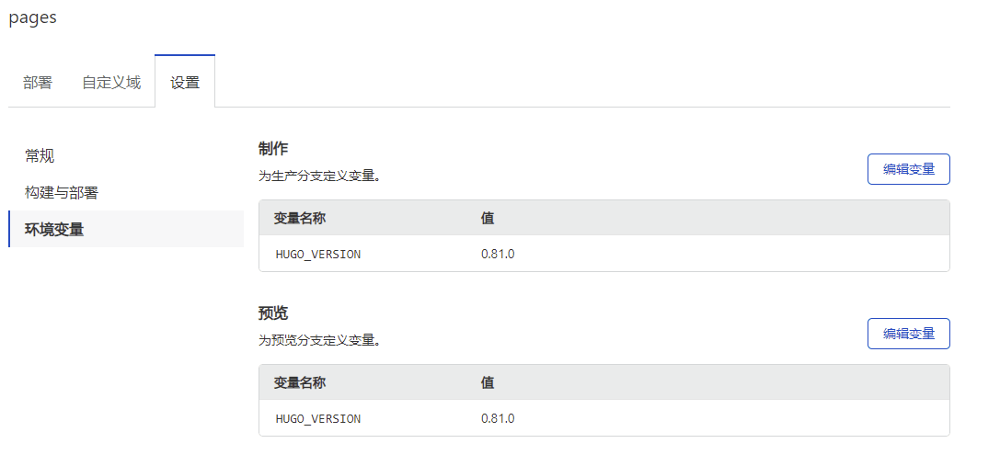
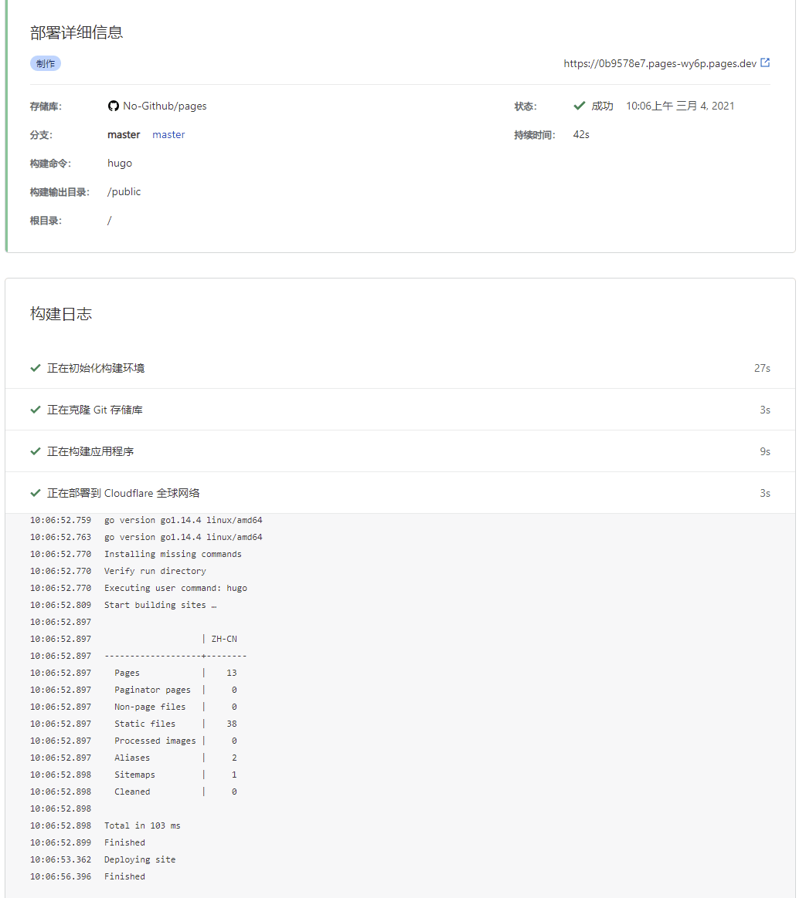
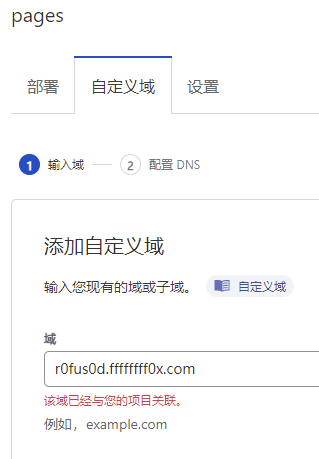
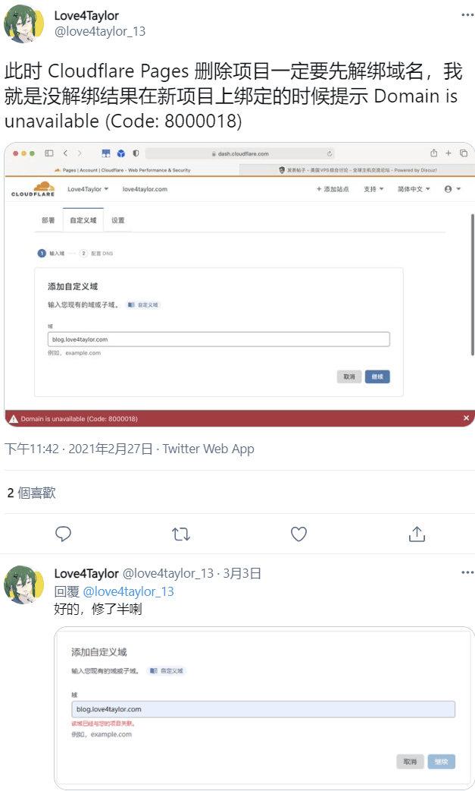
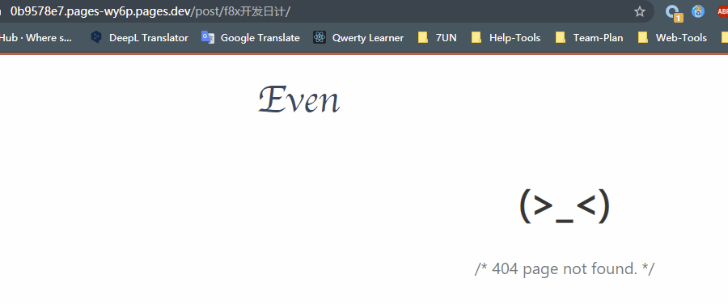
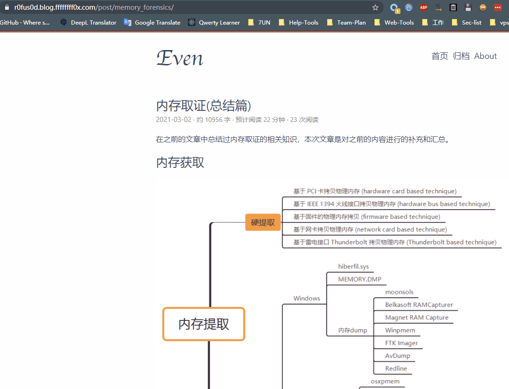

# Cloudflare Pages 踩坑

在搭建 Cloudflare Pages 过程中的遇到多处坑点，分享一下解决办法和思路

warning

注意，本文写于 2021.3.4, 遇到的问题在未来有可能已经解决

最近 Cloudflare Pages 开放使用，第一时间来尝尝鲜，结果遇到多个问题，下面进行下总结

- - -

# 不支持私有仓库

已经给 cloudflare pages 应用配置存储库访问权限，都能选择私有仓库了，结果无法 clone

但关键问题是，其无法 clone 的表现是显示一直在排队，在第二天早上我发现已经排了将近 10 个小时，改为公开仓库才得以解决

这个问题在去年年底就存在

info

截至我写完这个文章，该问题好像已经被修复，私有仓库也可以 clone

- - -

# 不支持子目录中带 .git 目录

以 hugo 为例，在 themes 目录下 clone 一个主题，该主题文件夹是肯定会存在 .git 目录的，但 cloudflare pages 在 clone 你的仓库时，会 clone 失败

需要手动删除 themes 目录下主题的 .git 目录

- - -

# 默认版本过低

开幕雷击，我都怀疑这开发团队是从 2019 年穿越过来的

不过官方文档也说明了可以自己改变量使用新版本

question

官方你既然知道，那为啥不把 hugo 0.54 换一换呢？

改下变量，可恶，少个 .0

改用较新的 0.81.0

一番折腾后终于成功部署

- - -

# 域名已关联

在测试第一个项目时绑定了 r0fus0d.ffffffff0x.com 域名，但删除第一个项目后，看上去绑定关系还是存在，dns 记录中也并没有记录，这种情况下 pages 中域名就不能被使用了

搜了下，同样有人也遇到了这个问题

没有办法，换个子域名，接下来又是个小坑

- - -

# 不支持中文路径

这…

没办法只好改为英文了

