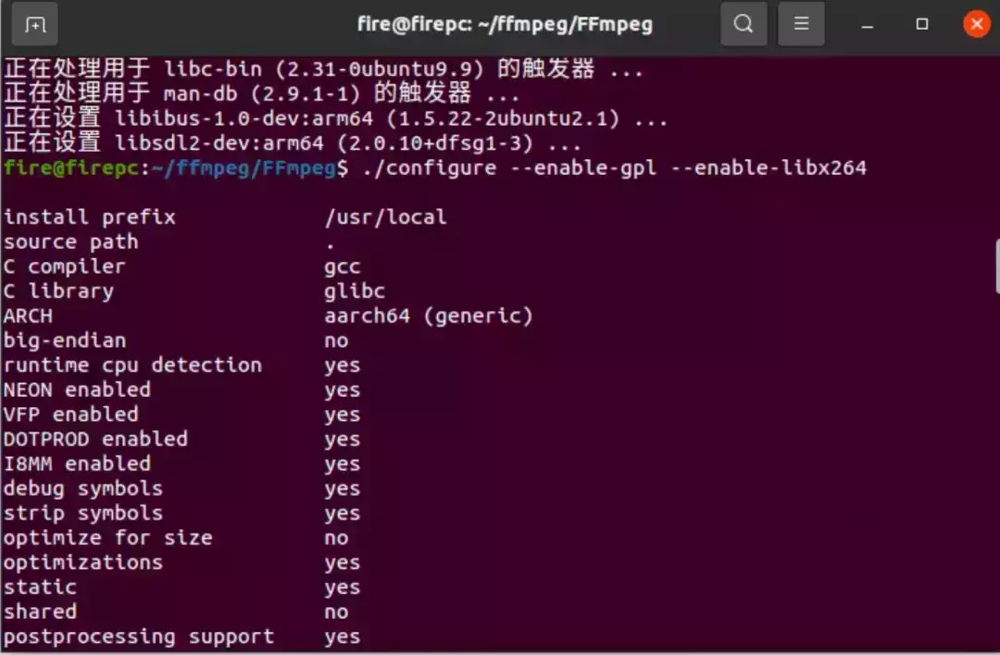
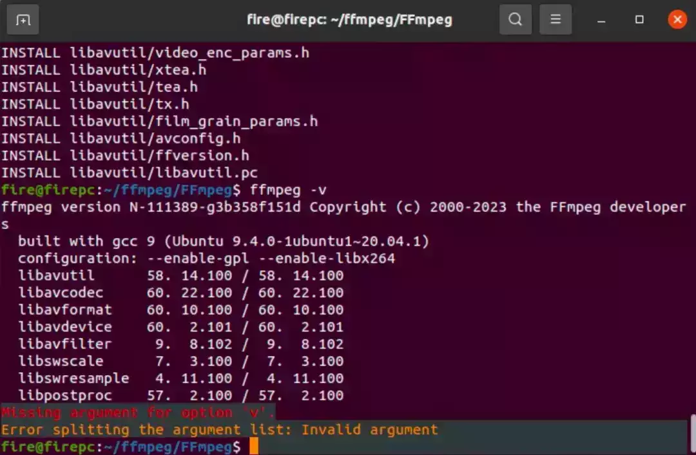
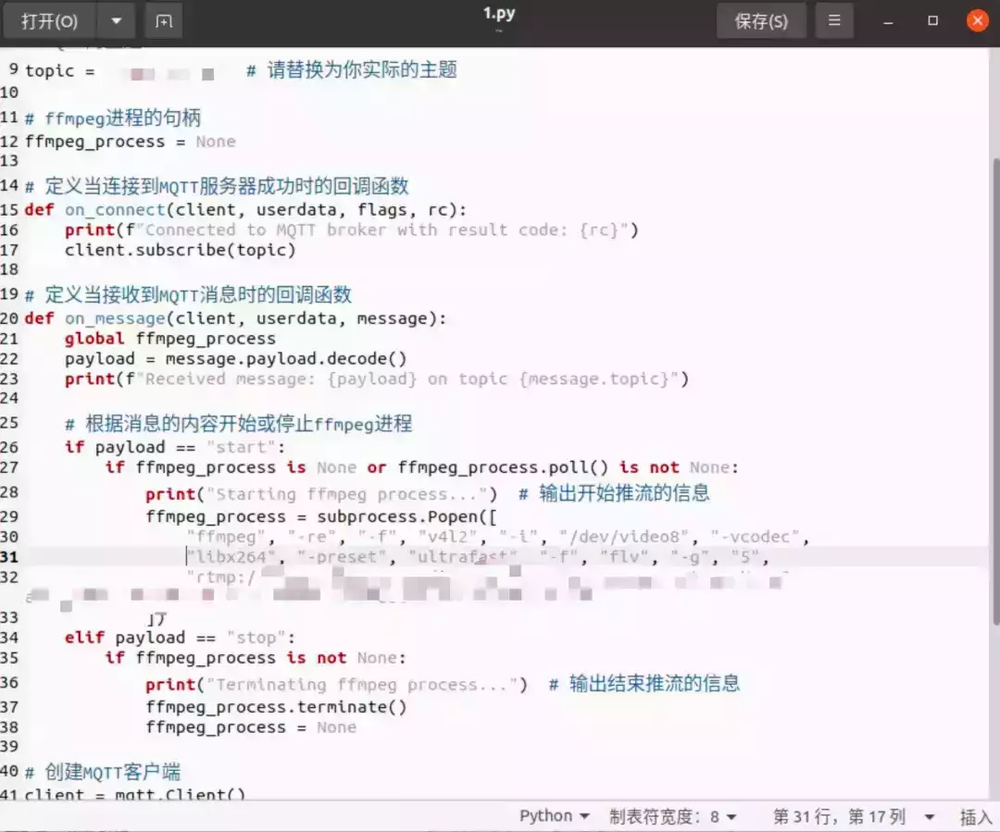
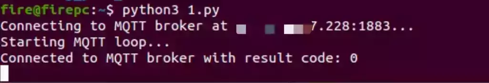

# FFmpeg 实时推流&MQTT 实时控制推流启动关闭

FFmpeg 是一个开源的自由软件，它包含了音频和视频多种格式的录制、转换、流媒体功能，同时也是一个音频与视频格式转换库（Library），许多开源的工具都是基于 FFmpeg 构建的。

最开始的方案是老板要求用 FFmpeg 将本地的视频转化为 GB28181 进而实现与某石互通实现推流。因为某石的平台只接受 GB28181 非某石的设备注册，当然，最后证明这个方案是不太可行的，尝试了一周无果之后，换了另外一种方案。

同样，libx264 是一个广泛使用的开源视频编码器，几乎支持所有常见的视频平台和播放设备。它是 H.264/AVC 标准的实现之一，被广泛支持和兼容。libx264 提供了出色的视频压缩性能，可以在保持较高视频质量的同时，将文件大小控制在相对较小的范围内。这对于网络传输、存储空间和带宽消耗都非常有利。H.264/AVC 是当前最常用的视频编码标准之一，几乎所有的现代设备和平台都支持该标准。使用 libx264 编码的视频可以在各种设备上进行无缝播放和观看。

但是值得注意的是，如果是要使用 libx264 则需要在编译的时候就在命令行中添加，否则无论是 apt 安装还是二进制安装，都不能直接启用 libx264。

**0x01 拉取代码**  

```plain
https://github.com/FFmpeg/FFmpeg.git
```

**0x02 安装依赖**

```plain
sudo apt-get install -y autoconf automake build-essential git libass-dev libfreetype6-dev libsdl2-dev libtheora-dev libtool libva-dev libvdpau-dev libvorbis-dev libxcb1-dev libxcb-shm0-dev libxcb-xfixes0-dev pkg-config texinfo wget zlib1g-dev libavformat-dev libavcodec-dev libswresample-dev libswscale-dev libavutil-dev libsdl1.2-dev yasm libsdl2-dev libx264-dev libx265-dev libfdk-aac-dev
```

**0x03 编译安装**

```plain
./configure --enable-gpl --enable-libx264 //这里设置支持 libx264
sudo make -j8
sudo make install
等待时间较长，耐心等待。
```



安装部署成功



**0x04 MQTT 推流控制测试**

写了段代码，可用性还比较强。代码的主要逻辑功能是在首先获取到当前摄像头的 USB 端口号，然后创建 MQTT 客户端，设置回调函数，链接 MQTT 服务器，开始 MQTT 客户端消息循环，定义回调函数，根据回调信息开始或停止 ffmpeg 进程。具体代码设计 MQTT 服务器及推流地址就不公开了，截图如下。



**0x05 效果展示**

实现控制，start/stop 控制节点开关。over



下文待续......