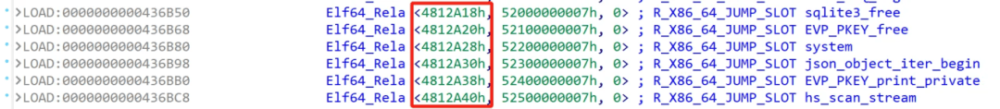
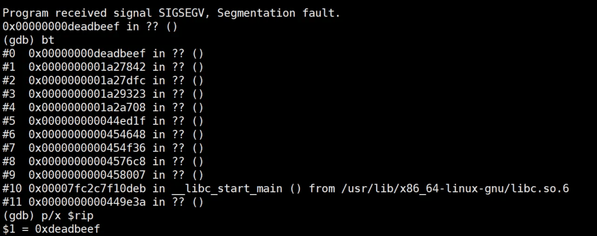

# FortiGate SSLVPN CVE-2024-21762 漏洞利用分析

**一**

  

**漏洞简介**

FortiGate 二月份发布版本更新，修复多个中高危漏洞，其中一个严重级别漏洞是 SSL VPN 的未授权越界写漏洞，漏洞预警称该漏洞可能被在野利用。本文将介绍笔者分析利用该漏洞，实现远程代码执行的过程。

  

https://www.fortiguard.com/psirt/FG-IR-24-015

**二**

  

**漏洞分析**

本文漏洞分析使用的环境是`FGT_VM64-v7.4.2.F-build2571`。

  

**01**

**diff patch**

  

对修复版本的二进制进行对比（7.4.2 和 7.4.3），分析发现修复代码位于函数`sub_18F4980`(7.4.2) 。

  

  

分析该函数不难发现，该函数逻辑是读取 HTTP POST 请求的 body 数据。同时根据`Transfer-Encoding`请求头判断是按照 chunk 格式读取，还是根据`Content-Length`读取。根据控制流图对比结果，存在两处代码修改：

1\. 解析 chunk 格式时，调用`ap_getline`读取分块长度，检查`ap_getline`的返回值是否大于 16，大于 16 认为是非法的 chunk length。

  

  

2\. 读取 chunk trailer 时，写入`\r\n`的偏移`line_off`的赋值来源，修复前`line_off`的值来源于`*(_QWORD *)(a1 + 744)`，修复后`line_off`为`ap_getline`的返回值。

  

  

继续向前回溯，可以找到`*(_QWORD *)(a1 + 744)`的值正是第一处校验的 chunk length 字段的长度。

  

  

同时阅读代码可以得知，当 chunk length 字段经过 hex 解码后值为 0 时，就会进入到 chunk trailer 读取的逻辑。

  

**02**

**触发越界写**

  

经过对 patch 的分析，我们可以得到以下结论：

1、解析 chunk 时，如果 chunk length 字段 hex 解码后值为 0，则开始 chunk trailer 的读取。

  

2、调用 ap\_getline 读取 chunk trailer 后，会根据 chunk length 字段的长度向缓冲区中写入`\r\n`。

  

因此，如果 chunk length 字段传入很多个 0，0 的长度大于剩余缓冲区长度的 1/2 时，就会触发越界写入`\r\n`。通过调试可知目标缓冲区位于栈上（函数 sub\_1A111E0），偏移 0x2028 的位置保存了返回地址。如果在偏移 0x202e 的位置写入`\r\n`，当函数返回执行`ret`指令恢复 rip 时就会因地址非法产生崩溃。

  

**Crash PoC:**

**崩溃现场：**

  

**三**

  

**漏洞利用**

通过分析漏洞成因可知，利用该漏洞可以实现栈上越界写`\r\n`两个字节，越界范围接近 0x2000。由于写入的内容非常有限，无法通过直接劫持 rip 实现 RCE。因此需要把目光放在栈上保存的内存指针上。

  

**01**

**失败的尝试**

  

比较容易想到的是劫持 rbp，通过覆盖 rbp 的低字节，使 rbp 刚好指向可控的内存区域。当上一级函数返回执行`leave ret`指令时，就可以完全劫持 rip。然而验证时发现即使覆盖了栈上的 rbp，也无法劫持 rsp 和 rip，甚至程序不会产生崩溃。继续向上回溯，找到`sub_1A111E0`的父函数`sub_1A26040`，该函数在返回时并没有调用`leave ret`来恢复 rsp，而是直接`add rsp, 0x18`，因此无法达到预期的效果。

  

  

**02**

**另寻突破点**

  

如上一小节看到的那样，`sub_1A26040`函数在栈上保存了 rbx、r12-r15 五个寄存器的值，并在函数返回时恢复这些寄存器。继续向上回溯找到父函数`sub_1A27650`。可以看到 r13 中保存的正是参数`a1`。

  

  

a1 是一个结构体指针，通过调试也可以看出栈上保存的`r13`是一个堆地址。

  

  

如果通过越界写覆盖图中红色区域的内存，那么`sub_1A26040`函数返回时恢复 r13 寄存器，就可以篡改`a1`指针的值。如果能够对堆内存进行布局，使得 a1 指向提前布置好的内存区域，那么就可以劫持整个 a1 结构体。同时通过分析`sub_1A27650`和`sub_1A26040`的代码逻辑，其中存在大量 a1 多级结构体成员的动态函数调用，因此劫持 a1 会有更多的利用机会。

  

**03**

**劫持结构体**

  

根据设想，a1 指针的低字节被覆盖成`\r\n`后，可以恰好指向预先布置好的内存。如图所示：

  

  

为实现这一效果，需要达成如下条件：

1.  a1 结构体地址比堆喷区域地址更高，并且二者间隔很小。
    
2.  `0x7fxxxxxxx0a0d`一定指向伪造的结构体。
    

调试可以发现 a1 结构体的大小是 0x730，根据 jemalloc 的对齐规则，会分配到 0x800 大小的堆块。0x800 的堆块在请求处理的过程中并不常用，因此很容易把 tcache 中 0x800 的堆块耗尽，同时申请更多新的 0x800 的块，使得释放后进入 tcache。堆喷也选择不常用的大小的堆块，使得新申请的堆块是连续的，同时与新申请的 0x800 距离较近；堆喷选择使用较大堆块，以保证其地址为 0x800 对齐，这样就很容易做到每一个伪造的结构体地址的低 12 比特为 0xa0d；堆喷范围不小于 0x10000，以保证`0x7fxxxxxxx0a0d`指向堆喷的区域。劫持后的效果如图：

  

  

**04**

**寻找可利用的多级指针**

  

通过上述操作，可实现 a1 结构体的劫持。梳理函数`sub_1A27650`和`sub_1A26040`的代码，其中存在多处 a1 结构体成员二级指针和三级指针的动态调用，例如：

  

  

当满足 `*(_BYTE *)(a1+0x20*(N+6)+0x10)&6==0`(0<N<5) 时，就会动态调用`*(__int64 (__fastcall **)(__int64))(*(_QWORD *)(*(_QWORD *)(a1 + 0x298)+0x70)+0xC0)(a1)` 因此，需要把`a1 + 0x298`成员伪造成一个多级指针，最终指向我们想要调用的函数。由于目标二进制没有开启 PIE 保护，所以可以在目标二进制寻找符合条件的多级指针。分析二进制，可以发现 Rela 重定位节中每一个条目的第一个字段都指向对应函数的 GOT 表地址。

  

Rela 重定位条目

  

GOT 表

  

因此，以`system`函数为例可以找到符合条件的多级指针

  

  

在堆喷时，将结构体偏移 0x298 处的值改成`0x4368d0`就可以实现对 system 函数的调用，效果如下：

  

  

如图所示，动态调用的参数正是 a1，指向的内存可控。到这里正常就可以利用 system 函数执行任意命令了。但是在 FortiGate 中，`/bin/sh`文件不具备执行命令的能力，因此使用 system 函数执行命令无法执行成功。

  

**05**

**劫持 RIP**

  

由于 system 函数无法执行命令，只能再想别的办法完成 RCE。现有的条件是可以调用任意的 GOT 表函数，函数的第一个参数指向的内存可控，所以如果 GOT 表中存在某个函数会回调参数中的某个成员，就有机会实现 RIP 劫持。很容易想到在以前的 FortiGate 漏洞利用中经常使用到的函数`SSL_do_handshake`。

只需要构造 SSL 结构体，使得满足条件，最终调用`s->handshake_func(s)`，就可以实现 rip 劫持，把 rip 劫持到 0xdeadbeef 如图：

  

  

**06**

**ROP**

  

FortiGate 主程序是一个 All in One 的二进制，大小已超过 70MB，有大量的 gadget 可以利用，利用 ROP 实现 RCE 并不困难，不再赘述。

**四**

  

**利用演示**

尽管 7.4.2 版本 SSL VPN 默认已关闭 web mode，浏览器访问返回 403，但是该漏洞仍然可以在默认配置下完成利用。

  

，时长 00:19

**五**

  

**总  结**

该漏洞与去年的`CVE-2023-27997`XOR 导致的堆溢出漏洞类似，都是看起来比较鸡肋的溢出漏洞，利用过程比较 Trick，更像是一道 CTF 题目。但是与传统攻击堆管理器的 CTF 题目相比，真实漏洞更多的需要借助上下文的结构体和代码逻辑完成利用。笔者水平有限，如有纰漏，欢迎指正。

  

【版权说明】

本作品著作权归 **zbleet** 所有

未经作者同意，不得转载
