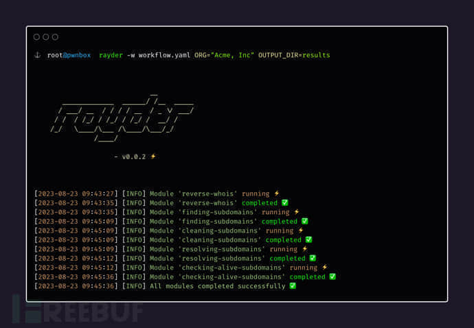

# 如何使用 Rayder 组织编排漏洞侦查和渗透测试工作流 - FreeBuf 网络安全行业门户

## 关于 Rayder

Rayder 是一款针对漏洞网络侦查和渗透测试自动化工作流工具，该工具本质上是一个命令行工具，旨在帮助广大研究人员更轻松地组织、编排和执行漏洞侦查和渗透测试工作流。


Rayder 允许我们在 YAML 文件中定义一系列功能模块，且每个模块都由要执行的命令所组成。Rayder 可以帮助广大研究人员自动化复杂的流程，使重复的模块变得简单，并在命令不相互依赖的情况下并行执行。

## 工具要求

> Go v1.16+

## 工具安装

首先，我们需要在本地设备上安装并配置好 Go v1.16+ 环境。然后直接运行下列命令即可安装最新版本的 Rayder：

```plain
go install github.com/devanshbatham/rayder@v0.0.4
```

## 工具使用

Rayder 提供了一种非常简单且直接的工作流执行方法，所有要执行的内容都在 YAML 文件中定义，使用下列命令即可直接运行 Rayder：

```plain
rayder -w path/to/workflow.yaml
```

## 工作流配置

定义在 YAML 文件中的工作流数据结构如下所示：

```plain
vars:

  VAR_NAME: value

  # 这里可以添加更多的变量...

 

parallel: true|false

modules:

  - name: task-name

    cmds:

      - command-1

      - command-2

      # 这里可以添加更多的命令...

    silent: true|false

  # 这里可以添加更多的模块...
```

## 在工作流中使用变量

Rayder 支持在工作流配置文件中使用各种变量，这种方式不仅实现了命令参数化，而且也能够更大程度地实现灵活性。我们可以在 YAML 工作流文件的 vars 部分定义变量，然后使用双大括号{{}}在命令字符串中引用这些变量。

### 定义变量

```plain
vars:

  VAR_NAME: value

  ANOTHER_VAR: another_value

  # Add more variables...
```

### 在命令中引用变量

```plain
modules:

  - name: example-task

    cmds:

      - echo "Output directory {{OUTPUT_DIR}}"
```

### 通过命令行提供变量

```plain
rayder -w path/to/workflow.yaml VAR_NAME=new_value ANOTHER_VAR=updated_value
```

## 工具使用样例

### 使用样例一

我们可以按照下列方式在工作流配置文件中定义、引用和提供变量：

```plain
vars:

  ORG: "example.org"

  OUTPUT_DIR: "results"

 

modules:

  - name: example-task

    cmds:

      - echo "Organization {{ORG}}"

      - echo "Output directory {{OUTPUT_DIR}}"
```

执行工作流时，我们可以在命令行命令中提供 ORG 和 OUTPUT\_DIR 的变量值：

```plain
rayder -w path/to/workflow.yaml ORG=custom_org OUTPUT_DIR=custom_results_dir
```

上述命令将会覆盖这些变量原用的值，并使用命令行提供的新值。

### 使用样例二

以下是一个为反向 whois 定制的工作流配置示例，它将根域名重新配置并处理为子域名，然后解析它们并检查哪些是有效域名：

```plain
vars:

  ORG: "Acme, Inc"

  OUTPUT_DIR: "results-dir"

 

parallel: false

modules:

  - name: reverse-whois

    silent: false

    cmds:

      - mkdir -p {{OUTPUT_DIR}}

      - revwhoix -k "{{ORG}}" > {{OUTPUT_DIR}}/root-domains.txt

 

  - name: finding-subdomains

    cmds:

      - xargs -I {} -a {{OUTPUT_DIR}}/root-domains.txt echo "subfinder -d {} -o {}.out" | quaithe -workers 30

    silent: false

 

  - name: cleaning-subdomains

    cmds:

      -  cat *.out > {{OUTPUT_DIR}}/root-subdomains.txt

      -  rm *.out

    silent: true

 

  - name: resolving-subdomains

    cmds:

      - cat {{OUTPUT_DIR}}/root-subdomains.txt | dnsx -silent -threads 100 -o {{OUTPUT_DIR}}/resolved-subdomains.txt

    silent: false

 

  - name: checking-alive-subdomains

    cmds:

      - cat {{OUTPUT_DIR}}/resolved-subdomains.txt | httpx -silent -threads 1000 -o {{OUTPUT_DIR}}/alive-subdomains.txt

silent: false
```

如需执行上述工作流，运行下列命令即可：

```plain
rayder -w path/to/reverse-whois.yaml ORG="Yelp, Inc" OUTPUT_DIR=results
```

需要注意的是，如果将配置文件中 parallel 字段设置为 true，则模块将会并行执行。

## 工具运行截图



## 许可证协议

本项目的开发与发布遵循

[↓↓↓](#MIT-1-ov-file)  
  
MIT  
  
[↑↑↑](#MIT-1-ov-file)

开源许可证协议。

## 项目地址

**Rayder**：【

[↓↓↓](https://github.com/devanshbatham/rayder)  
  
GitHub 传送门  
  
[↑↑↑](https://github.com/devanshbatham/rayder)

】

## 参考资料

> [↓↓↓](https://github.com/devanshbatham/rayder-workflows)  
>   
> https://github.com/devanshbatham/rayder-workflows  
>   
> [↑↑↑](https://github.com/devanshbatham/rayder-workflows)
> 
> [↓↓↓](https://taskfile.dev/)  
>   
> https://taskfile.dev/  
>   
> [↑↑↑](https://taskfile.dev/)