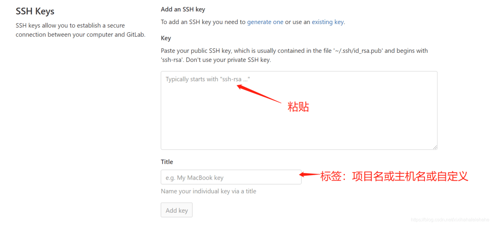

# Github 托管本地项目


1.  github 是什么
    
2.  GitHub 与 Git 关系
    
3.  git 安装
    

-   yum 安装
    
-   tar 安装
    

5.  git 配置
    
6.  界面创建 github 仓库
    
7.  上传本地项目到 github
    
8.  常见错误
    

## 1\. github 是什么

GitHub\[1\] 是一个共享虚拟主机服务，用于存放使用 Git\[2\] 版本控制的软件代码和内容项目。它由GitHub公司（曾称Logical Awesome）的开发者Chris Wanstrath\[3\]、PJ Hyett\[4\]和Tom Preston-Werner\[5\]使用Ruby on Rails\[6\]编写而成。

它还是什么?

-   • 网站
    
-   • 免费博客
    
-   • 管理配置文件
    
-   • 收集资料
    
-   • 简历
    
-   • 管理代码片段
    
-   • 托管编程环境
    
-   • 写作
    
-   • 版本管理与软件部署
    

## 2\. GitHub 与 Git 关系

`Git`是一个分布式的版本控制系统，最初由Linus Torvalds\[7\]编写，用作Linux内核代码的管理。在推出后，Git在其它项目中也取得了很大成功，尤其是在Ruby社区中。目前，包括`Rubinius`、`Merb`和`Bitcoin`在内的很多知名项目都使用了Git。Git同样可以被诸如 Capistrano\[8\] 和 Vlad the Deployer\[9\] 这样的部署工具所使用。

`GitHub`可以托管各种git库，并提供一个web界面，但与其它像 SourceForge\[10\]或Google Code\[11\]这样的服务不同，GitHub的独特卖点在于从另外一个项目进行分支的简易性。为一个项目贡献代码非常简单：首先点击项目站点的“fork”的按钮，然后将代码检出并将修改加入到刚才分出的代码库中，最后通过内建的“pull request”机制向项目负责人申请代码合并。已经有人将GitHub称为代码玩家的MySpace。

## 3\. git 安装

windows 下载git工具\[12\]：git bash 、git gui 、git cmd linux环境下如果yum源有git包，

### 3.1 yum 安装

```plain
$ yum -y install git-all.noarch
$ git version
git version 2.27.0
```

默认yum安装的git好像不太新。

### 3.2 tar 安装

1.  1. 安装依赖
    

```plain
$ sudo yum -y install make autoconf automake cmake perl-CPAN libcurl-devel libtool gcc gcc-c++ glibc-headers zlib-devel git-lfs telnet lrzsz jq expat-devel openssl-devel
```

1.  1. 安装 Git
    

```plain

$ cd /tmp
$ wget --no-check-certificate https://mirrors.edge.kernel.org/pub/software/scm/git/git-2.38.1.tar.gz
$ tar -xvzf git-2.38.1.tar.gz
$ cd git-2.38.1/
$ ./configure
$ make
$ sudo make install
$ git --version          # 输出 git 版本号，说明安装成功
git version 2.38.1
```

## 4\. git 配置

1.  1. 打开git bash，执行以下命令，配置git的`用户名`与`邮箱`
    

```plain
$ git config --global user.name "ghostwritten"
$ git config --global user.email "1zoxun1@gmail.com"
$ git config --list
$ git config --global credential.helper store    # 设置 Git，保存用户名和密码
$ git config --global core.longpaths true # 解决 Git 中 'Filename too long' 的错误
```

我们会把非 ASCII 字符叫做 Unusual 字符。这类字符在 Git 输出到终端的时候默认是用 8 进制转义字符输出的（以防乱码），但现在的终端多数都支持直接显示非 ASCII 字符，所以我们可以关闭掉这个特性

```plain
$ git config --global core.quotepath off
```

其次，GitHub 限制最大只能克隆 100M 的单个文件，为了能够克隆大于 100M 的文件，我们还需要安装 Git Large File Storage，安装方式如下：

```plain
$ git lfs install --skip-repo
```

1.  1. 设置`SSH key`（git中sshkey有何作用？）
    

首先检查是否已生成密钥`cd ~/.ssh`，如果返回的ls有3个文件,则密钥已经生成。

```plain
$ ssh-keygen -t rsa -C "1zoxun1@gmail.com"
```

生成密钥 把`id_rsa.pub`的公钥内容复制 ，然后找到github的用户设置的列表中SSH and GPG keys选项，添加 new SSH key，随便起个名字，粘贴复制公钥。



```plain
ssh -T git@github.com   #远程登录git
```

## 5\. 界面创建 github 仓库


## 6\. 上传本地项目到 github

非常简单，起名字，描述库的作用功能，设置公有，私有。是否设置创建README，如果之前没有设置它，上传文件就会报错。否则执行以下命令：

```plain
mkdir python-mysql
git init
echo "# github-roam" >> README.md
git add README.md
git commit -m 'first_commit'
git log --oneline
git status
git remote add origin https://github.com/ghostwritten/python-mysql.git
git push origin master
```

## 7\. 常见错误

1.  1. 错误1
    

```plain
1.To https://github.com/Ghostwritten/test.git
 ! [rejected]        master -> master (fetch first)
error: failed to push some refs to 'https://github.com/ghostwritten/python-mysql.git'
```

```plain
git push origin master --force   #强制推送到库名下
```

1.  1. 错误2
    

```plain
git remote add origin https://github.com/ghostwritten/python-mysql.git
  fatal: remote origin already exists
```

则执行以下语句：

```plain
git remote rm origin
git remote add origin https://github.com/ghostwritten/python-mysql.git 
```

1.  1. 错误3
    

```plain
在执行git push origin master时，报错：
error:failed to push som refs to.......
则执行以下语句：
git pull origin master
先把远程服务器github上面的文件拉先来，再push 上去。
```

可以看到我们的本地项目已经上传到了`github`上了。

#### 引用链接

`[1]` GitHub: *https://github.com/*  
`[2]` Git: *https://git-scm.com/*  
`[3]` Chris Wanstrath: *http://chriswanstrath.com/*  
`[4]` PJ Hyett: *https://hyett.com/*  
`[5]` Tom Preston-Werner: *https://tom.preston-werner.com/*  
`[6]` Ruby on Rails: *https://rubyonrails.org/*  
`[7]` Linus Torvalds: *https://github.com/torvalds*  
`[8]` Capistrano: *https://capistranorb.com/*  
`[9]` Vlad the Deployer: *https://rubygems.org/gems/vlad/versions/2.7.0*  
`[10]` SourceForge: *https://sourceforge.net/*  
`[11]` Google Code: *https://code.google.com/*  
`[12]` 下载git工具: *https://git-scm.com/downloads*