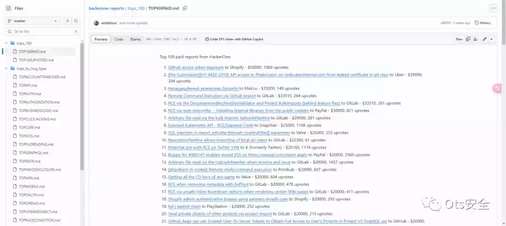
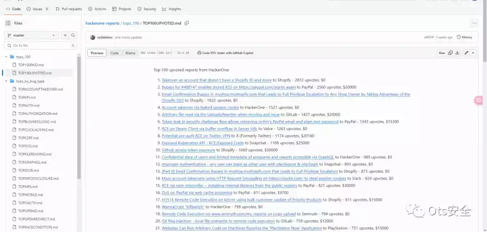

# HackerOne 公开的热门报告【赏金猎人的下饭菜】

  

### **热门公司报告排名：**

-   Mail.ru：作为一家国际知名的互联网公司，Mail.ru 的报告在排名中占据重要位置。我们深度分析了其网络安全漏洞，以确保用户数据的安全。
    
-   HackerOne：作为全球最大的漏洞赏金平台之一，HackerOne 的报告无疑成为我们重点关注的对象。我们排名了 HackerOne 平台上最显著的漏洞，以推动整个网络安全社区的发展。
    
-   Shopify：作为电商领域的领导者，Shopify 的报告排名凸显了该行业所面临的安全挑战。我们通过分析漏洞，为电商平台的用户提供了更安全的购物环境。
    

（...等这里不一一列举）

### **热门漏洞排名：**

在排名过程中，我们发现了一系列热门漏洞，这些漏洞对于攻击者构成潜在威胁，因此我们对它们进行了重点关注。这些漏洞包括但不限于：

-   跨站脚本攻击 (XSS)：这种漏洞可能导致用户在不知情的情况下执行恶意脚本，我们排名了最突出的 XSS 报告。
    
-   远程代码执行 (RCE)：RCE 漏洞允许攻击者在远程执行恶意代码，我们关注并排名了最危险的 RCE 报告。
    
-   SQL 注入 (SQLi)：SQLi 漏洞可能导致数据库的泄露，我们排名了最顶级的 SQLi 报告。
    
-   服务器端请求伪造 (SSRF)：SSRF 漏洞可能导致攻击者发起对内部系统的未经授权请求，我们排名了最危险的 SSRF 报告。
    

项目地址：https://github.com/reddelexc/hackerone-reports

**开饭咯！！！！！！！！！！！！！！！**

还有 HackerOne 的前 100 名付费报告，和 HackerOne 的前 100 名累计点赞报告。

项目地址：https://github.com/reddelexc/hackerone-reports/blob/master/tops\_100/TOP100UPVOTED.md

