# 《HelloGitHub》第 95 期

> 兴趣是最好的老师，**HelloGitHub** 让你对编程感兴趣！

## 简介

**HelloGitHub** 分享 GitHub 上有趣、入门级的开源项目。

这里有实战项目、入门教程、黑科技、开源书籍、大厂开源项目等，涵盖多种编程语言 Python、Java、Go、C/C++、Swift...让你在短时间内感受到开源的魅力，对编程产生兴趣！

- - -

> 以下为本期内容｜每个月 **28** 号更新

### C 项目


> 地址：https://github.com/audacity/audacity

2、VeraCrypt：一款开源的磁盘加密软件。该项目是基于知名、已停止维护的 TrueCrypt 开发，修复了已知的许多漏洞和安全问题。经过多年的迭代，VeraCrypt 的功能更加强大。它支持动态加密系统分区、硬件加速、隐藏加密容器、多重认证等功能，适用于 Windows、Linux 和 macOS 平台，提供了跨平台的硬盘加密开源解决方案。

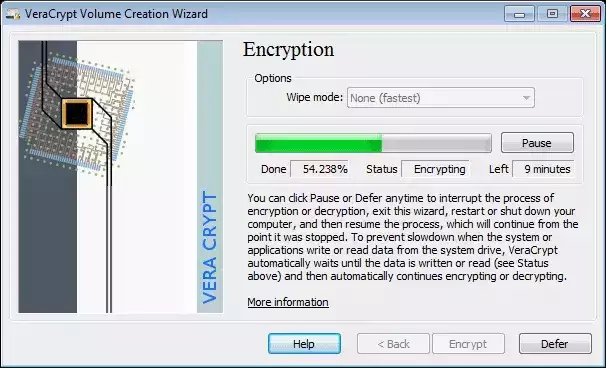

> 地址：https://github.com/veracrypt/VeraCrypt

### C# 项目

3、Jackett：一个支持磁力资源聚合搜索的工具。该项目能够将多个私有和公共的 BT 站点转化为统一的 API，并提供了一个简易的 Web 页面，方便统一管理搜索结果和下载任务。

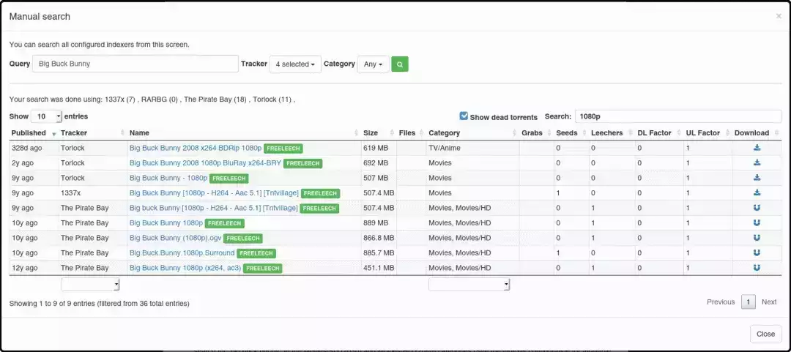

> 地址：https://github.com/Jackett/Jackett

### C++ 项目

4、endless-sky：一款 2D 太空交易和战斗游戏。这是一款免费、开源的太空探索类游戏。玩家将扮演一位小型宇宙飞船的舰长，在沙盒式的太空环境中展开探险。通过做任务、运送乘客或货物、护航、交易或掠夺敌方飞船，玩家可以赚取金钱，进而购买更强大的飞船并升级武器与引擎，探索更广阔的太空。游戏对硬件配置要求低，支持 Windows、Linux 和 macOS 平台。

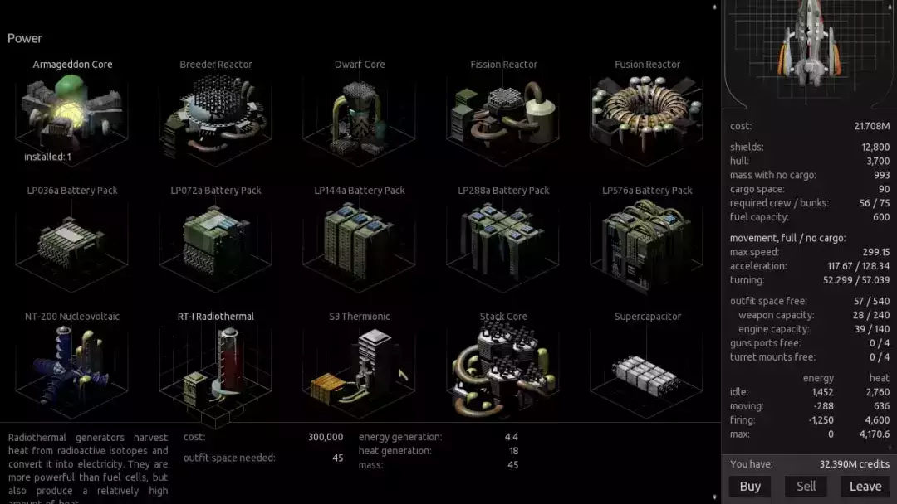

> 地址：https://github.com/endless-sky/endless-sky

5、Hyprland：一个灵活、强大的 Wayland 合成器。这是一个高度可定制的动态平铺 Wayland 合成器，用于 Linux 系统的自定义桌面环境。Wayland 是新一代的 Linux 桌面后端服务器协议。该项目提供了多应用程序窗口管理、自动调整、切换和切分窗口的功能。它还支持多显示器设置、自定义外观和丰富的插件扩展。

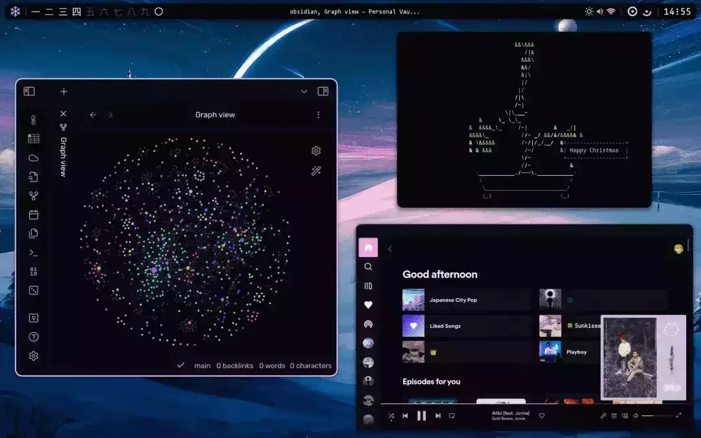

> 地址：https://github.com/hyprwm/Hyprland

6、images：一个缓存和调整图像尺寸的服务。这个项目是用 C++ 编写的图像处理服务，使用了 Nginx、libvips 和 Cloudflare 等技术。它具备调整图像大小和加速访问的功能，支持多种图像格式，包括 JPEG、PNG、BMP、GIF、TIFF、WebP、PDF 和 SVG 等。来自 @孤胆枪手 的分享

```plain
<!-- 源图标地址：wsrv.nl/lichtenstein.jpg -->

```

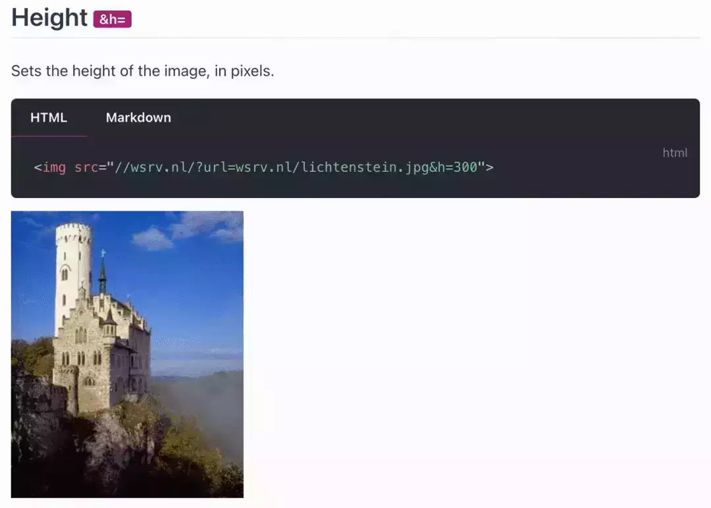

> 地址：https://github.com/weserv/images

7、Shell：一款强大的 Windows 上下文菜单管理工具。这项目是一个用于管理 Windows 文件资源管理器上下文菜单的程序。简单来说，就是扩展了 Windows 右键菜单的功能。该工具免费、开源、无广告、轻巧，支持所有文件系统对象，如文件、文件夹、桌面和任务栏。它提供了一系列提升效率的功能，包括拷贝文件地址、快速打开目录、终端打开、自定义外观以及复杂的嵌套菜单等。

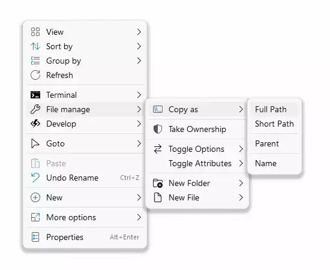

> 地址：https://github.com/moudey/Shell

### CSS 项目

8、hyperui：免费的 Tailwind CSS 组件集合。该项目提供了一系列适用于网站、营销和电商等网站的免费 Tailwind CSS 组件。这些组件支持深色模式、移动端适配和 LTR，复制代码即可使用。

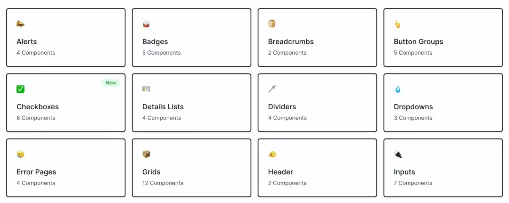

> 地址：https://github.com/markmead/hyperui

### Go 项目

9、besticon：获取网站 favicon 图标的服务。该服务使用 Go 语言编写，用于获取目标网站 favicon.ico 地址。它特别适用于导航类网站，因为它可以很方便地从源站点上获取图标，即使在找不到图标的情况下，也会返回一个站点名称首字母的灰色图标。来自 @Liang INX 的分享

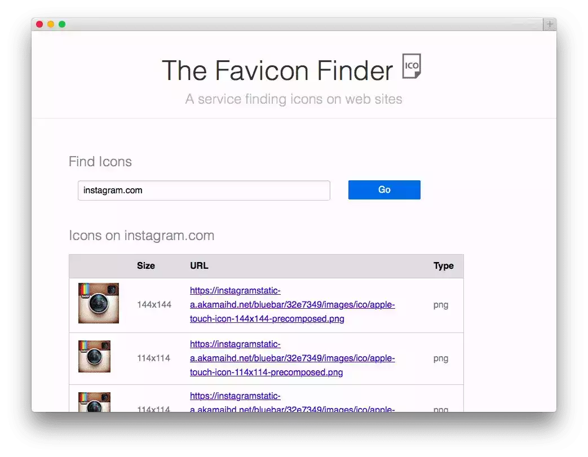

> 地址：https://github.com/mat/besticon

10、decimal：解决小数精度问题的 Go 库。该项目旨在解决浮点数类型在计算过程中，可能出现的精度丢失问题。它提供了一个名为 Decimal 的数据类型，支持常见的加法、减法、乘法和除法运算，保证结果不会丢失精度，同时还提供了四舍五入、取整和序列化等功能。

```plain
package main

import (
 "fmt"
 "github.com/shopspring/decimal"
)

func main() {
 price, err := decimal.NewFromString("136.02")
 if err != nil {
  panic(err)
 }

 quantity := decimal.NewFromInt(3)

 fee, _ := decimal.NewFromString(".035")
 taxRate, _ := decimal.NewFromString(".08875")

 subtotal := price.Mul(quantity)

 preTax := subtotal.Mul(fee.Add(decimal.NewFromFloat(1)))

 total := preTax.Mul(taxRate.Add(decimal.NewFromFloat(1)))

 fmt.Println("Subtotal:", subtotal)                      // Subtotal: 408.06
 fmt.Println("Pre-tax:", preTax)                         // Pre-tax: 422.3421
 fmt.Println("Taxes:", total.Sub(preTax))                // Taxes: 37.482861375
 fmt.Println("Total:", total)                            // Total: 459.824961375
 fmt.Println("Tax rate:", total.Sub(preTax).Div(preTax)) // Tax rate: 0.08875
}
```

> 地址：https://github.com/shopspring/decimal

11、gocv：基于 OpenCV 的 Go 语言计算机视觉库。OpenCV 是一个开源、跨平台的计算机视觉库，多用于做图像处理、视频采集和分析。该项目是 OpenCV 的 Go 语言封装库，让开发者可以使用 Go 语言调用 OpenCV 库，具有支持多平台、OpenCV 4+ 和 GPU 硬件加速等特性。

```plain
package main

import (
 "gocv.io/x/gocv"
)

func main() {
 // 打开摄像头
 webcam, _ := gocv.OpenVideoCapture(0)
 // 新建 GUI 窗口
 window := gocv.NewWindow("Hello")
 img := gocv.NewMat()
 // 显示视频
 for {
  webcam.Read(&img)
  window.IMShow(img)
  window.WaitKey(1)
 }
}
```

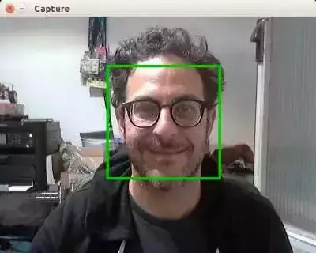

> 地址：https://github.com/hybridgroup/gocv

12、goreleaser：快速、优雅地发布 Go 应用。这是一个 Go 项目打包、签名和发布的工具，支持自动发布到 GitHub、GitLab 和 Gitea 平台、创建 Docker 镜像、Linux 软件包和 Homebrew 等功能，可在本地运行也支持 CI/CD 系统，但免费版不支持构建 macOS 和 Windows 安装包。


> 地址：https://github.com/goreleaser/goreleaser

13、termdash：一个跨平台、可定制的终端仪表盘。该项目提供了丰富的终端小部件，如按钮、进度条、图表等，可用于创建各种交互式终端工具。它支持 UTF-8 编码、鼠标事件和自定义布局等功能，能够快速构建出拥有好看界面的终端应用。

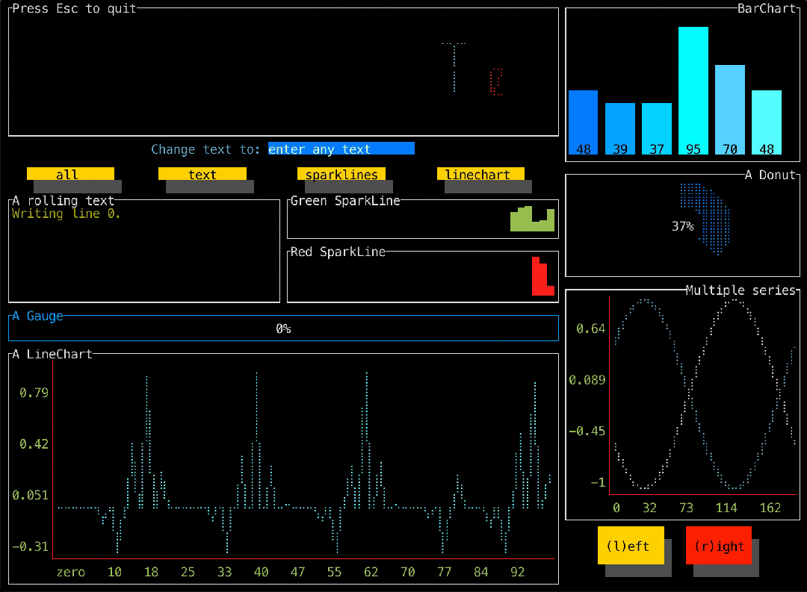

> 地址：https://github.com/mum4k/termdash

### Java 项目

14、winlator：在 Android 上运行 Windows 游戏的模拟器。这是一个 Android 应用，可以让你使用 Wine 和 Box86/Box64 来运行 Windows 应用和游戏，实现在手机上畅玩各种经典的 PC 游戏。

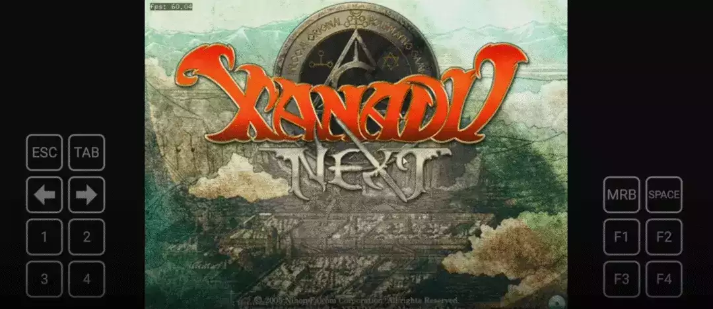

> 地址：https://github.com/brunodev85/winlator

### JavaScript 项目

15、excalidraw：手绘风格的白板 Web 应用。这是一款完全免费、开源的基于无限画布的白板 Web 应用，用户可以在上面创建手绘风格的作品。支持包括中文在内的多种语言，提供了自由绘制、多种工具、导出 PNG、实时协作、共享链接、自动保存等功能。

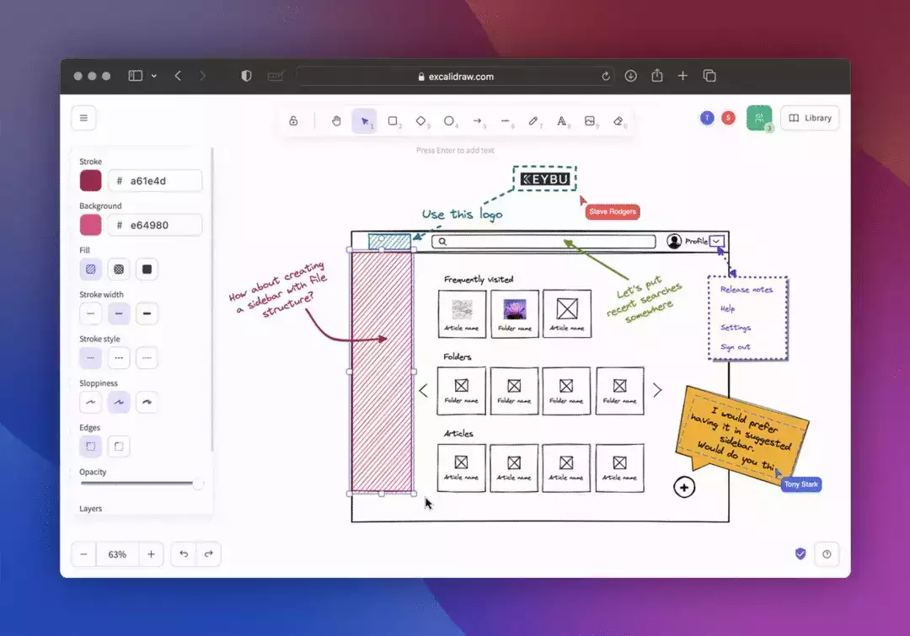

> 地址：https://github.com/excalidraw/excalidraw

16、jsoneditor：在线的 JSON 编辑器。该项目是一个基于 Web 的 JSON 编辑器，可用于查看、编辑、格式化和验证 JSON。它支持树形编辑器、代码编辑器和纯文本等模式，不仅可以直接在线使用，还可作为组件集成到项目中。

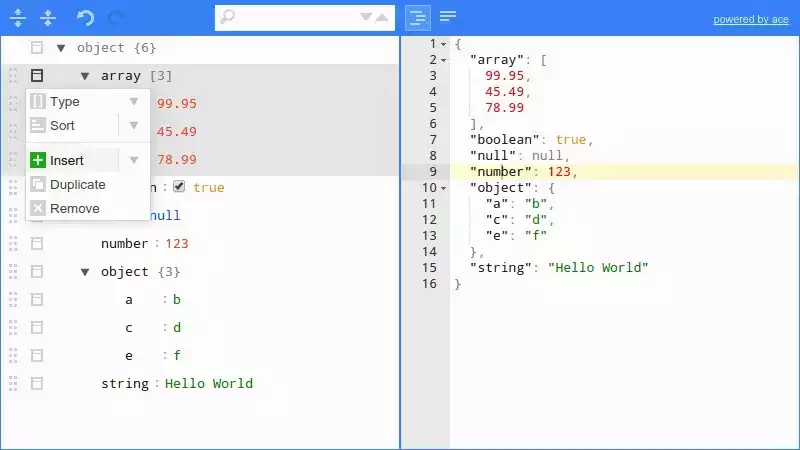

> 地址：https://github.com/josdejong/jsoneditor

17、reactjs-interview-questions：前端面试 React 高频问题和答案。该项目涵盖了一系列 React 相关的面试问题和答案，内容涉及基础知识、组件、状态管理、生命周期以及性能优化等方面。

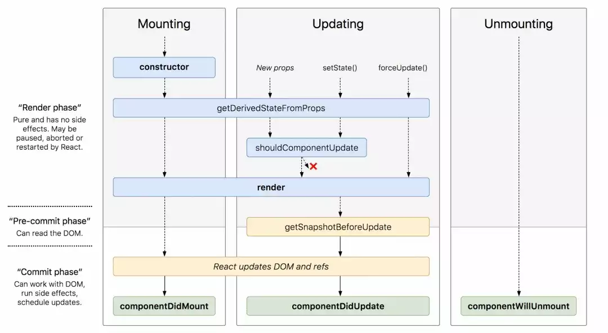

> 地址：https://github.com/sudheerj/reactjs-interview-questions

18、super-productivity：一款先进的待办事项列表应用。超级生产力是一款用 TypeScript 开发的高级 TODO 应用，旨在帮助用户规划任务和管理待办事项，培养健康高效的习惯。它开源、免费、无需注册，支持与 Jira、GitHub、GitLab 等第三方平台集成，可即时收到任务变动的通知。除了可在线使用的 Web 网页版，还提供了 Windows、Linux、macOS、iOS 和 Android 客户端。

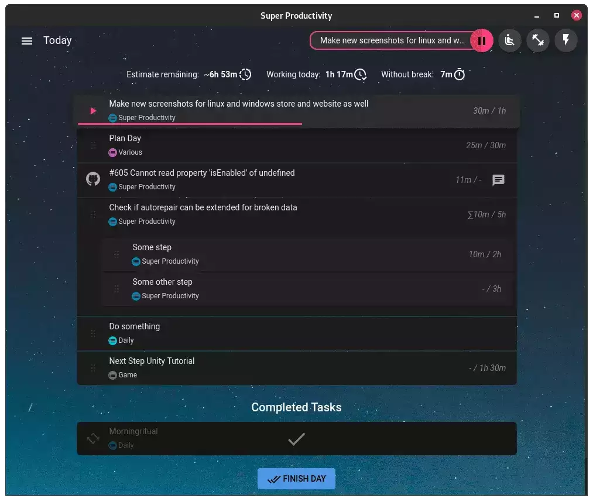

> 地址：https://github.com/johannesjo/super-productivity

19、tsparticles：立刻给网站安排上动画背景的库。该项目可用于创建高度可定制的 JavaScript 粒子效果，比如雪花、彩带和烟花效果等。虽然它是一个独立库、不依赖其他库或框架，但项目内提供了 React、Vue、Angular、Svelte、jQuery 等框架的现成组件，以便于快速集成到项目中。

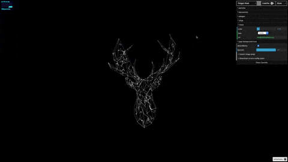

> 地址：https://github.com/tsparticles/tsparticles

### Kotlin 项目

20、MaterialFiles：一款开源的 Android 文件管理器。该项目是一个安卓文件管理器，采用 Kotlin 开发，并遵循 Material Design 设计规范。它轻量、简洁并且安全，支持 root 权限查看和管理文件、压缩/解压文件、远程查看服务器上的文件等功能，适用于 Android 5.0+ 系统。


> 地址：https://github.com/zhanghai/MaterialFiles

### Python 项目

21、cachetools：实用的 Python 缓存装饰器。这是一个 Python 的缓存库，它提供了多种缓存算法的数据类型和 Python 标准库的 @lru\_cache 函数装饰器的变种，该库适用于避免重复计算、加速结果返回以及减少重复请求等场景。

```plain
from cachetools import cached, LRUCache, TTLCache

# speed up calculating Fibonacci numbers with dynamic programming
@cached(cache={})
def fib(n):
    return n if n < 2 else fib(n - 1) + fib(n - 2)

# cache least recently used Python Enhancement Proposals
@cached(cache=LRUCache(maxsize=32))
def get_pep(num):
    url = 'http://www.python.org/dev/peps/pep-%04d/' % num
    with urllib.request.urlopen(url) as s:
        return s.read()

# cache weather data for no longer than ten minutes
@cached(cache=TTLCache(maxsize=1024, ttl=600))
def get_weather(place):
    return owm.weather_at_place(place).get_weather()
```

> 地址：https://github.com/tkem/cachetools

22、Ciphey：自动解密/解码和破解各种加密算法的工具。使用该项目时，你只需输入加密的文本，无需提供具体的加密类型，它就可以在 3 秒或更短的时间内自动解密大多数的加密文本。这个项目支持 30 多种常见的加密方式，包括二进制、base64、哈希等。

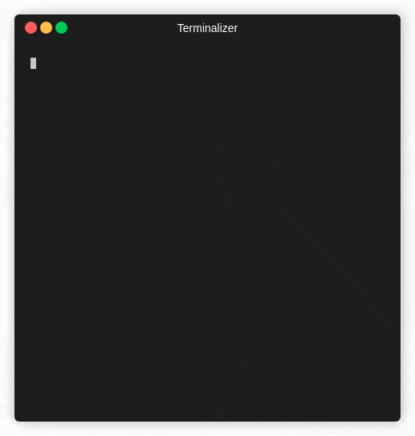

> 地址：https://github.com/Ciphey/Ciphey

23、music-tag-web：编辑歌曲文件元数据的 Web 应用。这款音乐标签编辑器提供了编辑歌曲标题、专辑、艺术家、歌词、封面等信息的功能。它支持多种音频格式，包括 FLAC、APE、WAV、AIFF、MP3 和 MP4 等。此外，它还提供了自动批量修改和整理音乐文件、歌词翻译、手机端访问等实用功能。来自 @xier 的分享

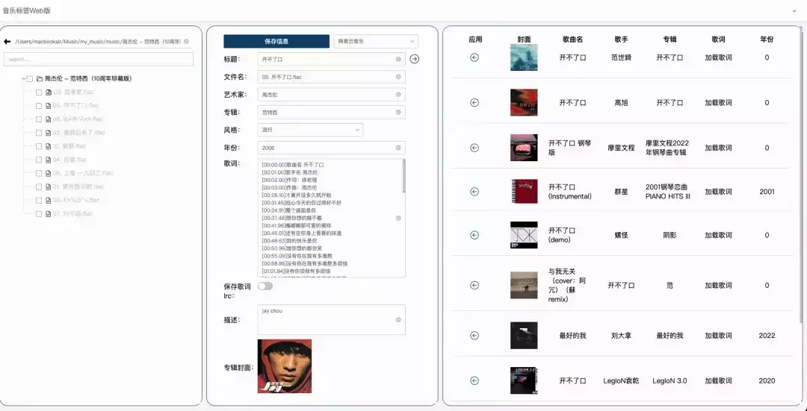

> 地址：https://github.com/xhongc/music-tag-web

24、sqlite-web：基于 Web 的 SQLite 数据库管理工具。这是一个用 Flask 和 peewee 编写的 SQLite 数据库 Web 管理平台。它安装简单、启动也非常方便。该项目提供了一个简单易用的界面，以及实用的 SQLite 数据管理功能，包括创建/删除表、索引、数据导入/导出、排序、SQL 查询等功能。

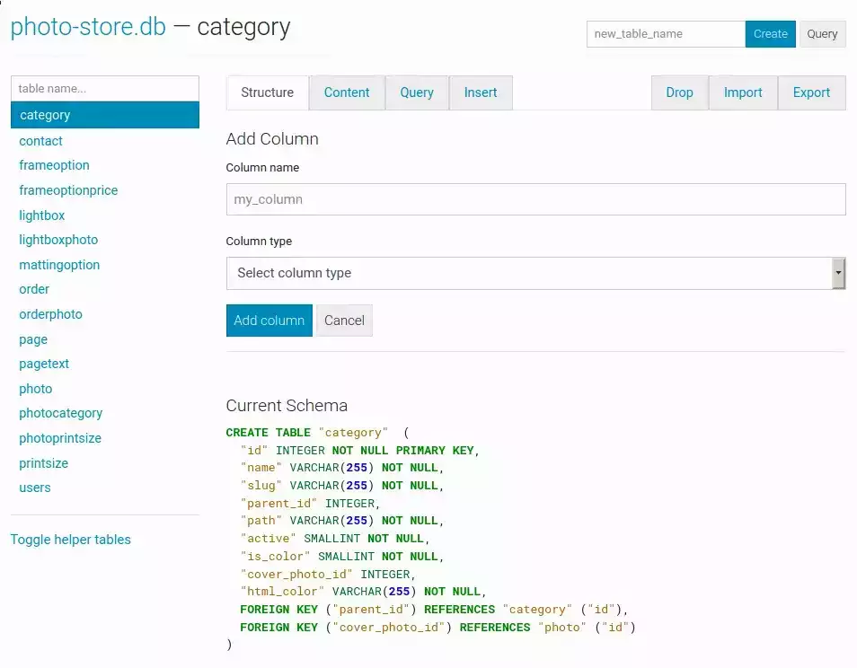

> 地址：https://github.com/coleifer/sqlite-web

25、toolong：好用的终端日志文件处理工具。这是一个用于查看、追踪、合并和搜索，日志/JSON 长文件的命令行工具。它提供了高亮显示和实时追踪日志的功能，支持快速打开 GB 级的文件，并能根据时间戳自动合并日志文件。

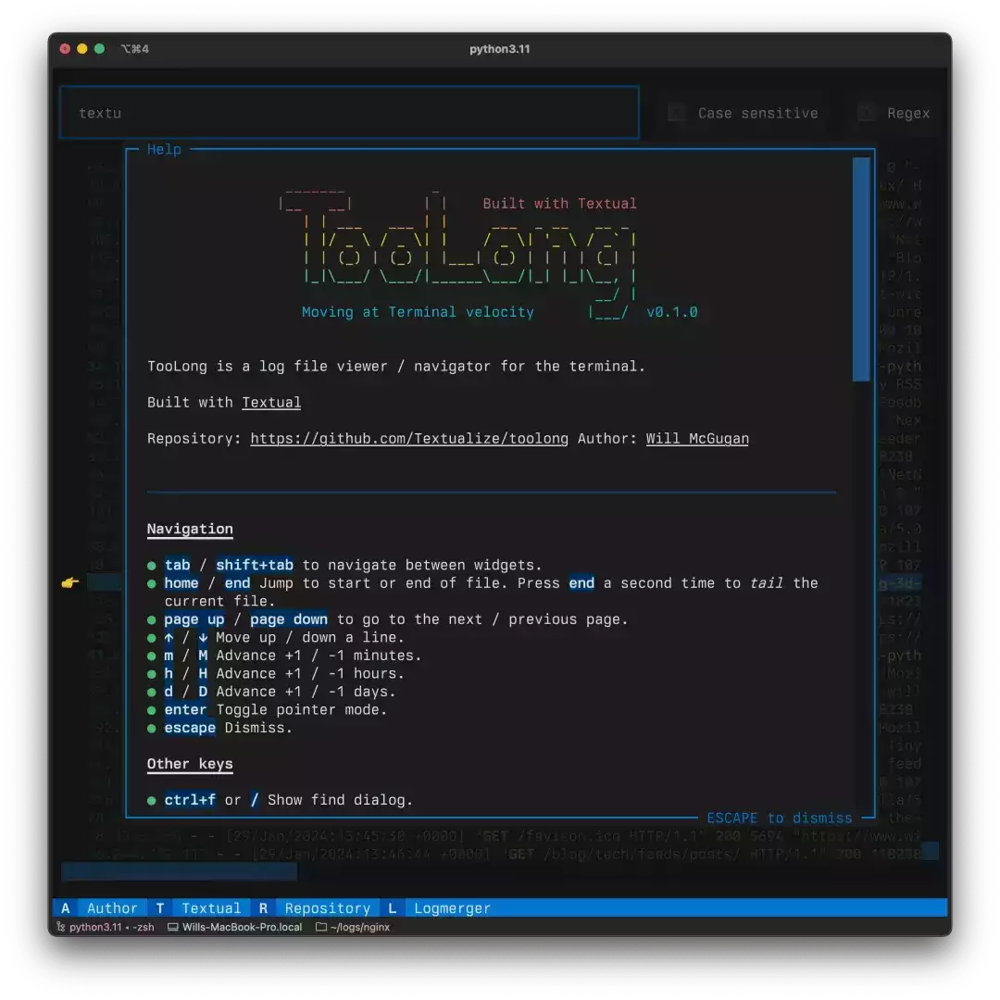

> 地址：https://github.com/Textualize/toolong

### Ruby 项目

26、judge0：开源的在线代码执行系统。该项目是用 Ruby 开发的在线代码执行系统，它安装简单、功能强大，支持 60 多种编程语言，可以设置代码执行时间和内存限制，并提供详细的执行结果，包括编译错误、运行错误和输出结果等信息。可用于构建竞赛编程、在线代码编辑和面试等平台。

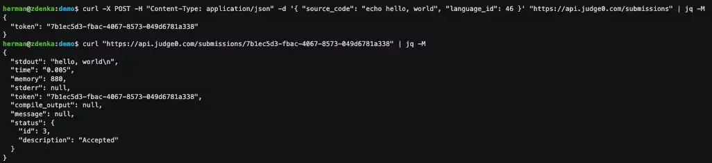

> 地址：https://github.com/judge0/judge0

### Rust 项目

27、czkawka：多功能文件清理工具。该项目是用 Rust 编写的，用于查找和清理重复文件、空文件夹以及相似图片等文件。它免费、开源且无广告，具有快速、跨平台和多语言等特点。使用这个工具，可以轻松地清理电脑上的无用文件，释放电脑的存储空间。


> 地址：https://github.com/qarmin/czkawka

28、meilisearch：一款轻量级的 Rust 搜索引擎。该项目是采用 Rust 编写的轻量且快速的搜索引擎。它具有开箱即用、易于维护和搜索速度快等特点，提供了实时搜索、容错纠正、排序、同义词等功能，支持包括中文在内等的多种语言。

```plain
client = meilisearch.Client('http://localhost:7700', 'masterKey')

client.index('movies').add_documents([
  { 'id': 1, 'title': 'Carol' },
  { 'id': 2, 'title': 'Wonder Woman' },
  { 'id': 3, 'title': 'Life of Pi' },
  { 'id': 4, 'title': 'Mad Max: Fury Road' },
  { 'id': 5, 'title': 'Moana' },
  { 'id': 6, 'title': 'Philadelphia'}
])
```


> 地址：https://github.com/meilisearch/meilisearch

29、MessAuto：Mac 上的自动提取短信和邮箱验证码工具。这款软件是采用 Rust 开发的，专为 macOS 平台设计的自动提取短信和邮箱验证码到剪贴板的工具。它具有免费、小巧、适用于任何应用的特点，其工作原理是监听邮件（Mail）和短信（iMessage）应用程序的消息，自动提取消息中的验证码，并将其存储到剪贴板中，运行后只有一个安静的任务栏托盘图标。

> 地址：https://github.com/LeeeSe/MessAuto

### Swift 项目

30、Minesweeper-Desktop：macOS 桌面版扫雷游戏。该项目是一个用 Swift 开发的 macOS 扫雷游戏，它提供了原汁原味的扫雷体验，保留了经典的外观、自定义玩法和操控方式。来自 @孤胆枪手 的分享


> 地址：https://github.com/cameron-goddard/Minesweeper-Desktop

31、Rectangle：macOS 上的窗口管理工具。该项目是 Swift 编写的窗口管理工具，基于 Spectacle 实现。它可通过键盘快捷键在 macOS 上快速移动窗口和调整窗口大小，适用于 macOS 10.15+、Intel 和 Apple 芯片。

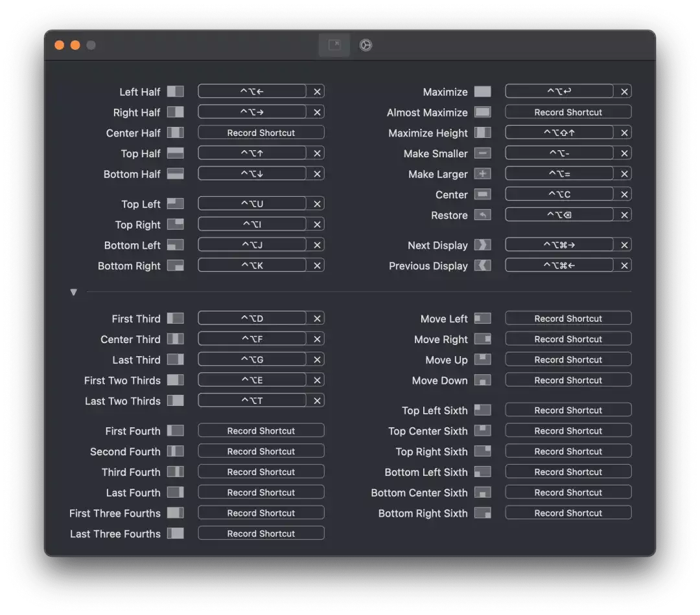

> 地址：https://github.com/rxhanson/Rectangle

### 其它

32、CorsixTH：主题医院游戏开源复刻版。该项目是采用 Lua 和 C++ 重新制作的经典模拟经营游戏《主题医院》，它在保留了原游戏经典玩法的基础上，增加了对现代操作系统（Windows、Linux 和 macOS）、中文语言以及高分辨率的支持。需要注意的是安装游戏后，无法立即运行，因为游戏的数据需要单独下载。


> 地址：https://github.com/CorsixTH/CorsixTH

33、foc-wheel-legged-robot：一个新型结构的双轮腿机器人。该项目包含了制作这款机器人所需的全部资料，包括机械结构设计、电子硬件、算法仿真和源码等，制作的物料成本在 700 元左右。


> 地址：https://github.com/Skythinker616/foc-wheel-legged-robot

34、h5player：网页播放器增强插件。这是一款浏览器插件，支持网页视频倍速/加速播放、截图、画中画、直播同步和下载等功能，适用于国外各大主流视频网站。

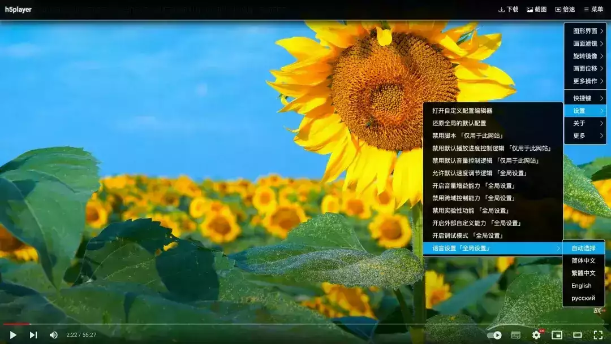

> 地址：https://github.com/xxxily/h5player

35、system-design-101：图文并茂的系统设计入门教程。该项目通过通俗易懂的文字和简洁明了的示意图，讲解系统设计的基础知识以及深层的工作原理的入门级教程。无论你是初学者还是准备面试的程序员，在这里都能有所收获。

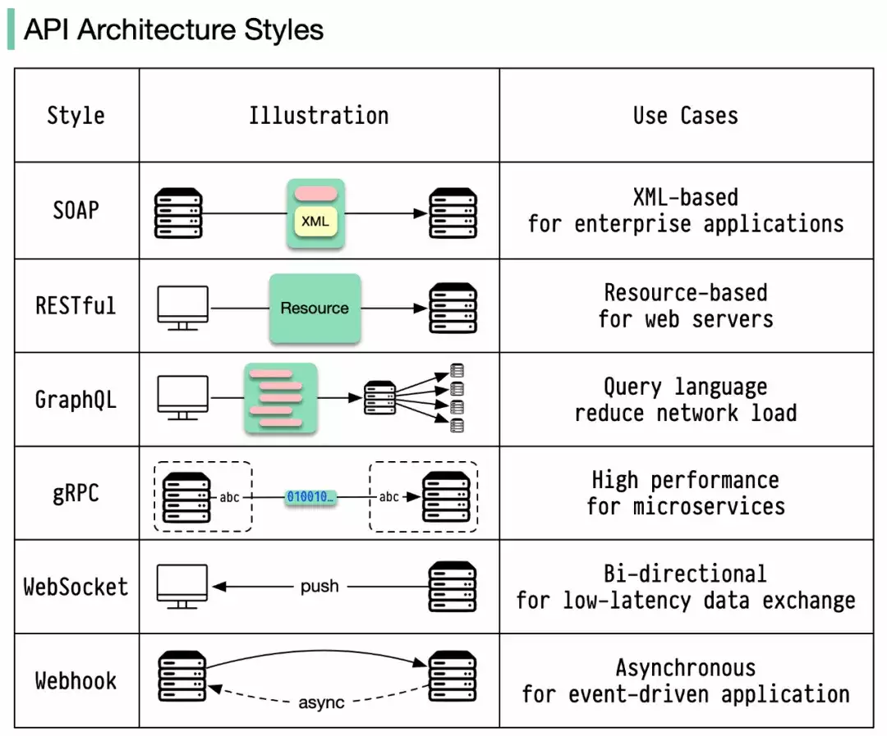

> 地址：https://github.com/ByteByteGoHq/system-design-101

36、wsl2-distro-manager：WSL 发行版图形管理工具。该项目是一个基于 Flutter 开发的 WSL 管理小工具，它提供了一个友好的图形化界面，让用户可以轻松配置、复制或转换 WSL 实例，免去了繁琐的命令操作。特别适合新手使用，不用再担心把 WSL 折腾坏了。来自 @mtig 的分享


> 地址：https://github.com/bostrot/wsl2-distro-manager

### 开源书籍

37、Hypervisor-From-Scratch：《从零创建虚拟机管理程序》。该项目提供了一个从头开始构建虚拟机监控程序的教程，内容涵盖基本概念、硬件虚拟化的技术细节以及源码等方面。帮助开发者了解虚拟机的工作原理，并一步步构建自己的虚拟机监控程序。

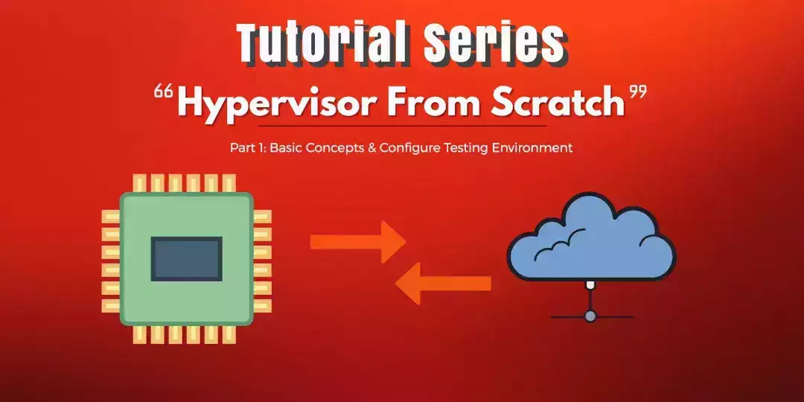

> 地址：https://github.com/SinaKarvandi/Hypervisor-From-Scratch

### 机器学习

38、llm-viz：3D 可视化 GPT 大语言模型。该项目通过 3D 可视化的方式，演示了类似 GPT 的大语言模型的工作原理和推理过程。

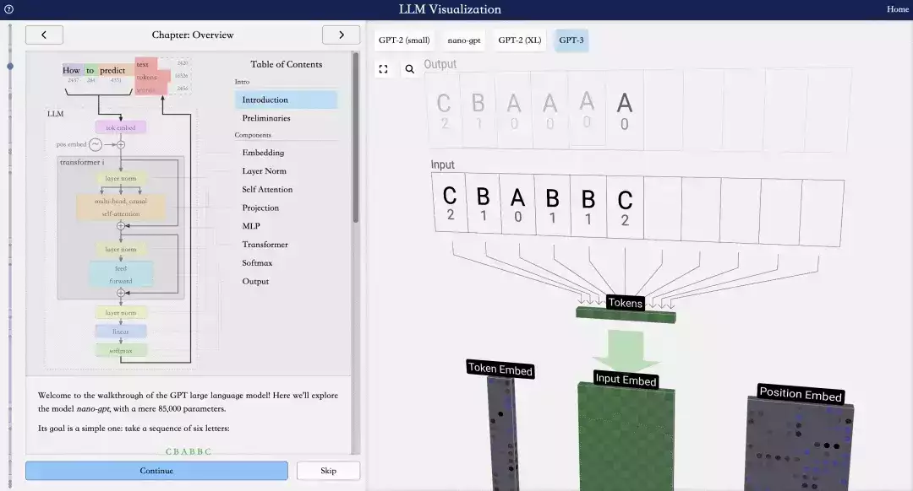

> 地址：https://github.com/bbycroft/llm-viz

39、nn-zero-to-hero：从零到神经网络高手。这是一门从基础开始的神经网络课程，包含视频、练习和配套源码，帮助初学者初逐步掌握神经网络的基本概念，并通过实例代码来加深理解。

> 地址：https://github.com/karpathy/nn-zero-to-hero

40、pandas-ai：数据分析对话化的开源库。该项目将 AIGC 和数据分析相结合，让用户可以通过自然语言向自己的数据进行提问，并获得相应的回答。首先，需要将数据以 pandas 的方式进行导入，然后配置好 OpenAI TOKEN 就可以开始通过对话和绘制图表等方式与数据进行交互，而无需编写代码。

```plain
import pandas as pd
from pandasai import SmartDataframe

# Sample DataFrame
df = pd.DataFrame({
    "country": ["United States", "United Kingdom", "France", "Germany", "Italy", "Spain", "Canada", "Australia", "Japan", "China"],
    "gdp": [19294482071552, 2891615567872, 2411255037952, 3435817336832, 1745433788416, 1181205135360, 1607402389504, 1490967855104, 4380756541440, 14631844184064],
    "happiness_index": [6.94, 7.16, 6.66, 7.07, 6.38, 6.4, 7.23, 7.22, 5.87, 5.12]
})

# Instantiate a LLM
from pandasai.llm import OpenAI
llm = OpenAI(api_token="YOUR_API_TOKEN")

df = SmartDataframe(df, config={"llm": llm})
df.chat('Which are the 5 happiest countries?')
```

> 地址：https://github.com/Sinaptik-AI/pandas-ai

41、PhotoMaker：AI 生成各种风格人类照片的工具。该项目可以通过上传的人物照片，生成任意风格的人物图像，如写实、卡通、艺术等风格，可用于生成别具一格的头像。


> 地址：https://github.com/TencentARC/PhotoMaker

## 最后

感谢参与分享开源项目的小伙伴，欢迎更多的开源爱好者来 HelloGitHub 自荐/推荐开源项目。

本期有你感兴趣的开源项目吗？如果有的话就留言告诉我吧～还没看过瘾？[点击阅读](https://mp.weixin.qq.com/mp/appmsgalbum?__biz=MzA5MzYyNzQ0MQ==&action=getalbum&album_id=1331197538447310849&scene=173&from_msgid=2247511076&from_itemidx=1&count=3&nolastread=1&scene=21#wechat_redirect) 往期内容。

\- END -