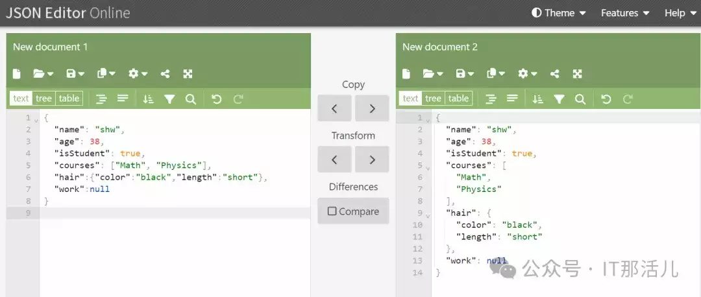
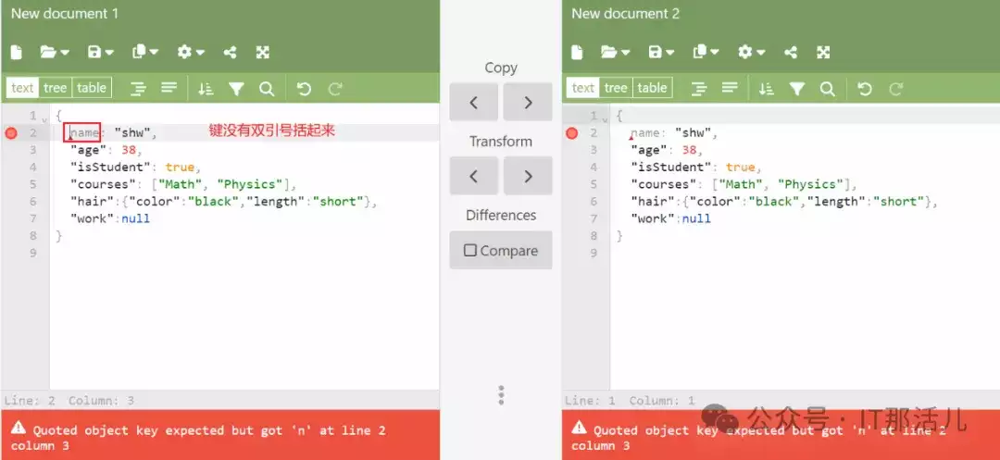
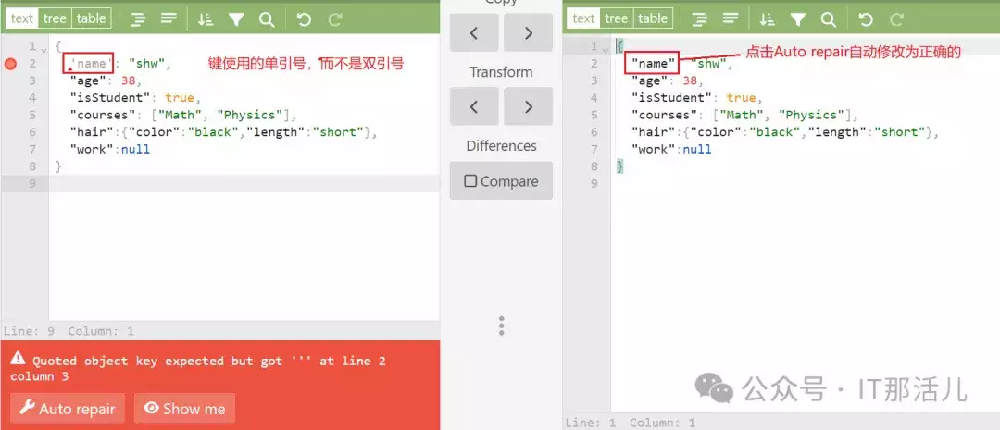

# JSON的语法与验证

  

JSON的语法与验证

不同的平台或系统之间进行数据传递，实现彼此的数据交换，需要标准的或一致的文本格式，常见的数据交换格式有XML、YAML、JSON。

当我们谈到互联网和网络通信时，JSON（全称JavaScript Object Notation为JavaScript对象表示法）是一种非常常见的数据传输格式。它是一种轻量级的数据交换格式，易于阅读和编写。JSON也被广泛应用于前端与后端之间的数据交换以及不同系统之间的数据传递。在本文中，将重点介绍JSON的语法和验证。

  

JSON语法

首先，让我们来了解一下JSON的语法。

```plain
{
  "name": "shw",
  "age": 38,
  "isStudent": true,
  "courses": ["Math", "Physics"],
  "hair":{"color":"black","length":"short"},
  "work":null
}
```

总体而言，JSON由键值对构成，一般由大括号 {} 括起来。键值对中的键和值之间使用冒号 : 分隔，不同的键值对之间使用逗号 , 分隔。

**数据类型：**

-   字符串：任何Unicode字符构成
    
    "name": "shw"
    
-   数字：整数、小数、负数或指数
    
    "age": 38
    
-   布尔值：不是真就是假，true或false，小写
    
    "isStudent": true
    
-   数组：方括号保存
    
    "courses": \["Math", "Physics"\]
    
-   对象：嵌套花括号的键值对
    
    “hair”:{“color”:”black”,”length”:”short”}
    
-   null
    
    “work”:null
    

**数据读取解析：**

-   {（左花括号）指“开始读取JSON”
    
-   }（右花括号）指“结束读取JSON”
    
-   \[（左方括号）指“开始读取数组”
    
-   \]（右方括号）指“结束读取数组”
    
-   :（冒号）指“键值对中分隔键和值”
    
-   ,（逗号）指“分隔JOSN中的键值对”或“分隔数组中的值”
    

特别需要强调的一点是，**键必须由双引号括起来，不加双引号或单引号会被认为是JavaScript对象，是不合法的JSON，验证会报错****。**

  

JSON的验证

接下来，让我们来谈谈JSON的验证。在实际开发中，我们需要确保生成的JSON数据是符合JSON格式规范的，以便于正确地解析和处理。为了验证JSON数据的有效性，我们通常可以采用一些工具或方法。

一种常用的验证方法是利用现有的JSON解析库来尝试解析JSON字符串，如果解析成功，则表明该JSON数据是有效的；否则，会抛出解析异常，表明该JSON数据存在格式错误。另外，也可以利用一些在线的JSON验证工具，将JSON数据粘贴进去进行验证，以便快速发现JSON格式的问题。

在此推荐一个在线验证工具：https://jsoneditoronline.org/，集验证、格式化和可视化于一身的JSON工具，如下：



错误的示例：





总的来说，JSON作为一种轻量级的数据交换格式，在实际应用中扮演着非常重要的角色。

熟悉JSON的语法规范和验证方法，能够帮助我们更好地处理和传输数据，确保数据的正确性和安全性。在使用的时候一定要注意，确保其符合JSON格式规范，避免出现解析错误和数据传输问题。