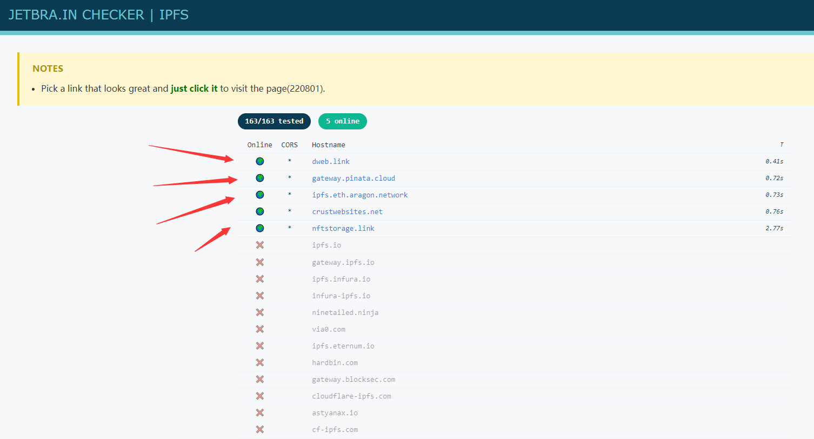

# 

[↓↓↓](https://www.cnblogs.com/wjsqqj/p/17735968.html)  
  
Jetbrains 全家桶激活  
  
[↑↑↑](https://www.cnblogs.com/wjsqqj/p/17735968.html)

## 包括 idea,clion,pycharm,datagrip 等软件

- - -

1\. 打开网站 [https://jetbra.in/s](https://jetbra.in/s) （如果打不开，就用手机开热点或者自己 XX 上网）

2\. 打开网站后，选择状态为 Online 的网址，并点击进去（如图所示）

3\. 点击网页上边的这个地方，随后会让下载一个压缩包  

4\. 解压刚才下载的压缩包 到一个文件夹里，最好自己建立一个文件夹，这个文件夹里的文件不能删除，删除了的话，激活就会失效.（如图为解压后的文件夹）

5\. 打开 scripts 文件夹，并双击 install-current-user.vbs 这个文件，然后等待，大约十秒左右，会出现成功的提示框。

6\. 回到刚才的网址，找到你要激活的软件，在下半部分点击左键就可以自动复制激活码  

7\. 打开电脑上要激活的软件，点击如图所示的按钮，粘贴刚刚复制的激活码，点击激活，即可激活

  

## 注意：如果已经激活过 Jetbrain 系列的其中一个软件，再下载其他 Jetbrain 软件的时候，只需要执行第六步之后的操作
