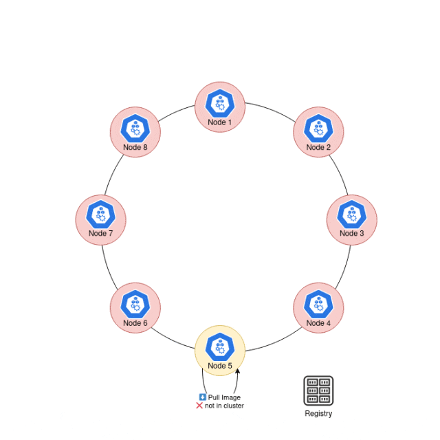
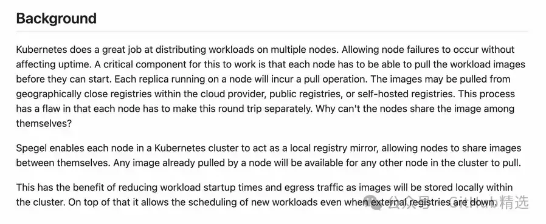
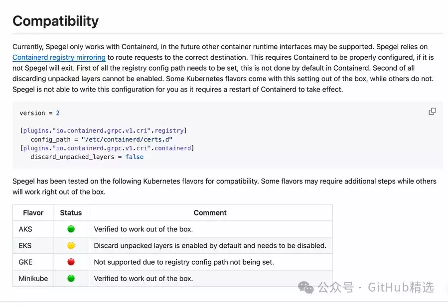
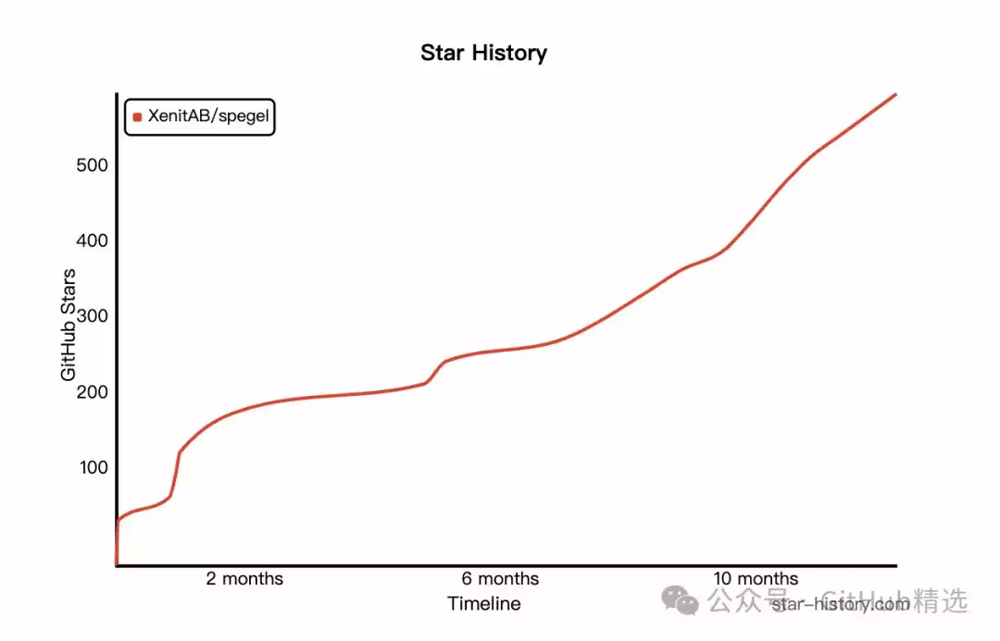

# K8S 镜像拉取速度慢？看这里

背景介绍

在使用 Kubernetes 的过程中，每个节点在启动前都需要拉取工作负载的镜像，而运行在每个节点上的每个工作负载的副本都将会产生一个类似的镜像拉取操作。而这些镜像无论是从地理范围内靠近的云镜像服务还是公共的镜像服务，或自搭建的私有镜像服务，镜像的拉取都存在一定的跨网络访问的开销，会直接影响工作负载的启动速度，同时也增加了各节点之间的网络压力。




#### 项目介绍

Spegel，瑞典语中的“镜子”，作为一个无状态的集群本地 OCI 注册表镜像，解决了以上问题。Spegel 的主要功能是允许 Kubernetes 集群中的每个节点充当本地注册表镜像，这样节点之间就可以共享镜像。任何一个节点已经拉取的图像，其他节点都可以直接拉取。这样既能够减少工作负载启动时间，又减少了出口流量，因为镜像将存储在本地集群中。另外，即使外部镜像服务关闭或故障，新创建的工作负载也能够继续被拉取到，提升了集群的容灾能力。



#### 如何使用

在安装 Spegel 之前，你可以先查看项目中的兼容性指南（./docs/COMPATIBILITY.md）



确认 Spegel 适用于你的 Kubernetes 集群。如果一切正常，最方便的部署 Spegel 的方式就是使用 Helm。

```plain
helm upgrade
--
create
-
namespace

--
namespace
 spegel
--
install
--
version v0
.
0.16
 spegel oci
:
//ghcr.io/xenitab/helm-charts/spegel
```

想了解更多细节的配置文件，可以参考 Helm Chart（./charts/spegel）。

#### 项目推介

无论是你想要从本地缓存镜像，还是抵抗外部镜像服务停工时的集群失败，或者是避免从外部镜像服务拉取图像时的频繁限制，甚至在边缘节点部署时提高镜像拉取的效率，Spegel 都是你可以尝试的方案。

以下是该项目 Star 趋势图（代表项目的活跃程度）：



更多项目详情请查看如下链接。

开源项目地址：https://github.com/XenitAB/spegel

开源项目作者：XenitAB

以下是参与项目建设的所有成员：