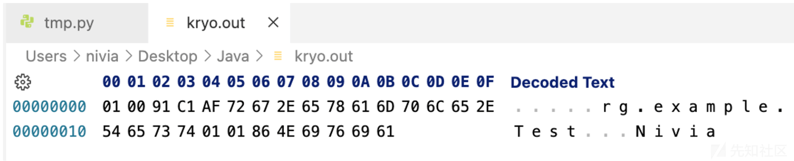
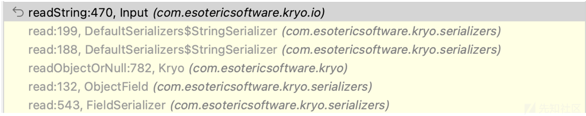
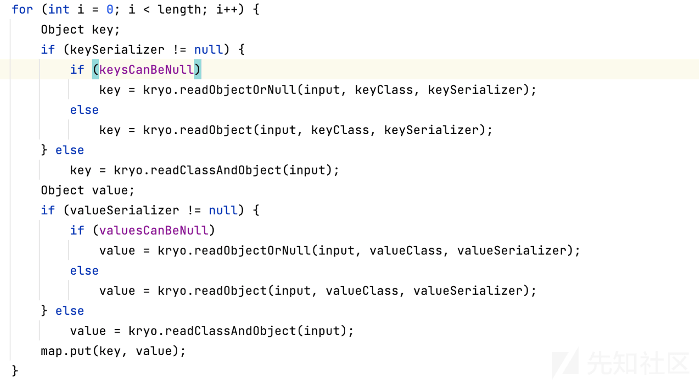

# Kryo-UTF8-Overlong-Encoding

### 前言

学了 1ue 和 phith0n 师傅介绍的知识点，让我受益匪浅。Java 的原生反序列化是从 IO 流中读出对象的过程，除了 Java 原生的反序列化以外，kryo 的反序列化也是从 IO 流中去读取对象，那么 kryo 会不会也存在相关的混淆方案呢

kryo 提供了三种方法来反序列化，分别是：readObject、readObjectOrNull、readClassAndObject，其中 readObject 跟 readObjectOrNull 都需要绑定一个 Class 对象作为反序列化还原的对象，而 readClassAndObject 则是从 IO 流中获取对象，那么这里主要跟进 readClassAndObject 进行分析

```plain
Kryo kryo = new Kryo();
Input input = new Input(new FileInputStream("kryo.out"));
Test test = (Test)kryo.readClassAndObject(input);
input.close();
```

一个 demo

```plain
package org.example;

import java.io.Serializable;

public class Test implements Serializable {
    public String name = "Nivia";
    transient String id = "abc";

    public String getName() {
        return name;
    }
}
```

### UTF-8 模式下的 IO 流写入流程

数据写入时，获取类名的调用栈

[](https://xzfile.aliyuncs.com/media/upload/picture/20240318195614-855d84cc-e51e-1.png)

writeString 方法

```plain
public void writeString (String value) throws KryoException {
        if (value == null) {
            writeByte(0x80); // 0 means null, bit 8 means UTF8.
            return;
        }
        int charCount = value.length();
        if (charCount == 0) {
            writeByte(1 | 0x80); // 1 means empty string, bit 8 means UTF8.
            return;
        }
        // Detect ASCII.
        boolean ascii = false;
        if (charCount > 1 && charCount < 64) {
            ascii = true;
            for (int i = 0; i < charCount; i++) {
                int c = value.charAt(i);
                if (c > 127) {
                    ascii = false;
                    break;
                }
            }
        }
        if (ascii) {
            if (capacity - position < charCount)
                writeAscii_slow(value, charCount);
            else {
                value.getBytes(0, charCount, buffer, position);
                position += charCount;
            }
            buffer[position - 1] |= 0x80;
        } else {
            writeUtf8Length(charCount + 1);
            int charIndex = 0;
            if (capacity - position >= charCount) {
                // Try to write 8 bit chars.
                byte[] buffer = this.buffer;
                int position = this.position;
                for (; charIndex < charCount; charIndex++) {
                    int c = value.charAt(charIndex);
                    if (c > 127) break;
                    buffer[position++] = (byte)c;
                }
                this.position = position;
            }
            if (charIndex < charCount) writeString_slow(value, charCount, charIndex);
        }
    }
```

形参 value 为类名，只要类名中全是 ascii 字符就走 ascii 字符处理，否则尝试走 UTF-8 处理模式

这里有个坑点，就是纯 ASCII 和 UTF-8 模式的数据写入是存在差异的，不是直接修改就能成功，为了了解 UTF-8 处理模式，我这里重写了源码，让 if 语句中的 ascii 布尔值进行了取反

[](https://xzfile.aliyuncs.com/media/upload/picture/20240318195635-91fe00a8-e51e-1.png)

先是调用 writeUtf8Length 方法，方法将指定的 UTF-8 长度写入到 IO 流

然后遍历类名，当发现不是 ascii 字符会 break

[](https://xzfile.aliyuncs.com/media/upload/picture/20240318195652-9c00d030-e51e-1.png)

如果出现 break 情况，就会调用 writeString\_slow 方法

[](https://xzfile.aliyuncs.com/media/upload/picture/20240318195710-a70ba11c-e51e-1.png)

方法就是 unicode 码转换成 UTF-8 编码的原理

### UTF-8 模式下的 IO 流读取

按照 Overlong Encoding 的原理，对 IO 流数据进行替换

[](https://xzfile.aliyuncs.com/media/upload/picture/20240318195817-ce9fc32a-e51e-1.png)

然后调试一下反序列化的过程，相关调用栈

[](https://xzfile.aliyuncs.com/media/upload/picture/20240318195833-d84dbb84-e51e-1.png)

在 Input#readString 方法中

[](https://xzfile.aliyuncs.com/media/upload/picture/20240318195846-dfbd4718-e51e-1.png)

如果是正常的 ascii 序列化，buffer 记录完 classid 后就直接存储类名了，而 UTF-8 会先记录 UTF-8 的长度。而在反序列化阶段，kryo 用这个差异判断进行哪种模式的反序列化

readUtf8Length 方法读取出长度，主要处理逻辑在 readUtf8 方法

[](https://xzfile.aliyuncs.com/media/upload/picture/20240318195946-03da0474-e51f-1.png)

如果发现是 Overlong Encoding 的情况，会调用 readUtf8\_slow 方法

```plain
private void readUtf8_slow (int charCount, int charIndex) {
        char[] chars = this.chars;
        byte[] buffer = this.buffer;
        while (charIndex < charCount) {
            if (position == limit) require(1);
            int b = buffer[position++] & 0xFF;
            switch (b >> 4) {
            case 0:
            case 1:
            case 2:
            case 3:
            case 4:
            case 5:
            case 6:
            case 7:
                chars[charIndex] = (char)b;
                break;
            case 12:
            case 13:
                if (position == limit) require(1);
                chars[charIndex] = (char)((b & 0x1F) << 6 | buffer[position++] & 0x3F);
                break;
            case 14:
                require(2);
                chars[charIndex] = (char)((b & 0x0F) << 12 | (buffer[position++] & 0x3F) << 6 | buffer[position++] & 0x3F);
                break;
            }
            charIndex++;
        }
    }
```

跟 UTF8-Overlong-Encoding 的原理就一样啦

### 混淆属性

除了类名我们还能混淆什么？

相关存在混淆的方法都位于 Input 的类下，除了 readString 方法以外还有 readStringBuilder，跟其对应的就是相关的 Output#write 方法，只要经过相关 write 方法处理并加进了序列化 IO 流，就应该可以实现 IO 流混淆

获取完类名以后，会通过对象类型获取序列化器，在一系列的 Serializer#read 方法还原对象后去还原属性，可以简单去序列化器里面进行一些搜索，这里只收集了部分有价值的

混淆字符串类型的变量，相关调用栈

[](https://xzfile.aliyuncs.com/media/upload/picture/20240318200001-0cd2e0aa-e51f-1.png)

混淆 Class 类型的变量

[](https://xzfile.aliyuncs.com/media/upload/picture/20240318200033-1f83dc72-e51f-1.png)

在 DefaultSerializers 中，更多的还有 StringBuffer 和 StringBuilder、Charset、URL

其他序列化器：

-   DefaultArraySerializer
    
    存放允许混淆的类型时
    

[](https://xzfile.aliyuncs.com/media/upload/picture/20240318200045-271d45cc-e51f-1.png)

-   MapSerializer
    
    key、value 是允许混淆的类型时
    

[](https://xzfile.aliyuncs.com/media/upload/picture/20240318200100-3025d724-e51f-1.png)

等等

### 混淆实现

其实这里很简单，重写 Output 源码，让数据写入 IO 流的操作全走 writeString\_slow 方法

[](https://xzfile.aliyuncs.com/media/upload/picture/20240318200224-61cafb92-e51f-1.png)

分别对应着 1、3、2 字节的写入方法，然后注释掉 1、3 字节写入的部分就能实现数据混淆

混淆前后对比

[](https://xzfile.aliyuncs.com/media/upload/picture/20240318200233-67970336-e51f-1.png)

### 更近一步

同样 kryo 支持 Java 原生反序列化，Java 原生反序列化也同样存在 Overlong Encoding 的混淆方法，具体实现可以重写 JavaSerializer 序列化器 write 方法下的源码，替换掉 ObjectOutputStream 对象即可

### 数据流转换

```plain
FileOutputStream barr = new FileOutputStream("kryo.out");
Output output = new Output(barr);
kryo.writeClassAndObject(output, test);
output.close();
```

用户自行生成的序列化数据，是以 ascii 模式生成，能否实现从 ascii 流转换成 UTF-8 形式的流

UTF-8 形式

[](https://xzfile.aliyuncs.com/media/upload/picture/20240318200257-75c5af8e-e51f-1.png)

ASCII 形式

[](https://xzfile.aliyuncs.com/media/upload/picture/20240318200310-7d34e924-e51f-1.png)

原理也很简单，还原最后一位字符，把 Utf8Length 写到前头就 OK 了

最后一位的操作

[](https://xzfile.aliyuncs.com/media/upload/picture/20240318195932-fb68eca6-e51e-1.png)

逆向操作

[](https://xzfile.aliyuncs.com/media/upload/picture/20240318195916-f1f01a96-e51e-1.png)

### 结语

如果文章存在错误还请师傅们指出

### 参考

<<探索 Java 反序列化绕 WAF 新姿势>>

[https://www.leavesongs.com/PENETRATION/utf-8-overlong-encoding.html](https://www.leavesongs.com/PENETRATION/utf-8-overlong-encoding.html)
