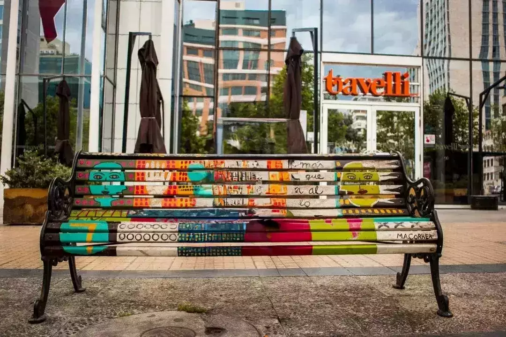

# Lama Cleaner: 一个开源图片修复神器，快速去除水印、老照片修复、文本替换样样精通

  

  
  

今天给大家推荐一个非常非常好的开源的图片修复神器。

这个开源项目叫：Lama Cleaner，基于 SOTA AI 模型构建，功能颇为齐全。

该工具是对三星研究院发布的 lama 模型进行的 2 次封装，开箱即用。免去了复杂的安装过程。本人实验过，对于一个人工智能新手来说，直接使用 lama 的教程估计几天都不一定成功。对于电脑没有显卡的也可以使用哦，启动工具的时候指定 cpu 模式就行了，具体可以查看仓库介绍。另外该仓库不仅封装了 lama 模型，还包括其它模型，比如 LDM，ZITS，可以在工具启动的时候指定使用哪个模型。该工具中还附带了 gui 工具，运行起来就可以直接使用。

代码开源、操作方便、且图片处理效果很好。同时提供了docker 部署方式，可以自己搭建一下试试。

原始图片：

处理后图片：

前后图片对比：

效果是不是很棒？感兴趣的朋友可以去 GitHub 上看看，研究一下。

开源项目地址：**https://github.com/Sanster/lama-cleaner**

开源项目作者：**Sanster**

> 本文转载自：「GitHub黑板报」，原文：https://url.hi-linux.com/QTZPf，版权归原作者所有。欢迎投稿，投稿邮箱: editor@hi-linux.com。

