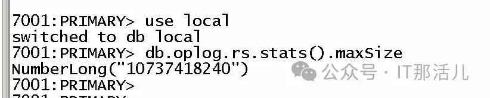
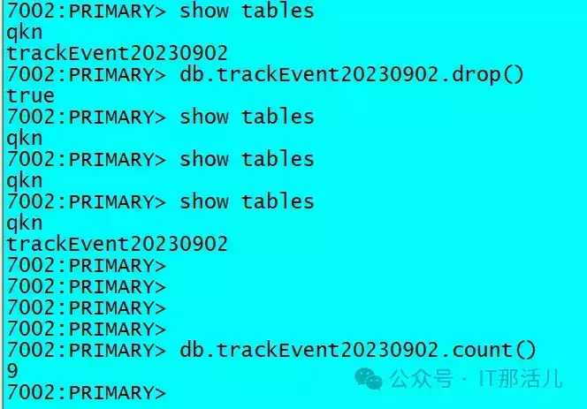

# MongoDB 数据备份恢复应急手册

  

数据备份与恢复的意义

在日常运维过程中，数据备份及恢复也越来越重要，数据的备份保证了数据的安全性，在数据丢失或者误删除的情况下可以让我们快速的恢复，尽可能做到不丢失或者少丢失数据。

  

备份恢复方法

**2.1 mongodump**

mongodump 是 MongoDB 官方提供的备份工具，它可以从 MongoDB 数据库读取数据，并生成 BSON 文件，mongodump 适合用于备份和恢复数据量较小的 MongoDB 数据库，不适用于大数据量备份。

默认情况下，mongodump 不获取 local 数据库里面的内容。  
mongodump 仅备份数据库中的文档，不备份索引，所以还原后，需要重新生成索引。

**全量备份命令如下：**

```plain
mongodump --host 127.0.0.1 --port 27017 -u root -p 123456 --authenticationDatabase admin --gzip --out /data/backup/mongodump
```

**备份指定集合命令如下：**

```plain
mongodump --host 127.0.0.1 --port 27017 -u root -p 123456 --authenticationDatabase admin -c trackEvent20230902 --gzip --out /data/backup/ trackEvent20230902
```

参数介绍：

-   \--host <hostname><:port>, -h <hostname><:port>  # 指定备份的主机 ip 和端口号，默认值 localhost:27017
    
-   \--port # 指定端口号 默认 27017
    
-   \--username <username>, -u <username> # 指定用户名
    
-   \--password <password>, -p <password> # 指定密码
    
-   \--authenticationDatabase <dbname> # 指定认证的数据库
    
-   \--authenticationMechanism <name> # 指定认证的算法，默认值 SCRAM-SHA-1
    
-   \--db <database>, -d <database> # 指定备份的数据库，未指定的话，备份所有的数据库，但不包含 local 库
    
-   \--collection <collection>, -c <collection> # 指定备份的集合，未指定则备份指定库中的所有集合
    
-   \--query <json>, -q <json>  # 指定 json 作为查询条件。来备份过滤后的数据
    
-   \--queryFile <path>  # 指定 json 文档路径，以该文档的内容作为查询条件，来备份过滤后的数据
    
-   \--quit # 通过抑制 MongoDB 的复制，连接等活动，来实现备份
    
-   \--gzip  # 开启压缩，3.2 版本后可以使用，输出为文件的话会带有后缀.gz
    
-   \--out <path>, -o <path>  # 输出的目录路径
    
-   \--repir # 修复数据时使用 下面有详细介绍
    
-   \--oplog # mongodump 会将 mongodump 执行期间的 oplog 日志 输出到文件 oplog.bson，这就意味着从备份开始到备份结束的数据操作都可以记录下来
    
-   \--archive <file> # 输出到单个存档文件或者是直接输出
    
-   \--dumpDbUsersAndRoles # 只有在 使用 --db 时才适用，备份数据库的包含的用户和角色
    
-   \--excludeCollection string # 排除指定的集合，如果要排除多个，使用多个--excludeCollection
    
-   \--numParallelCollections int, -j int # 并行导出的集合数，默认为 4
    
-   \--ssl  # 指定 TLS/SSL 协议
    
-   \--sslCAFile filename # 指定认证文件名
    
-   \--sslPEMKeyFile <filename>
    
-   \--sslPEMKeyPassword <value>
    
-   \--sslCRLFile <filename>
    
-   \--sslAllowInvalidCertificates
    
-   \--sslAllowInvalidHostnames
    
-   \--sslFIPSMode
    

**2.2 mongorestore**

mongorestore 可以创建新的数据库或将数据添加到现有的数据库，但是 mongorestore 仅仅执行 insert 操作，不执行 update 操作。

将文档还原到现有的数据库，现有的数据库中的文档的\_id 的值和要还原的文档中的\_id 值是一样的，是不会将数据库原有的值覆盖的。

重建索引，mongorestore 会重建索引。

**恢复全库命令如下：**

```plain
mongorestore --host 127.0.0.1 –por27017 -u root -p 123456 --authenticationDatabase admin /data/backup/mongodump
```

**恢复指定命令如下：**

```plain
mongorestore --host 127.0.0.1 –por27017 -u root -p 123456 --authenticationDatabase admin -d qkn /data/backup/ trackEvent20230902/qkn/trackEvent20230902.bson.gz
```

参数介绍：

-   \--help # 查看帮助
    
-   \--quiet # 通过抑制 MongoDB 的复制，连接等活动，来实现数据恢复
    
-   \--host <hostname><:port>, -h <hostname><:port>  # 指定恢复的主机 ip 和端口号，默认值 localhost:27017
    
-   \--port # 指定端口号 默认 27017
    
-   \--username <username>, -u <username> # 指定用户名
    
-   \--password <password>, -p <password> # 指定密码
    
-   \--authenticationDatabase <dbname> # 指定认证的数据库
    
-   \--authenticationMechanism <name> # 指定认证的算法，默认值 SCRAM-SHA-1
    
-   **namespace options:**
    
      -d, --db=  从 BSON 文件恢复时指定的数据库
    
      -c, --collection=  从 BSON 文件恢复的集合
    
           --excludeCollection=  过时的参数。在恢复期间跳过的集合 (可以多次指定以排除其他集合).
    
           --excludeCollectionsWithPrefix=  过时的参数。在恢复期间跳过具有给定前缀的集合 (可以多次指定以排除其他前缀).
    
           --nsExclude=  排除匹配的命名空间
    
           --nsInclude=  包括匹配的命名空间
    
           --nsFrom=  重命名匹配的命名空间，必须具有匹配的 nsTo
    
           --nsTo=  重命名匹配的命名空间，必须具有匹配的 nsFrom
    
-   **input options:**
    
      --objcheck  插入前验证所有对象
    
      --oplogReplay  重放 oplog 以进行时间点恢复
    
      --oplogLimit=\[:ordinal\]  仅在提供的时间戳之前包含 oplog 条目
    
      --oplogFile=  用于重放 oplog 的 oplog 文件
    
      --archive=  从指定的归档文件恢复转储;若指定了 flag 而没有值，则从 stdin 读取归档文件
    
      --restoreDbUsersAndRoles  恢复给定数据库的用户和角色定义
    
      --dir=  输入目录，对 stdin 使用' - '
    
      --gzip  解压缩 gzip 压缩输入
    
-   **restore options:**
    
      --drop  在导入之前删除每个集合
    
      --dryRun  查看摘要而不导入任何内容 建议详细说明
    
      --writeConcern=  写关注选项比如 --writeConcern majority, --writeConcern '{w: 3, wtimeout: 500, fsync: true, j: true}'
    
      --noIndexRestore  不要恢复索引
    
      --noOptionsRestore  不恢复收集选项
    
      --keepIndexVersion  不要更新索引版本
    
      --maintainInsertionOrder  在恢复期间保留文件的顺序
    
      -j, --numParallelCollections=  要并行恢复的集合数默认为 4
    
      --numInsertionWorkersPerCollection=  每个集合并发运行的插入操作数 (默认为 1)
    
      --stopOnError  如果在插入时遇到错误则停止恢复 (默认情况下关闭)
    
      --bypassDocumentValidation  绕过文档验证
    
      --preserveUUID  保留原始集合 UUID（默认情况下关闭，需要删除）
    

**2.3 oplog**

MongoDB 提供了 oplog 功能，类似于 mysql bin-log，oplog 是用于复制集间由 Primary 记录，Secondary 用来同步。从而保持数据一致。

oplog（local.oplog.rs 集合）默认情况下配置为可用磁盘空间的 5%，最大可设置为 50G，当 oplog 写满时，就会开始删除最先写入的 oplog，一次正常的 insert 操作包含如下步骤：

-   将文档写入指定的集合；
    
-   将写入操作记录到 oplog；
    
-   如果 oplog 满了，删除最先写入的 oplog。
    

当出现误删除情况下，被删除数据的所有操作记录还在 oplog 中未被覆盖，我们可以通过 oplog 来对数据进行恢复；若已经被覆盖只能尽快保持磁盘无新增数据，通过第三方恢复手段来进行恢复。

**可以通过以下命令查询 oplog 情况：**

**1）**查看 oplog 大小

```plain
use local
db.oplog.rs.stats().maxSize
```



**2）**在复制集中使用 oplog，可以使用一下命令查看 oplog 情况“”

```plain
rs.printReplicationInfo()
```


**使用 oplog 进行恢复：**

在使用副本集出现误删除情况下，被删除数据的所有操作记录还在 oplog 中未被覆盖，我们可以通过 mongodump 及 mongorestore 来对 oplog 还原所有操作记录进行恢复。

通过 rs.printReplicationInfo() 命令确认当前 oplog 记录的时间范围。


**导出当前的 local/oplog.rs，可以指定需要导出的起始时间：**

**1）**导出当前 oplog

```plain
mongodump -h 127.0.0.1:7002 -u root -p 123456 --authenticationDatabase admin -d local -c oplog.rs -o /data/oplog
```

可以通过 bsondump 来确认需要恢复的时间范围：

```plain
bsondump oplog.rs.bson >a.txt

cat a.txt |grep trackEvent20230902
{"ts":{"$timestamp":{"t":1693650095,"i":2}},"t":
{"$numberLong":"2"},"h":{"$numberLong":"0"},"v":
{"$numberInt":"2"},"op":"c","ns":"hsdb.$cmd","ui":
{"$binary":
{"base64":"fcsLkZ05SnyNPwKB6sg5BA==","subType":"04"}},"wall"
:{"$date":{"$numberLong":"1693650095962"}},"o":
{"create":"trackEvent20230902","idIndex":{"v":
{"$numberInt":"2"},"key":{"_id":
{"$numberInt":"1"}},"name":"_id_","ns":"hsdb.trackEvent20230902"}}}
```

###字段详解：

-   ts：操作发生的时间，t: unix 时间戳，i: 可以认为是同一时间内的第几个
    
-   h：记录的唯一 ID
    
-   v：版本信息
    
-   op：写操作的类型
    
-   n: no-op
    
-   c: db cmd
    
-   i: insert
    
-   u: update
    
-   d: delete
    
-   ns：操作的 namespace, 即：数据库。集合
    
-   o：操作所对应的文档
    
-   o2：更新时所对应的 where 条件，更新时才有
    

**2）**导出指定时间 oplog

```plain
mongodump -h 127.0.0.1:7002 -u root -p 123456 --
authenticationDatabase admin -d local -c oplog.rs -q '{"ts":
{"$lte": {"$timestamp":{"t":1693650420,"i":1}}, "$gte": 
{"$timestamp":{"t":1693650261,"i":1}}}}' -o /data/oplogv1
```

**3）**使用 oplogReplay 指定单独的 oplog.rs.bson 文件进行恢复

```plain
mongorestore -h 127.0.0.1:7002 -u root -p 123456 --
authenticationDatabase admin --oplogReplay --oplogLimit 
"1693650420:1" /data/oplogv1/local/oplog.rs.bson
```


