# Nuclei 工具学习-Nuclei 进阶使用 -2

1.  介绍
    

前面记录了关于 Nuclei 的简单使用，这里记录一些进一步的使用。

  

2. 使用  

    2.1 Nuclei 的运行

    nuclei 主要分为两种方式运行，一种是模板 (-t)，一种是工作流 (-w)

```bash
模板 Templates
    1. 默认情况下，所有模板（除了 nucles 忽略列表）都从默认的模板安装路径执行。
    一般不去扫描的是哪些容易造成 dos 攻击的 bug 等
    nuclei -u http://target.com
    2. 自定义模板目录或多模板目录可以如下执行。两个目录的漏洞文件都将被扫描
    nuclei -u https://target.com -t cves/ -t exposures/
    3. 批量扫描
    nuclei -list targets.txt

工作流 Workflows,-w  后面跟的是 workflows/
    1. nuclei -u https://target.com -w workflows/
    2. nuclei -list http_urls.txt -w workflows/wordpress-workflow.yaml
```

```bash
不同之处
模板用于描述和执行具体的请求与响应分析，
而工作流用于将多个模板组合成一个完整的扫描任务，并控制它们的执行流程。
```

例子：比如说扫描 apache 的常见问题 --Templates  

```bash
nuclei.exe -l target.txt -t .\templates\apache\ -duc  --debug
```

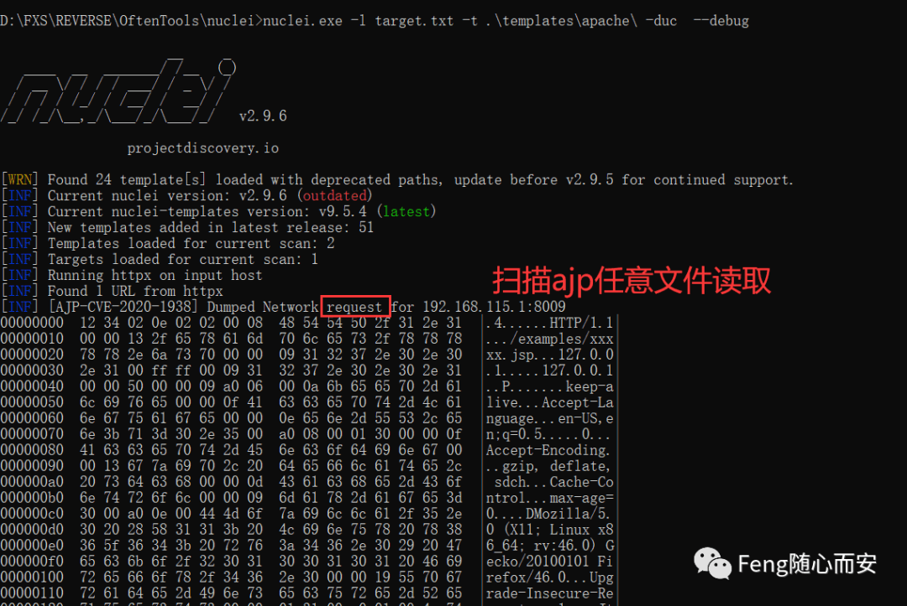

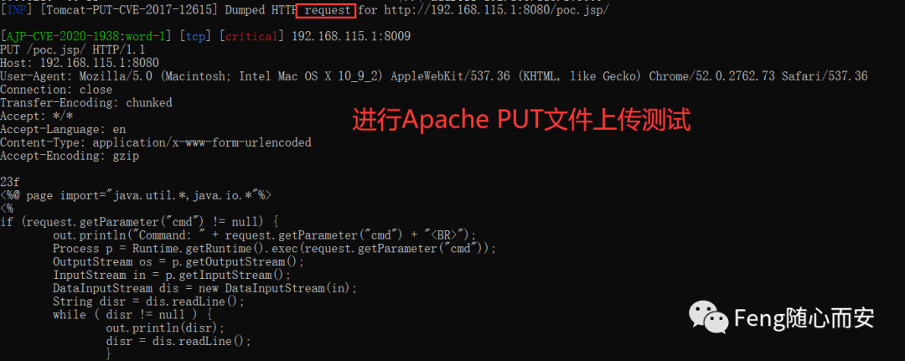

例子：比如说扫描 apache 的常见问题 --Workflows        什么是工作流，个人的简单理解就是，我可以把 apache 所有的问题集成在一个工作流，跟 - t 目录差不多。

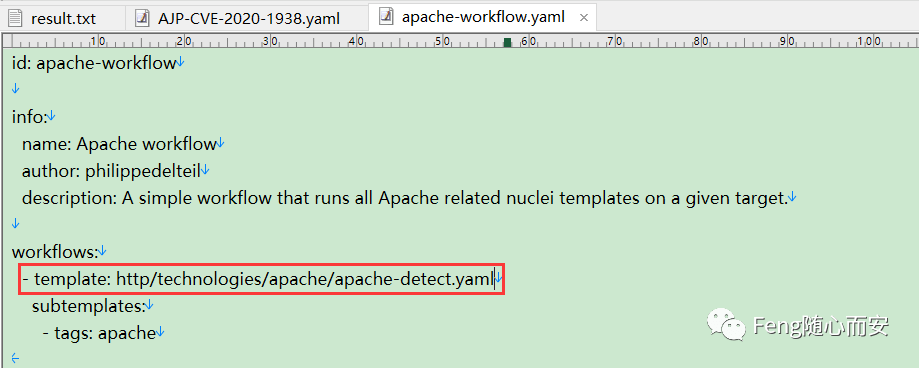

我们给他添加所有的漏洞的 apache 问题即可

```bash
nuclei.exe -l target.txt -w nuclei-templates-9.5.0\workflows\apache-workflow.yaml --debug
```

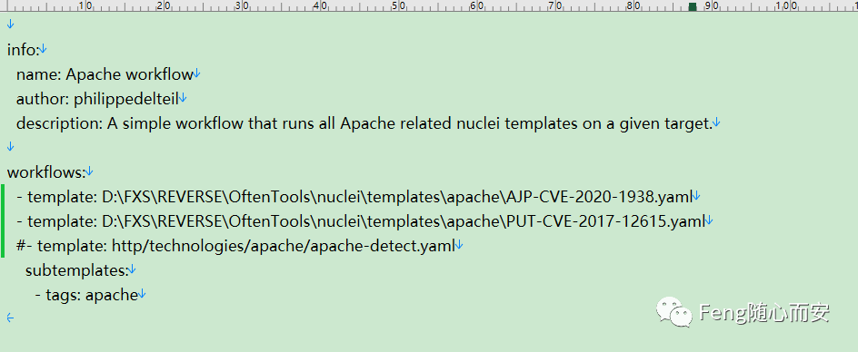

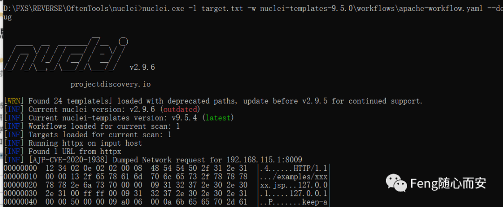

    2.2 Nuclei 过滤器

```bash
Nuclei 引擎支持三个基本过滤器来自定义模板执行。
1. Tags   (-tags)
    根据模板中可用的 Tags 字段进行筛选。
2. Severity  (-severity)
    根据模板中可用的严重性字段进行筛选。
3. Author  (-author)
    根据模板中可用的作者字段进行筛选。
```

以一个简单的模板为例  

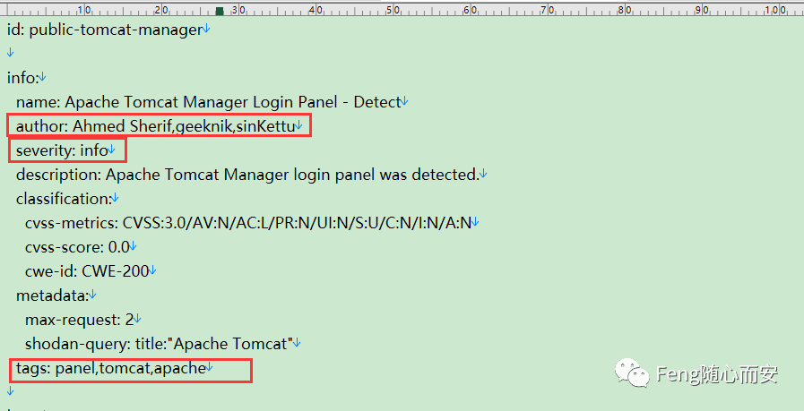

当建立属于你自己的一个模板库，你可以快速的进行定位，尤其对内网大资产的情况下，可以快速进行打点，  
对大佬的例子进行优化，建立属于自己的模板。我改成 FengXS0ne 后

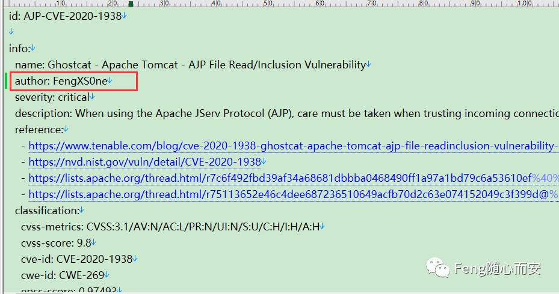

```bash
nuclei.exe -l target.txt -t .\templates\apache\ -author FengXS0ne -debug
-l 批量扫描
-t 自定义模板，我这里是选择的自定义目录下的所有模板
-author 过滤器，选择的是作者为：FengXS0ne
-debug 调试，能看见

同理其他的也一样，一般的选择的是-t 目录下，
再通过-author/-tags/-severity 进行过滤

nuclei -l target.txt -tags cve -severity critical,high -author geeknik

可以使用模板条件标志（-tc）组合多个过滤器，该标志允许使用以下复杂表达式：
nuclei -tc "contains(id,'xss') || contains(tags,'xss')"
nuclei -tc "contains(tags,'cve') && contains(tags,'ssrf')"
nuclei -tc "contains(name, 'Local File Inclusion')"

tc 支持的字段包括
    id,
    name,
    description
    tags
    authors
    severity
    protocol
    http_method
    body
    matcher_type
    extractor_type
所有字段都可以与逻辑运算符（||和&&）组合使用，并与 DSL 辅助函数一起使用。
同样，工作流中也支持所有筛选器。
nuclei -w workflows/wordpress-workflow.yaml -severity critical,high -list http_urls.txt
```

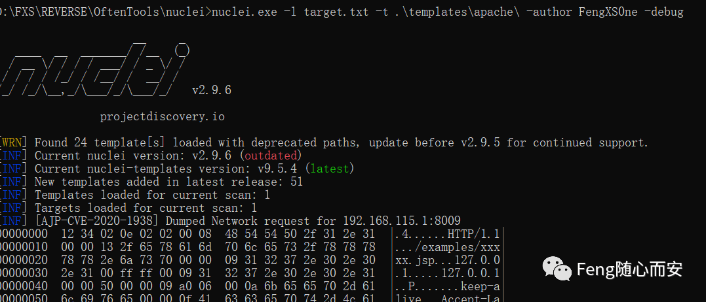

```bash
nuclei.exe -l target.txt -t .\templates\apache\ -tc "contains(tags,'tomcat')" -debug
```

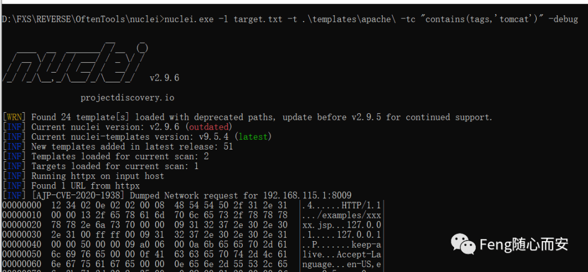

    2.3 Nuclei 速率限制  
    Nuclei 对多个因素有多个速率限制控制，包括要并发执行的多个模板、每个模板要并行扫描的主机数量，以及您希望使用 Nucles 进行 / 限制的每秒请求 / 全局数量，  

```bash
-rl -rate-limit    每秒发送的最大请求数（默认为 150）
-rlm -rate-limit-minute     每分钟发送的最大请求数
-bs -block-size     每个模板要并行分析的主机的最大数量（默认为 25）
-c  -concurrency    并行执行的最大模板数（默认为 25）
-hbs -headless-bulk-size  每个模板要并行分析的最大无头主机数（默认为 10）
-headc  -headless concurrency 并行执行的最大无头模板数（默认为 10）

-rl 优于优先于其他两个标志-c 和 -bs
请求数/秒不能超过为速率限制标志定义的值
```

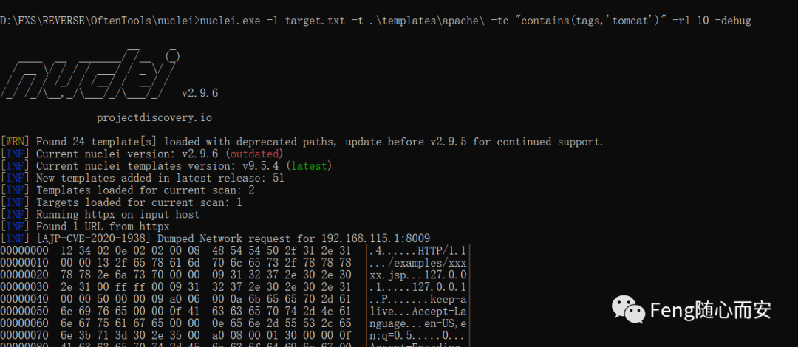

###     2.4 Nuclei 标记

在很多时候我们需要写道 header 头进行发送 HTTP 请求，我们有两种方法设置 header 头，  
    第一种是通过配置文件，$HOME/.config/nuclei/config.yaml

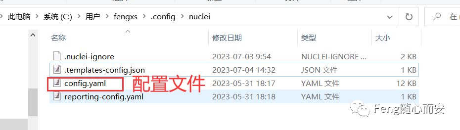

```bash
# Headers to include with each request.
header:
  - 'X-BugBounty-Hacker: h1/geekboy'
  - 'User-Agent: Mozilla/5.0 (Windows NT 10.0; WOW64) / nuclei'
```

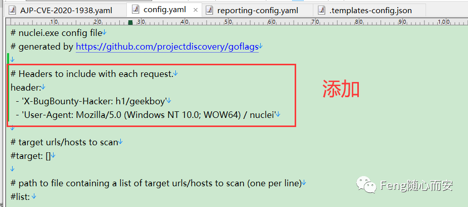

    第二种  -H /header  

```bash
nuclei.exe -header "User-Agent: Mozilla/5.0 (Windows NT 10.0; WOW64) / nuclei" -l target.txt -t .\templates\apache\ -author FengXS0ne --debug
```

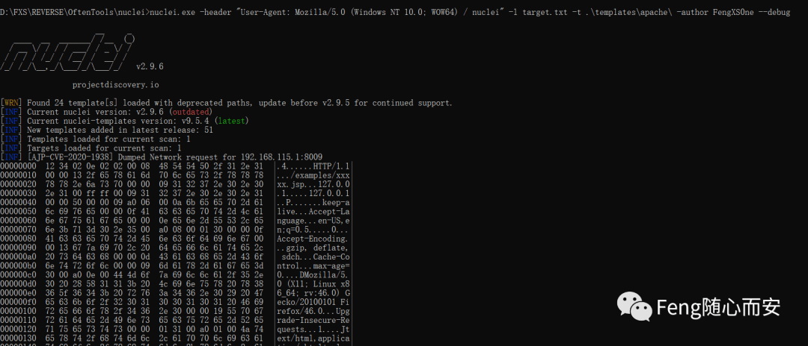

    2.5 Nuclei 模板排除    Nuclei 支持多种方法来排除 / 阻止执行模板。 当我们使用 nuclei.exe -u http://target.com   默认忽略的模板列表：https://github.com/projectdiscovery/nuclei-templates/blob/master/.nuclei-ignore  

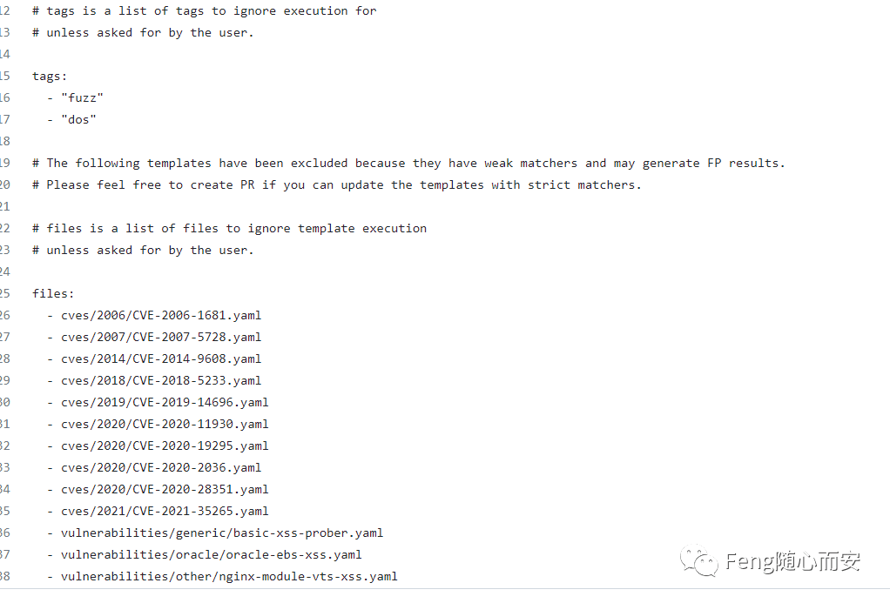Nuclei 引擎支持两种从扫描中手动排除模板的方式  
    -exclude-templates/exclude  用于排除单个或多个模板和目录  

```bash
nuclei.exe -header "User-Agent: Mozilla/5.0 (Windows NT 10.0; WOW64) / nuclei" -l target.txt -t .\templates\apache\ -exclude-templates .\templates\apache\PUT-CVE-2017-12615.yaml --debug
```

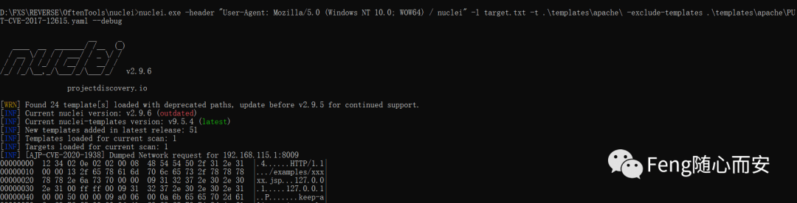

    -exclude-tags/etags  标志用于排除基于已定义标签的模板，可以使用单个或多个来排除模板。

```bash
nuclei.exe -header "User-Agent: Mozilla/5.0 (Windows NT 10.0; WOW64) / nuclei" -l target.txt -t .\templates\apache\ -etags rce  --debug
```

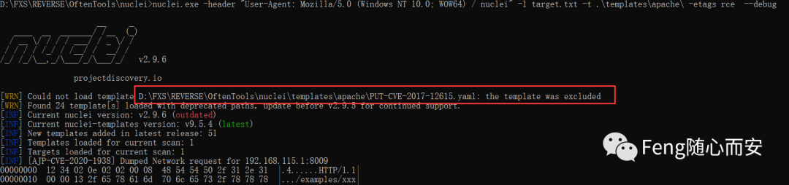

```bash
nuclei -list urls.txt -exclude-templates exposed-panels/ -exclude-templates technologies/
nuclei -l urls.txt -t cves/ -etags xss
nuclei -l urls.txt -t cves/ -etags sqli,rce
```

    为了轻松覆盖忽略的 nucles，nuclei 引擎支持 include-tags/include-templates 标志。

```bash
nuclei.exe -header "User-Agent: Mozilla/5.0 (Windows NT 10.0; WOW64) / nuclei" -l target.txt -t .\templates\apache\ -include-tags tomcat  --debug
```

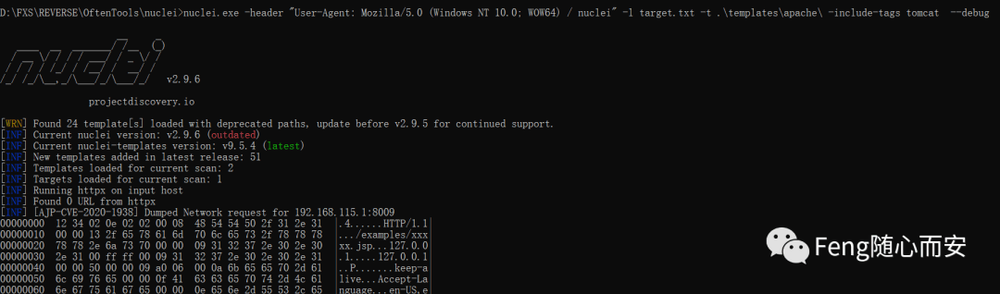

    2.6 Nuclei 模板排除  
    Nuclei 支持与 uncover 集成，以针对给定查询的 uncover 返回的主机执行模板。Uncover 就是一个搜索引擎的集合，使用多个搜索引擎快速发现互联网上暴露的主机。  
uncover 工具的配置为文件在

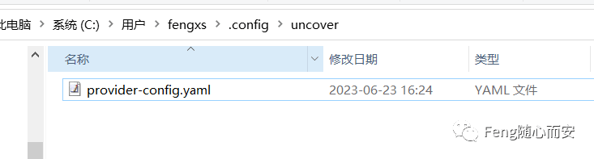

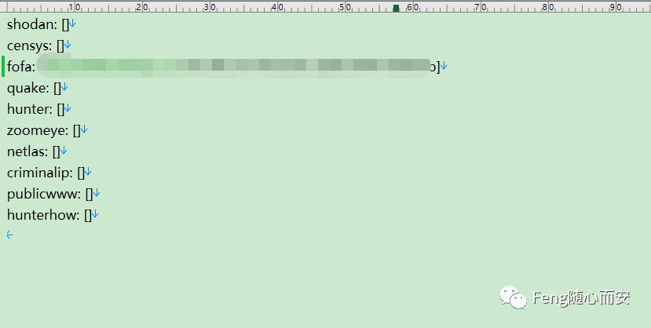

需要 API KEY 想办法搞吧

```bash
nuclei -h uncover

UNCOVER:
   -uc, -uncover                  enable uncover engine
   -uq, -uncover-query string[]   uncover search query
   -ue, -uncover-engine string[]  uncover search engine (shodan,shodan-idb,fofa,censys,quake,hunter,zoomeye,netlas,criminalip) (default shodan)
   -uf, -uncover-field string     uncover fields to return (ip,port,host) (default "ip:port")
   -ul, -uncover-limit int        uncover results to return (default 100)
   -ucd, -uncover-delay int       delay between uncover query requests in seconds (0 to disable) (default 1)
```

```bash
nuclei -t cves/2021/CVE-2021-26855.yaml -uncover -uq "edu.cn"
```

  

3\. 总结  
    介绍了一些关于 Nuclei 使用，并附上示例。还好，慢慢学。其实有句话说的真好，遇见已是上上签，又怎敢奢求永远。我们终究会遇见对的那个人，只希望自己有能力去遇见对的那个人。愿美好如期而至。
