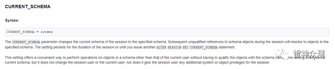
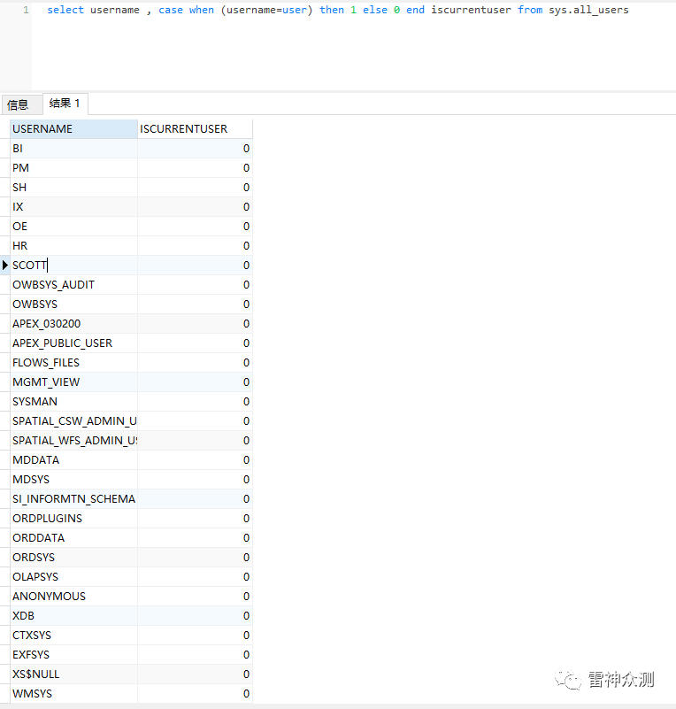
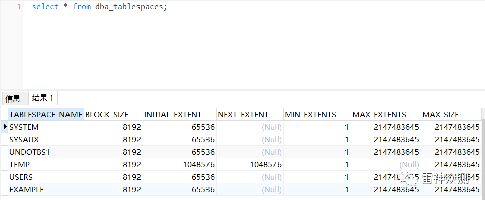

# Oracle 渗透利用（一）

  

  

**Oracle 体系结构**

与其他数据库不同，Oracle 引入了一个特殊的概念: 表空间 (Tablespace)。

  

Oracle 关系型数据库管理系统从逻辑上把数据保存在表空间内，在物理上以数据文件的形式存储。表空间可以包含多种类型的内存区块，例如数据区块（Data Segment）、索引区块（Index Segment）等等。区块相应的由一个或多个扩展（extent）组成。数据文件就是由多个表空间组成的，这些数据文件和相关文件形成一个完整的数据库，目录下以 DBF 后缀结尾的就是数据库默认创建的表空间。此概念的引入相对与其他数据库而言，对 oracle 来说一个用户就是一个“库”（后面会详细解释）。

**逻辑存储结构**

主要阐述 oracle 数据库内部是怎么管理数据的。

**实例、数据库、表空间、schema、表、视图之间的关系**


此处说的上述六个概念，特指在 Oracle 数据库服务内，不一定适用于其他数据库服务。上图是一个简化之后关系图，不涉及段、区和块，因为这对我们了解整个体系结构帮助不大。“数据库服务”是 Oracle 数据库提供的一切数据管理功能的总和。“实例”是 Oracle 数据库服务提供服务所需要的逻辑容器，本质是一组进程、线程和内存。进程和线程是为了处理相关的数据而建立的，也就是为了加载并处理数据库。“数据库”可以看做是磁盘上一堆数据库相关的文件的总和。实例和数据库可以存在 1 对 N 的关系，也就是说一个实例加载一个数据库，但是通常是 1 对 1。常见的 1 对 N 的部署场景是并行数据库（笔者没有实际操作过），一个数据库与多个实例相对应，在同一时间内，一个用户只与一个实例相联系，当一个实例出现问题时，其他自动服务，保证服务正常运行。（Oracle12c 后引入了 CDB 和 PDB 的概念，需要另做考虑，可以是一对多的概念）而表空间和 Schema 则都是用来做数据分离的，表空间更加倾向于这个表表示储存于磁盘上哪个文件，而 Schama 倾向于这个表属于哪个用户。

**服务名和 SID 的区别**

1) SID (Site ID)：一个由字母和数字组成的系统标识符用来做实例的唯一性区别，包含了至少一个应用程序的实例和数据存储设备

  

2) 实例 (Instance): 由一个实例数字 (或是一个引导 ID：SYS.V\_$DATABASE.ACTIVATION#）表示，包含了一个操作系统程序的集合和与存储设备进行交谈的内部结构

  

ORACLE 实例 = 进程 + 进程所使用的内存 (SGA)

  

进程：负责接受和处理客户端传来的数据，如 Windows 下由 oracle.exe 进程负责分发和处理请求

SGA: 全称为 System Global Area (系统全局区域)。实际上是内存中的一片共享区域，其中包含实例配置、数据缓存、操作日志、SQL 命令、用户信息等信息，由后台进程进行共享

3) 数据库：一般指物理存储的文件，Oracle 数据库除了基本的数据文件，还有控制文件和 Redo 日志 (重做文件 + 控制文件 + 数据文件 + 临时文件)，这些文件一般存储在 $ORACLE\_HOME\\oradata... 路径下，后缀名为 DBF

  

实例和数据库的关系：

实例是临时性的，数据库是永久性的，一个数据库可以对应多个实例，而一个实例只能对应一个数据库

**物理存储结构**

Oracle 数据库中的信息在操作系统文件系统中的体现。

⚫ 控制文件 

⚪ 数据库实例启动后，通过家在控制文件来定位数据文件、Redo 文件的路径  

⚪ 路径：\\path\\ORADATA\\ORCL\\CONTROL.CTL

⚫ 数据文件

⚪ 数据文件存在状态，可通过 SQL 语句进行查询，分别是：SYSTEM、ONLINE、OFFLINE、RECOVER，其中只有 SYSTEM 表空间会有 SYSTEM 状态

⚪ 路径：\\path\\ORADATA\\ORCL\\SYSTEM.DBF

⚪ 路径：\\path\\ORADATA\\ORCL\\SYSAUX.DBF

⚪ 路径：\\path\\ORADATA\\ORCL\\UNDOTBS.DBF

⚪ ...

⚫ 临时文件

⚪ 当 Oracle 进行需要占用大内存操作时，一般是指超过内存，此时会讲数据临时存储在 TEMP 表空间作为中转，类似共享虚拟内存

⚪ 路径：\\path\\ORADATA\\ORCL\\TEMP.DBF

⚫ 日志文件

⚪ Oracle 在执行修改操作后，并不会马上将相应的字符写入数据文件，而是生成 Redo 信息，将该信息写入到内存中固定区域 LOG\_BUFFER，当区域数据达到某个触发器条件是，会将该内存区域的内容写入到 Redo 日志文件中

⚪ 日志文件存在多种状态，分别为 UNUSED、CURRENT、ACTIVE、INACTIVE、CLEARING、CLEARING\_CUREENT

⚪ 路径：\\path\\ORADATA\\ORCL\\REDO0.LOG

⚫ 参数文件

⚪ 记录 Oracle 数据库的基本参数信息，包括数据库名、控制文件等信息所在路径

⚪ 文件名称：SPFILEsid.ora

**数据字典**

*https://book.huihoo.com/oracle-internals/04.Dictionary.pdf*

数据字典 (Data Dictionary) 是 Oracle 数据库的一个重要组成部分，是元数据 (Metadata) 的存储地点。Oracle RDBMS 使用数据字典记录和管理对象信息和安全信息等，用户和数据库 系统管理员可以通过数据字典来获取数据库相关信息。

  

数据字典包括以下内容：

⚫ 所有数据库 Schema 对象的定义 (表、视图、索引、聚簇、同义词、序列、过程、函数、包、触发器等等)

⚫ 数据库的空间分配和使用情况

⚫ 字段的缺省值

⚫ 完整性约束信息

⚫ Oracle 用户名称、角色、权限等信息

⚫ 审计信息

⚫ 其他数据库信息

**总之，数据字典是数据库核心，通过数据字典，Oracle 数据库基本上可以实现自解释。**

  

一般来说，数据字典是只读的，通常不建议对任何数据字典表中的任何信息进行手工更新或改动，**对于数据字典的修改很容易就会导致数据库紊乱，造成无法恢复的后果**，而且 Oracle 公司不对此类操作带来的后果负责。

  

通常所说的数据字典由四部分组成：内部 RDBMS (X $) 表、数据字典表、动态性能 (V$) 视图和数据字典视图。作为数据字典的辅助管理，还可以为对象创建同义词。

**Schema、表空间与系统表**

**Schema**

Schema 是用户表的逻辑容器。让我们分析下 navicat 从 oracle 成功连接之后展开一级结构时候的动作

展开之后就是这样的，然而这并不是表空间


现在显示出来的每一项是不是就是表空间，为什么要显示这些？让我们通过调试 navicat 来知道它执行了哪些语句，从而揣摩出它的意图。

  

它首先去查了一个 sessionid，这个感觉和我们的意图无关。


几乎每次执行语句之前都会执行这一句 

alter session set current\_schema= xxx

结合此语句的意义，不难发现它的目的。这句的作用可以理解为相当于 mysql 数据库中的切换数据库，oracle 叫做切换当前模式（直译，大部分中文资料也是这个翻译，亦或译为架构），主要是提供了对架构（模式）内的对象一种简便的访问方式，不指定架构（模式）时，默认从当前架构（模式）内查找。例如，执行 alter session set current\_schema= xxx，然后执行 select\* from user，此时的 user 表默认从 xxx 架构下寻找。


官网文档的叙述



但是以上语句并没有出现软件界面中显示的内容，这和不足以支撑我们的推断，但是如果结合接下来这句 select username , case when (username=user) then 1 else 0 end iscurrentuser from sys.all\_users;


查看此语句的返回结果



这段语句很多但是细看可以知道 navicat 首先去查了 SYS.ALL\_USERS。当我们选定其中某一项的内容查看下方的叙述，navicat 将它看做一个“数据库”。可以得出一个结论：在 oracle 中一个用户就是一个“数据库”（这里的数据库跟前文提到的代表文件的数据库不同），一个“库”就是某一个用户架构（模式）下所有表的集合。


所以，打开 navicat 看到的那竖排以用户名命名的“数据库”既不是表空间也不是数据库，而是以用户名为命名的用户所拥有的表的集合的列表，这也就是 schema 的具体表现，我们看出，运行状态中的（也就是实例）oracle 主要用 Schema 进行数据的分离，因为 Schema 和表空间都有一个很重要的特性，就是对表的独占性。默认情况下，Schema 同用户名称相同。Schema 是表的逻辑集合，是所有应用访问表必须指定的对象（不指定的话就是默认的 schema）。

**表空间**

在 oracle 中数据库是一个整体的逻辑概念。表空间是啥

如果创建用户时，不指定其永久表空间，则会使用默认的表空间。

当 Oracle 创建数据库时，会默认创建五个表空间：

  

**SYSTEM：**用于存储系统表和管理配置等基本信息

**SYSAUX：**类似于 SYSTEM，主要存放一些系统附加信息，以便减轻 SYSTEM 的空间负担

**UNDOTBS：**用于事务回退等

**TEMP：**作为缓存空间减少内存负担

**USERS：**存储定义的表和数据



*（上图中 EXAMPLE 是安装数据库实例的表空间）*

SYSAUX 表空间做为 SYSTEM 表空间的辅助表空间，主要存放 EM 相关的内容以及表统计信息，AWR 快照，审计信息等

  

**系统表**

Oracle 的系统表：

  

**dba\_tables :** 系统里所有的表的信息，需要 DBA 权限才能查询

**all\_tables :** 当前用户有权限的表的信息

**user\_tables:** 当前用户名下的表的信息

**DBA\_ALL\_TABLES：**DBA 用户所拥有的或有访问权限的对象和表

**ALL\_ALL\_TABLES：**某一用户拥有的或有访问权限的对象和表

**USER\_ALL\_TABLES：**某一用户所拥有的对象和表

user\_tables 的范围最小，all\_tables 看到的东西稍多一些，而 dba\_tables 的信息最全

  

**ORACLE 的一些常用系统表说明和介绍**

*https://www.huaweicloud.com/articles/0f2cb0917e686e6de3551ea381fdb25b.html*

**dba\_开头**

```bash
 dba_tables  --用户表信息
 dba_users  --数据库用户信息
 dba_segments  --表段信息
 dba_extents  --数据区信息
 dba_objects  --数据库对象信息
 dba_tablespaces  --数据库表空间信息
 dba_data_files  --数据文件设置信息
 dba_temp_files  --临时数据文件信息
 dba_rollback_segs  --回滚段信息
 dba_ts_quotas  --用户表空间配额信息
 dba_free_space  --数据库空闲空间信息
 dba_profiles  --数据库用户资源限制信息
 dba_sys_privs  --用户的系统权限信息
 dba_tab_privs  --用户具有的对象权限信息
 dba_col_privs  --用户具有的列对象权限信息
 dba_role_privs   --用户具有的角色信息
 dba_audit_trail  --审计跟踪记录信息
 dba_stmt_audit_opts  --审计设置信息
 dba_audit_object  --对象审计结果信息
 dba_audit_session  --会话审计结果信息
 dba_indexes  --用户模式的索引信息
```

**user\_开头**

```bash
 user_objects  --用户对象信息
 user_source  --数据库用户的所有资源对象信息
 user_segments  --用户的表段信息
 user_tables  --用户的表对象信息
 user_tab_columns  --用户的表的列信息
 user_constraints  --用户的对象约束信息
 user_sys_privs  --当前用户的系统权限信息
 user_tab_privs  --当前用户的对象权限信息
 user_col_privs  --当前用户的表列权限信息
 user_role_privs  --当前用户的角色权限信息
 user_indexes  --用户的索引信息
 user_ind_columns  --用户的索引对应的表列信息
 user_cons_columns  --用户的约束对应的表列信息
 user_clusters  --用户的所有簇信息
 user_clu_columns  --用户的簇所包含的内容信息
 user_cluster_hash_expressions  --散列簇的信息
```

**v$ 开头**

```bash
 v$database  --数据库信息
 v$datafile  --数据文件信息
 v$controlfile  --控制文件信息
 v$logfile  --重做日志信息
 v$instance  --数据库实例信息
 v$log  --日志组信息
 v$loghist  --日志历史信息
 v$sga  --数据库 SGA 信息
 v$parameter  --初始化参数信息
 v$process  --数据库服务器进程信息
 v$bgprocess  --数据库后台进程信息
 v$controlfile_record_section  --控制文件记载的各部分信息
 v$thread  --线程信息
 v$datafile_header  --数据文件头所记载的信息
 v$archived_log  --归档日志信息
 v$archive_dest  --归档日志的设置信息
 v$logmnr_contents  --归档日志分析的 DML DDL 结果信息
 v$logmnr_dictionary  --日志分析的字典文件信息
 v$logmnr_logs  --日志分析的日志列表信息
 v$tablespace  --表空间信息
 v$tempfile  --临时文件信息
 v$filestat  --数据文件的 I/O 统计信息
 v$undostat  --Undo 数据信息
 v$rollname  --在线回滚段信息
 v$session  --会话信息
 v$transaction  --事务信息
 v$rollstat  --回滚段统计信息
 v$pwfile_users  --特权用户信息
 v$sqlarea  --当前查询过的 sql 语句访问过的资源及相关的信息
 v$sql  --与 v$sqlarea 基本相同的相关信息
 v$sysstat  --数据库系统状态信息
```

**all\_开头**

```bash
 all_users  --数据库所有用户的信息
 all_objects  --数据库所有的对象的信息
 all_def_audit_opts  --所有默认的审计设置信息
 all_tables  --所有的表对象信息
 all_indexes  --所有的数据库对象索引的信息
```

**session\_开头**

```bash
 session_roles  --会话的角色信息
 session_privs  --会话的权限信息
```

**index\_开头**

```bash
 index_stats  --索引的设置和存储信息
```

**伪表**

```bash
 dual  系统伪列表信息  --用于查询结果和任何表没有关系的时候，用于补全 sql 的 from
```

  

  

  

本文主要介绍了 Oracle 的体系结构，下一章我们将介绍 Oracle Java 支持、Oracle CLR 和 Oracle SQL 注入技巧。
