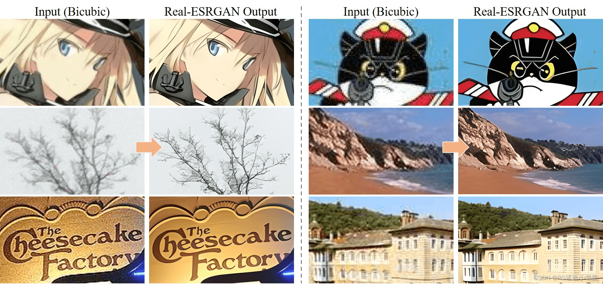

# 【Python&图像超分】Real-ESRGAN图像超分模型（超分辨率重建）详细安装和使用教程

​

## **1 前言**

        **图像超分是一种图像处理技术，旨在提高图像的分辨率，使其具有更高的清晰度和细节。这一技术通常用于图像重建、图像恢复、图像增强等领域，可以帮助我们更好地理解和利用图像信息。图像超分技术可以通过多种方法实现，包括插值算法、深度学习等。其中，深度学习的方法在近年来得到了广泛的关注和应用。基于深度学习的图像超分技术，可以利用深度神经网络学习图像的高频部分，从而提高了图像的分辨率和清晰度。**

        **目前应用较多的应用场景是图像及视频分辨率提高，比如可以提高以往影视作品或图像的分辨率，提高视觉感官效果；或是解决视频经有损压缩后导致视频效果退化问题。****今天给大家介绍一下腾讯ARC实验室发布的一个图像超分辨率模型Real-ESRGAN：[项目开源地址](https://github.com/xinntao/Real-ESRGAN/blob/master/ "项目开源地址")，[论文地址](https://arxiv.org/abs/2107.10833 "论文地址")。**

### 1.1 项目效果展示

[](https://img2023.cnblogs.com/blog/3204676/202311/3204676-20231114165314192-1938994803.png)​

## **2 Python代码使用教程**

### 2.1 依赖库安装

-   **Python >= 3.7 (推荐使用[Anaconda](https://www.anaconda.com/download/#linux "Anaconda")或[Miniconda](https://docs.conda.io/en/latest/miniconda.html "Miniconda"))**
-   **[PyTorch >= 1.7](https://pytorch.org/ "PyTorch >= 1.7")**
-   **这里比较推荐大家用离线本地安装**

#### **2.1.1 项目安装**

```plain
cke_widget_element highlighter-  awk
```

```awk
git clone https://github.com/xinntao/Real-ESRGAN.git
cd Real-ESRGAN
```

#### **2.1.2 安装依赖**

```plain
cke_widget_element highlighter-  mipsasm
```

```plain
# 安装 basicsr - https://github.com/xinntao/BasicSR
# 我们使用BasicSR来训练以及推断
pip install basicsr
# facexlib和gfpgan是用来增强人脸的
pip install facexlib
pip install gfpgan
pip install -r requirements.txt
python setup.py develop
```

### **2.2 模型介绍**

        **[模型下载链接](https://pan.baidu.com/s/1e5zPB3I5JP1Ob6YFMDzsgA?pwd=cqnh "模型下载链接")，里面有7个，有些我不知道是干啥用的，所以就没说。**

-   realesrgan-x4plus（默认）
-   reaesrnet-x4plus
-   realesrgan-x4plus-anime（针对动漫插画图像优化，有更小的体积）
-   realesr-animevideov3 (针对动漫视频)

### **2.3 代码使用**

        将下载好的模型，放在项目文件中的weights文件夹中，然后打开inference\_realesrgan.py和inference\_realesrgan\_video.py这两个文件就运行就行了，一个是图片超分，一个是视频超分。我这里将代码已经全部注释了，自己可以看看很好理解。

        默认模型是realesrgan-x4plus，需要超分的图片/视频放在项目文件夹的inputs中，输出在results中。

```plain
cke_widget_element highlighter-  routeros
```

```plain
import argparse
import cv2
import glob
import os
from basicsr.archs.rrdbnet_arch import RRDBNet
from basicsr.utils.download_util import load_file_from_url

from realesrgan import RealESRGANer
from realesrgan.archs.srvgg_arch import SRVGGNetCompact


def main():
    """Inference demo for Real-ESRGAN.
    """
    parser = argparse.ArgumentParser()  # 创建一个命令行解析器对象，用于解析命令行参数
    parser.add_argument('-i', '--input', type=str, default='inputs', help='Input image or folder')
    # 添加一个命令行参数 -i, --input，类型为字符串，默认值为 'inputs'，用于指定输入图像或文件夹
    parser.add_argument(
        '-n',
        '--model_name',
        type=str,
        default='RealESRGAN_x4plus',
        help=('Model names: RealESRGAN_x4plus | RealESRNet_x4plus | RealESRGAN_x4plus_anime_6B | RealESRGAN_x2plus | '
              'realesr-animevideov3 | realesr-general-x4v3'))
    # 添加一个命令行参数 -n, --model_name，类型为字符串，默认值为 'RealESRGAN_x4plus'，用于指定使用的模型名称
    parser.add_argument('-o', '--output', type=str, default='results', help='Output folder')
    # 添加一个命令行参数 -o, --output，类型为字符串，默认值为 'results'，用于指定输出文件夹
    parser.add_argument(
        '-dn',
        '--denoise_strength',
        type=float,
        default=0.5,
        help=('Denoise strength. 0 for weak denoise (keep noise), 1 for strong denoise ability. '
              'Only used for the realesr-general-x4v3 model'))
    # 添加一个命令行参数 -dn, --denoise_strength，类型为浮点数，默认值为 0.5，用于指定去噪强度
    parser.add_argument('-s', '--outscale', type=float, default=4, help='The final upsampling scale of the image')
    # 添加一个命令行参数 -s, --outscale，类型为浮点数，默认值为 4，用于指定最终的放大倍数
    parser.add_argument(
        '--model_path', type=str, default=None, help='[Option] Model path. Usually, you do not need to specify it')
    # 添加一个命令行参数 --model_path，类型为字符串，默认值为 None，用于指定模型路径。通常不需要指定。
    parser.add_argument('--suffix', type=str, default='out', help='Suffix of the restored image')
    # 添加一个命令行参数 --suffix，类型为字符串，默认值为 'out'，用于指定输出图像的后缀
    parser.add_argument('-t', '--tile', type=int, default=0, help='Tile size, 0 for no tile during testing')
    # 添加一个命令行参数 -t, --tile，类型为整数，默认值为 0，用于指定瓦片大小。0 表示测试时没有瓦片。
    parser.add_argument('--tile_pad', type=int, default=10, help='Tile padding')
    # 添加一个命令行参数 --tile_pad，类型为整数，默认值为 10，用于指定瓦片填充大小
    parser.add_argument('--pre_pad', type=int, default=0, help='Pre padding size at each border')
    # 添加一个命令行参数 --pre_pad，类型为整数，默认值为 0，用于指定每个边界的预填充大小
    parser.add_argument('--face_enhance', action='store_true', help='Use GFPGAN to enhance face')
    # 添加一个命令行参数 --face_enhance，动作是存储为 True，用于指定是否使用 GFPGAN 来增强人脸
    parser.add_argument(
        '--fp32', action='store_true', help='Use fp32 precision during inference. Default: fp16 (half precision).')
    # 添加一个命令行参数 --fp32，动作是存储为 True，用于指定推理期间是否使用 fp32 精度。默认情况下使用 fp16（半精度）
    parser.add_argument(
        '--alpha_upsampler',
        type=str,
        default='realesrgan',
        help='The upsampler for the alpha channels. Options: realesrgan | bicubic')
    # 添加一个命令行参数 --alpha_upsampler，类型为字符串，默认值为 'realesrgan'，用于指定 alpha 通道的上采样器。选项：realesrgan | bicubic
    parser.add_argument(
        '--ext',
        type=str,
        default='auto',
        help='Image extension. Options: auto | jpg | png, auto means using the same extension as inputs')
    # 添加一个参数，参数名为'--ext'，类型为字符串，默认值为auto，这个参数主要用于指定输入图像的扩展名。
    parser.add_argument(
        '-g', '--gpu-id', type=int, default=None, help='gpu device to use (default=None) can be 0,1,2 for multi-gpu')
    # 添加一个参数，参数名为'-g'或'--gpu-id'，类型为整数，默认值为None。这个参数主要用于指定使用的GPU设备。
    args = parser.parse_args()
    # 解析命令行参数，生成一个命名空间args

    # determine models according to model names
    args.model_name = args.model_name.split('.')[0]
    # 根据传入的命令行参数--model-name来选择模型，这里假设模型名称和使用的模型之间的关系已经预设好。
    if args.model_name == 'RealESRGAN_x4plus':  # x4 RRDBNet model
        model = RRDBNet(num_in_ch=3, num_out_ch=3, num_feat=64, num_block=23, num_grow_ch=32, scale=4)
        netscale = 4
        file_url = ['https://github.com/xinntao/Real-ESRGAN/releases/download/v0.1.0/RealESRGAN_x4plus.pth']
    elif args.model_name == 'RealESRNet_x4plus':  # x4 RRDBNet model
        model = RRDBNet(num_in_ch=3, num_out_ch=3, num_feat=64, num_block=23, num_grow_ch=32, scale=4)
        netscale = 4
        file_url = ['https://github.com/xinntao/Real-ESRGAN/releases/download/v0.1.1/RealESRNet_x4plus.pth']
    elif args.model_name == 'RealESRGAN_x4plus_anime_6B':  # x4 RRDBNet model with 6 blocks
        model = RRDBNet(num_in_ch=3, num_out_ch=3, num_feat=64, num_block=6, num_grow_ch=32, scale=4)
        netscale = 4
        file_url = ['https://github.com/xinntao/Real-ESRGAN/releases/download/v0.2.2.4/RealESRGAN_x4plus_anime_6B.pth']
    elif args.model_name == 'RealESRGAN_x2plus':  # x2 RRDBNet model
        model = RRDBNet(num_in_ch=3, num_out_ch=3, num_feat=64, num_block=23, num_grow_ch=32, scale=2)
        netscale = 2
        file_url = ['https://github.com/xinntao/Real-ESRGAN/releases/download/v0.2.1/RealESRGAN_x2plus.pth']
    elif args.model_name == 'realesr-animevideov3':  # x4 VGG-style model (XS size)
        model = SRVGGNetCompact(num_in_ch=3, num_out_ch=3, num_feat=64, num_conv=16, upscale=4, act_type='prelu')
        netscale = 4
        file_url = ['https://github.com/xinntao/Real-ESRGAN/releases/download/v0.2.5.0/realesr-animevideov3.pth']
    elif args.model_name == 'realesr-general-x4v3':  # x4 VGG-style model (S size)
        model = SRVGGNetCompact(num_in_ch=3, num_out_ch=3, num_feat=64, num_conv=32, upscale=4, act_type='prelu')
        netscale = 4
        file_url = [
            'https://github.com/xinntao/Real-ESRGAN/releases/download/v0.2.5.0/realesr-general-wdn-x4v3.pth',
            'https://github.com/xinntao/Real-ESRGAN/releases/download/v0.2.5.0/realesr-general-x4v3.pth'
        ]

    # determine model paths
    if args.model_path is not None:
        # 判断是否传入了模型路径，如果传入了则直接使用该路径，否则会结合模型名称生成一个默认的模型路径
        model_path = args.model_path
    else:
        model_path = os.path.join('weights', args.model_name + '.pth')
        if not os.path.isfile(model_path):
            ROOT_DIR = os.path.dirname(os.path.abspath(__file__))
            for url in file_url:
                # model_path will be updated
                model_path = load_file_from_url(
                    url=url, model_dir=os.path.join(ROOT_DIR, 'weights'), progress=True, file_name=None)

    # use dni to control the denoise strength
    dni_weight = None
    # dni_weight 为 None 表示不使用 DNI
    # 如果使用了 DNI，dni_weight 的值会是一个列表，列表的两个元素分别代表 DNI 网络和原始模型的权重
    if args.model_name == 'realesr-general-x4v3' and args.denoise_strength != 1:
        wdn_model_path = model_path.replace('realesr-general-x4v3', 'realesr-general-wdn-x4v3')
        model_path = [model_path, wdn_model_path]
        dni_weight = [args.denoise_strength, 1 - args.denoise_strength]

    # restorer
    upsampler = RealESRGANer(
        scale=netscale,  # 放大倍率，即超分辨率的因子
        model_path=model_path,   # 预训练模型的路径
        dni_weight=dni_weight,  # DNI网络的权重，用于控制去噪强度（Denoising Network Integration）
        model=model,  # 输入模型，一般是降噪后的图像
        tile=args.tile,  # 分块大小，即将图像切割成多个小块进行超分辨率
        tile_pad=args.tile_pad,   # 块与块之间的填充大小
        pre_pad=args.pre_pad,   # 预处理时的填充大小
        half=not args.fp32,   # 是否使用半精度浮点数进行计算，若args.fp32为True则使用半精度，否则使用全精度
        gpu_id=args.gpu_id)  # GPU的ID，用于在多GPU环境下指定使用哪个GPU进行计算

    if args.face_enhance:  # Use GFPGAN for face enhancement,如果需要使用 GFPGAN 进行人脸增强
        from gfpgan import GFPGANer  # 导入 GFPGAN 人脸增强器的类
        face_enhancer = GFPGANer(
            model_path='https://github.com/TencentARC/GFPGAN/releases/download/v1.3.0/GFPGANv1.3.pth',
            upscale=args.outscale,  # 放大倍率，即超分辨率的因子
            arch='clean',   # GFPGAN的架构，这里选择的是'clean'版本
            channel_multiplier=2,  # 通道的乘数，用于扩大模型的通道数
            bg_upsampler=upsampler)  # 使用之前创建的RealESRGAN超分辨率增强器作为背景超分辨率增强器
    # args.output = r"G:\Anaconda\ProjectYOLO\yolov5-7.0\Real-ESRGAN-master\1/"
    os.makedirs(args.output, exist_ok=True)  # 创建输出目录，如果已存在则不报错，继续执行后续代码

    if os.path.isfile(args.input):
        # 判断输入路径是否为一个文件
        paths = [args.input]
        # 如果是文件，直接将其路径加入到paths列表中
    else:
        paths = sorted(glob.glob(os.path.join(args.input, '*')))
        # 如果输入路径不是一个文件，那么它应该是一个包含图像的文件夹
        # 使用glob库获取输入路径下所有的文件路径，并将它们按字母顺序排序后加入到paths列表中
    for idx, path in enumerate(paths):
        # 遍历所有的文件路径
        imgname, extension = os.path.splitext(os.path.basename(path))  # 获取文件名和扩展名
        print('Testing', idx, imgname)  # 打印正在处理的文件信息
        img = cv2.imread(path, cv2.IMREAD_UNCHANGED)
        # 使用OpenCV读取图片，参数cv2.IMREAD_UNCHANGED表示以最接近原始图像的颜色空间读取图像
        if len(img.shape) == 3 and img.shape[2] == 4:
            # 判断图像的维度，如果维度为3且第三个维度的大小为4，说明图像是RGBA格式的，否则不进行特殊处理
            img_mode = 'RGBA'  # 记录图片模式为RGBA
        else:
            img_mode = None  # 否则不记录图片模式
        try:
            if args.face_enhance:
                # 如果需要人脸增强，使用face_enhancer进行人脸增强处理，参数包括输入图像、是否进行人脸对齐、是否只处理中心的人脸部分以及是否将处理后的人脸粘贴回原图
                _, _, output = face_enhancer.enhance(img, has_aligned=False, only_center_face=False, paste_back=True)
            else:
                # 否则，使用upsampler进行图像超分辨率增强，参数包括输入图像、放大倍数以及是否使用GPU加速
                output, _ = upsampler.enhance(img, outscale=args.outscale)
        except RuntimeError as error:
            # 如果在处理过程中出现RuntimeError异常，打印错误信息，并给出可能的解决方案
            print('Error', error)
            print('If you encounter CUDA out of memory, try to set --tile with a smaller number.')
        else:
            # 如果没有出现异常，执行else分支的代码
            # 如果用户没有指定输出文件的扩展名，则自动从输入文件的扩展名中获取输出文件的扩展名；否则使用用户指定的扩展名
            if args.ext == 'auto':
                extension = extension[1:]
            else:
                extension = args.ext
            if img_mode == 'RGBA':  # RGBA images should be saved in png format
                # 如果图片的模式是RGBA，说明图片是RGBA格式的，需要将其保存为png格式的图片
                extension = 'png'
            if args.suffix == '':
                # 根据用户指定的后缀名构造保存路径
                save_path = os.path.join(args.output, f'{imgname}.{extension}')
            else:
                save_path = os.path.join(args.output, f'{imgname}_{args.suffix}.{extension}')
                # 使用OpenCV将处理后的图片保存到指定路径下，参数指定保存的文件格式和压缩质量等选项（这里没有指定压缩质量）
            cv2.imwrite(save_path, output)
            # 保存处理后的图片到指定路径下


if __name__ == '__main__':
    main()
```

### **2.4 命令行使用**

#### **2.4.1 参数**

```plain
cke_widget_element highlighter-  vim
```

```plain
Usage: python inference_realesrgan.py -n RealESRGAN_x4plus -i infile -o outfile [options]...

A common command: python inference_realesrgan.py -n RealESRGAN_x4plus -i infile --outscale 3.5 --face_enhance

  -h                   show this help
  -i --input           Input image or folder. Default: inputs
  -o --output          Output folder. Default: results
  -n --model_name      Model name. Default: RealESRGAN_x4plus
  -s, --outscale       The final upsampling scale of the image. Default: 4
  --suffix             Suffix of the restored image. Default: out
  -t, --tile           Tile size, 0 for no tile during testing. Default: 0
  --face_enhance       Whether to use GFPGAN to enhance face. Default: False
  --fp32               Whether to use half precision during inference. Default: False
  --ext                Image extension. Options: auto | jpg | png, auto means using the same extension as inputs. Default: auto
```

#### **2.4.2 参数使用**

```plain
cke_widget_element highlighter-  apache
```

```plain
python inference_realesrgan.py -n RealESRGAN_x4plus_anime_6B -i inputs
```

## **3 桌面端轻应用**

        作者提供了打包好的桌面端exe程序，无需配置PyTorch等依赖，[Windows下载地址](https://github.com/xinntao/Real-ESRGAN/releases/download/v0.2.5.0/realesrgan-ncnn-vulkan-20220424-windows.zip "Windows下载地址")。

        使用方法也很简单，图片放在realesrgan-ncnn-vulkan.exe同目录下，然后使用cmd命令行跳转至这个目录，输入下面的命令（自己修改）。

```plain
cke_widget_element highlighter-  stylus
```

```plain
./realesrgan-ncnn-vulkan.exe -i 输入图像.jpg -o 输出图像.png -n 模型名字
```

[](https://img2023.cnblogs.com/blog/3204676/202311/3204676-20231114165154620-1065440497.gif)

        **注意：可执行文件并没有支持 python 脚本 `inference_realesrgan.py` 中所有的功能，比如 `outscale` 选项) .**

```plain
cke_widget_element highlighter-  routeros
```

```plain
Usage: realesrgan-ncnn-vulkan.exe -i infile -o outfile [options]...

  -h                   show this help
  -i input-path        input image path (jpg/png/webp) or directory
  -o output-path       output image path (jpg/png/webp) or directory
  -s scale             upscale ratio (can be 2, 3, 4. default=4)
  -t tile-size         tile size (>=32/0=auto, default=0) can be 0,0,0 for multi-gpu
  -m model-path        folder path to the pre-trained models. default=models
  -n model-name        model name (default=realesr-animevideov3, can be realesr-animevideov3 | realesrgan-x4plus | realesrgan-x4plus-anime | realesrnet-x4plus)
  -g gpu-id            gpu device to use (default=auto) can be 0,1,2 for multi-gpu
  -j load:proc:save    thread count for load/proc/save (default=1:2:2) can be 1:2,2,2:2 for multi-gpu
  -x                   enable tta mode"
  -f format            output image format (jpg/png/webp, default=ext/png)
  -v                   verbose output
```

        由于这些exe文件会把图像分成几个板块，然后来分别进行处理，再合成导出，输出的图像可能会有一点割裂感（而且可能跟PyTorch的输出不太一样）。

## **4 总结**

        **这个开源项目总体来说精度是不错的，图像的分辨率确实有明显的提升，可以将模糊的图片还原出更多的细节，但有时候的效果比较抽象。作者在项目中说会持续更新（PS：作者的重心好像是放在动漫图片超分方面），希望会越来越好。最后分享一下腾讯ARC的[Web端使用demo](https://arc.tencent.com/zh/ai-demos/faceRestoration "Web端使用demo")。**

​

-   [1 前言](#tid-k8YeW2)
-       [1.1 项目效果展示](#tid-caYw5Z)
-   [2 Python代码使用教程](#tid-zkF38x)
-       [2.1 依赖库安装](#tid-EzZzEW)
-           [2.1.1 项目安装](#tid-rnXXbx)
-           [2.1.2 安装依赖](#tid-XzNFPY)
-       [2.2 模型介绍](#tid-XMYkdR)
-       [2.3 代码使用](#tid-S33wz8)
-       [2.4 命令行使用](#tid-KxEnNs)
-           [2.4.1 参数](#tid-PCBPDb)
-           [2.4.2 参数使用](#tid-spQQSJ)
-   [3 桌面端轻应用](#tid-hwKGMG)
-   [4 总结](#tid-ktBsKM)

  

\_\_EOF\_\_

[](https://images.cnblogs.com/cnblogs_com/blogs/794656/galleries/2313898/o_230531010356_%E5%8F%AF%E8%BE%BE%E9%B8%AD.jpg)

-   **本文作者：** [RS迷途小书童](https://www.cnblogs.com/RSran)
-   **本文链接：** [https://www.cnblogs.com/RSran/p/17832024.html](https://www.cnblogs.com/RSran/p/17832024.html)
-   **关于博主：** 评论和私信会在第一时间回复。或者[直接私信](https://msg.cnblogs.com/msg/send/RSran)我。
-   **版权声明：** 本博客所有文章除特别声明外，均采用 [BY-NC-SA](https://creativecommons.org/licenses/by-nc-nd/4.0/ "BY-NC-SA") 许可协议。转载请注明出处！
-   **声援博主：** 如果您觉得文章对您有帮助，可以点击文章右下角**【[推荐](javascript:)】**一下。