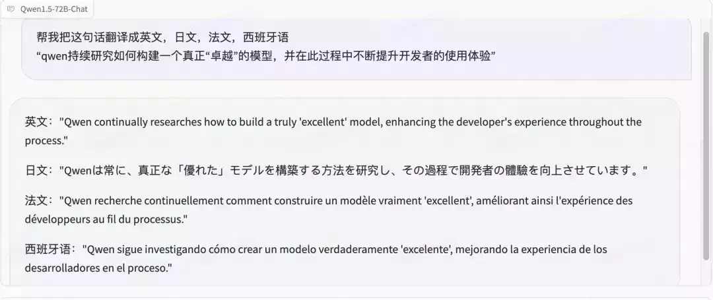
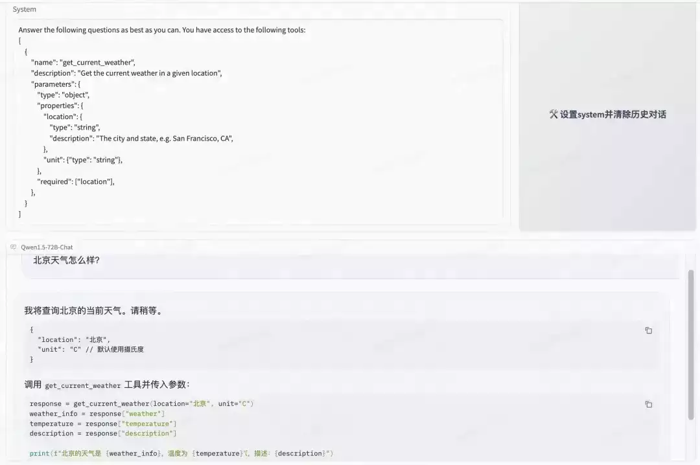
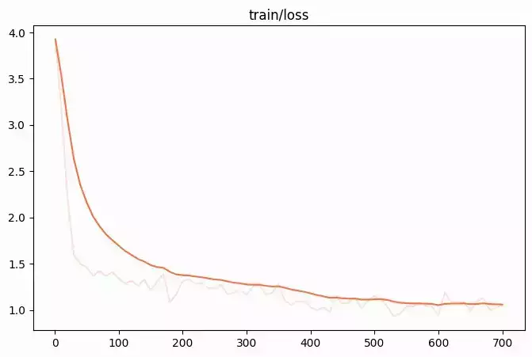
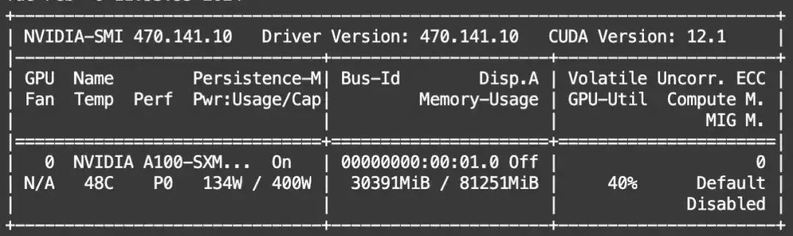

# Qwen1.5 开源！魔搭最佳实践来啦！

近几个月来，通义千问团队一直在努力探索如何构建一个“好”的模型，同时优化开发者体验。就在刚刚，中国新年前夕，通义千问团队分享了 Qwen 开源系列的下一个版本，**Qwen1.5**。  

  

Qwen1.5 本次开源了包括 0.5B、1.8B、4B、7B、14B 和 72B 在内的六种大小的基础和聊天模型，同时，也开源了量化模型。不仅提供了 Int4 和 Int8 的 GPTQ 模型，还有 AWQ 模型，以及 GGUF 量化模型。为了提升开发者体验，Qwen1.5 的代码合并到 Hugging Face Transformers 中，开发者现在可以直接使用 transformers>=4.37.0 而无需 trust\_remote\_code。此外，Qwen1.5 支持了例如 vLLM、SGLang、AutoGPTQ 等框架对 Qwen1.5 的支持。

与之前的版本相比，Qwen1.5 显著提升了聊天模型与人类偏好的一致性，并且改善了它们的多语言能力。所有模型提供了统一的上下文长度支持，支持 32K 上下文。还有，基础语言模型的质量也有所小幅改进。

  

**00**

  

**小编划重点** 

  

**1\. 更全的模型系列：**提供 6 个不同 size 模型，以及 GPTQ/AWQ/GGUF 量化版，总有一款适合你

  

**2\. 更好的生态融入：**接入 huggingface transformers，以及主流的第三方部署、量化、微调、服务等框架，方便你我他

  

**3.更强大的性能：**Chat 模型性能大幅提升，即便在英文的 MT-Bench 上，Qwen1.5-Chat 系列也取得了优秀的性能

  

**4.更全面统一的功能：**全系列均统一支持至少 32k 的最大长度，多语言能力全面提升并提供了更丰富的多语言评测，全系列统一支持 system prompt，统一具备强大的链接外部系统能力（agent/RAG/Tool-use/Code-interpreter）

  

  

**01**

  

**魔搭最佳实践** 

  

**模型体验**

  

**体验地址：**

https://modelscope.cn/studios/qwen/Qwen1.5-72B-Chat-Demo/summary

  

例如，多语言能力：



  

角色扮演：


  

工具调用能力：



  

  

**模型下载**

  

**模型链接：**https://modelscope.cn/organization/qwen

```plain
from modelscope import snapshot_download
model_dir = snapshot_download('qwen/Qwen1.5-7B-Chat')
```

**模型推理**

  

**环境依赖：**

```plain
pip install transformers>=4.37.0
```

  

**推理代码：**

```plain
from modelscope import AutoModelForCausalLM, AutoTokenizer
device = "cuda" # the device to load the model onto

model = AutoModelForCausalLM.from_pretrained(
    "qwen/Qwen1.5-0.5B-Chat",
    device_map="auto"
)
tokenizer = AutoTokenizer.from_pretrained("qwen/Qwen1.5-7B-Chat")

prompt = "Give me a short introduction to large language model."
messages = [
    {"role": "system", "content": "You are a helpful assistant."},
    {"role": "user", "content": prompt}
]
text = tokenizer.apply_chat_template(
    messages,
    tokenize=False,
    add_generation_prompt=True
)
model_inputs = tokenizer([text], return_tensors="pt").to(device)

generated_ids = model.generate(
    model_inputs.input_ids,
    max_new_tokens=512
)
generated_ids = [
    output_ids[len(input_ids):] for input_ids, output_ids in zip(model_inputs.input_ids, generated_ids)
]

response = tokenizer.batch_decode(generated_ids, skip_special_tokens=True)[0]
```

##   

**模型训练**

  

魔搭社区的微调框架 SWIFT(https://github.com/modelscope/swift) 已经支持了 Qwen1.5 全系列模型的微调和推理。

下面我们以自我认知任务为例针对千问 1.5-7b-chat 模型为例给出训练参数配置：

```plain
# Experimental environment: A100
# 30GB GPU memory
PYTHONPATH=../../.. \
CUDA_VISIBLE_DEVICES=0 \
python llm_sft.py \
    --model_type qwen1half-7b-chat \
    --sft_type lora \
    --tuner_backend swift \
    --dtype AUTO \
    --output_dir output \
    --dataset ms-bench \
    --train_dataset_sample 5000 \
    --num_train_epochs 2 \
    --max_length 1024 \
    --check_dataset_strategy warning \
    --lora_rank 8 \
    --lora_alpha 32 \
    --lora_dropout_p 0.05 \
    --lora_target_modules ALL \
    --gradient_checkpointing true \
    --batch_size 1 \
    --weight_decay 0.01 \
    --learning_rate 1e-4 \
    --gradient_accumulation_steps 16 \
    --max_grad_norm 0.5 \
    --warmup_ratio 0.03 \
    --eval_steps 100 \
    --save_steps 100 \
    --save_total_limit 2 \
    --logging_steps 10 \
    --use_flash_attn false \
    --self_cognition_sample 1000 \
    --model_name 卡卡罗特 \
    --model_author 陶白白 \
```

  

其中的 ms-bench 数据集是魔搭提供的通用知识数据集，用来做数据混合防止知识遗忘。训练的 Loss 收敛情况：



训练的显存使用情况：



训练后推理可以使用如下脚本（注意将--ckpt\_dir 替换为训练 log 输出的 weights 路径）：

```plain
# Experimental environment: A100
PYTHONPATH=../../.. \
CUDA_VISIBLE_DEVICES=0 \
python llm_infer.py \
    --ckpt_dir "/xxx/xxx/Qwen1.5-7b-chat/vx-xxx/checkpoint-xx" \
    --load_dataset_config true \
    --max_length 2048 \
    --eval_human true \
    --use_flash_attn false \
    --max_new_tokens 2048 \
    --temperature 0.1 \
    --top_p 0.7 \
    --repetition_penalty 1. \
    --do_sample true \
    --merge_lora_and_save false \
```

自我认识微调后的模型推理效果：  

  


  

**模型部署**

  

### 使用 vllm 部署魔搭社区千问 1.5 开源版本

设置环境变量：export VLLM\_USE\_MODELSCOPE=True

  

vllm 拉起 openai server

```plain
python -m vllm.entrypoints.openai.api_server \
    --model qwen/Qwen1.5-7B-Chat --max-model-len 8192  --gpu-memory-utilization 0.95
```

###   

访问服务

```plain
curl http://localhost:8000/v1/chat/completions \
    -H "Content-Type: application/json" \
    -d '{
        "model": "qwen/Qwen1.5-7B-Chat",
        "messages": [
            {"role": "system", "content": "You are a helpful assistant."},
            {"role": "user", "content": "写一篇春天为主题的作文"}
        ],
        "stop": ["<|im_end|>", "<|endoftext|>"]
    }'
```

  

### 使用 llama.cpp 部署千问 1.5 开源的 GGUF 的版本

下载 GGUF 文件：

```plain
from modelscope.hub.file_download import model_file_download

model_dir = model_file_download(model_id='qwen/Qwen1.5-1.8B-Chat-GGUF',file_path='qwen1.5-1_8b-chat-q8_0.gguf',revision='master',cache_dir='/mnt/workspace/')
```

  

git clone llama.cpp 代码并推理：

```plain
git clone https://github.com/ggerganov/llama.cpp.git
cd llama.cpp
make -j && ./main -m /mnt/workspace/qwen/Qwen1.5-1.8B-Chat-GGUF/qwen1.5-1_8b-chat-q8_0.gguf -p "Building a website can be done in 10 simple steps:\nStep 1:" -n 400 -e
```

  


###   

### 使用 ollama 运行 qwen1.5

安装 ollama，并运行

```plain
curl https://ollama.ai/install.sh | sh
ollama serve
```

  

直接运行千问

```plain
ollama run qwen
```

免安装使用 llamafile 版本推理（感谢社区网友 bingal 贡献）:  

链接：https://modelscope.cn/models/bingal/Qwen1.5-7B-Chat-llamafile/summary

  

模型下载：

```plain
from modelscope.hub.file_download import model_file_download

model_dir = model_file_download(model_id='bingal/Qwen1.5-7B-Chat-llamafile',file_path='qwen1.5-7b-chat-q5_k_m.llamafile',revision='master',cache_dir='/mnt/workspace/')
```

  

无需安装环境，直接推理：

```plain
chmod +x qwen1.5-7b-chat-q5_k_m.llamafile
./qwen1.5-7b-chat-q5_k_m.llamafile
```

  

支持 openai 格式 api 调用：

```plain
from openai import OpenAI
client = OpenAI(
    base_url="http://localhost:8080/v1", # "http://<Your api-server IP>:port"
    api_key = "sk-no-key-required"
)
completion = client.chat.completions.create(
    model="LLaMA_CPP",
    messages=[
        {"role": "system", "content": "You are an helpful AI assistant."},
        {"role": "user", "content": "你好"}
    ]
)
print(completion.choices[0].message)
```


  

  

点击**阅读原文**，直链模型体验