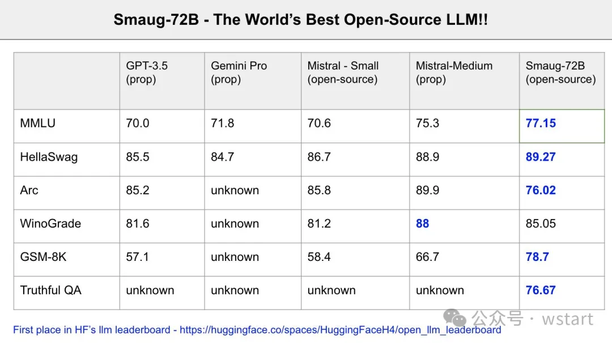

# Smaug-72B 大模型

Smaug-72B是由Abacus AI推出的一款开源语言模型，目前在Hugging Face的LLM排行榜上名列榜首，成为第一个平均得分达到80分的模型。该模型采用了多种源自Qwen-72B的微调技术，特别针对推理和数学技能，解释了其在GSM8K上的高分。团队计划发表研究论文，并将这些技术应用于其他模型，包括miqu（LLama-2的70B版本）。用户可以下载权重并进行量化，同时团队计划在接下来的几周内向llmsys人类评估排行榜提交Smaug模型+Online RAG。感谢团队的努力，他们致力于在开源人工智能领域推动创新。🚀🚀🚀

  

​